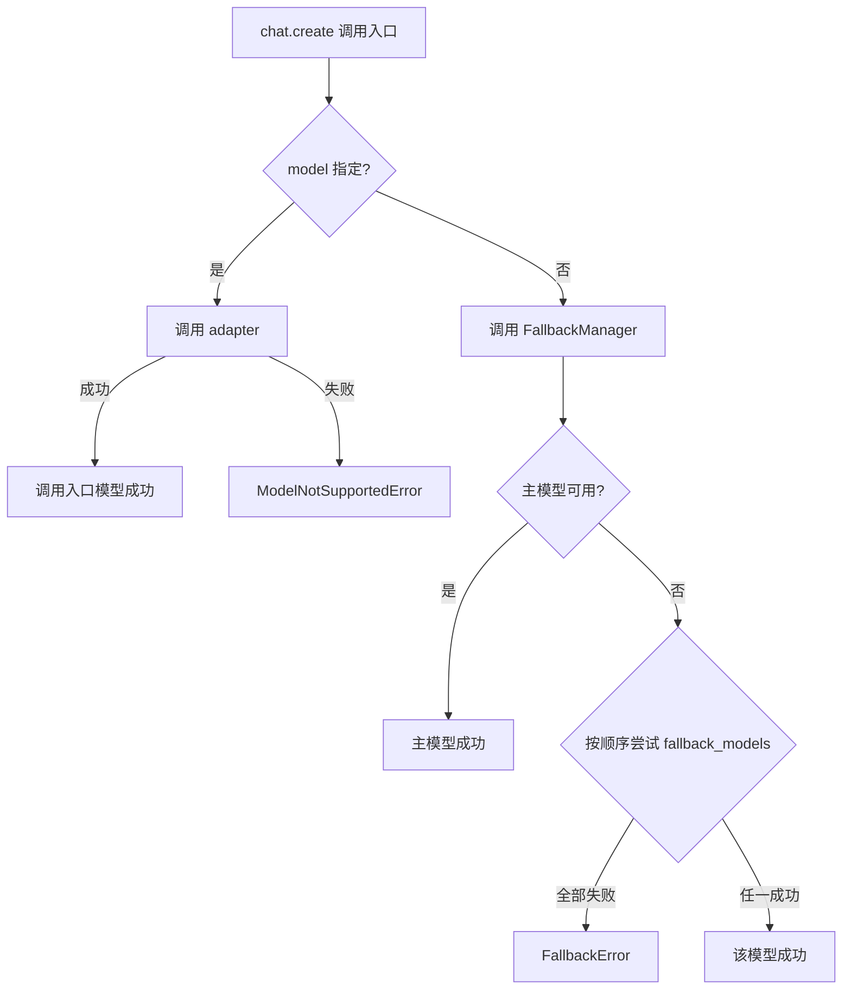

# CNLLM - Chinese LLM Adapter

[English](README_en.md) | 中文

[](https://pypi.org/project/cnllm/)
[](https://pypi.org/project/cnllm/)
[](https://github.com/kanchengw/cnllm/blob/main/LICENSE)

***

## 项目背景

CNLLM 的开发始于两个问题：
- 如何将中文大模型更高效地接入 langchain、LlamaIndex、LiteLLM 等**主流机器学习和大模型应用框架**
- 如何基于 OpenAI 标准统一中文大模型的**接口、参数与响应规范**

对于问题一，厂商提供的 OpenAI 兼容接口解决方案虽简单易用，但无法充分发挥中文大模型的原生能力；

这又引出问题二，若使用厂商的原生接口，除了响应解析、格式转换等繁琐工作，还依赖于各厂商的 SDK，其代码和参数规范迥异，导致开发者需要为每个模型进行定制化的开发，增加了部署和维护成本。

CNLLM 致力于解决这一两难困境——通过提供一个**统一的 OpenAI 兼容接口层**与一套**标准化的参数规则和响应格式规范**，在完整释放中文大模型原生能力的同时，将异构响应自动封装为 OpenAI 标准格式；尤其在需要不同厂商的模型协作的场景中，CNLLM 也能稳定提供一致的接口、参数和响应格式。

通过 CNLLM，开发者可以无障碍地在 OpenAI 生态内的机器学习和大模型应用框架中使用中文大模型。

### CNLLM 特性

- **OpenAI 标准兼容** - 模型响应对齐 OpenAI API 标准格式
- **主流框架集成** - 适配 LangChain、LlamaIndex 等主流机器学习库
- **统一接口** - 一套参数和代码，无缝切换不同国产大模型

### 我们期待这样的合作

欢迎志同道合的朋友共同参与 CNLLM 的发展，请在以下邮箱联系我们：<wangkancheng1122@163.com>

| 方向           | 说明                            |
| ------------ | ----------------------------- |
| 🌐 **新厂商适配** | 接入更多中文大模型（如阿里千问、百度文心一言、腾讯混元等）  |
| 🔗 **框架适配**  | 深化与 LlamaIndex、LiteLLM 等框架的集成 |
| 🐛 **能力扩展**  | 多模态功能的适配框架开发       |
| 📖 **文档完善**  | 补充使用案例、优化开发指南                 |
| 💡 **功能建议**  | 提出您的想法与需求                     | 

项目开发文档：
- [系统架构](docs/ARCHITECTURE.md)
- [厂商适配](docs/CONTRIBUTOR.md)
- [功能性文档](docs/feature/)

## 更新日志


### v0.6.0 (2026-04-08)

- ✨ **异步支持** - 完整异步支持，通过 `asyncCNLLM` 客户端提供 `await client.chat.create()` 和 `await client.embeddings.create()` 异步接口
  - httpx 统一同步/异步 HTTP 客户端，支持 SSE 流式
  - 流式调用返回 `AsyncIterator[dict]`，非流式返回 `dict`
- ✨ **批量调用** - 支持 `CNLLM.chat.batch()` 同步批量调用，`asyncCNLLM.chat.batch()` 异步批量调用
  - 实时统计：`request_counts` 字段实时显示当前请求状态
  - 错误隔离：单个请求失败不影响其他请求
  - 进度回调：`callbacks` 自定义回调函数
- ✨ **Embedding 调用** - `client.embeddings.create()` 支持单个/批量 Embedding，返回 `EmbeddingResponse`
  - 统一接口：同步/异步客户端均使用 `create()` 方法
  - 自定义 ID：支持 `custom_ids` 参数
  - OpenAI 兼容：返回标准 OpenAI embedding 格式

### v0.5.0 (2026-04-06)

- ✨ **KIMI 适配** - Kimi 模型适配开发，支持 kimi-k2.5、kimi-k2 系列和 moonshot-v1 系列（8k/32k/128k），  支持原生参数`prompt_cache_key`、`safety_identifier`
- ✨ **DeepSeek 适配** - DeepSeek 模型适配开发，支持 `deepseek-chat` 和 `deepseek-reasoner` 两个模型，支持原生参数`logit_bias`
- ✨ **响应字段全支持** - 若厂商的响应中包含 `system_fingerprint` 和 `choices[0].logprobs` 字段，则在 CNLLM标准响应中也会包含这些字段，实现 OpenAI 标准响应的全字段支持

## 支持的模型

### chat completion 支持：

- **DeepSeek**：deepseek-chat、deepseek-reasoner
- **KIMI (Moonshot AI)**：kimi-k2.5、kimi-k2-thinking、kimi-k2-thinking-turbo、kimi-k2-turbo-preview、kimi-k2-0905-preview、moonshot-v1-8k、moonshot-v1-32k、moonshot-v1-128k
- **豆包Doubao**：doubao-seed-2-0-pro、doubao-seed-2-0-mini、doubao-seed-2-0-lite、doubao-seed-2-0-code、doubao-seed-1-8、doubao-seed-1-6、doubao-seed-1-6-lite、doubao-seed-1-6-flash
- **智谱GLM**：glm-4.6、glm-4.7、glm-4.7-flash、glm-4.7-flashx、glm-5、glm-5-turbo、glm-5.1
- **小米mimo**：mimo-v2-pro、mimo-v2-omni、mimo-v2-flash
- **MiniMax**：MiniMax-M2.7、MiniMax-M2.5、MiniMax-M2.1、MiniMax-M2

### embedding 支持：

- **MiniMax**: embo-01
- **GLM**：embedding-2、embedding-3、embedding-3-pro

## 1. 快速开始

### 1.1 安装

```bash
pip install cnllm
```

### 1.2 客户端初始化

#### 1.2.1 同步客户端
```python
client = CNLLM(model="minimax-m2.7", api_key="your_api_key")
```

#### 1.2.2 异步客户端

支持两种异步客户端的初始化方式，分别对应不同的使用场景：
- **持久化会话** 会在多个调用之间保持会话状态，适合需要维护上下文的应用场景
- **临时会话** 单次会话，不保持会话状态，自动关闭会话。

**持久化会话**：
```python
client = asyncCNLLM(
    model="minimax-m2.7", api_key="your_api_key")
resp = await client.chat.create(...)
await client.aclose()  # 手动关闭
```

**临时会话**：
```python
async with asyncCNLLM(
    model="deepseek-chat", api_key="your_api_key") as client:
    resp = await client.chat.create(...)
```

### 1.3 三种调用入口（支持同步/异步）

**1. 极简调用** 

```python
resp = client("用一句话介绍自己")
```

**2. 标准调用** 

```python
resp = client.chat.create(prompt="用一句话介绍自己")
```

**3. 完整调用** 

```python
resp = client.chat.create(
    messages=[{"role": "user", "content": "用一句话介绍自己"}]
)
```
## 2. 调用场景

### 2.1 流式调用

支持同步/异步的流式调用，返回的 chunk 均为 OpenAI 标准流式结构。

```python
response = client.chat.create(
    messages=[{"role": "user", "content": "数到3"}], 
    stream=True
)
for chunk in response:  # 异步客户端迭代 async for chunk in await response:
    pass
```
或直接迭代的调用：

```python
for chunk in client.chat.create(...):  # 异步客户端迭代 async for chunk in await client.chat.create(...):
    pass
```

#### 2.1.1 响应访问

流式调用中，响应支持**流中访问**，结果**实时累积**

| 类别 | 访问方式 | 返回格式 | 返回示例 |
|------|---------|---------|---------|
| **think** | `resp.think` / `client.chat.think` | `str` | `"推理内容..."` |
| **still** | `resp.still` / `client.chat.still` | `str` | `"回复内容..."` |
| **tools** | `resp.tools` / `client.chat.tools` | `Dict[int, Dict]` | `{0: {"id": "...", "function": {...}}, 1: {...}` |
| **raw** | `resp.raw` / `client.chat.raw` | `Dict` | `{"id": "...", "choices": [...], ...}` |

### 2.2 chat completion 批量调用

支持同步/异步、流式/非流式的批量调用，支持**进度回调、自定义请求 ID 、遇错停止**等高级功能，支持配置**并发控制**。

```python
results = client.chat.batch(
    ["你好", "今天天气怎么样", "你是谁"]
)
```

#### 2.2.1 chat completion 批量响应结构

 BatchResponse 外层结构，其中 `results[request_id]`字段下的每条响应为 OpenAI 标准流式/非流式结构：

```python
{
    "success": ["request_0"],  # 成功的 request_id 列表
    "fail": ["request_1"],   # 失败的 request_id 列表
    "request_counts": {"success_count": 1, "fail_count": 1, "total": 2},  # 统计信息
    "elapsed": 0.42,  # 耗时
    "results": {
        "request_0": [chunk1, chunk2, chunk3],  # 单个请求中标准结构的流式 chunk 列表
        "request_1": [error_chunk],
    },
    "think": {"request_0": "...", "request_1": "..."},
    "still": {"request_0": "...", "request_1": "..."},
    "tools": {"request_0": [...], "request_1": [...]},
    "raw": {"request_0": {...}, "request_1": {...}}
}
```

#### 2.2.2 chat completion 批量响应访问

流式/非流式批量调用中，响应支持**批中访问**，结果**实时累积**。

**两种访问方式**：实时迭代中直接 `for chunk in resp.results` 访问，或迭代结束后通过 `resp.batch_result.results` 访问累积结果。

| 类别 | 访问方式 | 返回格式 | 返回示例 |
|------|---------|---------|---------|
| **统计字段** | `resp.success` / `batch_result.success` | `List[str]` | `["request_0", "request_1"]` |
| | `resp.fail` / `batch_result.fail` | `List[str]` | `[]` |
| | `resp.request_counts` / `batch_result.request_counts` | `Dict` | `{"success_count": 2, "fail_count": 0, "total": 2}` |
| | `resp.elapsed` / `batch_result.elapsed` | `float` | `1.23` |
| **results** | `resp.results` / `batch_result.results` | `Dict[str, Dict]` | `{"request_0": {...}, "request_1": {...}}` |
| | `resp.results[0]` / `batch_result.results[0]` | `Dict` | `{"id": "...", "choices": [...], ...}` |
| | `resp.results["request_0"]` / `batch_result.results["request_0"]` | `Dict` | 同上 |
| **think** | `resp.think` / `batch_result.think` | `Dict[str, str]` | `{"request_0": "...", "request_1": "..."}` |
| | `resp.think[0]` / `batch_result.think[0]` | `str` | `"推理内容..."` |
| | `resp.think["request_0"]` / `batch_result.think["request_0"]` | `str` | `"推理内容..."` |
| **still** | `resp.still` / `batch_result.still` | `Dict[str, str]` | `{"request_0": "...", "request_1": "..."}` |
| | `resp.still[0]` / `batch_result.still[0]` | `str` | `"回复内容..."` |
| | `resp.still["request_0"]` / `batch_result.still["request_0"]` | `str` | `"回复内容..."` |
| **tools** | `resp.tools` / `batch_result.tools` | `Dict[str, Dict[int, Dict]]` | `{"request_0": {...}, "request_1": {...}}` |
| | `resp.tools[0]` / `batch_result.tools[0]` | `Dict[int, Dict]` | `{0: {"id": "...", "function": {...}}, 1: {...}` |
| | `resp.tools["request_0"]` / `batch_result.tools["request_0"]` | `Dict[int, Dict]` | 同上 |
| **raw** | `resp.raw` / `batch_result.raw` | `Dict[str, Dict]` | `{"request_0": {...}, "request_1": {...}}` |
| | `resp.raw[0]` / `batch_result.raw[0]` | `Dict` | `{"id": "...", "choices": [...], ...}` |
| | `resp.raw["request_0"]` / `batch_result.raw["request_0"]` | `Dict` | 同上 |


**repr():**
```python
# 简洁统计，不显示大文本:
print(result)
# BatchResponse(request_counts={...}, elapsed=..., success=[...], errors=[...])
```

**to_dict():**
```python
result.to_dict()                        # 只保留 results (默认)
result.to_dict(stats=True)              # 包含 results + 统计字段（request_counts、elapsed）
result.to_dict(stats=True, think=True, still=True, tools=True, raw=True)  # results + 任意字段
```

### 2.3 Embeddings 调用

支持同步/异步 Embeddings 调用，支持**进度回调、自定义请求 ID 、遇错停止**等高级功能，支持配置**并发控制、批量大小**。
当前支持 MiniMax embo-01，GLM embedding-2/embedding-3 模型。

#### 2.3.1 单条调用

```python
result = client.embeddings.create(input="Hello world")
# 返回: Dict (OpenAI 标准 Embeddings 格式)
```

#### 2.3.2 embeddings 批量调用

```python
results = client.embeddings.batch(
    input=["Hello", "world", "你好"]
)
```

#### 2.3.2 Embeddings 批量响应结构

 BatchEmbeddingResponse 外层结构，其中 `results[request_id]` 字段下每条响应为 OpenAI 标准 Embeddings 结构：

```python
{   
    "success": ["request_0"], 
    "fail": [], 
    "request_counts": {
        "success_count": 1, "fail_count": 1, "total": 2,"dimension": 1024
    },
    "elapsed": 0.35,
    "results": {
        "request_0": {
            "object": "list",
            "data": [{"object": "embedding","embedding": [0.1, 0.2, ...], "index": 0}],
            "model": "embedding-2",
            "usage": {"prompt_tokens": 5, "total_tokens": 5}
        }
    }
}
```

#### 2.3.3 Embedding 批量响应访问

流式/非流式批量调用中，响应支持**批中访问**，结果**实时累积**。

**两种访问方式**：实时迭代中直接 `resp.results[request_id]` 访问，或迭代结束后通过 `resp.batch_result.results[request_id]` 访问累积结果。

| 类别 | 访问方式 | 返回格式 | 返回示例 |
|------|---------|---------|---------|
| **统计字段** | `resp.success` / `batch_result.success` | `List[str]` | `["request_0", "request_1"]` |
| | `resp.fail` / `batch_result.fail` | `List[str]` | `["request_2"]` |
| | `resp.request_counts` / `batch_result.request_counts` | `Dict` | `{"total": 2, "success_count": 2, "fail_count": 0, "dimension": 1024}` |
| | `resp.elapsed` / `batch_result.elapsed` | `float` | `1.23` |
| | `resp.total` / `batch_result.total` | `int` | `2` |
| | `resp.dimension` / `batch_result.dimension` | `int` | `1024` |
| **results** | `resp.results` / `batch_result.results` | `Dict[str, Dict]` | `{"request_0": {...}, "request_1": {...}}` |
| | `resp.results[0]` / `batch_result.results[0]` | `Dict` | `{"object": "list", "data": [...], ...}` |
| | `resp.results["request_0"]` / `batch_result.results["request_0"]` | `Dict` | 同上 |

**repr():**
```python
# 简洁统计，不显示大文本:
print(result)
# BatchResponse(request_counts={...}, elapsed=..., success=[...], errors=[...])
```

**to_dict():**
```python
result.to_dict()                        # 只保留 results (默认)
result.to_dict(stats=True)              # 包含 results + 统计字段（request_counts、elapsed）
```

### 2.4 批量调用参数

批量调用支持**重试策略、并发控制**参数配置：

| 参数 | 类型 | 默认值 | 说明 |
|------|------|--------|------|
| `batch_size` | `int` | 动态计算 | 批处理大小，仅 Embeddings 调用支持配置 |
| `max_concurrent` | `int` | `12`/`3` | 最大并发数，Embeddings 默认12，Chat completion 默认3 |
| `rps` | `float` | `10`/`2` | 每秒请求数，Embeddings 默认10，Chat completion 默认2 |
| `timeout` | `int` | 30 | 单请求超时（秒） |
| `max_retries` | `int` | 3 | 最大重试次数 |
| `retry_delay` | `float` | 1.0 | 重试延迟（秒）|

**batch_size**：仅支持批量 Embeddings 调用时配置，建议使用动态适应默认值。

### 2.5 批量调用高级功能

#### 2.5.1 自定义请求 ID

通过 `custom_ids` 参数为批量请求指定自定义 ID，批量响应中会替换原 request_id。

```python
resp = client.embeddings.batch(
    input=["文本1", "文本2", "文本3"],
    custom_ids=["doc_001", "doc_002", "doc_003"]
)

resp.results["doc_001"]          # 获取 doc_001 的响应
resp.think["doc_002"]            # 获取 doc_002 的推理内容
```

#### 2.5.2 进度回调

回调会在**每个请求完成时被调用**，可以用于：
- 实时显示处理进度
- 记录已完成的任务
- 动态调整后续任务
- ...

```python
def on_complete(request_id, status):          # 回调函数示例，支持自定义
    print(f"[{request_id}] {status}")

resp = client.chat.batch(
    requests,
    callbacks=[on_complete]
)
```

#### 2.5.3 遇错停止

当批量请求遭遇第一个错误时，会立即停止后续任务，同时返回已处理的请求结果：

```python
resp = client.embeddings.batch(
    input=requests,
    stop_on_error=True
)
```

## 3. CNLLM 标准响应格式

CNLLM 单条请求的流式、非流式、 Embeddings 响应格式，完全实现 OpenAI 标准结构。

### 3.1 非流式响应格式

```python
{
    "id": "chatcmpl-xxx",
    "object": "chat.completion",
    "created": 1234567890,
    "model": "minimax-m2.7",
    "choices": [{
        "index": 0,
        "message": {
            "role": "assistant",
            "content": "你好，我是 MiniMax-M2.7..."
        },
        "logprobs": null,
        "finish_reason": "stop"
    }],
    "usage": {
        "prompt_tokens": 10,
        "completion_tokens": 20,
        "total_tokens": 30,
        "prompt_tokens_details": {
            "cached_tokens": 0
        },
        "completion_tokens_details": {
            "reasoning_tokens": 0
        }
    },
    "system_fingerprint": "fp_xxx"
}
```

### 3.2 流式响应格式

```python
{'id': 'chatcmpl-xxx', 'object': 'chat.completion.chunk', 'created': 1234567890, 'model': 'minimax-m2.7', 'choices': [{'index': 0, 'delta': {'role': 'assistant'}, 'finish_reason': None}]}

{'id': 'chatcmpl-xxx', 'object': 'chat.completion.chunk', 'created': 1234567890, 'model': 'minimax-m2.7', 'choices': [{'index': 0, 'delta': {'content': '你'}, 'finish_reason': None}]}

 # ... 中间 chunks

{'id': 'chatcmpl-xxx', 'object': 'chat.completion.chunk', 'created': 1234567890, 'model': 'minimax-m2.7', 'choices': [{'index': 0, 'delta': {}, 'finish_reason': 'stop'}]}
```

### 3.3 Embeddings 响应格式

```python
{
    "object": "list",
    "data": [{
        "object": "embedding",
        "embedding": [0.1, 0.2, ...],
        "index": 0
    }],
    "model": "embedding-2",
    "usage": {
        "prompt_tokens": 5,
        "total_tokens": 5
    }
}
```

## 4. CNLLM 统一接口参数

| 参数                  | 类型          | 必填 | 默认值                    | 客户端入口 | 调用入口 | 说明                                                      |
| ------------------- | ----------- | -- | ---------------------- | :---: | :--: | ------------------------------------------------------- |
| `model`             | str         | ✅  | -                      |   ✅   |   ✅  | 客户端初始化必填                                                |
| `api_key`           | str         | ✅  | -                      |   ✅   |   ✅  | API 密钥                                                  |
| `messages`          | list\[dict] | ⚠️ | -                      |   ❌   |   ✅  | OpenAI 格式消息列表（与 prompt 二选一）                             |
| `prompt`            | str         | ⚠️ | -                      |   ❌   |   ✅  | 简写参数（与 messages 二选一）                                    |
| `fallback_models`   | dict        | -  | -                      |   ✅   |   ❌  | 备用模型配置（具体见文档底部的 FallbackManager 流程设计）                   |
| `base_url`          | str         | -  | 自动适配支持模型的默认地址          |   ✅   |   ✅  | 自定义 API 地址                                              |
| `stream`            | bool        | -  | 端口默认值，一般为False         |   ✅   |   ✅  | 流式响应                                                    |
| `thinking`          | bool        | -  | 端口默认值                  |   ✅   |   ✅  | 思考模式，统一格式为`thinking=True/False`，部分模型支持`thinking="auto"` |
| `tools`             | list        | -  | -                      |   ✅   |   ✅  | 函数工具定义                                                  |
| `response_format`   | dict        | -  | 端口默认值，一般为{type:"text"} |   ✅   |   ✅  | 响应格式                                                    |
| `timeout`           | int         | -  | 60                     |   ✅   |   ✅  | 请求超时（秒）                                                 |
| `max_retries`       | int         | -  | 3                      |   ✅   |   ✅  | 最大重试次数                                                  |
| `retry_delay`       | float       | -  | 1.0                    |   ✅   |   ✅  | 重试延迟（秒）                                                 |
| `temperature`       | float       | -  | 端口默认值                  |   ✅   |   ✅  | 生成随机性                                                   |
| `max_tokens`        | int         | -  | 端口默认值                  |   ✅   |   ✅  | 最大生成 token 数                                            |
| `top_p`             | float       | -  | 端口默认值                  |   ✅   |   ✅  | 核采样阈值                                                   |
| `tool_choice`       | str         | -  | -                      |   ✅   |   ✅  | 工具选择模式：none / auto                                      |
| `presence_penalty`  | float       | -  | 端口默认值                  |   ✅   |   ✅  | 存在惩罚                                                    |
| `frequency_penalty` | float       | -  | 端口默认值                  |   ✅   |   ✅  | 频率惩罚                                                    |
| `organization`      | str         | -  | -                      |   ✅   |   ✅  | 组织标识                                                    |
| `stop`              | str/list    | -  | -                      |   ✅   |   ✅  | 停止序列                                                    |
| `user`              | str         | -  | -                      |   ✅   |   ✅  | 用户标识                                                    |

**说明**：

- 并非所有支持的模型都支持所有 CNLLM 标准请求参数，具体支持情况和支持的其他参数请参考厂商的官方文档。
- 模型支持的更多参数请参考官方文档， CNLLM 会透传具体模型支持的所有参数。
- 对于客户端初始化入口和调用入口都支持的参数，调用时若传入，将覆盖客户端入口配置。

## 5. FallbackManager 模型选择的流程设计

客户端初始化配置`fallback_models`参数，若 `model`中的主模型因任何原因无法响应，将顺序尝试传入的`fallback_models`。
如需重复使用客户端实例，尤其对程序的稳健性有要求，建议配置此项。

```python
client = CNLLM(
    model="minimax-m2.7", api_key="minimax_key", 
    fallback_models={"mimo-v2-flash": "xiaomi-key", "minimax-m2.5": None}  
    )   # None 表示使用主模型配置的 API_key
resp = client.chat.create(prompt="2+2等于几？") 
print(resp)
```



***

**说明**：

在调用入口传入模型将会覆盖客户端的`model`和`fallback_models`参数配置，不会启用 FallbackManager 。

```python
resp = client.chat.create(
    prompt="介绍自己",
    model="minimax-m2.5",  # 覆盖客户端入口传入的模型配置
    api_key="your_other_api_key"  # 覆盖，或不传入，默认使用客户端入口配置的 API_key
)
```

## 6. 应用框架深度集成

### 6.1. LangChainRunnable实现

LangChain chain 统一支持同步/异步方法：

```python
from cnllm import CNLLM
from cnllm.core.framework import LangChainRunnable
from langchain_core.prompts import ChatPromptTemplate
import asyncio

# 创建 CNLLM 客户端（内部持有异步引擎）
client = CNLLM(model="deepseek-chat", api_key="your_key")
runnable = LangChainRunnable(client)

prompt = ChatPromptTemplate.from_messages([
    ("system", "你是一个热心的智能助手"),
    ("human", "{input}")
])

# 构建 LangChain chain
chain = prompt | runnable

async def langchain_demo():
    # 异步非流式调用
    result = await chain.ainvoke({"input": "2+2等于几？"})
    print(result.content)

    # 异步流式调用
    async for chunk in chain.astream({"input": "数到5"}):
        print(chunk, end="", flush=True)

    # 批量调用（异步）
    results = await chain.batch(["Hello", "How are you?"])
    for r in results:
        print(r.content)

asyncio.run(langchain_demo())
```

### 许可证

MIT License - 详见 [LICENSE](LICENSE) 文件

### 联系方式

- GitHub Issues: <https://github.com/kanchengw/cnllm/issues>
- 作者邮箱：<wangkancheng1122@163.com>
