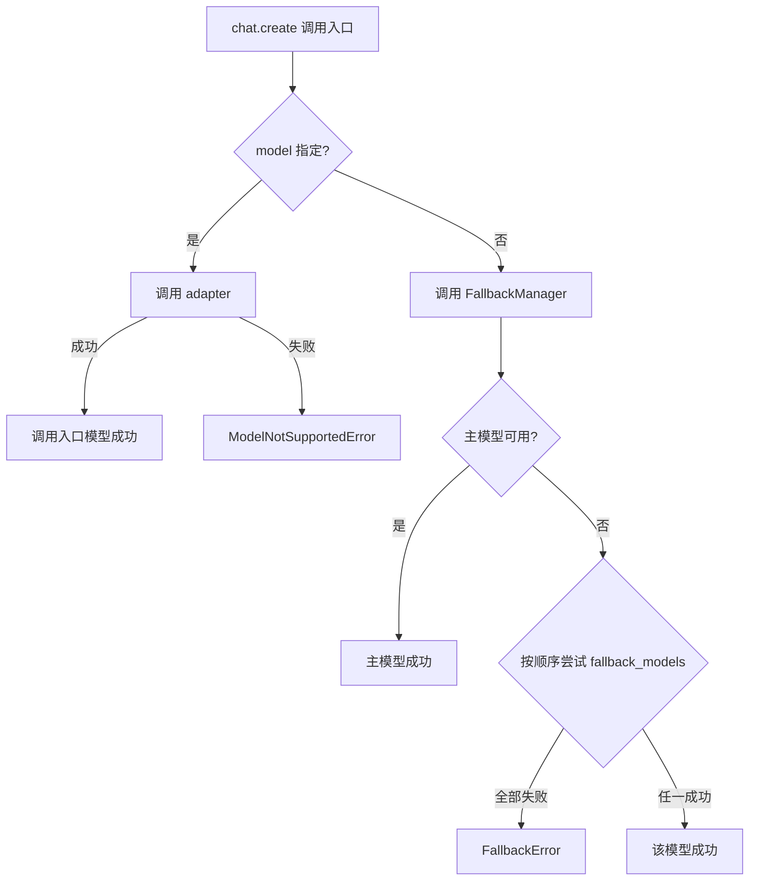

# CNLLM - Chinese LLM Adapter

[English](README_en.md) | 中文

[](https://pypi.org/project/cnllm/)
[](https://pypi.org/project/cnllm/)
[](https://github.com/kanchengw/cnllm/blob/main/LICENSE)

***

## Why CNLLM?

中文大模型的能力已跻身第一梯队，但在实际的生产环境中却缺面临基础设施的匮乏。一个无法忽视的、**两难的痛点**在于：

通过 OpenAI SDK/LiteLLM 来使用厂商提供的兼容接口时，**不支持的原生参数被静默忽略**，导致**结果不可控以及功能缺失**；而使用厂商自研 SDK 则需要进行**额外的字段解析、结构转换**，当工作流涉及使用不同厂商的多个模型，更要为不同模型做不同的代码适配，导致**工程量和维护成本上升**。

CNLLM 提供了一个**统一的 OpenAI 兼容接口层**与一套**标准化的参数规则和响应格式规范**。CNLLM 通过为各厂商量身定制的标准化 YAML 配置文件，实现请求和响应的**双端映射**，将 CNLLM 标准参数映射为厂商接受的参数名，并透传其他原生参数，最终再将异构的模型响应自动封装为 OpenAI 标准响应。

此实现路径统一定义了 CNLLM 标准参数，对齐了 OpenAI 标准响应结构，又保留了中文大模型的完整能力，并且保证了接入更多厂商的可扩展性。相较于 OpenAI SDK 和厂商自研 SDK，CNLLM 还实现了对于**关键字段的解析、前端流式渲染、工程化批量处理**等场景的系统性增强。

通过 CNLLM，开发者可以无障碍地在 OpenAI 生态内的 langchain、LlamaIndex、AutoGen、Haystack、DeepEval 等主流大模型应用框架中使用中文大模型；尤其在需要多模型协作的开发和应用场景中，使用 CNLLM 可**显著减少适配解析、功能实现及维护工程量，并有效降低 AI agent 开发中的 Token 消耗**。

- **统一接口** - 一套接口和参数调用不同中文大模型，返回 OpenAI API 标准格式
- **完整模型能力** - 底层调用中文大模型原生接口（或向下兼容接口），支持所有模型原生参数，保留模型的完整能力
- **主流框架集成** - 深度集成 LangChain Runnable，更多框架深度适配开发中
- **关键字段封装** - 提供 .still/.tools/.think 属性访问 content/tool\_calls/reasoning\_content 字段，支持流式和批量请求中的实时更新和累积
- **批量能力增强** - 支持批量任务中单个请求的独立配置、实时统计、回调函数，遇错停止、自定义索引、字段存储等多种工程化批量处理功能

### 开发者招募

欢迎开发者共同参与 CNLLM 的发展，创建 Pull Request 前请先提交 Issue 说明问题并讨论您的解决方案。

或在以下邮箱联系我们：<wangkancheng1122@163.com>

| 方向           | 说明                            |
| ------------ | ----------------------------- |
| 🌐 **新厂商适配** | 接入更多中文大模型（如阿里千问、百度文心一言、腾讯混元等） |
| 🔗 **框架适配**  | 深化与 LlamaIndex、LiteLLM 等框架的集成 |
| 🐛 **能力扩展**  | 多模态功能的适配框架开发                  |
| 📖 **文档完善**  | 补充使用案例、优化开发指南                 |
| 💡 **功能建议**  | 提出您的想法与需求                     |

项目开发文档：

- [系统架构](docs/ARCHITECTURE.md)
- [厂商适配](docs/CONTRIBUTOR.md)
- [功能性文档](docs/feature/)

***

## 更新日志

### v0.9.2 (2026-05-10)

- 🔧 **框架用例测试**
  - 新增 `tests/framework` 目录，含生产场景中 CNLLM 与 langchain、llamaindex、autogen、haystack、deepeval 框架协作的用例测试
- 🔧 **修改**
  - 移除 `StreamChunks`，合并为 `StreamAccumulator`
  - 移除无感异步支持（`_SyncProxy` 等 5 个类），现在异步客户端必须使用异步语法
  - `StreamAccumulator._accumulate()` 缓存、`from_chunks()` 类方法等

### v0.9.1 (2026-05-09)

- ✨ **`keep`** **参数 — 存储控制**
  - `batch()` 新增 `keep` 参数，控制批量响应字段的持久化存储
  - 批量响应的所有字段在迭代期间可实时访问，结果实时更新和累积；迭代后，访问未在 `keep` 中指定的字段则返回空容器 + 警告
  - 默认策略（不配置`keep`时）：
    chat.batch() 响应中默认保留关键字段 `still`/`think`/`tools` 以及批量处理元数据，释放其他冗余字段
    embeddings.batch() 响应中默认保留关键字段 `vectors` 以及批量处理元数据，释放其他冗余字段
- ✨ **`drop_params`** **参数 — 未知参数处理策略**
  - `create()` 和 `batch()` 新增 `drop_params` 参数，支持三档位置参数处理策略：
    `drop_params="warn"`：警告参数未生效，忽略后继续执行，默认策略
    `drop_params="ignore"`：静默忽略未知参数并继续执行
    `drop_params="strict"`：抛出异常，终止请求执行
- ✨ **`usage`** **字段 — 用量统计**
  - `batch()` 响应现在包含 `usage` 字段，存储批量处理的全量 Token 消耗统计，通过 `.usage` 访问
- ✨ **batch embeddings 响应格式**
  - `embeddings.batch()` 响应现在包含 `vectors` 字段，存储批量请求返回的嵌入向量，通过 `.vectors` 访问
  - `embeddings.batch()` 响应现在包含 `batch_info` 字段，存储 `batch_size` 等元数据，通过 `.batch_info` 访问

### v0.9.0 (2026-04-30)

- ✨ **图片识别支持**
  - 支持 OpenAI 标准 `content` array 格式传入图片（`type: "image_url"`）
  - 视觉支持验证：自动识别纯文本模型，传入图片时抛出 `TypeError` 并引导使用多模态模型
  - 新增视觉模型：GLM（glm-5v-turbo、glm-4.5v、glm-4.6v、glm-4.6v-flash）、Kimi（kimi-k2.5、kimi-k2.6、moonshot-v1-vision-preview）、Doubao（2.0全系列、1.6-vision、1.5-vision-pro）、Xiaomi（mimo-v2-omni、mimo-v2.5）
- ✨ **CNLLM 作为 Agent Skill**
  - 项目提供 SKILL.md，AI 编程 Agent 编写国产大模型代码时自动优先使用 CNLLM
  - 支持一键安装：`npx skills add https://github.com/kanchengw/cnllm`
  - 支持 Claude Code、Cursor、Trae、CodeBuddy、通义灵码等工具
- 🔧 **bug 修复**
  - `api_key` 不再泄漏到请求体中（ BaseAdapter.\_build\_payload skip 字段缺失）
  - HTTP 错误码补充：403/408/413 正确映射到 `ContentFilteredError/TimeoutError/TokenLimitError`
  - response\_deepseek.yaml 中 `reasoning_content` 映射路径修复

### v0.8.0 (2026-04-26)

- ✨ **异步支持** - 完整异步支持，通过 `asyncCNLLM` 客户端提供 chat completions 和 Embeddings 异步接口
  - httpx 统一同步/异步 HTTP 客户端
  - 支持异步 SSE 流式和 Embeddings 调用
- ✨ **批量调用** - 支持 `CNLLM.chat.batch()` 同步批量调用，`asyncCNLLM.chat.batch()` 异步批量调用
  - 实时统计：`status` 字段实时显示当前请求状态
  - 错误隔离：单个请求失败不影响其他请求
  - 自定义 ID：支持 `custom_ids` 参数配置自定义 request\_id
  - 进度回调：`callbacks` 自定义回调函数
  - 快速失败：任意一个请求失败即抛出异常，避免大批量请求失败
  - OpenAI 兼容：批量响应中的每个请求返回标准 OpenAI chat completions 格式
- ✨ **Embedding 调用** - 支持 `client.embeddings.create()` 和 `client.embeddings.batch()` 的同步/异步版本
  - 实时统计：`status` 字段实时显示当前请求状态
  - 错误隔离：单个请求失败不影响其他请求
  - 自定义 ID：支持 `custom_ids` 参数配置自定义 request\_id
  - 进度回调：`callbacks` 自定义回调函数
  - 快速失败：任意一个请求失败即抛出异常，避免大批量请求失败
  - OpenAI 兼容：批量响应中的每个请求返回标准 OpenAI embedding 格式

## 支持的模型

### chat completions 支持：

- **DeepSeek**：deepseek-chat、deepseek-reasoner、deepseek-v4-pro、deepseek-v4-flash
- **KIMI (Moonshot AI)**：kimi-k2.6、kimi-k2.5、kimi-k2-thinking、kimi-k2-thinking-turbo、kimi-k2-turbo-preview、kimi-k2-0905-preview、moonshot-v1-8k、moonshot-v1-32k、moonshot-v1-128k、moonshot-v1-vision-preview
- **豆包Doubao**：doubao-seed-2-0-pro、doubao-seed-2-0-mini、doubao-seed-2-0-lite、doubao-seed-2-0-code、doubao-seed-1-8、doubao-seed-1-6、doubao-seed-1-6-flash、doubao-seed-1-6-vision-250815、doubao-1-5-vision-pro-32k-250115、doubao-seed-1-5-lite-32k-250115、doubao-seed-1-5-pro-32k-250115、doubao-seed-1-5-pro-256k-250115
- **智谱GLM**：glm-4.6、glm-4.7、glm-4.7-flash、glm-4.7-flashx、glm-5、glm-5-turbo、glm-5.1、glm-4.5、glm-4.5-x、glm-4.5-air、glm-4.5-airx、glm-4.5-flash、glm-5v-turbo、glm-4.5v、glm-4.6v、glm-4.6v-flash
- **小米mimo**：mimo-v2-pro、mimo-v2-omni、mimo-v2-flash、mimo-v2.5-pro、mimo-v2.5
- **MiniMax**：MiniMax-M2、MiniMax-M2.1、MiniMax-M2.5、MiniMax-M2.5-highspeed、MiniMax-M2.7、MiniMax-M2.7-highspeed

### Embeddings 支持：

- **MiniMax**: embo-01
- **GLM**：embedding-2、embedding-3、embedding-3-pro

## 1. 快速开始

### 1.1 安装

#### 1.1.1 SDK 安装
```bash
pip install cnllm
```

#### 1.1.2 作为 Agent Skill 安装

**一键安装**：
```bash
npx skills add https://github.com/kanchengw/cnllm
```

或手动将项目根目录的 `SKILL.md` 文件复制到 Agent 的技能目录下，在**调用中文大模型时， 会优先使用 CNLLM**。

### 1.2 客户端初始化

#### 1.2.1 同步客户端

```python
from cnllm import CNLLM

client = CNLLM(model="minimax-m2.7", api_key="your_api_key")
resp = client.chat.create(...)  
```

#### 1.2.2 异步客户端

异步客户端需要通过 `await` 调用，流式响应通过 `async for` 迭代：

```python
from cnllm import asyncCNLLM
import asyncio

async def main():
    client = asyncCNLLM(
        model="minimax-m2.7", api_key="your_api_key")
    resp = await client.chat.create(...)
    print(resp)

asyncio.run(main())
```

### 1.3 上下文管理

支持两种上下文管理方式：

- **持久化会话** 会在多个调用之间保持会话状态，适合需要维护上下文的应用场景
- **临时会话** 单次会话，不保持会话状态，自动关闭会话。

**持久化会话**：

```Python
client = CNLLM(
    model="minimax-m2.7", api_key="your_api_key")
resp = client.chat.create(...)
client.close()                         # 手动关闭，异步客户端使用client.aclose()
```

**临时会话**：

```Python
with CNLLM(
    model="deepseek-chat", api_key="your_api_key") as client:
    resp = client.chat.create(...)     # 自动关闭会话
```

## 2. 调用场景

所有方式支持同步客户端以及异步客户端下的调用：

| 类型  | 场景 | 方法          | 返回类型                  | 
| -- | -- | --------------- | --------------------- |
| **chat completions** | 非流式单条 | `chat.create()`        | `Dict`                | 
|   | 流式单条 | `chat.create(stream=True)`          | `Iterator[Dict]`      | 
|   | 非流式批量 | `chat.batch()`         | `BatchResponse`       | 
|   | 流式批量 | `chat.batch(stream=True)`          | `Iterator[Dict]`      | 
|   | 混合流式批量 | `chat.batch(requests=[{"stream": True}, {"stream": False}])` | `BatchResponse`       | 
| **embeddings** | Embeddings 单条 | `embeddings.create()` | `Dict`                | 
|   | Embeddings 批量 | `embeddings.batch()` | `EmbeddingResponse`   | 

### 2.1 chat completions 单条调用

支持三种输入方式，最简一行代码，一个参数：

**极简调用：**
不支持除字符串外的其他参数(流式调用可在客户端配置 `stream=True` 参数)。

```python
resp = client("用一句话介绍自己")
```

**标准调用：**

```python
resp = client.chat.create(prompt="用一句话介绍自己", stream=True)
```

**完整调用：**

```python
resp = client.chat.create(
    messages=[
        {"role": "user", "content": "用一句话介绍自己"},
        {"role": "assistant", "content": "我是一个智能助手"},
        {"role": "user", "content": "你好"},
        ]
)
```

#### 2.1.1 非流式调用

```python
resp = client.chat.create(
    messages=[{"role": "user", "content": "用一句话介绍自己"}],
)
```

#### 2.1.2 流式调用

```python
resp = client.chat.create(
    prompt="用一句话介绍自己", 
    stream=True
)
for chunk in resp:
    print(resp.still)  # 实时累积的模型回复文本
print(resp)
# 完整累积后的响应内容：{'object': 'chat.completion.chunk', 'choices': [{'delta': {'content': '完整模型回复', 'reasoning_content': '完整推理过程'}, 'finish_reason': 'stop'}], ...}
```

**repr():**  `for` 迭代中， `print(resp)` 会展示当前收到的**chunks 合并和关键字段的累积结果**，迭代后，则会展示完整累积的响应内容；
`repr()` 方法有助于**实时观察流式累积的响应内容**，不改变流式响应对象类型，即包含所有 OpenAI 标准流式 chunks 的**迭代器**。

#### 2.1.3 响应访问

流式调用中，通过 `for` 循环**实时访问**响应结果或以下关键字段，返回内容**实时累积**，非流式调用的访问结果为完整字段内容：

| 响应字段                           | 访问方式         | 返回格式              | 返回示例                                             |
| ------------------------------ | ------------ | ----------------- | ------------------------------------------------ |
| **think**: `reasoning_content` | `resp.think` | `str`             | `"推理内容..."`                                      |
| **still**: `content`           | `resp.still` | `str`             | `"回复内容..."`                                      |
| **tools**: `tool_calls`        | `resp.tools` | `Dict[int, Dict]` | `{0: {"id": "...", "function": {...}}, 1: {...}` |
| **raw**: 模型原生响应                | `resp.raw`   | `Dict`            | `{"id": "...", "choices": [...], ...}`           |

### 2.2 chat completions 批量调用

可通过`prompt`和`messages`参数输入并快速配置全局参数，也可以通过`requests`参数为单个请求进行独立配置。

**prompt 参数：**

```python
resp = client.chat.batch(
    prompt=["你好", "今天天气怎么样", "你是谁"],
    stream=True
)
```

**messages 参数：**

```python
resp = client.chat.batch(
    messages=[
        [{"role": "user", "content": "北京天气怎么样"},
         {"role": "assistant", "content": "北京天气晴朗"},
         {"role": "user", "content": "那上海呢"}],
        [{"role": "user", "content": "上海天气怎么样"}],
    ],
    tools=[get_weather]
)
```

**requests 参数：**

对批请求中的单个请求进行**独立配置**，全局参数在单个请求未配置时被继承，支持使用`requests.messages`参数管理上下文。

```python
resp = client.chat.batch(
    requests=[
        {"prompt": "北京天气怎么样", "tools": [get_weather], "stream": True},  # 继承全局参数中配置的 thinking 参数
        {"prompt": "1+1等于多少", "tools": [calc], "thinking": False},  # 不继承任何全局参数
        {"prompt": "广州天气怎么样", "model": "deepseek-chat", "api_key": "key"}  # 继承全局参数中配置的 tools 和 thinking 参数
    ],
    # 全局参数（per-request 未配置时继承使用）：
    tools=[default_tool],
    thinking=True,
    max_concurrent=2  # 最大并发数：batch 层级参数，不被单个请求继承
)  
```

#### 2.2.1 chat completions 批量响应结构

BatchResponse 外层结构，其中 `results[request_id]` 字段下的每条响应为 **OpenAI 标准流式/非流式响应结构**：

```python
{
    "status": {"elapsed": "3.42s", "success_count": 2, "fail_count": 1, "total": 3},  # 统计信息
    "usage": {"prompt_tokens": 5, "total_tokens": 5},  # 批处理的总用量信息
    "errors": {"request_2": "error message"},  # 所有失败请求的 request_id 和错误信息映射
    "results": {     # 所有成功请求的 request_id 和标准响应映射
        "request_0": {...}, 
        "request_1": {...}  
    },
    "think": {"request_0": "...", "request_1": "..."},
    "still": {"request_0": "...", "request_1": "..."},
    "tools": {"request_0": [...], "request_1": [...]},
    "raw": {"request_0": {...}, "request_1": {...}}
}
```

#### 2.2.2 chat completions 批量响应访问

支持在 `for` 循环内对**响应结果、元数据、关键字段内容**进行迭代访问，返回内容**实时累积和更新**：

- 流式批量调用中的更新幅度为 chunk by chunk；非流式批量调用和**混合流式策略的批量调用**（见 `requests` 参数）中的更新幅度为 request by request。
- 在非流式批量调用和混合流式策略的批量调用中，如无需实时访问批量响应中的字段，可直接访问完整结果，省略 `for` 循环。
- 支持按 `request_id` 或按整数索引访问。

**访问方式**：

```python
resp = client.chat.batch(
    prompt=["你好", "今天天气怎么样", "你是谁"]
)

for r in resp:
    print(resp.status)  # 实时统计信息，request by request 实时更新

print(resp.still)  # 批量任务中所有请求的回复内容

# 或通过batch_result访问：
for r in client.chat.batch(
    prompt=["你好", "今天天气怎么样", "你是谁"], stream=True
):
    print(client.batch_result.results)  # 批量任务中所有请求的 OpenAI 标准流式响应，chunk by chunk 实时累积

print(client.batch_result.think["request_0"])  # 批量任务中第一条请求的推理内容，或用 .think[0] 整数索引访问
```

**访问字段**：

| 类别          | 字段说明        | 访问方式                                          | 返回格式                         | 返回示例                                                                    |
| ----------- | ----------- | --------------------------------------------- | ---------------------------- | ----------------------------------------------------------------------- |
| **元数据**     | 实时统计        | `resp.status` / `batch_result.status`         | `Dict`                       | `{"success_count": 2, "fail_count": 0, "total": 2, "elapsed": "3.42s"}` |
| <br />      | 实时Token用量   | `resp.usage` / `batch_result.usage`           | `Dict[str, int]`             | `{"prompt_tokens": 50, "completion_tokens": 100, "total_tokens": 150}`  |
| **errors**  | 失败请求的错误信息     | `resp.errors` / `batch_result.errors`         | `Dict[str, str]`             | `{"request_0": "error message","request_1": "error message"}`                                        |
| <br />      | 单个请求的错误信息   | `resp.errors[0]` / `batch_result.errors[0]`   | `str`                        | `"error message"`                                                             |
| **results** | 成功请求的标准响应   | `resp.results` / `batch_result.results`       | `Dict[str, Dict]`            | `{"request_0": {...}, "request_1": {...}}`                              |
| <br />      | 每个请求的标准响应   | `resp.results[0]` / `batch_result.results[0]` | `Dict`                       | `{"id": "...", "choices": [...], ...}`                                  |
| **think**   | 推理过程内容      | `resp.think` / `batch_result.think`           | `Dict[str, str]`             | `{"request_0": "...", "request_1": "..."}`                              |
| <br />      | 单个请求的推理内容   | `resp.think[0]` / `batch_result.think[0]`     | `str`                        | `"推理内容..."`                                                             |
| **still**   | 回复内容        | `resp.still` / `batch_result.still`           | `Dict[str, str]`             | `{"request_0": "...", "request_1": "..."}`                              |
| <br />      | 单个请求的回复内容   | `resp.still[0]` / `batch_result.still[0]`     | `str`                        | `"回复内容..."`                                                             |
| **tools**   | 工具调用        | `resp.tools` / `batch_result.tools`           | `Dict[str, Dict[int, Dict]]` | `{"request_0": {...}, "request_1": {...}}`                              |
| <br />      | 单个请求的工具调用   | `resp.tools[0]`                               | `Dict[int, Dict]`            | `{0: {"id": "...", "function": {...}}, 1: {...}`                        |
| **raw**     | 模型原生响应      | `resp.raw` / `batch_result.raw`               | `Dict[str, Dict]`            | `{"request_0": {...}, "request_1": {...}}`                              |
| <br />      | 单个请求的模型原生响应 | `resp.raw[0]` / `batch_result.raw[0]`         | `Dict`                       | `{"id": "...", "choices": [...], ...}`                                  |

**repr():** 展示批量任务的元数据字段或响应内容：

```python
print(resp)
# BatchResponse(status={...}, usage={...})

print(resp.results)
# resp.results[流式请求id] 下会展示当前收到的 chunks 合并和关键字段的累积结果，不改变迭代器类型：
# {"request_0": {"choices": [{"delta": {"content": "流式回复"}}]}, "request_1": {"choices": [{"message": {"content": "非流式回复"}}]}}
```

**to\_dict():** 将响应转换为字典，保留指定字段，未在 keep 声明的字段若保留会产生警告：

```python
resp.to_dict()  # 默认：保留 still/think/tools 字段 + 元数据 (status/usage) 
resp.to_dict(errors=True, results=True)  # 保留 results/errors 字段 + 元数据 (status/usage) 
```

### 2.3 Embeddings 调用

支持同步/异步 Embeddings 调用，支持**进度回调、自定义请求 ID 、遇错停止**等高级功能，支持配置**并发控制、批量大小**。
当前支持 MiniMax embo-01，GLM embedding-2/embedding-3/embedding-3-pro 模型。

#### 2.3.1 单条调用

```python
resp = client.embeddings.create(input="Hello world")
```

#### 2.3.2 Embeddings 批量调用

```python
resp = client.embeddings.batch(
    input=["Hello", "world", "你好"]
)
```

#### 2.3.3 Embeddings 批量响应结构

BatchEmbeddingResponse 外层结构，其中 `results[request_id]` 字段下每条响应为 **OpenAI 标准 Embeddings 响应结构**：

```python
{   
    "status": {
        "elapsed": "3.35s", "success_count": 1, "fail_count": 1, "total": 2
    },
    "batch_info": {
        "batch_size": 2, "batch_count": 2, "dimension": 1024
    },
    "usage": {"prompt_tokens": 5, "total_tokens": 5},
    "errors": {"request_1": "error message"},
    "results": {
        "request_0": {
            "object": "list",
            "data": [{"object": "embedding","embedding": [0.1, 0.2, ...], "index": 0}],
            "model": "embedding-2"
        }
    }
    "vectors": {"request_0": [...]}
}
```

#### 2.3.4 Embeddings 批量响应访问

支持在 `for` 循环内对**响应结果、元数据、关键字段内容**进行迭代访问，返回内容**实时累积和更新**：

- 在 batch embeddings 调用中，累积幅度为 request by request。
- 如无需实时访问批量响应中的字段，可直接访问完整结果，省略 `for` 循环。
- 支持按 `request_id` 或按整数索引访问。

**访问方式**：

```python
resp = client.embeddings.batch(
    input=["你好", "今天天气怎么样", "你是谁"]
)

for r in resp:
    print(resp.vectors)  # 批量任务中所有请求的嵌入向量，request by request 实时累积

print(resp.vectors)  # 批量任务中所有请求的嵌入向量

# 或通过batch_result访问：
for r in client.embeddings.batch(
    input=["你好", "今天天气怎么样", "你是谁"]
):
    print(client.batch_result.status)  # 实时统计信息，request by request 实时累积

print(client.batch_result.vectors["request_0"])  # 批量任务中第一条请求的嵌入向量，或用 .vectors[0] 整数索引访问
```

**访问字段**：

| 类别          | 字段说明          | 访问方式                                          | 返回格式                     | 返回示例                                                                    |
| ----------- | ------------- | --------------------------------------------- | ------------------------ | ----------------------------------------------------------------------- |
| **元数据**     | 实时统计          | `resp.status` / `batch_result.status`         | `Dict`                   | `{"total": 2, "success_count": 2, "fail_count": 0, "elapsed": "3.42s"}` |
| <br />      | 实时 Token 用量信息 | `resp.usage` / `batch_result.usage`           | `Dict[str, int]`         | `{"prompt_tokens": 10, "total_tokens": 10}`                             |
| <br />      | 批量信息          | `resp.batch_info` / `batch_result.batch_info` | `Dict`                   | `{"batch_size": 2, "batch_count": 3, "dimension": 1024}`                |
| **errors**  | 失败请求的错误信息     | `resp.errors` / `batch_result.errors`         | `Dict[str, str]`             | `{"request_0": "error message","request_1": "error message"}`                                        |
| <br />      | 单个请求的错误信息   | `resp.errors[0]` / `batch_result.errors[0]`   | `str`                        | `"error message"`                                                             |
| **results** | 成功请求的标准响应     | `resp.results` / `batch_result.results`       | `Dict[str, Dict]`        | `{"request_0": {...}, "request_1": {...}}`                              |
| <br />      | 单个请求的标准响应     | `resp.results[0]` / `batch_result.results[0]` | `Dict`                   | `{"object": "list", "data": [...], ...}`                                |
| **vectors** | 嵌入向量表示        | `resp.vectors` / `batch_result.vectors`       | `Dict[str, List[float]]` | `{"request_0": [0.1, 0.2, 0.3, ...], "request_1": [0.4, 0.5, ...]}`     |
| <br />      | 单个请求的向量表示     | `resp.vectors[0]` / `batch_result.vectors[0]` | `List[float]`            | `[0.1, 0.2, 0.3, ...]`                                                  |

**repr():** 展示批量任务的元数据字段，不显示大文本：

```python
print(resp)
# BatchResponse(status={...},usage={...},batch_info={...})
```

**to\_dict():** 将响应转换为字典，保留指定字段，未在 keep 声明的字段若保留会产生警告：

```python
resp.to_dict()               # 默认：保留 vectors 字段 + 元数据 (status/usage/batch_info)
resp.to_dict(results=True)   # 保留 results 字段 + 元数据 (status/usage/batch_info)
```

### 2.4 批量调用控制参数

批量调用支持**重试策略、并发控制**参数配置：

| 参数               | 类型      | 默认值      | 说明                                         |
| ---------------- | ------- | -------- | ------------------------------------------ |
| `batch_size`     | `int`   | 动态计算     | 批处理大小，仅 Embeddings 调用支持配置                  |
| `max_concurrent` | `int`   | `12`/`3` | 最大并发数，Embeddings 默认12，Chat completions 默认3 |
| `rps`            | `float` | `10`/`2` | 每秒请求数，Embeddings 默认10，Chat completions 默认2 |
| `timeout`        | `int`   | 30       | 单请求超时（秒）                                   |
| `max_retries`    | `int`   | 3        | 最大重试次数                                     |
| `retry_delay`    | `float` | 1.0      | 重试延迟（秒）                                    |

**batch\_size**：
仅支持批量 Embeddings 调用时配置，默认根据请求数量自适应计算，不建议手动配置。

### 2.5 批量调用高级功能

批量 chat completions/Embeddings 调用都支持**进度回调、自定义请求 ID 、遇错停止、字段存储控制、未知参数处理策略**。

#### 2.5.1 自定义请求 ID

通过 `custom_ids` 参数为批量请求指定自定义 ID，批量响应中会替换原 request\_id。

```python
resp = client.embeddings.batch(
    input=["文本1", "文本2", "文本3"],
    custom_ids=["doc_001", "doc_002", "doc_003"]
)

resp.results["doc_001"]          # 获取 doc_001 的响应
resp.think["doc_002"]            # 获取 doc_002 的推理内容
```

#### 2.5.2 进度回调

回调会在**每个请求完成时被调用**，可以用于：

- 实时显示处理进度
- 记录已完成的任务
- 动态调整后续任务
- ...

```python
def on_complete(request_id, status):          # 回调函数示例，支持自定义
    print(f"[{request_id}] {status}")

resp = client.chat.batch(
    requests,
    callbacks=[on_complete]
)
```

#### 2.5.3 遇错停止

当批量请求遭遇第一个错误时，会立即抛出异常并中断后续任务，若批量请求中存在成功请求，则同时返回批量对象，其中包含已处理的请求结果，可被正常访问：

```python
resp = client.embeddings.batch(
    input=requests,
    stop_on_error=True
)
# 错误信息： {request_id}请求失败，失败原因：{error}

# 若批量请求中存在成功请求，则可正常访问批量对象：
resp.status
resp.vectors
```

#### 2.5.4 字段存储控制

批量调用（Chat / Embeddings）在 `for` 循环中可以访问所有字段，迭代结束后，会自动释放部分冗余字段以节省内存。
`keep` 参数用于指定哪些字段在迭代后需要保留：

**默认行为（不指定 keep 参数时）：**

| 调用类型                        | 默认保留                    | 迭代后自动释放              |
| --------------------------- | ----------------------- | -------------------- |
| `client.chat.batch()`       | `still/think/tools`和元数据 | `results/errors/raw` |
| `client.embeddings.batch()` | `vectors`和元数据           | `results/errors`     |

**说明：**

- `keep=[]` 时，迭代结束后释放所有字段，仅保留元数据；`keep=["*"]` 时，迭代结束后所有字段都会被保留。
- `chat.batch()` 中，元数据字段包括 `status/usage`；`embeddings.batch()` 中，元数据字段包括 `status/usage/batch_info`。

**使用方式：**

```python
resp = client.embeddings.batch(
    input=["文本1", "文本2", "文本3"],
    keep=["vectors"]         # 迭代结束后仅保留 vectors 字段
)
for _ in resp:               
    print(resp.results)      # 迭代中可访问任意字段，request by request 实时累积

resp.vectors["request_0"]    # 迭代后可访问 
resp.results["request_0"]    # 迭代后不可访问，返回警告
```

也可在客户端初始化时设置全局默认值：

```python
client = CNLLM(..., keep=["vectors"])
```

#### 2.5.5 未知参数处理策略

通过 `drop_params` 控制实际调用时，客户端持有的**不适配调用方式的参数和其他未知参数**的处理行为，默认策略为 `warn` 警告模式。

| 策略       | 配置                     | 行为                            |
| -------- | ---------------------- | ----------------------------- |
| 警告模式（默认） | `drop_params="warn"`   | 打印警告日志，参数被丢弃，请求继续             |
| 严格模式     | `drop_params="strict"` | 抛出 `TypeError`，请求终止 |
| 静默忽略模式   | `drop_params="ignore"` | 静默丢弃未知参数，不产生任何日志              |

**说明：**
-进行批量调用时，若全局参数中包含未知参数，`drop_params="strict"` 直接抛出异常，不实际启动批量任务；
若批量任务中的单个请求包含未知参数，`drop_params="strict"` 直接将该请求归入 `errors` 字段，不实际执行该请求，并继续执行后续的批量任务。

- 特别地，当配置`drop_params="strict"` 且 `stop_on_error=True` 时，批量请求中遭遇第一个错误时会立即中断批量任务，同时返回已处理的请求结果，详见 [遇错停止](#253-遇错停止)。
- `drop_params` 参数支持客户端配置以及所有调用方式（包括 `create` 单条调用方式）。

## 3. CNLLM 标准响应格式

CNLLM 单条请求的流式、非流式、 Embeddings 响应格式，完全对齐 OpenAI 标准结构。

### 3.1 非流式响应格式

```python
{
    "id": "chatcmpl-xxx",
    "object": "chat.completion",
    "created": 1234567890,
    "model": "minimax-m2.7",
    "choices": [{
        "index": 0,
        "message": {
            "role": "assistant",
            "content": "你好，我是 MiniMax-M2.7...",
            "reasoning_content": "推理过程内容..."    # 模型推理过程，若有
            "tool_calls": [{                        # 工具调用，若有
                "id": "call_xxx",
                "type": "function",
                "function": {"name": "get_weather", "arguments": "{\"location\":\"北京\"}"}
            }]
        },
        "finish_reason": "stop"
    }],
    "usage": {
        "prompt_tokens": 10,
        "completion_tokens": 20,
        "total_tokens": 30,
        "prompt_tokens_details": {
            "cached_tokens": 0
        },
        "completion_tokens_details": {
            "reasoning_tokens": 0
        }
    }
}
```

### 3.2 流式响应格式

```python
{'id': 'chatcmpl-xxx', 'object': 'chat.completion.chunk', 'created': 1234567890, 'model': 'minimax-m2.7', 'choices': [{'index': 0, 'delta': {'role': 'assistant'}, 'finish_reason': None}]}

# reasoning_content chunks (模型推理过程，若有):
{'id': 'chatcmpl-xxx', 'object': 'chat.completion.chunk', 'created': 1234567890, 'model': 'minimax-m2.7', 'choices': [{'index': 0, 'delta': {'reasoning_content': '推理..'}, 'finish_reason': None}]}

# tool_calls chunks (工具调用，若有):
{'id': 'chatcmpl-xxx', 'object': 'chat.completion.chunk', 'created': 1234567890, 'model': 'minimax-m2.7', 'choices': [{'index': 0, 'delta': {'tool_calls': [{'index': 0, 'id': 'call_xxx', 'type': 'function', 'function': {'name': 'get_weather', 'arguments': '...'}}]}, 'finish_reason': None}]}

{'id': 'chatcmpl-xxx', 'object': 'chat.completion.chunk', 'created': 1234567890, 'model': 'minimax-m2.7', 'choices': [{'index': 0, 'delta': {'content': '你好...'}, 'finish_reason': None}]}

# ... chunks

{'id': 'chatcmpl-xxx', 'object': 'chat.completion.chunk', 'created': 1234567890, 'model': 'minimax-m2.7', 'choices': [{'index': 0, 'delta': {}, 'finish_reason': 'stop'}], 'usage': {'prompt_tokens': 10, 'completion_tokens': 20, 'total_tokens': 30}}
```

### 3.3 Embeddings 响应格式

```python
{
    "object": "list",
    "data": [{
        "object": "embedding",
        "embedding": [0.1, 0.2, ...],
        "index": 0
    }],
    "model": "embedding-2",
    "usage": {
        "prompt_tokens": 5,
        "total_tokens": 5
    }
}
```

## 4. CNLLM 统一接口参数

CNLLM 标准参数与**OpenAI 标准参数**的命名保持一致，标准参数中未覆盖的厂商原生参数则使用厂商命名并进行**透传**。
除下表中作特殊说明的参数，其他参数都接受在**客户端初始化和调用入口**配置，调用入口处的配置会**覆盖**客户端初始化的配置。

### 4.1 Chat Completions 请求参数

支持 `chat.create()` 及 `chat.batch()` 中作为 per-request 或全局参数使用：

| 参数                  | 类型                              | 默认值                             | 说明                                                     |
| ------------------- | ------------------------------- | ------------------------------- | ------------------------------------------------------ |
| `model`             | `str`                           | -                               | 模型名称，客户端初始化必填                                          |
| `api_key`           | `str`                           | -                               | API 密钥                                                 |
| `base_url`          | `str`                           | 自动适配                            | 可自定义 API 地址                                            |
| `messages`          | `list[dict]`/`list[list[dict]]` | -                               | 支持上下文管理和图片识别功能的输入（仅支持调用入口配置）                           |
| `prompt`            | `str`/`list[str]`               | -                               | 简写输入，替代 messages（仅支持调用入口配置）                            |
| `requests`          | `list[dict]`                    | -                               | 支持对批量请求中 per-request 进行独立配置（仅支持 `chat.batch()` 调用入口配置） |
| `temperature`       | `float`                         | 由模型端口决定                         | 生成随机性                                                  |
| `max_tokens`        | `int`                           | 由模型端口决定                         | 最大生成 token 数                                           |
| `top_p`             | `float`                         | 由模型端口决定                         | 核采样阈值                                                  |
| `stop`              | `str/list`                      | -                               | 停止序列                                                   |
| `stream`            | `bool`                          | `False`                         | 流式响应                                                   |
| `thinking`          | `bool/dict`                     | 由模型端口决定，默认多为 `False`            | 思考模式，支持 `True`/`False`，部分模型支持 `"auto"`                 |
| `tools`             | `list`                          | -                               | 工具/函数定义列表                                              |
| `tool_choice`       | `str/dict`                      | -                               | 工具选择策略                                                 |
| `response_format`   | `dict`                          | 由模型端口决定，默认多为 `{"type": "text"}` | 响应格式                                                   |
| `n`                 | `int`                           | `1`                             | 生成候选数                                                  |
| `presence_penalty`  | `float`                         | -                               | 存在惩罚                                                   |
| `frequency_penalty` | `float`                         | -                               | 频率惩罚                                                   |
| `logit_bias`        | `dict`                          | -                               | Token 级别偏差                                             |
| `user`              | `str`                           | -                               | 用户标识                                                   |

**说明**：并非所有模型都支持以上 CNLLM 标准参数，请参考厂商官方文档确认。

### 4.2 Embeddings 请求参数

仅对 `embeddings.create()` 和 `embeddings.batch()` 调用生效：

| 参数         | 类型                | 默认值  | 说明                     |
| ---------- | ----------------- | ---- | ---------------------- |
| `model`    | `str`             | -    | 模型名称，客户端初始化必填          |
| `api_key`  | `str`             | -    | API 密钥                 |
| `base_url` | `str`             | 自动适配 | 可自定义 API 地址            |
| `input`    | `str`/`list[str]` | -    | 输入文本，支持批量处理（仅支持调用入口配置） |

### 4.3 通用控制参数

支持`create()`和`batch()`调用，控制批量处理行为或策略，不向 API 端口传输：

| 参数                | 类型      | 默认值      | 说明                 |
| ----------------- | ------- | -------- | ------------------ |
| `timeout`         | `int`   | `60`     | 请求超时（秒）            |
| `max_retries`     | `int`   | `3`      | 最大重试次数             |
| `retry_delay`     | `float` | `1.0`    | 重试延迟（秒）            |
| `fallback_models` | `dict`  | -        | 备用模型（仅支持客户端初始化配置）  |
| `drop_params`     | `str`   | `"warn"` | 见 [未知参数处理策略](#255) |

### 4.4 批量控制参数

仅对 `chat.batch()` 和 `embeddings.batch()` 调用生效，控制批量处理行为或策略，不向 API 端口传输：

| 参数               | 类型          | 默认值                          | 说明                    |
| ---------------- | ----------- | ---------------------------- | --------------------- |
| `max_concurrent` | `int`       | Chat: `3` / Embeddings: `12` | 最大并发数                 |
| `rps`            | `float`     | Chat: `2` / Embeddings: `10` | 每秒请求数限制               |
| `batch_size`     | `int`       | 动态计算                         | 批处理大小，仅 Embeddings 支持 |
| `stop_on_error`  | `bool`      | `False`                      | 遇错时停止后续请求，返回已处理结果     |
| `callbacks`      | `list`      | -                            | 进度回调函数列表              |
| `custom_ids`     | `list[str]` | -                            | 自定义请求 ID 列表           |
| `keep`           | `set/list`  | 见 [字段存储控制](#254)             | 迭代后保留的数据字段            |

### 4.5 厂商透传参数

未被 CNLLM 标准参数覆盖的模型原生参数，若模型实际支持， CNLLM 会透传到模型端口，例如：

- Kimi：`prompt_cache_key`、`safety_identifier`
- Doubao：`reasoning_effort`、`service_tier`

其他模型支持的参数可参考厂商官方文档

## 5. FallbackManager 模型选择的流程设计

客户端初始化配置`fallback_models`参数，若 `model`中的主模型因任何原因无法响应，将顺序尝试传入的`fallback_models`。
如需重复使用客户端实例，尤其对程序的稳健性有要求，建议配置此项。

```python
client = CNLLM(
    model="minimax-m2.7", api_key="minimax_key", 
    fallback_models={"mimo-v2-flash": "xiaomi-key", "minimax-m2.5": None}  
    )   # None 表示使用主模型配置的 key
resp = client.chat.create(prompt="2+2等于几？") 
print(resp)
```



***

**说明**：

在调用入口传入模型将会覆盖客户端的`model`和`fallback_models`参数配置，不会启用 FallbackManager, `batch()` 中按请求独立判断。

```python
client = CNLLM(model="minimax-m2.5", api_key="key1", fallback_models={"deepseek-chat": "key2"})

resp = client.chat.batch(requests=[
    {"prompt": "你好", "model": "deepseek-chat", "api_key": "key2"},     # 有 model → 覆盖客户端配置
    {"prompt": "天气"},                               # 无 model → 用客户端 minimax-m2.5 + fallback
])
```

## 6. 应用框架深度集成

### 6.1. LangChainRunnable实现

LangChain chain 统一支持同步/异步方法：

```python
from cnllm import CNLLM
from cnllm.core.framework import LangChainRunnable
from langchain_core.prompts import ChatPromptTemplate
import asyncio

# 创建 CNLLM 客户端（内部持有异步引擎）
client = CNLLM(model="deepseek-chat", api_key="your_key")

# 创建 Runnable 实例
runnable = LangChainRunnable(client)

prompt = ChatPromptTemplate.from_messages([
    ("system", "你是一个热心的智能助手"),
    ("human", "{input}")
])

# 构建 LangChain chain
chain = prompt | runnable

# 同步调用 invoke/stream/batch
resp = chain.invoke({"input": "2+2等于几？"})
print(resp.content)

for chunk in chain.stream({"input": "数到5"}):
    print(chunk, end="", flush=True)

resp = chain.batch([{"input": "Hello"}, {"input": "How are you?"}])
for r in resp:
    print(r.content)

# 异步调用 ainvoke/astream/abatch
async def main():
    async with client:
        resp = await chain.ainvoke({"input": "2+2等于几？"})
        print(resp.content)

        async for chunk in chain.astream({"input": "数到5"}):
            print(chunk, end="", flush=True)

        resp = await chain.abatch([{"input": "Hello"}, {"input": "How are you?"}])
        for r in resp:
            print(r.content)

asyncio.run(main())
```

### 6.2. LlamaIndex — 响应消费

CNLLM 的响应可直接构造 LlamaIndex 的 ChatMessage：

```python
from cnllm import CNLLM
from llama_index.core.llms import ChatMessage, MessageRole

client = CNLLM(model="deepseek-chat", api_key="your_key")
resp = client.chat.create(prompt="用一句话介绍自己")

msg = ChatMessage(role=MessageRole.ASSISTANT, content=resp.still)
print(msg.content)
```

### 6.3. AutoGen — LLM 后端

CNLLM 通过 OpenAI 兼容接口与 AutoGen 配合：

```python
from cnllm import CNLLM
from autogen_agentchat.messages import TextMessage

client = CNLLM(model="deepseek-chat", api_key="your_key")
resp = client.chat.create(prompt="1+1=?")

msg = TextMessage(content=resp.still, source="assistant")
print(msg.content)
```

### 6.4. Haystack — Document 与 ChatMessage

CNLLM 的 embedding 注入 Haystack Document，chat 输出构造 ChatMessage：

```python
from cnllm import CNLLM
from haystack import Document
from haystack.dataclasses import ChatMessage

client = CNLLM(model="deepseek-chat", api_key="your_key")

# embedding → Document
text = "CNLLM 是一个中文大模型适配器"
resp = client.embeddings.create(input=text)
doc = Document(content=text, embedding=resp["data"][0]["embedding"])
print(f"向量维度: {len(doc.embedding)}")

# chat → ChatMessage
resp = client.chat.create(prompt="1+1=?")
msg = ChatMessage.from_assistant(resp.still)
print(msg.text)
```

### 6.5. DeepEval — 评估测试用例

CNLLM 的输出用于 DeepEval 评估：

```python
from cnllm import CNLLM
from deepeval.test_case import LLMTestCase

client = CNLLM(model="deepseek-chat", api_key="your_key")
resp = client.chat.create(messages=[{"role": "user", "content": "1+1=?"}])

test_case = LLMTestCase(
    input="1+1=?", actual_output=resp.still, expected_output="2",
)
print(test_case.actual_output)
```

### 许可证

MIT License - 详见 [LICENSE](LICENSE) 文件

### 联系方式

- GitHub Issues: <https://github.com/kanchengw/cnllm/issues>
- 作者邮箱：<wangkancheng1122@163.com>

