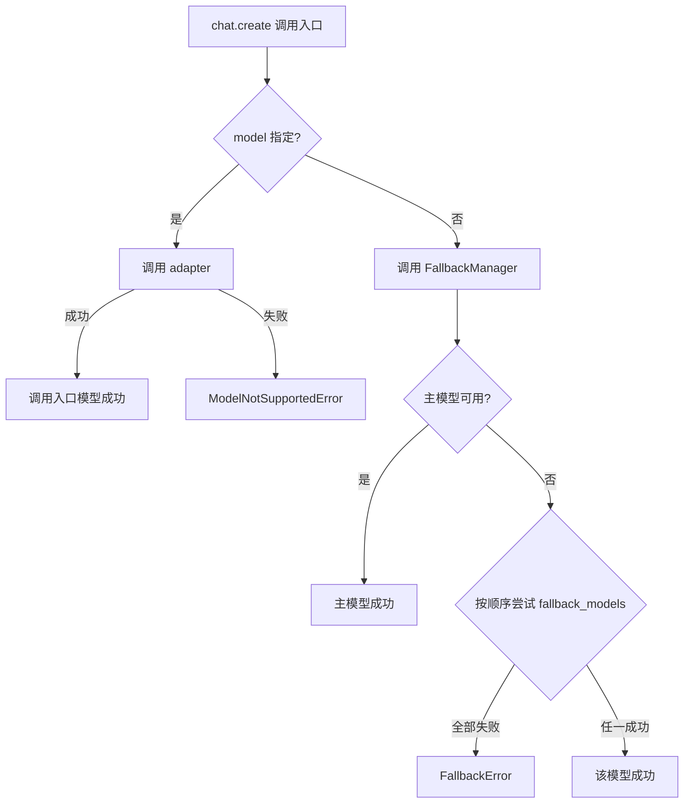

# CNLLM - Chinese LLM Adapter

[English](README_en.md) | 中文

[!\[PyPI Version\](https://img.shields.io/pypi/v/cnllm null)](https://pypi.org/project/cnllm/)
[!\[Python Versions\](https://img.shields.io/pypi/pyversions/cnllm null)](https://pypi.org/project/cnllm/)
[!\[License\](https://img.shields.io/github/license/kanchengw/cnllm null)](LICENSE)

***

## 项目背景

CNLLM 的开发始于两个问题：
- 如何将中文大模型更高效地接入 langchain、LlamaIndex、LiteLLM 等主流机器学习和大模型应用框架
- 如何基于 OpenAI 标准统一中文大模型的接口、参数与响应规范

对于问题一，厂商提供的 OpenAI 兼容接口解决方案虽简单易用，但无法充分发挥中文大模型的原生能力；

这又引出问题二，若使用厂商的原生接口，除了响应解析、格式转换等繁琐工作，还依赖于各厂商的 SDK，其代码和参数规范迥异，导致开发者需要为每个模型进行定制化的开发，增加了部署和维护成本。

CNLLM 致力于解决这一两难困境——通过提供一个**统一的 OpenAI 兼容接口层**与一套**标准化的参数规则和响应格式规范**，在完整释放中文大模型原生能力的同时，将异构响应自动封装为 OpenAI 标准格式；尤其在需要不同厂商的模型协作的场景中，CNLLM 也能稳定提供一致的接口、参数和响应格式。

通过 CNLLM，开发者可以无障碍地在 OpenAI 生态内的机器学习和大模型应用框架中使用中文大模型。

欢迎志同道合的朋友共同参与 CNLLM 的发展，请在以下邮箱联系我们：<wangkancheng1122@163.com>

### 我们期待这样的合作

| 方向           | 说明                            |
| ------------ | ----------------------------- |
| 🌐 **新厂商适配** | 接入更多中文大模型（如阿里千问、百度文心一言、腾讯混元等）  |
| 🔗 **框架适配**  | 深化与 LlamaIndex、LiteLLM 等框架的集成 |
| 🐛 **能力扩展**  | Embedding、多模态等功能的适配框架开发       |
| 📖 **文档完善**  | 补充使用案例、优化开发指南                 |
| 💡 **功能建议**  | 提出您的想法与需求                     |

#### 项目开发文档：

- [开发者指南](docs/CONTRIBUTOR.md)
- [系统架构](docs/ARCHITECTURE.md)

## 更新日志

### v0.6.0 (2026-04-08)

- ✨ **异步调用** - 完整异步支持，通过 `AsyncCNLLM` 客户端提供 `await client.chat.create()` 和 `await client.embedding.create()` 异步接口
  - httpx 统一同步/异步 HTTP 客户端，支持 SSE 流式
  - 流式调用返回 `AsyncIterator[dict]`，非流式返回 `dict`
- ✨ **批量调用** - `client.chat.batch()` 支持批量并发调用，返回 `BatchResponse`，支持流式/非流式、实时统计
  - 实时统计：`request_counts` 字段实时显示当前请求状态
  - 错误隔离：单个请求失败不影响其他请求
  - 进度回调：`callbacks` 自定义回调函数
- ✨ **Embedding 调用** - `client.embedding.create()` 支持单个/批量 Embedding，返回 `EmbeddingResponse`
  - 同步/异步接口：`create()` / `acreate()`
  - 自定义 ID：支持 `custom_ids` 参数
  - OpenAI 兼容：返回标准 OpenAI embedding 格式

### v0.5.0 (2026-04-06)

- ✨ **KIMI 适配** - Kimi 模型适配开发，支持 kimi-k2.5、kimi-k2 系列和 moonshot-v1 系列（8k/32k/128k），  支持原生参数`prompt_cache_key`、`safety_identifier`
- ✨ **DeepSeek 适配** - DeepSeek 模型适配开发，支持 `deepseek-chat` 和 `deepseek-reasoner` 两个模型，支持原生参数`logit_bias`
- ✨ **响应字段全支持** - 若厂商的响应中包含 `system_fingerprint` 和 `choices[0].logprobs` 字段，则在 CNLLM标准响应中也会包含这些字段，实现 OpenAI 标准响应的全字段支持

### v0.4.3 (2026-04-06)

- ✨ **豆包Doubao适配** - 豆包Doubao Seed系列模型适配开发，支持 seed-2.0系列、seed-1.6系列和 seed-1.8等 9 个模型(具体见`支持的模型列表`)，支持豆包原生参数，如`stream_options`、`reasoning_effort`、`service_tier` 等
  - 支持 `reasoning_effort` 推理长度字段， `minimal`、`low`、`medium`、`high`四档位切换
  - 支持 `thinking` 字段，`true`(enabled)、`false`(disabled)、`auto`三档位切换，其中`thinking="auto"`仅在 doubao-seed-1-6 模型中生效
- 🔧 **已知 bug 修复** - 修复流式响应中 `_collect_stream_result` 重复调用导致内容累积异常的 bug

### v0.4.2 (2026-04-05)

- ✨ **智谱GLM适配** - 智谱GLM模型适配开发，支持"glm-4.6"、"glm-5"、"glm-5-turbo"和 GLM 4.7系列模型
  - 支持智谱原生参数，如`do_sample`、`request_id`、`response_format`、`tool_stream`、`thinking`等
- 🔧 **已知 bug 修复** - 修复`id`字段的响应映射

### v0.4.1 (2026-04-04)

- 🔧 **已知 bug 修复**

### v0.4.0（2026-04-03）

- ✨ **mimo适配** - 小米mimo模型适配开发，支持"mimo-v2-pro"、"mimo-v2-omni"、"mimo-v2-flash"
- ✨ **.think 属性** - `client.chat.think` 获取 reasoning\_content，支持流式累积
- ✨ **.tools 属性** - `client.chat.tools` 获取 tool\_calls，支持流式累积
- ✨ **流式累积** - `.think`、`.still`、`.tools` 支持在流式响应中实时滚动积累

## 特性

- **OpenAI 标准兼容** - 模型输出对齐 OpenAI API 标准格式
- **主流框架集成** - 适配 LangChain、LlamaIndex 等主流机器学习库
- **统一接口** - 一套代码，无缝切换不同国产大模型

## 支持的模型

- **DeepSeek**：deepseek-chat、deepseek-reasoner
- **KIMI (Moonshot AI)**：kimi-k2.5、kimi-k2-thinking、kimi-k2-thinking-turbo、kimi-k2-turbo-preview、kimi-k2-0905-preview、moonshot-v1-8k、moonshot-v1-32k、moonshot-v1-128k
- **豆包Doubao**：doubao-seed-2-0-pro、doubao-seed-2-0-mini、doubao-seed-2-0-lite、doubao-seed-2-0-code、doubao-seed-1-8、doubao-seed-1-6、doubao-seed-1-6-lite、doubao-seed-1-6-flash
- **智谱GLM**：glm-4.6、glm-4.7、glm-4.7-flash、glm-4.7-flashx、glm-5、glm-5-turbo、glm-5.1
- **小米mimo**：mimo-v2-pro、mimo-v2-omni、mimo-v2-flash
- **MiniMax**：MiniMax-M2.7、MiniMax-M2.5、MiniMax-M2.1、MiniMax-M2
- **更多厂商、模型支持正在开发中**

## 安装

```bash
pip install cnllm
```

## 快速开始

### 客户端初始化

#### 同步客户端
```python
client = CNLLM(model="minimax-m2.7", api_key="your_api_key")
```

#### 异步客户端

支持两种异步客户端的初始化方式，分别对应不同的使用场景：
- `持久化会话`会在多个调用之间保持会话状态，适合需要维护上下文的应用场景
- `临时会话`单次会话，不保持会话状态，自动关闭会话。

**持久化会话**：
```python
client = AsyncCNLLM(
    model="minimax-m2.7", api_key="your_api_key")
resp = await client.chat.create(...)
await client.aclose()  # 手动关闭
```

**临时会话**：
```python
async with AsyncCNLLM(
    model="deepseek-chat", api_key="xxx") as client:
    resp = await client.chat.create(...)
    print(resp)  # 自动调用 aclose()关闭会话
```

### 三种调用入口（同步/异步）

**1. 极简调用** 

```python
# 同步
resp = client("用一句话介绍自己")

# 异步
resp = await async_client("用一句话介绍自己")
```

**2. 标准调用** 

```python
# 同步
resp = client.chat.create(prompt="用一句话介绍自己")

# 异步
resp = await async_client.chat.create(prompt="用一句话介绍自己")
```

**3. 完整调用** 

```python
# 同步
resp = client.chat.create(
    messages=[{"role": "user", "content": "用一句话介绍自己"}]
)

# 异步
resp = await async_client.chat.create(
    messages=[{"role": "user", "content": "用一句话介绍自己"}]
)
```

### 流式调用

流式调用通过 WebSocket 实现**实时流式推送**，支持同步和异步调用。

**同步流式调用**
```python
response = client.chat.create(
    messages=[{"role": "user", "content": "数到3"}], 
    stream=True
)
for chunk in response:
    print(chunk)
```

**异步流式调用**
```python
response = await async_client.chat.create(
    messages=[{"role": "user", "content": "数到3"}],
    stream=True
)
async for chunk in response:
    print(chunk)
```

### 批量调用

支持同步/异步、流式/非流式的批量调用，支持多种高级参数。

```python
results = client.chat.batch(
    ["你好", "今天天气怎么样", "你是谁"],
    stream=True,
    max_concurrent=3,         # 最大并发数，默认值为3
    timeout=60,               # 单请求超时（秒）
    stop_on_error=False,      # 遇错是否停止
    callbacks=None            # 进度回调函数列表
)
for chunk in results:
    print(chunk)  # 流式 chunk
print(results.still)               # 批量回复内容 {"request_0": "...", ...}
print(results.tools["request_0"])  # 单个请求的工具调用 {...}
print(result[0])                   # 或 print(result["request_0"]) 单个响应结果
print(result["doc_001"])           # 获取 doc_001 的响应（自定义 custom_ids 时）
```

#### to_dict():

```python
result.to_dict()                        # 只保留 results (默认)
result.to_dict(stats=True)              # 包含 results + 统计字段（request_counts、elapsed）
result.to_dict(stats=True, think=True, still=True, tools=True, raw=True)  # results + 任意字段
```

### Embedding 调用

#### 批量 Embedding

```python
result = client.embedding.create(["Hello", "world", "你好"])
```

#### 标准 Embedding 响应结构

```python
{
    "request_counts": {
        "total": 2,
        "dimension": 1024
    },
    "elapsed": 0.35,
    "results": {
        "request_0": {
            "object": "list",
            "data": [{"embedding": [0.1, 0.2, ...], "index": 0}],
            "model": "embedding-2",
            "usage": {"prompt_tokens": 5, "total_tokens": 5}
        }
    }
}
```

#### 响应访问

```python
print(result[0])  # 或 print(result["request_0"]) 单个响应结果，标准 OpenAI Embedding 响应
print(result["doc_001"])                 # 获取 doc_001 的响应（自定义 custom_ids 时）
print(result.elapsed)                    # 请求耗时
print(result.request_counts)             # 统计信息
```

#### to_dict():
```python
result.to_dict()                        # 只保留 results (默认)
result.to_dict(stats=True)              # 包含 results + 统计字段（request_counts、elapsed）
result.to_dict(results=True, stats=True, usage=True)  # 包含所有信息
```

### 快捷响应入口

针对指定字段设计的快捷入口，优化如 `response.choices[0].message.content` 这样的复杂访问。

| 访问方式                | 说明                         | 响应示例                                                                    |
| ------------------- | -------------------------- | ----------------------------------------------------------------------- |
| `client.chat.still` | 纯净会话响应                     | "你好，我是 minimax-m2.7 模型..."                                              |
| `client.chat.tools` | 工具调用消息                     | [{'id': '...', 'type': 'function', 'function': {...}}]                 |
| `client.chat.think` | 模型思考过程                     | "Let me think about this..."                                            |
| `client.chat.raw`   | 厂商原始响应（包含思考过程等字段在内的完整原生响应） | {'id': '...', 'choices': \[{'message': {'reasoning\_content': '...'}}]} |

## CNLLM 标准响应格式

CNLLM 的流式及非流式标准响应支持由 LangChain 库（深度集成 Runnable 组件）、 LlamaIndex、LiteLLM、Instructor 等支持 OpenAI 标准结构的框架直接消费。

### 非流式响应格式

```python
{
    "id": "chatcmpl-xxx",
    "object": "chat.completion",
    "created": 1234567890,
    "model": "minimax-m2.7",
    "choices": [{
        "index": 0,
        "message": {
            "role": "assistant",
            "content": "你好，我是 MiniMax-M2.7..."
        },
        "logprobs": null,
        "finish_reason": "stop"
    }],
    "usage": {
        "prompt_tokens": 10,
        "completion_tokens": 20,
        "total_tokens": 30,
        "prompt_tokens_details": {
            "cached_tokens": 0
        },
        "completion_tokens_details": {
            "reasoning_tokens": 0
        }
    },
    "system_fingerprint": "fp_xxx"
}
```

### 流式响应格式

```python
{'id': 'chatcmpl-xxx', 'object': 'chat.completion.chunk', 'created': 1234567890, 'model': 'minimax-m2.7', 'choices': [{'index': 0, 'delta': {'role': 'assistant'}, 'finish_reason': None}]}

{'id': 'chatcmpl-xxx', 'object': 'chat.completion.chunk', 'created': 1234567890, 'model': 'minimax-m2.7', 'choices': [{'index': 0, 'delta': {'content': '你'}, 'finish_reason': None}]}

 # ... 中间 chunks

{'id': 'chatcmpl-xxx', 'object': 'chat.completion.chunk', 'created': 1234567890, 'model': 'minimax-m2.7', 'choices': [{'index': 0, 'delta': {}, 'finish_reason': 'stop'}]}
```

## CNLLM 统一接口参数

| 参数                  | 类型          | 必填 | 默认值                    | 客户端入口 | 调用入口 | 说明                                                      |
| ------------------- | ----------- | -- | ---------------------- | :---: | :--: | ------------------------------------------------------- |
| `model`             | str         | ✅  | -                      |   ✅   |   ✅  | 客户端初始化必填                                                |
| `api_key`           | str         | ✅  | -                      |   ✅   |   ✅  | API 密钥                                                  |
| `messages`          | list\[dict] | ⚠️ | -                      |   ❌   |   ✅  | OpenAI 格式消息列表（与 prompt 二选一）                             |
| `prompt`            | str         | ⚠️ | -                      |   ❌   |   ✅  | 简写参数（与 messages 二选一）                                    |
| `fallback_models`   | dict        | -  | -                      |   ✅   |   ❌  | 备用模型配置（具体见文档底部的 FallbackManager 流程设计）                   |
| `base_url`          | str         | -  | 自动适配支持模型的默认地址          |   ✅   |   ✅  | 自定义 API 地址                                              |
| `stream`            | bool        | -  | 端口默认值，一般为False         |   ✅   |   ✅  | 流式响应                                                    |
| `thinking`          | bool        | -  | 端口默认值                  |   ✅   |   ✅  | 思考模式，统一格式为`thinking=True/False`，部分模型支持`thinking="auto"` |
| `tools`             | list        | -  | -                      |   ✅   |   ✅  | 函数工具定义                                                  |
| `response_format`   | dict        | -  | 端口默认值，一般为{type:"text"} |   ✅   |   ✅  | 响应格式                                                    |
| `timeout`           | int         | -  | 60                     |   ✅   |   ✅  | 请求超时（秒）                                                 |
| `max_retries`       | int         | -  | 3                      |   ✅   |   ✅  | 最大重试次数                                                  |
| `retry_delay`       | float       | -  | 1.0                    |   ✅   |   ✅  | 重试延迟（秒）                                                 |
| `temperature`       | float       | -  | 端口默认值                  |   ✅   |   ✅  | 生成随机性                                                   |
| `max_tokens`        | int         | -  | 端口默认值                  |   ✅   |   ✅  | 最大生成 token 数                                            |
| `top_p`             | float       | -  | 端口默认值                  |   ✅   |   ✅  | 核采样阈值                                                   |
| `tool_choice`       | str         | -  | -                      |   ✅   |   ✅  | 工具选择模式：none / auto                                      |
| `presence_penalty`  | float       | -  | 端口默认值                  |   ✅   |   ✅  | 存在惩罚                                                    |
| `frequency_penalty` | float       | -  | 端口默认值                  |   ✅   |   ✅  | 频率惩罚                                                    |
| `organization`      | str         | -  | -                      |   ✅   |   ✅  | 组织标识                                                    |
| `stop`              | str/list    | -  | -                      |   ✅   |   ✅  | 停止序列                                                    |
| `user`              | str         | -  | -                      |   ✅   |   ✅  | 用户标识                                                    |

**说明**：

- 并非所有支持的模型都支持所有 CNLLM 标准请求参数，具体支持情况和支持的其他参数请参考厂商的官方文档。
- 模型支持的更多参数请参考官方文档， CNLLM 会透传具体模型支持的所有参数。
- 对于客户端初始化入口和调用入口都支持的参数，调用时若传入，将覆盖客户端入口配置。

## FallbackManager 模型选择的流程设计

客户端初始化配置`fallback_models`参数，若 `model`中的主模型因任何原因无法响应，将顺序尝试传入的`fallback_models`。
如需重复使用客户端实例，尤其对程序的稳健性有要求，建议配置此项。

```python
client = CNLLM(
    model="minimax-m2.7", api_key="minimax_key", 
    fallback_models={"mimo-v2-flash": "xiaomi-key", "minimax-m2.5": None}  
    )   # None 表示使用主模型配置的 API_key
resp = client.chat.create(prompt="2+2等于几？") 
print(resp)
```



***

**说明**：
在调用入口传入模型将会覆盖客户端的`model`和`fallback_models`参数配置，不会启用 FallbackManager 。

```python
resp = client.chat.create(
    prompt="介绍自己",
    model="minimax-m2.5",  # 覆盖客户端入口传入的模型配置
    api_key="your_other_api_key"  # 覆盖，或不传入，默认使用客户端入口配置的 API_key
)
```

## LangChainRunnable实现

LangChain chain 现在支持异步方法：

```python
from cnllm import AsyncCNLLM
from cnllm.core.framework import LangChainRunnable
from langchain_core.prompts import ChatPromptTemplate
import asyncio

async def langchain_async_stream_demo():
    # 持久化异步客户端
    client = AsyncCNLLM(model="deepseek-chat", api_key="your_key")
    runnable = LangChainRunnable(client)

    prompt = ChatPromptTemplate.from_messages([
        ("system", "你是一个热心的智能助手"),
        ("human", "{input}")
    ])

    # 构建异步 LangChain chain
    chain = prompt | runnable

    # 异步非流式调用
    result = await chain.ainvoke({"input": "2+2等于几？"})
    print(result.content)

    # 异步流式调用
    async for chunk in chain.astream({"input": "数到5"}):
        print(chunk, end="", flush=True)

    # 批量调用
    results = runnable.batch(["Hello", "How are you?"])
    for r in results:
        print(r.content)

    await client.aclose()
asyncio.run(langchain_async_stream_demo())
```

## 许可证

MIT License - 详见 [LICENSE](LICENSE) 文件

## 联系方式

- GitHub Issues: <https://github.com/kanchengw/cnllm/issues>

