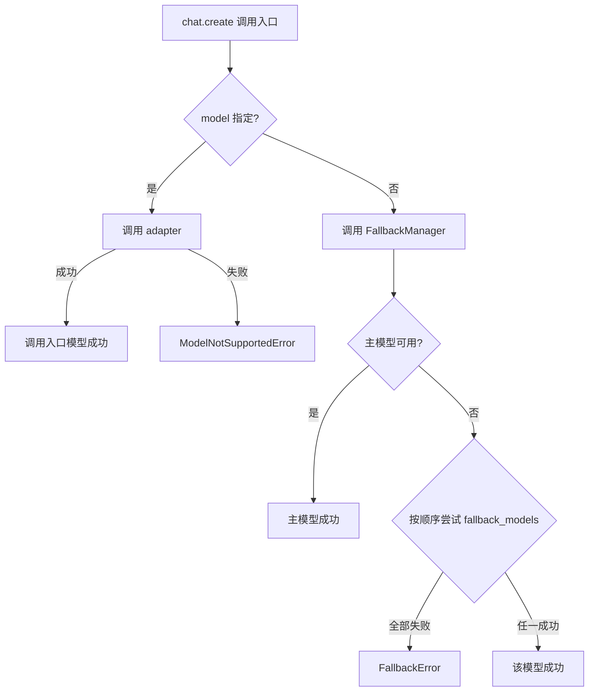

# CNLLM - Chinese LLM Adapter

[English](README_en.md) | 中文

[](https://pypi.org/project/cnllm/)
[](https://pypi.org/project/cnllm/)
[](https://github.com/kanchengw/cnllm/blob/main/LICENSE)

***

## Why CNLLM?

CNLLM 提供了一个**统一的 OpenAI 兼容接口层**与一套**标准化的参数规则和响应格式规范**。通过标准化可配置的 YAML 文件实现请求端和响应端的双重映射，将异构的模型原生响应自动封装为 OpenAI 标准响应，同时完整保留中文大模型的原生参数和能力。

通过 CNLLM，开发者可以无障碍地在 OpenAI 生态内的 langchain、LlamaIndex、LiteLLM 等主流机器学习应用框架中使用中文大模型；尤其在需要多模型协作的开发和应用场景中，通过 CNLLM 可以**减少额外的 SDK 依赖、80% 以上的解析代码量、以及 AI agent 的 Token 消耗**。

- **统一接口** - 一套接口和参数，轻松切换不同中文大模型
- **OpenAI 标准响应** - 让所有中文大模型的异构响应对齐 OpenAI API 标准格式
- **模型能力完整** - 底层调用中文大模型原生接口，支持模型的原生参数，发挥模型完整能力
- **主流框架集成** - 适配 LangChain、LlamaIndex、LiteLLM 等主流机器学习库
- **高度封装** - 提供高度封装的 content/tool\_calls/reasoning\_content 以及原生响应访问入口，无需额外解析响应
- **批量功能Max** - 高灵活性和功能强大的批量请求功能，支持高度可定制的批量请求和其他高级功能

### 开发者招募

欢迎开发者共同参与 CNLLM 的发展，创建 Pull Request 前请先提交 Issue 说明问题并讨论您的解决方案。

或在以下邮箱联系我们：<wangkancheng1122@163.com>

| 方向           | 说明                            |
| ------------ | ----------------------------- |
| 🌐 **新厂商适配** | 接入更多中文大模型（如阿里千问、百度文心一言、腾讯混元等） |
| 🔗 **框架适配**  | 深化与 LlamaIndex、LiteLLM 等框架的集成 |
| 🐛 **能力扩展**  | 多模态功能的适配框架开发                  |
| 📖 **文档完善**  | 补充使用案例、优化开发指南                 |
| 💡 **功能建议**  | 提出您的想法与需求                     |

项目开发文档：

- [系统架构](docs/ARCHITECTURE.md)
- [厂商适配](docs/CONTRIBUTOR.md)
- [功能性文档](docs/feature/)

## 更新日志

### v0.8.1 (2026-04-30)

- ✨ **图片识别支持**
  - 支持 OpenAI 标准 `content` array 格式传入图片（`type: "image_url"`）
  - 多模态验证：自动识别纯文本模型，传入图片时抛出 `InvalidRequestError` 并引导使用多模态模型
  - 新增多模态模型：GLM（glm-5v-turbo、glm-4.5v、glm-4.6v、glm-4.6v-flash）、Kimi（kimi-k2.5、kimi-k2.6、moonshot-v1-vision-preview）、Doubao（2.0全系列、1.6-vision、1.5-vision-pro）、Xiaomi（mimo-v2-omni）
- ✨ **CNLLM 作为 Agent Skill**
  - 项目提供 SKILL.md，AI 编程 Agent 编写国产大模型代码时自动优先使用 CNLLM
  - 支持一键安装：`npx skills add https://github.com/kanchengw/cnllm`
  - 支持 Claude Code、Cursor、Trae、CodeBuddy、通义灵码等工具
- 🔧 **bug 修复**
  - `api_key` 不再泄漏到请求体中（修复 BaseAdapter._build_payload skip 字段缺失）
  - HTTP 错误码补充：403/408/413 正确映射到 ContentFilteredError/TimeoutError/TokenLimitError

### v0.8.0 (2026-04-26)

- ✨ **定制化批量任务**
  - 支持`request`参数，支持对于批量任务中的单个请求进行独立配置，如model、thinking、stream 策略等
- ✨ **模型支持**
  - 新增 deepseek-v4-pro、deepseek-v4-flash、kimi-k2.6、mimo-v2.5-pro、mimo-v2.5 模型适配
- 🔧 **bug 修复**
  - 修复批量非流式任务中，统计字段实时更新失效的问题

### v0.7.0 (2026-04-21)

- ✨ **异步支持** - 完整异步支持，通过 `asyncCNLLM` 客户端提供 chat completion 和 Embeddings 异步接口
  - httpx 统一同步/异步 HTTP 客户端
  - 支持异步 SSE 流式和 Embeddings 调用
- ✨ **批量调用** - 支持 `CNLLM.chat.batch()` 同步批量调用，`asyncCNLLM.chat.batch()` 异步批量调用
  - 实时统计：`request_counts` 字段实时显示当前请求状态
  - 错误隔离：单个请求失败不影响其他请求
  - 自定义 ID：支持 `custom_ids` 参数配置自定义 request\_id
  - 进度回调：`callbacks` 自定义回调函数
  - 快速失败：任意一个请求失败即抛出异常，避免大批量请求失败
  - OpenAI 兼容：批量响应中的每个请求返回标准 OpenAI chat completion 格式
- ✨ **Embedding 调用** - 支持 `client.embeddings.create()` 和 `client.embeddings.batch()` 的同步/异步版本
  - 实时统计：`request_counts` 字段实时显示当前请求状态
  - 错误隔离：单个请求失败不影响其他请求
  - 自定义 ID：支持 `custom_ids` 参数配置自定义 request\_id
  - 进度回调：`callbacks` 自定义回调函数
  - 快速失败：任意一个请求失败即抛出异常，避免大批量请求失败
  - OpenAI 兼容：批量响应中的每个请求返回标准 OpenAI embedding 格式

### v0.6.0 (2026-04-08)

- ✨ **KIMI 适配** - Kimi 模型适配开发，支持 kimi-k2.5、kimi-k2 系列和 moonshot-v1 系列（8k/32k/128k），  支持原生参数`prompt_cache_key`、`safety_identifier`
- ✨ **DeepSeek 适配** - DeepSeek 模型适配开发，支持 `deepseek-chat` 和 `deepseek-reasoner` 两个模型，支持原生参数`logit_bias`
- ✨ **响应字段全支持** - 若厂商的响应中包含 `system_fingerprint` 和 `choices[0].logprobs` 字段，则在 CNLLM标准响应中也会包含这些字段，实现 OpenAI 标准响应的全字段支持

## 支持的模型

### chat completion 支持：

- **DeepSeek**：deepseek-chat、deepseek-reasoner、deepseek-v4-pro、deepseek-v4-flash
- **KIMI (Moonshot AI)**：kimi-k2.6、kimi-k2.5、kimi-k2-thinking、kimi-k2-thinking-turbo、kimi-k2-turbo-preview、kimi-k2-0905-preview、moonshot-v1-8k、moonshot-v1-32k、moonshot-v1-128k、moonshot-v1-vision-preview
- **豆包Doubao**：doubao-seed-2-0-pro、doubao-seed-2-0-mini、doubao-seed-2-0-lite、doubao-seed-2-0-code、doubao-seed-1-8、doubao-seed-1-6、doubao-seed-1-6-flash、doubao-seed-1-6-vision-250815、doubao-1-5-vision-pro-32k-250115、doubao-seed-1-5-lite-32k-250115、doubao-seed-1-5-pro-32k-250115、doubao-seed-1-5-pro-256k-250115
- **智谱GLM**：glm-4.6、glm-4.7、glm-4.7-flash、glm-4.7-flashx、glm-5、glm-5-turbo、glm-5.1、glm-4.5、glm-4.5-x、glm-4.5-air、glm-4.5-airx、glm-4.5-flash、glm-5v-turbo、glm-4.5v、glm-4.6v、glm-4.6v-flash
- **小米mimo**：mimo-v2-pro、mimo-v2-omni、mimo-v2-flash、mimo-v2.5-pro、mimo-v2.5
- **MiniMax**：MiniMax-M2、MiniMax-M2.1、MiniMax-M2.5、MiniMax-M2.5-highspeed、MiniMax-M2.7、MiniMax-M2.7-highspeed

### Embeddings 支持：

- **MiniMax**: embo-01
- **GLM**：embedding-2、embedding-3、embedding-3-pro

## CNLLM 作为 Agent Skill 使用

根目录下的 SKILL.md 提供了 Agent 可读的指令集，模型在编写中文大模型相关代码时会**自动优先使用 CNLLM**， Skill 安装方式：

### 方式一：一键安装（推荐）

```bash
npx skills add https://github.com/kanchengw/cnllm
```

### 方式二：手动放置

将项目根目录的 `SKILL.md` 文件复制到对应工具的技能目录

### 方式三：从技能市场搜索

在 [LobeHub Skills](https://lobehub.com/skills) 搜索 "cnllm" 

## 1. 快速开始

### 1.1 安装

```bash
pip install cnllm
```

### 1.2 客户端初始化

#### 1.2.1 同步客户端

```python
from cnllm import CNLLM

client = CNLLM(model="minimax-m2.7", api_key="your_api_key")
resp = client.chat.create(...)  
```

#### 1.2.2 异步客户端

**无感异步调用**：
异步客户端封装了`asyncio.run()`，支持使用**同步语法实现异步调用**，也支持用户主动包裹`asyncio.run()`并使用异步语法来管理事件循环。

```python
from cnllm import asyncCNLLM

client = asyncCNLLM(
    model="minimax-m2.7", api_key="your_api_key")
resp = client.chat.create(...)
```

### 1.3 上下文管理

支持两种上下文管理方式：

- **持久化会话** 会在多个调用之间保持会话状态，适合需要维护上下文的应用场景
- **临时会话** 单次会话，不保持会话状态，自动关闭会话。

**持久化会话**：

```Python
client = CNLLM(
    model="minimax-m2.7", api_key="your_api_key")
resp = client.chat.create(...)
client.close()                         # 手动关闭，异步客户端使用client.aclose()
```

**临时会话**：

```Python
with CNLLM(
    model="deepseek-chat", api_key="your_api_key") as client:
    resp = client.chat.create(...)     # 自动关闭会话
```

## 2. 调用场景

### 2.1 chat completion 单条调用

支持三种输入方式，其中**极简调用**不支持除字符串外的其他参数(流式调用可在客户端配置 `stream=True` 参数)。

**极简调用：**

```python
resp = client("用一句话介绍自己")
```

**标准调用：**

```python
resp = client.chat.create(prompt="用一句话介绍自己", stream=True)
```

**完整调用：**

```python
resp = client.chat.create(
    messages=[
        {"role": "user", "content": "用一句话介绍自己"},
        {"role": "assistant", "content": "我是一个智能助手"},
        {"role": "user", "content": "你好"},
        ]
)
```

#### 2.1.1 非流式调用

```python
resp = client.chat.create(
    messages=[{"role": "user", "content":"用一句话介绍自己"}],
)
```

#### 2.1.2 流式调用

```python
resp = client.chat.create(
    prompt="用一句话介绍自己", 
    stream=True
)
for chunk in resp:
    pass
```

#### 2.1.3 响应访问

特别的，在流式调用中，响应支持**流中访问**，结果**实时累积**：

| 类别              | 访问方式         | 返回格式              | 返回示例                                             |
| --------------- | ------------ | ----------------- | ------------------------------------------------ |
| **think**思考过程   | `resp.think` | `str`             | `"推理内容..."`                                      |
| **still**回复内容   | `resp.still` | `str`             | `"回复内容..."`                                      |
| **tools**工具调用消息 | `resp.tools` | `Dict[int, Dict]` | `{0: {"id": "...", "function": {...}}, 1: {...}` |
| **raw**模型原生响应   | `resp.raw`   | `Dict`            | `{"id": "...", "choices": [...], ...}`           |

### 2.2 chat completion 批量调用

可通过`prompt`和`messages`参数输入并快速配置全局参数，也可以通过`requests`参数为单个请求进行独立配置。

**prompt 参数：**

```python
resp = client.chat.batch(
    prompt=["你好", "今天天气怎么样", "你是谁"],
    stream=True
)
```

**messages 参数：**

```python
resp = client.chat.batch(
    messages=[
        [{"role": "user", "content": "北京天气怎么样"},
         {"role": "assistant", "content": "北京天气晴朗"},
         {"role": "user", "content": "那上海呢"}],
        [{"role": "user", "content": "上海天气怎么样"}],
    ],
    tools=[get_weather]
)
```

**requests 参数：** 也支持使用`requests.messages`参数管理上下文。

```python
resp = client.chat.batch(
    requests=[
        {"prompt": "北京天气怎么样", "tools": [get_weather], "stream": True},  # 继承全局参数中配置的 thinking 参数
        {"prompt": "1+1等于多少", "tools": [calc], "thinking": False},        # 不继承任何全局参数
        {"prompt": "广州天气怎么样", "model": "deepseek-chat", "api_key": "key"}  # 继承全局参数中配置的 tools 和 thinking 参数
    ],
    # 全局参数（per-request 未配置时继承使用）：
    tools=[default_tool],
    thinking=True,
    max_concurrent=2  # batch 层级参数，不被单个请求继承
)  
```

#### 2.2.1 chat completion 批量响应结构

BatchResponse 外层结构，其中 `results[request_id]` 字段下的每条响应为 OpenAI 标准流式/非流式结构：

```python
{
    "success": ["request_0"],              # 成功的 request_id 列表
    "fail": ["request_1"],                 # 失败的 request_id 列表
    "request_counts": {"success_count": 1, "fail_count": 1, "total": 2},  # 统计信息
    "elapsed": 0.42,                       # 耗时
    "results": {
        "request_0": [chunk1, chunk2, chunk3],  # 单个请求中标准结构的流式 chunk 列表
        "request_1": [error_chunk],
    },
    "think": {"request_0": "...", "request_1": "..."},
    "still": {"request_0": "...", "request_1": "..."},
    "tools": {"request_0": [...], "request_1": [...]},
    "raw": {"request_0": {...}, "request_1": {...}}
}
```

#### 2.2.2 chat completion 批量响应访问

响应支持**实时访问**，结果**实时累积**，支持按 `request_id` 或按索引访问：
批量流式调用中的累积为流式累积，累积幅度 chunk by chunk；批量非流式调用中的累积幅度为 request by request。
特别地，在混合流式策略的批量调用中，实时累积幅度为 request by request。

**访问方式**：

```python
resp = client.chat.batch(
    prompt=["你好", "今天天气怎么样", "你是谁"]
)

for r in resp:
    print(resp.request_counts)    # 实时统计信息，request by request实时更新

print(resp.still)                 # 完整批量请求的回复内容

# 或通过batch_result访问：

for r in client.chat.batch(
    prompt=["你好", "今天天气怎么样", "你是谁"]
):
    print(client.batch_result.results)    # 每个请求的标准响应，request by request实时累积

print(client.batch_result.raw)            # 完整批量请求的模型原生响应
```

**访问字段**：

| 类别          | 访问方式                                                              | 返回格式                         | 返回示例                                                |
| ----------- | ----------------------------------------------------------------- | ---------------------------- | --------------------------------------------------- |
| **统计字段**    | `resp.success` / `batch_result.success`                           | `List[str]`                  | `["request_0", "request_1"]`                        |
| <br />      | `resp.fail` / `batch_result.fail`                                 | `List[str]`                  | `[]`                                                |
| <br />      | `resp.request_counts` / `batch_result.request_counts`             | `Dict`                       | `{"success_count": 2, "fail_count": 0, "total": 2}` |
| <br />      | `resp.elapsed` / `batch_result.elapsed`                           | `float`                      | `1.23`                                              |
| **results** | `resp.results` / `batch_result.results`                           | `Dict[str, Dict]`            | `{"request_0": {...}, "request_1": {...}}`          |
| <br />      | `resp.results[0]` / `batch_result.results[0]`                     | `Dict`                       | `{"id": "...", "choices": [...], ...}`              |
| <br />      | `resp.results["request_0"]` / `batch_result.results["request_0"]` | `Dict`                       | 同上                                                  |
| **think**   | `resp.think` / `batch_result.think`                               | `Dict[str, str]`             | `{"request_0": "...", "request_1": "..."}`          |
| <br />      | `resp.think[0]` / `batch_result.think[0]`                         | `str`                        | `"推理内容..."`                                         |
| <br />      | `resp.think["request_0"]` / `batch_result.think["request_0"]`     | `str`                        | `"推理内容..."`                                         |
| **still**   | `resp.still` / `batch_result.still`                               | `Dict[str, str]`             | `{"request_0": "...", "request_1": "..."}`          |
| <br />      | `resp.still[0]` / `batch_result.still[0]`                         | `str`                        | `"回复内容..."`                                         |
| <br />      | `resp.still["request_0"]` / `batch_result.still["request_0"]`     | `str`                        | `"回复内容..."`                                         |
| **tools**   | `resp.tools` / `batch_result.tools`                               | `Dict[str, Dict[int, Dict]]` | `{"request_0": {...}, "request_1": {...}}`          |
| <br />      | `resp.tools[0]` / `batch_result.tools[0]`                         | `Dict[int, Dict]`            | `{0: {"id": "...", "function": {...}}, 1: {...}`    |
| <br />      | `resp.tools["request_0"]` / `batch_result.tools["request_0"]`     | `Dict[int, Dict]`            | 同上                                                  |
| **raw**     | `resp.raw` / `batch_result.raw`                                   | `Dict[str, Dict]`            | `{"request_0": {...}, "request_1": {...}}`          |
| <br />      | `resp.raw[0]` / `batch_result.raw[0]`                             | `Dict`                       | `{"id": "...", "choices": [...], ...}`              |
| <br />      | `resp.raw["request_0"]` / `batch_result.raw["request_0"]`         | `Dict`                       | 同上                                                  |

**repr():**

```python
# 简洁统计，不显示大文本:
print(resp)
# BatchResponse(request_counts={...}, elapsed=..., success=[...], errors=[...])
```

**to\_dict():**

```python
resp.to_dict()                        # 只保留 results (默认)
resp.to_dict(stats=True)              # 包含 results + 统计字段（request_counts、elapsed）
resp.to_dict(stats=True, think=True, still=True, tools=True, raw=True)  # results + 任意字段
```

### 2.3 Embeddings 调用

支持同步/异步 Embeddings 调用，支持**进度回调、自定义请求 ID 、遇错停止**等高级功能，支持配置**并发控制、批量大小**。
当前支持 MiniMax embo-01，GLM embedding-2/embedding-3/embedding-3-pro 模型。

#### 2.3.1 单条调用

```python
resp = client.embeddings.create(input="Hello world")
# 返回: Dict (OpenAI 标准 Embeddings 格式)
```

#### 2.3.2 Embeddings 批量调用

```python
resp = client.embeddings.batch(
    input=["Hello", "world", "你好"]
)
```

#### 2.3.2 Embeddings 批量响应结构

BatchEmbeddingResponse 外层结构，其中 `results[request_id]` 字段下每条响应为 OpenAI 标准 Embeddings 结构：

```python
{   
    "success": ["request_0"], 
    "fail": [], 
    "request_counts": {
        "success_count": 1, "fail_count": 1, "total": 2,"dimension": 1024
    },
    "elapsed": 0.35,
    "results": {
        "request_0": {
            "object": "list",
            "data": [{"object": "embedding","embedding": [0.1, 0.2, ...], "index": 0}],
            "model": "embedding-2",
            "usage": {"prompt_tokens": 5, "total_tokens": 5}
        }
    }
}
```

#### 2.3.3 Embeddings 批量响应访问

响应支持**实时访问**，结果**实时累积**，累积幅度 request by request；支持按 `request_id` 或按索引访问。

| 类别          | 访问方式                                                              | 返回格式              | 返回示例                                                                   |
| ----------- | ----------------------------------------------------------------- | ----------------- | ---------------------------------------------------------------------- |
| **统计字段**    | `resp.success` / `batch_result.success`                           | `List[str]`       | `["request_0", "request_1"]`                                           |
| <br />      | `resp.fail` / `batch_result.fail`                                 | `List[str]`       | `["request_2"]`                                                        |
| <br />      | `resp.request_counts` / `batch_result.request_counts`             | `Dict`            | `{"total": 2, "success_count": 2, "fail_count": 0, "dimension": 1024}` |
| <br />      | `resp.elapsed` / `batch_result.elapsed`                           | `float`           | `1.23`                                                                 |
| <br />      | `resp.total` / `batch_result.total`                               | `int`             | `2`                                                                    |
| <br />      | `resp.dimension` / `batch_result.dimension`                       | `int`             | `1024`                                                                 |
| **results** | `resp.results` / `batch_result.results`                           | `Dict[str, Dict]` | `{"request_0": {...}, "request_1": {...}}`                             |
| <br />      | `resp.results[0]` / `batch_result.results[0]`                     | `Dict`            | `{"object": "list", "data": [...], ...}`                               |
| <br />      | `resp.results["request_0"]` / `batch_result.results["request_0"]` | `Dict`            | 同上                                                                     |

**repr():**

```python
# 简洁统计，不显示大文本:
print(resp)
# BatchResponse(request_counts={...}, elapsed=..., success=[...], errors=[...])
```

**to\_dict():**

```python
resp.to_dict()                        # 只保留 results (默认)
resp.to_dict(stats=True)              # 包含 results + 统计字段（request_counts、elapsed）
```

### 2.4 批量调用控制参数

批量调用支持**重试策略、并发控制**参数配置：

| 参数               | 类型      | 默认值      | 说明                                        |
| ---------------- | ------- | -------- | ----------------------------------------- |
| `batch_size`     | `int`   | 动态计算     | 批处理大小，仅 Embeddings 调用支持配置                 |
| `max_concurrent` | `int`   | `12`/`3` | 最大并发数，Embeddings 默认12，Chat completion 默认3 |
| `rps`            | `float` | `10`/`2` | 每秒请求数，Embeddings 默认10，Chat completion 默认2 |
| `timeout`        | `int`   | 30       | 单请求超时（秒）                                  |
| `max_retries`    | `int`   | 3        | 最大重试次数                                    |
| `retry_delay`    | `float` | 1.0      | 重试延迟（秒）                                   |

**batch\_size**：
仅支持批量 Embeddings 调用时配置，默认根据请求数量自适应计算，不建议手动配置。

### 2.5 批量调用高级功能

批量 chat completion/Embeddings 调用都支持**进度回调、自定义请求 ID 、遇错停止**。

#### 2.5.1 自定义请求 ID

通过 `custom_ids` 参数为批量请求指定自定义 ID，批量响应中会替换原 request\_id。

```python
resp = client.embeddings.batch(
    input=["文本1", "文本2", "文本3"],
    custom_ids=["doc_001", "doc_002", "doc_003"]
)

resp.results["doc_001"]          # 获取 doc_001 的响应
resp.think["doc_002"]            # 获取 doc_002 的推理内容
```

#### 2.5.2 进度回调

回调会在**每个请求完成时被调用**，可以用于：

- 实时显示处理进度
- 记录已完成的任务
- 动态调整后续任务
- ...

```python
def on_complete(request_id, status):          # 回调函数示例，支持自定义
    print(f"[{request_id}] {status}")

resp = client.chat.batch(
    requests,
    callbacks=[on_complete]
)
```

#### 2.5.3 遇错停止

当批量请求遭遇第一个错误时，会立即停止后续任务，同时返回已处理的请求结果：

```python
resp = client.embeddings.batch(
    input=requests,
    stop_on_error=True
)
```

## 3. CNLLM 标准响应格式

CNLLM 单条请求的流式、非流式、 Embeddings 响应格式，完全对齐 OpenAI 标准结构。

### 3.1 非流式响应格式

```python
{
    "id": "chatcmpl-xxx",
    "object": "chat.completion",
    "created": 1234567890,
    "model": "minimax-m2.7",
    "choices": [{
        "index": 0,
        "message": {
            "role": "assistant",
            "content": "你好，我是 MiniMax-M2.7..."
        },
        "logprobs": null,
        "finish_reason": "stop"
    }],
    "usage": {
        "prompt_tokens": 10,
        "completion_tokens": 20,
        "total_tokens": 30,
        "prompt_tokens_details": {
            "cached_tokens": 0
        },
        "completion_tokens_details": {
            "reasoning_tokens": 0
        }
    },
    "system_fingerprint": "fp_xxx"
}
```

### 3.2 流式响应格式

```python
{'id': 'chatcmpl-xxx', 'object': 'chat.completion.chunk', 'created': 1234567890, 'model': 'minimax-m2.7', 'choices': [{'index': 0, 'delta': {'role': 'assistant'}, 'finish_reason': None}]}

{'id': 'chatcmpl-xxx', 'object': 'chat.completion.chunk', 'created': 1234567890, 'model': 'minimax-m2.7', 'choices': [{'index': 0, 'delta': {'content': '你'}, 'finish_reason': None}]}

 # ... 中间 chunks

{'id': 'chatcmpl-xxx', 'object': 'chat.completion.chunk', 'created': 1234567890, 'model': 'minimax-m2.7', 'choices': [{'index': 0, 'delta': {}, 'finish_reason': 'stop'}]}
```

### 3.3 Embeddings 响应格式

```python
{
    "object": "list",
    "data": [{
        "object": "embedding",
        "embedding": [0.1, 0.2, ...],
        "index": 0
    }],
    "model": "embedding-2",
    "usage": {
        "prompt_tokens": 5,
        "total_tokens": 5
    }
}
```

## 4. CNLLM 统一接口参数

| 参数                  | 类型          | 必填 | 默认值                    | 客户端入口 | 调用入口 | 说明                                                      |
| ------------------- | ----------- | -- | ---------------------- | :---: | :--: | ------------------------------------------------------- |
| `model`             | str         | ✅  | -                      |   ✅   |   ✅  | 客户端初始化必填                                                |
| `api_key`           | str         | ✅  | -                      |   ✅   |   ✅  | API 密钥                                                  |
| `messages`          | list\[dict] | ⚠️ | -                      |   ❌   |   ✅  | OpenAI 格式消息列表（与 prompt 二选一）                             |
| `prompt`            | str         | ⚠️ | -                      |   ❌   |   ✅  | 简写参数（与 messages 二选一）                                    |
| `fallback_models`   | dict        | -  | -                      |   ✅   |   ❌  | 备用模型配置（具体见文档底部的 FallbackManager 流程设计）                   |
| `base_url`          | str         | -  | 自动适配支持模型的默认地址          |   ✅   |   ✅  | 自定义 API 地址                                              |
| `stream`            | bool        | -  | 端口默认值，一般为False         |   ✅   |   ✅  | 流式响应                                                    |
| `thinking`          | bool        | -  | 端口默认值                  |   ✅   |   ✅  | 思考模式，统一格式为`thinking=True/False`，部分模型支持`thinking="auto"` |
| `tools`             | list        | -  | -                      |   ✅   |   ✅  | 函数工具定义                                                  |
| `response_format`   | dict        | -  | 端口默认值，一般为{type:"text"} |   ✅   |   ✅  | 响应格式                                                    |
| `timeout`           | int         | -  | 60                     |   ✅   |   ✅  | 请求超时（秒）                                                 |
| `max_retries`       | int         | -  | 3                      |   ✅   |   ✅  | 最大重试次数                                                  |
| `retry_delay`       | float       | -  | 1.0                    |   ✅   |   ✅  | 重试延迟（秒）                                                 |
| `temperature`       | float       | -  | 端口默认值                  |   ✅   |   ✅  | 生成随机性                                                   |
| `max_tokens`        | int         | -  | 端口默认值                  |   ✅   |   ✅  | 最大生成 token 数                                            |
| `top_p`             | float       | -  | 端口默认值                  |   ✅   |   ✅  | 核采样阈值                                                   |
| `tool_choice`       | str         | -  | -                      |   ✅   |   ✅  | 工具选择模式：none / auto                                      |
| `presence_penalty`  | float       | -  | 端口默认值                  |   ✅   |   ✅  | 存在惩罚                                                    |
| `frequency_penalty` | float       | -  | 端口默认值                  |   ✅   |   ✅  | 频率惩罚                                                    |
| `organization`      | str         | -  | -                      |   ✅   |   ✅  | 组织标识                                                    |
| `stop`              | str/list    | -  | -                      |   ✅   |   ✅  | 停止序列                                                    |
| `user`              | str         | -  | -                      |   ✅   |   ✅  | 用户标识                                                    |

**说明**：

- 并非所有支持的模型都支持所有 CNLLM 标准请求参数，具体支持情况和支持的其他参数请参考厂商的官方文档。
- 模型支持的更多参数请参考官方文档， CNLLM 会透传具体模型支持的所有参数。
- 对于客户端初始化入口和调用入口都支持的参数，调用时若传入，将覆盖客户端入口配置。

## 5. FallbackManager 模型选择的流程设计

客户端初始化配置`fallback_models`参数，若 `model`中的主模型因任何原因无法响应，将顺序尝试传入的`fallback_models`。
如需重复使用客户端实例，尤其对程序的稳健性有要求，建议配置此项。

```python
client = CNLLM(
    model="minimax-m2.7", api_key="minimax_key", 
    fallback_models={"mimo-v2-flash": "xiaomi-key", "minimax-m2.5": None}  
    )   # None 表示使用主模型配置的 key
resp = client.chat.create(prompt="2+2等于几？") 
print(resp)
```



***

**说明**：

在调用入口传入模型将会覆盖客户端的`model`和`fallback_models`参数配置，不会启用 FallbackManager, `batch()` 中按请求独立判断。

```python
client = CNLLM(model="minimax-m2.5", api_key="key1", fallback_models={"deepseek-chat": "key2"})

resp = client.chat.batch(requests=[
    {"prompt": "你好", "model": "deepseek-chat", "api_key": "key2"},     # 有 model → 覆盖客户端配置
    {"prompt": "天气"},                               # 无 model → 用客户端 minimax-m2.5 + fallback
])
```

## 6. 应用框架深度集成

### 6.1. LangChainRunnable实现

LangChain chain 统一支持同步/异步方法：

```python
from cnllm import CNLLM
from cnllm.core.framework import LangChainRunnable
from langchain_core.prompts import ChatPromptTemplate
import asyncio

# 创建 CNLLM 客户端（内部持有异步引擎）
client = CNLLM(model="deepseek-chat", api_key="your_key")

# 创建 Runnable 实例
runnable = LangChainRunnable(client)

prompt = ChatPromptTemplate.from_messages([
    ("system", "你是一个热心的智能助手"),
    ("human", "{input}")
])

# 构建 LangChain chain
chain = prompt | runnable

# 同步调用 invoke/stream/batch
resp = chain.invoke({"input": "2+2等于几？"})
print(resp.content)

for chunk in chain.stream({"input": "数到5"}):
    print(chunk, end="", flush=True)

resp = chain.batch([{"input": "Hello"}, {"input": "How are you?"}])
for r in resp:
    print(r.content)

# 异步调用 ainvoke/astream/abatch
async def main():
    async with client:
        resp = await chain.ainvoke({"input": "2+2等于几？"})
        print(resp.content)

        async for chunk in chain.astream({"input": "数到5"}):
            print(chunk, end="", flush=True)

        resp = await chain.abatch([{"input": "Hello"}, {"input": "How are you?"}])
        for r in resp:
            print(r.content)

asyncio.run(main())
```

### 许可证

MIT License - 详见 [LICENSE](LICENSE) 文件

### 联系方式

- GitHub Issues: <https://github.com/kanchengw/cnllm/issues>
- 作者邮箱：<wangkancheng1122@163.com>

