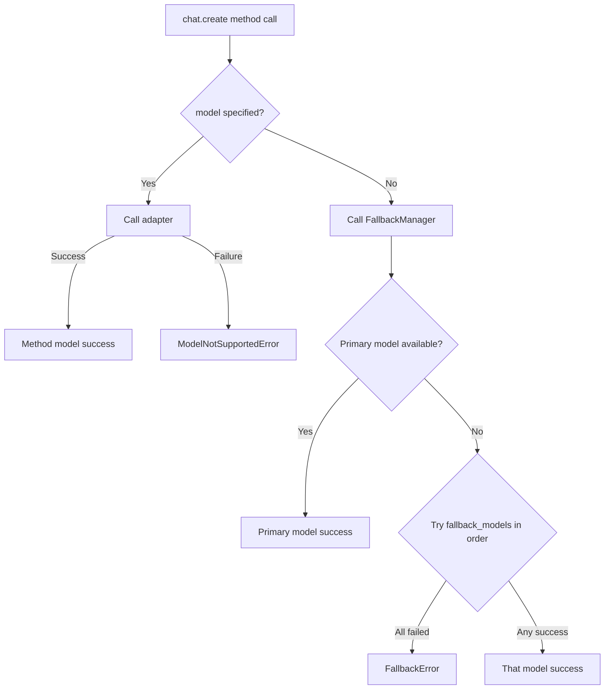

# CNLLM - Chinese LLM Adapter

[English](README_en.md) | [中文](README.md)

[](https://pypi.org/project/cnllm/)
[](https://pypi.org/project/cnllm/)
[](LICENSE)

***

## Project Background

CNLLM was developed to address two key challenges:
- How to efficiently integrate Chinese LLMs into mainstream ML and LLM application frameworks like LangChain, LlamaIndex, and LiteLLM
- How to unify Chinese LLMs' **interfaces, parameters, and response specifications** based on OpenAI standards

For the first challenge, while OpenAI-compatible interfaces from vendors are easy to use, they cannot fully leverage the native capabilities of Chinese LLMs.

This leads to the second challenge: using vendors' native interfaces requires tedious work like response parsing and format conversion, and relies on vendor SDKs with inconsistent code and parameter specifications. Developers need customized development for each model, increasing deployment and maintenance costs.

CNLLM is dedicated to solving this dilemma—by providing a **unified OpenAI-compatible interface layer** and **standardized parameter rules and response format specifications**. While fully unleashing Chinese LLMs' native capabilities, CNLLM automatically converts heterogeneous responses into OpenAI standard format. Even in scenarios requiring collaboration across different vendors' models, CNLLM provides consistent interfaces, parameters, and response formats.

With CNLLM, developers can seamlessly use Chinese LLMs within the OpenAI ecosystem of ML and LLM application frameworks.

### CNLLM Features

- **OpenAI Standard Compatible** - Model responses align with OpenAI API standard format
- **Mainstream Framework Integration** - Adapted for LangChain, LlamaIndex, and other mainstream ML libraries
- **Unified Interface** - One set of parameters and code, seamlessly switch between different Chinese LLMs

### Collaboration Opportunities

Welcome like-minded friends to join us in building CNLLM. Please contact us at: <wangkancheng1122@163.com>

| Area | Description |
|------|-------------|
| 🌐 **New Vendor Adapters** | Integrate more Chinese LLMs (Alibaba Qwen, Baidu Wenxin, Tencent Hunyuan, etc.) |
| 🔗 **Framework Integration** | Deepen integration with LlamaIndex, LiteLLM, and other frameworks |
| 🐛 **Capability Expansion** | Adapter framework development for Embedding, Multimodal, etc. |
| 📖 **Documentation** | Add use cases and improve development guides |
| 💡 **Feature Suggestions** | Share your ideas and requirements |

Project Documentation:
- [System Architecture](docs/ARCHITECTURE_en.md)
- [Vendor Development Guide](docs/CONTRIBUTOR_en.md)
- [Feature Documentation](docs/feature/)

## Changelog

### v0.7.0 (2026-04-21)

- ✨ **Async Support** - Full async support via `AsyncCNLLM` client for chat completion and Embeddings async interfaces
  - httpx unified sync/async HTTP client
  - Supports async SSE streaming and Embeddings calls
- ✨ **Batch Calls** - `CNLLM.chat.batch()` for sync batch calls, `AsyncCNLLM.chat.batch()` for async batch calls
  - Real-time stats: `request_counts` field shows real-time request status
  - Error isolation: single request failure doesn't affect other requests
  - Custom IDs: supports `custom_ids` parameter for custom request_id
  - Progress callbacks: `callbacks` custom callback functions
  - Fast fail: throws exception on any request failure to avoid large-scale batch failures
  - OpenAI compatible: each request in batch response returns standard OpenAI chat completion format
- ✨ **Embedding Calls** - `client.embeddings.create()` and `client.embeddings.batch()` sync/async versions
  - Real-time stats: `request_counts` field shows real-time request status
  - Error isolation: single request failure doesn't affect other requests
  - Custom IDs: supports `custom_ids` parameter for custom request_id
  - Progress callbacks: `callbacks` custom callback functions
  - Fast fail: throws exception on any request failure to avoid large-scale batch failures
  - OpenAI compatible: each request in batch response returns standard OpenAI embedding format

### v0.6.0 (2026-04-08)

- ✨ **KIMI Adapter** - Kimi model adapter, supports kimi-k2.5, kimi-k2 series, and moonshot-v1 series (8k/32k/128k), supports native parameters `prompt_cache_key`, `safety_identifier`
- ✨ **DeepSeek Adapter** - DeepSeek model adapter, supports `deepseek-chat` and `deepseek-reasoner`, supports native parameter `logit_bias`
- ✨ **Full Response Field Support** - If vendor responses contain `system_fingerprint` and `choices[0].logprobs` fields, CNLLM standard responses will also include these fields

## Supported Models

### Chat Completion:

- **DeepSeek**: deepseek-chat, deepseek-reasoner
- **KIMI (Moonshot AI)**: kimi-k2.6, kimi-k2.5, kimi-k2-thinking, kimi-k2-thinking-turbo, kimi-k2-turbo-preview, kimi-k2-0905-preview, moonshot-v1-8k, moonshot-v1-32k, moonshot-v1-128k
- **Doubao**: doubao-seed-2-0-pro, doubao-seed-2-0-mini, doubao-seed-2-0-lite, doubao-seed-2-0-code, doubao-seed-1-8, doubao-seed-1-6, doubao-seed-1-6-lite, doubao-seed-1-6-flash
- **GLM**: glm-4.6, glm-4.7, glm-4.7-flash, glm-4.7-flashx, glm-5, glm-5-turbo, glm-5.1
- **Xiaomi mimo**: mimo-v2-pro, mimo-v2-omni, mimo-v2-flash
- **MiniMax**: MiniMax-M2.7, MiniMax-M2.5, MiniMax-M2.1, MiniMax-M2

### Embedding:

- **MiniMax**: embo-01
- **GLM**: embedding-2, embedding-3

## Quick Start

### 1.1 Installation

```bash
pip install cnllm
```

### 1.2 Client Initialization

#### 1.2.1 Sync Client
```python
client = CNLLM(model="minimax-m2.7", api_key="your_api_key")
```

#### 1.2.2 Async Client

Two async client initialization methods for different use cases:
- **Persistent Session** maintains session state across multiple calls, suitable for context-dependent applications
- **Temporary Session** is single-use, doesn't maintain state, auto-closes

**Persistent Session:**
```python
client = asyncCNLLM(
    model="minimax-m2.7", api_key="your_api_key")
resp = await client.chat.create(...)
await client.aclose()  # Manual close
```

**Temporary Session:**
```python
async with asyncCNLLM(
    model="deepseek-chat", api_key="your_api_key") as client:
    resp = await client.chat.create(...)
```

### 1.3 Three Calling Entrypoints (Sync/Async)

**Simple Call**

```python
resp = client("Introduce yourself in one sentence")
```

**Standard Call**

```python
resp = client.chat.create(prompt="Introduce yourself in one sentence")
```

**Full Call**

```python
resp = client.chat.create(
    messages=[{"role": "user", "content": "Introduce yourself in one sentence"}]
)
```

## 2. Call Scenarios

### 2.1 Streaming Call

Supports sync/async streaming calls, returning chunks in OpenAI standard streaming format.

```python
response = client.chat.create(
    messages=[{"role": "user", "content": "Count to 3"}],
    stream=True
)
for chunk in response:  # Async client uses: async for chunk in await response:
    pass
```

Or direct iteration:

```python
for chunk in client.chat.create(...):  # Async client uses: async for chunk in await client.chat.create(...):
    pass
```

#### 2.1.1 Response Access

In streaming calls, responses support **in-stream access** with **real-time accumulation**.

| Category | Access Method | Return Format | Example |
|----------|-------------|----------------|---------|
| **think** | `resp.think` / `client.chat.think` | `str` | `"reasoning content..."` |
| **still** | `resp.still` / `client.chat.still` | `str` | `"response content..."` |
| **tools** | `resp.tools` / `client.chat.tools` | `Dict[int, Dict]` | `{0: {"id": "...", "function": {...}}, 1: {...}` |
| **raw** | `resp.raw` / `client.chat.raw` | `Dict` | `{"id": "...", "choices": [...], ...}` |

### 2.2 Chat Batch Calls

Supports sync/async, streaming/non-streaming batch calls with **progress callbacks, custom request IDs, error stopping** and other advanced features, with **concurrency control**.

```python
results = client.chat.batch(
    ["Hello", "How's the weather today", "Who are you"]
)
```

#### 2.2.1 BatchResponse Structure

BatchResponse outer structure, where each response under `results[request_id]` is in OpenAI standard streaming/non-streaming format:

```python
{
    "success": ["request_0"],  # List of successful request_ids
    "fail": ["request_1"],   # List of failed request_ids
    "request_counts": {"success_count": 1, "fail_count": 1, "total": 2},  # Statistics
    "elapsed": 0.42,  # Time elapsed
    "results": {
        "request_0": [chunk1, chunk2, chunk3],  # Standard streaming chunks for single request
        "request_1": [error_chunk],
    },
    "think": {"request_0": "...", "request_1": "..."},
    "still": {"request_0": "...", "request_1": "..."},
    "tools": {"request_0": [...], "request_1": [...]},
    "raw": {"request_0": {...}, "request_1": {...}}
}
```

#### 2.2.2 Response Access

In streaming/non-streaming batch calls, responses support **in-batch access** with **real-time accumulation**.

**Two access methods**: directly access via `for chunk in resp.results` during streaming iteration, or access accumulated results via `resp.batch_result.results` after iteration.

| Category | Access Method | Return Format | Example |
|----------|-------------|----------------|---------|
| **stats** | `resp.success` / `batch_result.success` | `List[str]` | `["request_0", "request_1"]` |
| | `resp.fail` / `batch_result.fail` | `List[str]` | `[]` |
| | `resp.request_counts` / `batch_result.request_counts` | `Dict` | `{"success_count": 2, "fail_count": 0, "total": 2}` |
| | `resp.elapsed` / `batch_result.elapsed` | `float` | `1.23` |
| **results** | `resp.results` / `batch_result.results` | `Dict[str, Dict]` | `{"request_0": {...}, "request_1": {...}}` |
| | `resp.results[0]` / `batch_result.results[0]` | `Dict` | `{"id": "...", "choices": [...], ...}` |
| | `resp.results["request_0"]` / `batch_result.results["request_0"]` | `Dict` | Same as above |
| **think** | `resp.think` / `batch_result.think` | `Dict[str, str]` | `{"request_0": "...", "request_1": "..."}` |
| | `resp.think[0]` / `batch_result.think[0]` | `str` | `"reasoning content..."` |
| | `resp.think["request_0"]` / `batch_result.think["request_0"]` | `str` | `"reasoning content..."` |
| **still** | `resp.still` / `batch_result.still` | `Dict[str, str]` | `{"request_0": "...", "request_1": "..."}` |
| | `resp.still[0]` / `batch_result.still[0]` | `str` | `"response content..."` |
| | `resp.still["request_0"]` / `batch_result.still["request_0"]` | `str` | `"response content..."` |
| **tools** | `resp.tools` / `batch_result.tools` | `Dict[str, Dict[int, Dict]]` | `{"request_0": {...}, "request_1": {...}}` |
| | `resp.tools[0]` / `batch_result.tools[0]` | `Dict[int, Dict]` | `{0: {"id": "...", "function": {...}}, 1: {...}` |
| | `resp.tools["request_0"]` / `batch_result.tools["request_0"]` | `Dict[int, Dict]` | Same as above |
| **raw** | `resp.raw` / `batch_result.raw` | `Dict[str, Dict]` | `{"request_0": {...}, "request_1": {...}}` |
| | `resp.raw[0]` / `batch_result.raw[0]` | `Dict` | `{"id": "...", "choices": [...], ...}` |
| | `resp.raw["request_0"]` / `batch_result.raw["request_0"]` | `Dict` | Same as above |

**repr():**
```python
print(result)
# BatchResponse(request_counts={...}, elapsed=..., success=[...], fail=[...])
```

**to_dict():**
```python
result.to_dict()                        # Only results (default)
result.to_dict(stats=True)              # Results + statistics
result.to_dict(stats=True, think=True, still=True, tools=True, raw=True)  # Results + any fields
```

### 2.3 Embeddings Calls

Supports sync/async Embeddings calls with **progress callbacks, custom request IDs, error stopping** and other advanced features, with **concurrency control, batch size** configuration.
Currently supports MiniMax embo-01, GLM embedding-2/embedding-3 models.

#### 2.3.1 Single Call

```python
result = client.embeddings.create(input="Hello world")
# Returns: Dict (OpenAI standard Embeddings format)
```

#### 2.3.2 Batch Call

```python
results = client.embeddings.batch(
    ["Hello", "world", "你好"]
)
```

#### 2.3.3 EmbeddingResponse Structure

EmbeddingResponse outer structure, where each response under `results[request_id]` is in OpenAI standard Embeddings format:

```python
{
    "success": ["request_0"],
    "fail": [],
    "request_counts": {
        "success_count": 1, "fail_count": 1, "total": 2, "dimension": 1024
    },
    "elapsed": 0.35,
    "results": {
        "request_0": {
            "object": "list",
            "data": [{"object": "embedding", "embedding": [0.1, 0.2, ...], "index": 0}],
            "model": "embedding-2",
            "usage": {"prompt_tokens": 5, "total_tokens": 5}
        }
    }
}
```

#### 2.3.4 Response Access

In streaming/non-streaming batch calls, responses support **in-batch access** with **real-time accumulation**.

**Two access methods**: directly access via `resp.results[request_id]` during iteration, or access via `resp.batch_result.results[request_id]` after iteration.

| Category | Access Method | Return Format | Example |
|----------|-------------|----------------|---------|
| **stats** | `resp.success` / `batch_result.success` | `List[str]` | `["request_0", "request_1"]` |
| | `resp.fail` / `batch_result.fail` | `List[str]` | `["request_2"]` |
| | `resp.request_counts` / `batch_result.request_counts` | `Dict` | `{"total": 2, "success_count": 2, "fail_count": 0, "dimension": 1024}` |
| | `resp.elapsed` / `batch_result.elapsed` | `float` | `1.23` |
| | `resp.total` / `batch_result.total` | `int` | `2` |
| | `resp.dimension` / `batch_result.dimension` | `int` | `1024` |
| **results** | `resp.results` / `batch_result.results` | `Dict[str, Dict]` | `{"request_0": {...}, "request_1": {...}}` |
| | `resp.results[0]` / `batch_result.results[0]` | `Dict` | `{"object": "list", "data": [...], ...}` |
| | `resp.results["request_0"]` / `batch_result.results["request_0"]` | `Dict` | Same as above |

**repr():**
```python
print(result)
# EmbeddingResponse(request_counts={...}, elapsed=..., success=[...], fail=[...])
```

**to_dict():**
```python
result.to_dict()                        # Only results (default)
result.to_dict(stats=True)              # Results + statistics
```

### 2.4 Batch Advanced Features

#### 2.4.1 Retry Strategy and Concurrency Control Parameters

| Parameter | Type | Default | Description |
|-----------|------|---------|-------------|
| `batch_size` | `int` | Auto-calculated | Batch size, auto-calculated based on request count (Embedding calls only) |
| `max_concurrent` | `int` | `12`/`3` | Max concurrent requests, Embeddings default 12, Chat completion default 3 |
| `rps` | `float` | `10`/`2` | Requests per second, Embeddings default 10, Chat completion default 2 |
| `timeout` | `int` | 30 | Single request timeout (seconds) |
| `max_retries` | `int` | 3 | Max retry attempts |
| `retry_delay` | `float` | 1.0 | Retry delay (seconds) |

#### 2.4.2 Custom Request IDs

Specify custom IDs for batch requests via `custom_ids` parameter, which will replace original request_ids in batch response.

```python
resp = client.embeddings.batch(
    input=["text1", "text2", "text3"],
    custom_ids=["doc_001", "doc_002", "doc_003"]
)

resp.results["doc_001"]          # Get doc_001's response
resp.think["doc_002"]            # Get doc_002's reasoning content
```

#### 2.4.3 Progress Callbacks

Callbacks are invoked when **each request completes**, useful for:
- Real-time progress display
- Recording completed tasks
- Dynamically adjusting subsequent tasks
- ...

```python
def on_complete(request_id, status):  # Custom callback function example
    print(f"[{request_id}] {status}")

results = client.chat.batch(
    requests,
    callbacks=[on_complete]
)
```

#### 2.4.4 Stop on Error

When the first error occurs in batch requests, subsequent tasks are immediately stopped while returning results of already processed requests:

```python
resp = client.embeddings.batch(
    input=requests,
    stop_on_error=True
)
```

## 3. CNLLM Standard Response Format

CNLLM single request streaming, non-streaming, and Embeddings response formats fully implement OpenAI standard structure.

### 3.1 Non-Streaming Response Format

```python
{
    "id": "chatcmpl-xxx",
    "object": "chat.completion",
    "created": 1234567890,
    "model": "minimax-m2.7",
    "choices": [{
        "index": 0,
        "message": {
            "role": "assistant",
            "content": "Hello, I'm MiniMax-M2.7..."
        },
        "logprobs": null,
        "finish_reason": "stop"
    }],
    "usage": {
        "prompt_tokens": 10,
        "completion_tokens": 20,
        "total_tokens": 30,
        "prompt_tokens_details": {
            "cached_tokens": 0
        },
        "completion_tokens_details": {
            "reasoning_tokens": 0
        }
    },
    "system_fingerprint": "fp_xxx"
}
```

### 3.2 Streaming Response Format

```python
{'id': 'chatcmpl-xxx', 'object': 'chat.completion.chunk', 'created': 1234567890, 'model': 'minimax-m2.7', 'choices': [{'index': 0, 'delta': {'role': 'assistant'}, 'finish_reason': None}]}

{'id': 'chatcmpl-xxx', 'object': 'chat.completion.chunk', 'created': 1234567890, 'model': 'minimax-m2.7', 'choices': [{'index': 0, 'delta': {'content': '你'}, 'finish_reason': None}]}

 # ... middle chunks

{'id': 'chatcmpl-xxx', 'object': 'chat.completion.chunk', 'created': 1234567890, 'model': 'minimax-m2.7', 'choices': [{'index': 0, 'delta': {}, 'finish_reason': 'stop'}]}
```

### 3.3 Embeddings Response Format

```python
{
    "object": "list",
    "data": [{
        "object": "embedding",
        "embedding": [0.1, 0.2, ...],
        "index": 0
    }],
    "model": "embedding-2",
    "usage": {
        "prompt_tokens": 5,
        "total_tokens": 5
    }
}
```

## 4. CNLLM Unified Interface Parameters

| Parameter | Type | Required | Default | Client Init | Method Call | Description |
|-----------|------|----------|---------|:---:|:--:|---|
| `model` | str | ✅ | - | ✅ | ✅ | Required at client initialization |
| `api_key` | str | ✅ | - | ✅ | ✅ | API key |
| `messages` | list\[dict] | ⚠️ | - | ❌ | ✅ | OpenAI format messages list (choose one with prompt) |
| `prompt` | str | ⚠️ | - | ❌ | ✅ | Short form parameter (choose one with messages) |
| `fallback_models` | dict | - | - | ✅ | ❌ | Backup model configuration |
| `base_url` | str | - | Vendor default | ✅ | ✅ | Custom API URL |
| `stream` | bool | - | Vendor default | ✅ | ✅ | Streaming response |
| `thinking` | bool | - | Vendor default | ✅ | ✅ | Thinking mode, some models support `thinking="auto"` |
| `tools` | list | - | - | ✅ | ✅ | Function tool definitions |
| `response_format` | dict | - | Vendor default | ✅ | ✅ | Response format |
| `timeout` | int | - | 60 | ✅ | ✅ | Request timeout (seconds) |
| `max_retries` | int | - | 3 | ✅ | ✅ | Max retry attempts |
| `retry_delay` | float | - | 1.0 | ✅ | ✅ | Retry delay (seconds) |
| `temperature` | float | - | Vendor default | ✅ | ✅ | Generation randomness |
| `max_tokens` | int | - | Vendor default | ✅ | ✅ | Max generated tokens |
| `top_p` | float | - | Vendor default | ✅ | ✅ | Nucleus sampling threshold |
| `tool_choice` | str | - | - | ✅ | ✅ | Tool choice mode: none/auto |
| `presence_penalty` | float | - | Vendor default | ✅ | ✅ | Presence penalty |
| `frequency_penalty` | float | - | Vendor default | ✅ | ✅ | Frequency penalty |
| `organization` | str | - | - | ✅ | ✅ | Organization identifier |
| `stop` | str/list | - | - | ✅ | ✅ | Stop sequences |
| `user` | str | - | - | ✅ | ✅ | User identifier |

**Note**:

- Not all CNLLM standard parameters are supported by all models. Refer to vendors' official documentation for specific support.
- CNLLM passes through all parameters supported by specific models. Refer to official documentation for more parameters.
- For parameters supported by both client initialization and method call, method call parameters override client initialization configuration.

## 5. FallbackManager Design

Configure `fallback_models` at client initialization. If the primary model fails for any reason, CNLLM will sequentially try models in `fallback_models`.
Recommended to configure this for applications requiring stability.

```python
client = CNLLM(
    model="minimax-m2.7", api_key="minimax_key",
    fallback_models={"mimo-v2-flash": "xiaomi-key", "minimax-m2.5": None}
    )   # None means use the primary model's API_key
resp = client.chat.create(prompt="What is 2+2?")
print(resp)
```



**Note**:

Passing model at method call will override `model` and `fallback_models` configuration at client initialization, and will not enable FallbackManager.

```python
resp = client.chat.create(
    prompt="Introduce yourself",
    model="minimax-m2.5",  # Override client initialization model configuration
    api_key="your_other_api_key"  # Override, or don't pass to use client initialization API_key
)
```

## 6. Framework Integration

### 6.1 LangChainRunnable Implementation

LangChain chain uniformly supports sync/async methods:

```python
from cnllm import CNLLM
from cnllm.core.framework import LangChainRunnable
from langchain_core.prompts import ChatPromptTemplate
import asyncio

client = CNLLM(model="deepseek-chat", api_key="your_key")
runnable = LangChainRunnable(client)

prompt = ChatPromptTemplate.from_messages([
    ("system", "You are a helpful assistant"),
    ("human", "{input}")
])

chain = prompt | runnable

async def langchain_demo():
    # Async non-streaming call
    result = await chain.ainvoke({"input": "What is 2+2?"})
    print(result.content)

    # Async streaming call
    async for chunk in chain.astream({"input": "Count to 5"}):
        print(chunk, end="", flush=True)

    # Batch call (async)
    results = await chain.batch(["Hello", "How are you?"])
    for r in results:
        print(r.content)

asyncio.run(langchain_demo())
```

### License

MIT License - See [LICENSE](LICENSE) file

### Contact

- GitHub Issues: <https://github.com/kanchengw/cnllm/issues>
- Author Email: <wangkancheng1122@163.com>
