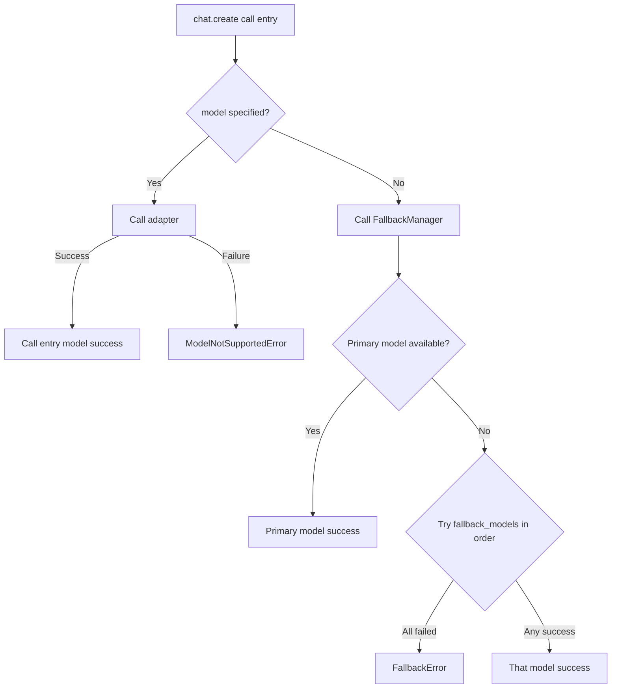

# CNLLM - Chinese LLM Adapter

[English](README_en.md) | [中文](README.md)

[](https://pypi.org/project/cnllm/)
[](https://pypi.org/project/cnllm/)
[](https://github.com/kanchengw/cnllm/blob/main/LICENSE)

***

## Why CNLLM?

Chinese LLMs have reached the top tier in capabilities, yet in real production environments they face a lack of infrastructure. An unavoidable **dilemma** is:

When using OpenAI SDK with vendor-provided compatible interfaces, **unsupported native parameters are silently ignored**, leading to **uncontrollable results and missing features**; using vendor proprietary SDKs requires **extra field parsing and structure transformation**. When workflows involve multiple models from different vendors, different code adaptations are needed for each model, resulting in **increased engineering workload and maintenance costs**.

CNLLM provides a **unified OpenAI-compatible interface layer** and a set of **standardized parameter rules and response format specifications**. CNLLM achieves **bidirectional mapping** of requests and responses through standardized YAML configuration files tailored for each vendor, mapping CNLLM standard parameters to vendor-accepted parameter names, passing through other native parameters, and finally automatically encapsulating heterogeneous model responses into OpenAI standard responses.

This implementation path uniformly defines CNLLM standard parameters, aligns with OpenAI standard response structures, preserves the complete capabilities of Chinese LLMs, and ensures scalability for integrating more vendors. Compared to OpenAI SDK and vendor proprietary SDKs, CNLLM also implements **systematic enhancements** for key field parsing, frontend streaming rendering, and engineering batch processing scenarios.

Through CNLLM, developers can seamlessly use Chinese LLMs in the OpenAI ecosystem — LangChain, LlamaIndex, LiteLLM, and other mainstream ML application frameworks. Especially in development and application scenarios requiring multi-model collaboration, using CNLLM can **significantly reduce adaptation, parsing, feature implementation, and maintenance workload, and effectively lower token consumption in AI agent development**.

- **Unified Interface** - One set of interfaces and parameters to call different Chinese LLMs, returns OpenAI API standard format
- **Complete Model Capabilities** - Calls Chinese LLMs' native interfaces (or backward-compatible interfaces), supports all model native parameters, preserving complete model capabilities
- **Mainstream Framework Integration** - Deeply integrated with LangChain Runnable, more framework deep adaptation development in progress
- **Encapsulated Key Fields** - Provides `.still`/`.tools`/`.think` property access for content/tool_calls/reasoning_content fields, supporting real-time updates and accumulation in streaming and batch requests
- **Batch Capability Enhancement** - Supports independent configuration for single requests in batch tasks, real-time statistics, callbacks, stop on error, custom indices, field storage, and various other engineered batch processing features

### Collaboration Opportunities

Welcome developers to participate in CNLLM's development. Please submit an Issue to discuss your solution before creating a Pull Request.

Or contact us at: <wangkancheng1122@163.com>

| Area | Description |
|------|-------------|
| 🌐 **New Vendor Adapters** | Integrate more Chinese LLMs (Alibaba Qwen, Baidu Wenxin, Tencent Hunyuan, etc.) |
| 🔗 **Framework Integration** | Deepen integration with LlamaIndex, LiteLLM, and other frameworks |
| 🐛 **Capability Expansion** | Adapter framework development for multimodal capabilities |
| 📖 **Documentation** | Add use cases and improve development guides |
| 💡 **Feature Suggestions** | Share your ideas and requirements |

Project Documentation:

- [System Architecture](docs/ARCHITECTURE.md)
- [Vendor Development Guide](docs/CONTRIBUTOR.md)
- [Feature Documentation](docs/feature/)

***

## Changelog

### v0.9.1 (2026-05-09)

- ✨ **`keep` parameter — Storage Control**
  - `batch()` adds `keep` parameter to control persistent storage of batch response fields
  - All fields in batch responses can be accessed in real-time during iteration, with results updated and accumulated in real-time; after iteration, accessing fields not specified in `keep` returns empty container + warning
  - Default strategy (when `keep` is not configured):
    - `chat.batch()` responses default to keeping key fields `still`/`think`/`tools` and batch metadata, releasing other redundant fields
    - `embeddings.batch()` responses default to keeping key field `vectors` and batch metadata, releasing other redundant fields
- ✨ **`drop_params` parameter — Unknown Parameter Handling Strategy**
  - `create()` and `batch()` add `drop_params` parameter, supporting three-tier position parameter handling strategies:
    - `drop_params="warn"`: warns that parameters are not taking effect, ignores and continues, default strategy
    - `drop_params="ignore"`: silently ignores unknown parameters and continues execution
    - `drop_params="strict"`: throws exception, terminates request execution
- ✨ **`usage` field — Usage Statistics**
  - `batch()` response now includes `usage` field, storing full Token consumption statistics for batch processing, accessed via `.usage`
- ✨ **batch embeddings response format**
  - `embeddings.batch()` response now includes `vectors` field, storing embedding vectors returned from batch requests, accessed via `.vectors`
  - `embeddings.batch()` response now includes `batch_info` field, storing batch metadata like `batch_size`, accessed via `.batch_info`

### v0.9.0 (2026-04-30)

- ✨ **Image Recognition** 
  - OpenAI-standard `content` array for image input(`type: "image_url"`)
  - Multimodal validation raises `TypeError` on text-only models
  - Added new multimodal models across GLM, Kimi, Doubao, Xiaomi
- ✨ **CNLLM as Agent Skill** 
  - Ships SKILL.md, allow agents to use CNLLM when writing code for Chinese LLMs
  - One-click install via `npx skills add https://github.com/kanchengw/cnllm`
  - Supports Claude Code, Cursor, Trae, and other AI programming tools
- 🔧 **Fixes** 
  - `api_key` no longer leaks into request body
  - HTTP 403/408/413 correctly map to CNLLM exception types `ContentFilteredError/TimeoutError/TokenLimitError`
  - `reasoning_content` mapping path fixed in response_deepseek.yaml

### v0.8.0 (2026-04-26)

- ✨ **Async Support** - Full async support via `asyncCNLLM` client for chat completions and Embeddings async interfaces
  - httpx unified sync/async HTTP client
  - Supports async SSE streaming and Embeddings calls
- ✨ **Batch Calls** - `CNLLM.chat.batch()` for sync batch calls, `asyncCNLLM.chat.batch()` for async batch calls
  - Real-time stats: `status` field shows real-time request status
  - Error isolation: single request failure doesn't affect other requests
  - Custom IDs: supports `custom_ids` parameter for custom request_id
  - Progress callbacks: `callbacks` custom callback functions
  - Fast fail: throws exception on any request failure to avoid large-scale batch failures
  - OpenAI compatible: each request in batch response returns standard OpenAI chat completions format
- ✨ **Embedding Calls** - Sync/async versions of `client.embeddings.create()` and `client.embeddings.batch()`
  - Real-time stats: `status` field shows real-time request status
  - Error isolation: single request failure doesn't affect other requests
  - Custom IDs: supports `custom_ids` parameter for custom request_id
  - Progress callbacks: `callbacks` custom callback functions
  - Fast fail: throws exception on any request failure to avoid large-scale batch failures
  - OpenAI compatible: each request in batch response returns standard OpenAI embedding format

## Supported Models

### Chat Completions:

- **DeepSeek**: deepseek-chat, deepseek-reasoner, deepseek-v4-pro, deepseek-v4-flash
- **KIMI (Moonshot AI)**: kimi-k2.6, kimi-k2.5, kimi-k2-thinking, kimi-k2-thinking-turbo, kimi-k2-turbo-preview, kimi-k2-0905-preview, moonshot-v1-8k, moonshot-v1-32k, moonshot-v1-128k, moonshot-v1-vision-preview
- **Doubao**: doubao-seed-2-0-pro, doubao-seed-2-0-mini, doubao-seed-2-0-lite, doubao-seed-2-0-code, doubao-seed-1-8, doubao-seed-1-6, doubao-seed-1-6-flash, doubao-seed-1-6-vision-250815, doubao-1-5-vision-pro-32k-250115, doubao-seed-1-5-lite-32k-250115, doubao-seed-1-5-pro-32k-250115, doubao-seed-1-5-pro-256k-250115
- **GLM**: glm-4.6, glm-4.7, glm-4.7-flash, glm-4.7-flashx, glm-5, glm-5-turbo, glm-5.1, glm-4.5, glm-4.5-x, glm-4.5-air, glm-4.5-airx, glm-4.5-flash, glm-5v-turbo, glm-4.5v, glm-4.6v, glm-4.6v-flash
- **Xiaomi mimo**: mimo-v2-pro, mimo-v2-omni, mimo-v2-flash, mimo-v2.5-pro, mimo-v2.5
- **MiniMax**: MiniMax-M2, MiniMax-M2.1, MiniMax-M2.5, MiniMax-M2.5-highspeed, MiniMax-M2.7, MiniMax-M2.7-highspeed

### Embeddings:

- **MiniMax**: embo-01
- **GLM**: embedding-2, embedding-3, embedding-3-pro

## 1. Quick Start

### 1.1 Installation

#### 1.1.1 SDK Installation
```bash
pip install cnllm
```

#### 1.1.2 Install as Agent Skill

**One-Click Install**:
```bash
npx skills add https://github.com/kanchengw/cnllm
```

Or manually copy the `SKILL.md` file from the project root to your agent's skill directory. When **calling Chinese LLMs, CNLLM will be used as the preferred option**.

### 1.2 Client Initialization

#### 1.2.1 Sync Client

```python
from cnllm import CNLLM

client = CNLLM(model="minimax-m2.7", api_key="your_api_key")
resp = client.chat.create(...)
```

#### 1.2.2 Async Client

**Seamless Async**:
The async client wraps `asyncio.run()`, supporting **sync syntax for async calls**, and also supporting users actively wrapping `asyncio.run()` and using async syntax to manage the event loop.

```python
from cnllm import asyncCNLLM

client = asyncCNLLM(
    model="minimax-m2.7", api_key="your_api_key")
resp = client.chat.create(...)
```

### 1.3 Context Management

Two context management modes are supported:

- **Persistent Session** maintains session state across multiple calls, suitable for applications that need to maintain context
- **Temporary Session** is single-use, does not maintain session state, auto-closes

**Persistent Session**:

```Python
client = CNLLM(
    model="minimax-m2.7", api_key="your_api_key")
resp = client.chat.create(...)
client.close()  # Manual close; async client uses client.aclose()
```

**Temporary Session**:

```Python
with CNLLM(
    model="deepseek-chat", api_key="your_api_key") as client:
    resp = client.chat.create(...)  # Auto-closes session
```

## 2. Call Scenarios

All methods support both sync and async clients:

| Type | Scenario | Method | Return Type |
| -- | -- | --------------- | --------------------- |
| **chat completions** | Non-streaming single | `chat.create()`        | `Dict`                |
|   | Streaming single | `chat.create(stream=True)`          | `Iterator[Dict]`      |
|   | Non-streaming batch | `chat.batch()`         | `BatchResponse`       |
|   | Streaming batch | `chat.batch(stream=True)`          | `Iterator[Dict]`      |
|   | Mixed streaming batch | `chat.batch(requests=[{"stream": True}, {"stream": False}])` | `BatchResponse`       |
| **embeddings** | Embeddings single | `embeddings.create()` | `Dict`                |
|   | Embeddings batch | `embeddings.batch()` | `EmbeddingResponse`   |

### 2.1 Chat Completions Single Call

Three calling methods are supported, call with one line of code, one parameter:

**Simplified Call:** 
Takes only strings as parameter(streaming can be configured at client level with `stream=True`)

```python
resp = client("Introduce yourself in one sentence")
```

**Standard Call:**

```python
resp = client.chat.create(prompt="Introduce yourself in one sentence", stream=True)
```

**Full Call:**

```python
resp = client.chat.create(
    messages=[
        {"role": "user", "content": "Introduce yourself in one sentence"},
        {"role": "assistant", "content": "I am an intelligent assistant"},
        {"role": "user", "content": "Hello"},
    ]
)
```

#### 2.1.1 Non-Streaming Call

```python
resp = client.chat.create(
    messages=[{"role": "user", "content": "Introduce yourself in one sentence"}],
)
```

#### 2.1.2 Streaming Call

```python
resp = client.chat.create(
    prompt="Introduce yourself in one sentence",
    stream=True
)
for chunk in resp:
    print(resp.still)  # Real-time accumulated model response text
print(resp)
# Complete accumulated response content: {'object': 'chat.completion.chunk', 'choices': [{'delta': {'content': 'Complete model response', 'reasoning_content': 'Complete reasoning process'}, 'finish_reason': 'stop'}], ...}
```

**repr():** During `for` iteration, `print(resp)` displays the **real-time merged content and accumulated key fields** of chunks received so far; after iteration completes, it displays the fully accumulated response content. The `repr()` method helps users **observe streaming accumulated response content in real time**, while preserving the streaming response object type — an **iterator** containing all OpenAI standard streaming chunks.

#### 2.1.3 Response Access

In streaming calls, access via `for` loop with **real-time accumulation**; outside the loop or in non-streaming calls, access the full field content directly:

| Response Field | Access Method | Return Format | Example |
|----------|-------------|---------------|---------|
| **think**: `reasoning content` | `resp.think` | `str` | `"reasoning content..."` |
| **still**: `content` | `resp.still` | `str` | `"response content..."` |
| **tools**: `tool_calls` | `resp.tools` | `Dict[int, Dict]` | `{0: {"id": "...", "function": {...}}, 1: {...}` |
| **raw**: model native response | `resp.raw` | `Dict` | `{"id": "...", "choices": [...], ...}` |

### 2.2 Chat Completions Batch Call

You can use `prompt` and `messages` parameters for quick global configuration, or use `requests` parameter for independent configuration of individual requests.

**prompt parameter:**
```python
resp = client.chat.batch(
    prompt=["Hello", "How's the weather today", "Who are you"],
    stream=True
)
```

**messages parameter:**
```python
resp = client.chat.batch(
    messages=[
        [{"role": "user", "content": "How's the weather in Beijing?"},
         {"role": "assistant", "content": "It's sunny in Beijing"},
         {"role": "user", "content": "What about Shanghai?"}],
        [{"role": "user", "content": "How's the weather in Shanghai?"}],
    ],
    tools=[get_weather]
)
```

**requests parameter:** 

Configure individual requests with **independent strategy**, global parameters inherited when not configured per-request, also supports `requests.messages` parameter to manage context.

```python
resp = client.chat.batch(
    requests=[
        {"prompt": "How's the weather in Beijing?", "tools": [get_weather], "stream": True},  # Inherits global thinking parameter
        {"prompt": "What is 1+1?", "tools": [calc], "thinking": False},  # Does not inherit any global parameters
        {"prompt": "How's the weather in Guangzhou?", "model": "deepseek-chat", "api_key": "key"}  # Inherits global tools and thinking parameters
    ],
    # Global parameters (used when per-request not configured):
    tools=[default_tool],
    thinking=True,
    max_concurrent=2  # Batch-level parameter, not inherited by individual requests
)
```

#### 2.2.1 Chat Batch Response Structure

BatchResponse outer structure, where each response under `results[request_id]` is in **OpenAI standard streaming/non-streaming response structure**:

```python
{
    "status": {"elapsed": "3.42s", "success_count": 2, "fail_count": 1, "total": 3},  # Statistics
    "usage": {"prompt_tokens": 5, "total_tokens": 5},  # Batch processing total usage info
    "errors": {"request_2": "error message"},  # Mapping of all failed requests' request_id and error messages
    "results": {     # Mapping of all successful requests' request_id and standard responses
        "request_0": {...},
        "request_1": {...}
    },
    "think": {"request_0": "...", "request_1": "..."},
    "still": {"request_0": "...", "request_1": "..."},
    "tools": {"request_0": [...], "request_1": [...]},
    "raw": {"request_0": {...}, "request_1": {...}}
}
```

#### 2.2.2 Chat Batch Response Access

Supports iterative access to **response results, metadata, and key field contents** within `for` loop, with content **real-time accumulation and updates**:
- In batch streaming calls, updates build chunk by chunk; in batch non-streaming calls and **batch calls with mixed streaming strategies**, updates build request by request.
- In batch non-streaming calls and batch calls with mixed streaming strategies, `for` loop iteration is not mandatory; complete results can be accessed directly.
- Supports access by `request_id` or by integer index.

**Access methods:**

```python
resp = client.chat.batch(
    prompt=["Hello", "How's the weather today", "Who are you"]
)

for r in resp:
    print(resp.status)  # Real-time statistics, request by request real-time update

print(resp.still)  # Response content for all requests in batch task

# Or access via batch_result:
for r in client.chat.batch(
    prompt=["Hello", "How's the weather today", "Who are you"], stream=True
):
    print(client.batch_result.results)  # OpenAI standard streaming responses for all requests in batch task, chunk by chunk real-time accumulation

print(client.batch_result.think["request_0"])  # Reasoning content for first request in batch task, or use .think[0] integer index access
```

**Access fields:**

| Category | Field Description | Access Method | Return Format | Example |
| ---- | ----- | ----- | ------------- | --------------------------------------------------- |
| **Metadata** | Real-time statistics | `resp.status` / `batch_result.status` | `Dict` | `{"success_count": 2, "fail_count": 0, "total": 2, "elapsed": 0.42}` |
| | Real-time Token usage | `resp.usage` / `batch_result.usage` | `Dict[str, int]` | `{"prompt_tokens": 50, "completion_tokens": 100, "total_tokens": 150}` |
| **errors** | Error request information | `resp.errors` / `batch_result.errors` | `Dict[str, str]` | `{"request_0": "error message", "request_1": "error message"}` |
| | Error information for single request | `resp.errors[0]` / `batch_result.errors[0]` | `str` | `"error message"` |
| **results** | Standard response for successful requests | `resp.results` / `batch_result.results` | `Dict[str, Dict]` | `{"request_0": {...}, "request_1": {...}}` |
| | Standard response for single request | `resp.results[0]` / `batch_result.results[0]` | `Dict` | `{"id": "...", "choices": [...], ...}` |
| **think** | Reasoning process content | `resp.think` / `batch_result.think` | `Dict[str, str]` | `{"request_0": "...", "request_1": "..."}` |
| | Reasoning content for single request | `resp.think[0]` / `batch_result.think[0]` | `str` | `"reasoning content..."` |
| **still** | Response content | `resp.still` / `batch_result.still` | `Dict[str, str]` | `{"request_0": "...", "request_1": "..."}` |
| | Response content for single request | `resp.still[0]` / `batch_result.still[0]` | `str` | `"response content..."` |
| **tools** | Tool calls | `resp.tools` / `batch_result.tools` | `Dict[str, Dict[int, Dict]]` | `{"request_0": {...}, "request_1": {...}}` |
| | Tool calls for single request | `resp.tools[0]` | `Dict[int, Dict]` | `{0: {"id": "...", "function": {...}}, 1: {...}` |
| **raw** | Model native response | `resp.raw` / `batch_result.raw` | `Dict[str, Dict]` | `{"request_0": {...}, "request_1": {...}}` |
| | Model native response for single request | `resp.raw[0]` / `batch_result.raw[0]` | `Dict` | `{"id": "...", "choices": [...], ...}` |

**repr():** Displays batch processing metadata fields or response content:

```python
print(resp)
# BatchResponse(status={...}, usage={...})

print(resp.results)
# If the batch contains streaming requests, the index for that request shows the current received chunks merged and accumulated key fields, without changing the iterator type:
# {"request_0": {"choices": [{"delta": {"content": "streaming response"}}]}, "request_1": {"choices": [{"message": {"content": "non-streaming response"}}]}}
```

**to_dict():** Converts response to dictionary, keeps specified fields; keeping fields not declared in `keep` generates warnings:

```python
resp.to_dict()  # Default: keeps still/think/tools fields + metadata (status/usage)
resp.to_dict(errors=True, results=True)  # Keeps results/errors fields + metadata (status/usage)
```

### 2.3 Embeddings Calls

Supports sync/async Embeddings calls with **progress callbacks, custom request IDs, stop on error** and other advanced features, with **concurrency control and batch size** configuration.
Currently supports MiniMax embo-01, GLM embedding-2/embedding-3/embedding-3-pro models.

#### 2.3.1 Single Call

```python
resp = client.embeddings.create(input="Hello world")
```

#### 2.3.2 Embeddings Batch Call

```python
resp = client.embeddings.batch(
    input=["Hello", "world", "你好"]
)
```

#### 2.3.3 Embeddings Batch Response Structure

BatchEmbeddingResponse outer structure, where each response under `results[request_id]` is in **OpenAI standard Embeddings response structure**:

```python
{
    "status": {
        "elapsed": 0.35, "success_count": 1, "fail_count": 1, "total": 2
    },
    "batch_info": {
        "batch_size": 2, "batch_count": 2, "dimension": 1024
    },
    "usage": {"prompt_tokens": 5, "total_tokens": 5},
    "errors": {"request_1": "error message"},
    "results": {
        "request_0": {
            "object": "list",
            "data": [{"object": "embedding","embedding": [0.1, 0.2, ...], "index": 0}],
            "model": "embedding-2"
        }
    }
    "vectors": {"request_0": [...]}
}
```

#### 2.3.4 Embeddings Batch Response Access

Supports iterative access to **response results, metadata, and key field contents** within `for` loop, with content **real-time accumulation and updates**:
- In batch embeddings calls, updates build request by request.
- `for` loop iteration is not mandatory; complete results can be accessed directly.
- Supports access by `request_id` or by integer index.

**Access methods:**

```python
resp = client.embeddings.batch(
    input=["Hello", "How's the weather today", "Who are you"]
)

for r in resp:
    print(resp.vectors)  # Embedding vectors for all requests in batch task, request by request real-time accumulation

print(resp.vectors)  # Embedding vectors for all requests in batch task

# Or access via batch_result:
for r in client.embeddings.batch(
    input=["Hello", "How's the weather today", "Who are you"]
):
    print(client.batch_result.status)  # Real-time statistics, request by request real-time accumulation

print(client.batch_result.vectors["request_0"])  # Embedding vector for first request in batch task, or use .vectors[0] integer index access
```

**Access fields:**

| Category | Field Description | Access Method | Return Format | Example |
| ----------- | ------------ | ------------ | ------------- | ---------------------------------------------------------------------- |
| **Metadata** | Real-time statistics | `resp.status` / `batch_result.status` | `Dict` | `{"total": 2, "success_count": 2, "fail_count": 0, "elapsed": 0.42}` |
| | Real-time Token usage | `resp.usage` / `batch_result.usage` | `Dict[str, int]` | `{"prompt_tokens": 10, "total_tokens": 10}` |
| | Batch info | `resp.batch_info` / `batch_result.batch_info` | `Dict` | `{"batch_size": 2, "batch_count": 3, "dimension": 1024}` |
| **errors** | Error request information | `resp.errors` / `batch_result.errors` | `Dict[str, str]` | `{"request_0": "error message", "request_1": "error message"}` |
| | Error information for single request | `resp.errors[0]` / `batch_result.errors[0]` | `str` | `"error message"` |
| **results** | Standard response for successful requests | `resp.results` / `batch_result.results` | `Dict[str, Dict]` | `{"request_0": {...}, "request_1": {...}}` |
| | Standard response for single request | `resp.results[0]` / `batch_result.results[0]` | `Dict` | `{"object": "list", "data": [...], ...}` |
| **vectors** | Embedding vector representation | `resp.vectors` / `batch_result.vectors` | `Dict[str, List[float]]` | `{"request_0": [0.1, 0.2, 0.3, ...], "request_1": [0.4, 0.5, ...]}` |
| | Vector representation for single request | `resp.vectors[0]` / `batch_result.vectors[0]` | `List[float]` | `[0.1, 0.2, 0.3, ...]` |

**repr():** Displays batch processing metadata fields, no large text:

```python
print(resp)
# BatchResponse(status={...}, usage={...}, batch_info={...})
```

**to_dict():** Converts response to dictionary, keeps specified fields; keeping fields not declared in `keep` generates warnings:

```python
resp.to_dict()               # Default: keeps vectors field + metadata (status/usage/batch_info)
resp.to_dict(results=True)   # Keeps results fields + metadata (status/usage/batch_info)
```

### 2.4 Batch Call Control Parameters

Batch calls support **retry strategy** and **concurrency control** parameter configuration:

| Parameter | Type | Default | Description |
|-----------|------|---------|-------------|
| `batch_size` | `int` | Auto-calculated | Batch size, batch Embeddings calls only |
| `max_concurrent` | `int` | `12`/`3` | Max concurrent requests, Embeddings default 12, Chat completions default 3 |
| `rps` | `float` | `10`/`2` | Requests per second, Embeddings default 10, Chat completions default 2 |
| `timeout` | `int` | 30 | Single request timeout (seconds) |
| `max_retries` | `int` | 3 | Max retry attempts |
| `retry_delay` | `float` | 1.0 | Retry delay (seconds) |

**batch_size**:
Supported only for batch Embeddings calls, auto-calculated based on request count by default.
Not recommended to manually configure.

### 2.5 Batch Call Advanced Features

Both batch chat completions and Embeddings calls support **progress callbacks, custom request IDs, stop on error, field storage control, unknown parameter handling strategy**.

#### 2.5.1 Custom Request IDs

Specify custom IDs for batch requests via `custom_ids` parameter, which will replace original request_ids in batch response.

```python
resp = client.embeddings.batch(
    input=["text1", "text2", "text3"],
    custom_ids=["doc_001", "doc_002", "doc_003"]
)

resp.results["doc_001"]  # Get doc_001's response
resp.results["doc_002"]  # Get doc_002's response
```

#### 2.5.2 Progress Callbacks

Callbacks are invoked when **each request completes**, useful for:
- Real-time progress display
- Recording completed tasks
- Dynamically adjusting subsequent tasks
- ...

```python
def on_complete(request_id, status):          # Callback function example, customization supported
    print(f"[{request_id}] {status}")

resp = client.chat.batch(
    requests,
    callbacks=[on_complete]
)
```

#### 2.5.3 Stop on Error

When the first error occurs in batch requests, subsequent tasks are immediately stopped while returning results of already processed requests:
When the batch request encounters the first error, it immediately throws an exception and stops subsequent tasks. If the batch contains successful requests, the batch object is returned simultaneously, containing already processed request results that can be accessed normally:

```python
resp = client.embeddings.batch(
    input=requests,
    stop_on_error=True
)
# Error message: {request_id} request failed, reason: {error}

# If the batch contains successful requests, the batch object can be accessed normally:
resp.status
resp.vectors
```

#### 2.5.4 Field Storage Control

Batch calls (Chat / Embeddings) can access all fields during `for` loop. After iteration, some redundant fields are automatically released to save memory.
`keep` parameter specifies which fields to retain after iteration:

**Default behavior (when `keep` is not specified):**

| Call Type | Default Retain | Auto-release after iteration |
|-----------|----------------|------------------------------|
| `client.chat.batch()` | `still/think/tools` and metadata | `results/errors/raw` |
| `client.embeddings.batch()` | `vectors` and metadata | `results/errors` |

**Notes:**
- When `keep=[]`, all fields are released after iteration, only metadata retained; When `keep=["*"]`, all fields are retained after iteration.
- In `chat.batch()`, metadata fields include `status/usage`; In `embeddings.batch()`, metadata fields include `status/usage/batch_info`.

**Usage:**

```python
resp = client.embeddings.batch(
    input=["text1", "text2", "text3"],
    keep=["vectors"]         # Only retains vectors field after iteration
)
for _ in resp:
    print(resp.results)      # Any field accessible during iteration, accumulated request by request

resp.vectors["request_0"]    # Accessible after iteration
resp.results["request_0"]    # Not accessible after iteration, returns warning
```

Can also set global defaults at client initialization:

```python
client = CNLLM(..., keep=["vectors"])
```

#### 2.5.5 Unknown Parameter Handling Strategy

`drop_params` controls the handling behavior for **parameters not suitable for the call method and other unknown parameters** configured in client initialization during actual calls. Default strategy is `warn` mode.

| Strategy | Config | Behavior |
|----------|--------|----------|
| Warning mode (default) | `drop_params="warn"` | Logs warning, parameters dropped, request continues |
| Strict mode | `drop_params="strict"` | Throws `TypeError`, request terminates |
| Silent ignore mode | `drop_params="ignore"` | Silently drops unknown parameters, no logs |

**Notes:**
- When batch calls are made and global parameters contain unknown parameters, `drop_params="strict"` throws exception directly, batch task not actually started;
  When individual request in batch task contains unknown parameters, `drop_params="strict"` directly puts that request into `errors` field, does not execute that request, and continues with subsequent batch tasks.
- Specifically, when `drop_params="strict"` and `stop_on_error=True` are both configured, the batch request encounters the first error and immediately stops, while returning already processed request results. See [Stop on Error](#253-stop-on-error) for details.
- `drop_params` parameter supports client configuration and all call methods (including `create` single call method).

## 3. CNLLM Standard Response Format

CNLLM single request streaming, non-streaming, and Embeddings response formats fully implement OpenAI standard structure.

### 3.1 Non-Streaming Response Format

```python
{
    "id": "chatcmpl-xxx",
    "object": "chat.completion",
    "created": 1234567890,
    "model": "minimax-m2.7",
    "choices": [{
        "index": 0,
        "message": {
            "role": "assistant",
            "content": "你好，我是 MiniMax-M2.7...",
            "reasoning_content": "推理过程内容...",    # Model reasoning process, if any
            "tool_calls": [{                        # Tool calls, if any
                "id": "call_xxx",
                "type": "function",
                "function": {"name": "get_weather", "arguments": "{\"location\":\"北京\"}"}
            }]
        },
        "finish_reason": "stop"
    }],
    "usage": {
        "prompt_tokens": 10,
        "completion_tokens": 20,
        "total_tokens": 30,
        "prompt_tokens_details": {
            "cached_tokens": 0
        },
        "completion_tokens_details": {
            "reasoning_tokens": 0
        }
    }
}
```

### 3.2 Streaming Response Format

```python
{'id': 'chatcmpl-xxx', 'object': 'chat.completion.chunk', 'created': 1234567890, 'model': 'minimax-m2.7', 'choices': [{'index': 0, 'delta': {'role': 'assistant'}, 'finish_reason': None}]}

# reasoning_content chunks (模型推理过程，若有):
{'id': 'chatcmpl-xxx', 'object': 'chat.completion.chunk', 'created': 1234567890, 'model': 'minimax-m2.7', 'choices': [{'index': 0, 'delta': {'reasoning_content': '推理..'}, 'finish_reason': None}]}

# tool_calls chunks (工具调用，若有):
{'id': 'chatcmpl-xxx', 'object': 'chat.completion.chunk', 'created': 1234567890, 'model': 'minimax-m2.7', 'choices': [{'index': 0, 'delta': {'tool_calls': [{'index': 0, 'id': 'call_xxx', 'type': 'function', 'function': {'name': 'get_weather', 'arguments': '...'}}]}, 'finish_reason': None}]}

{'id': 'chatcmpl-xxx', 'object': 'chat.completion.chunk', 'created': 1234567890, 'model': 'minimax-m2.7', 'choices': [{'index': 0, 'delta': {'content': '你好...'}, 'finish_reason': None}]}

# ... chunks

{'id': 'chatcmpl-xxx', 'object': 'chat.completion.chunk', 'created': 1234567890, 'model': 'minimax-m2.7', 'choices': [{'index': 0, 'delta': {}, 'finish_reason': 'stop'}], 'usage': {'prompt_tokens': 10, 'completion_tokens': 20, 'total_tokens': 30}}
```

### 3.3 Embeddings Response Format

```python
{
    "object": "list",
    "data": [{
        "object": "embedding",
        "embedding": [0.1, 0.2, ...],
        "index": 0
    }],
    "model": "embedding-2",
    "usage": {
        "prompt_tokens": 5,
        "total_tokens": 5
    }
}
```

## 4. CNLLM Unified Interface Parameters

CNLLM standard parameters keep naming consistent with **OpenAI standard parameters**. For vendor native fields not covered by standard parameters, vendor naming is used directly and **passed through**.
Except as specially noted in the table below, other parameters can be configured at **client initialization and method call entry**. Parameters configured at method call entry will **override** client initialization configuration.

### 4.1 Chat Completions Request Parameters

Supported for use as per-request or global parameters in `chat.create()` and `chat.batch()`:

| Parameter | Type | Default | Description |
| --- | --- | --- | --- |
| `model` | `str` | - | Model name, required at client initialization |
| `api_key` | `str` | - | API key |
| `base_url` | `str` | Auto-matched | Custom API URL |
| `messages` | `list[dict]`/`list[list[dict]]` | - | Supports context management and image recognition input (method call entry only) |
| `prompt` | `str`/`list[str]` | - | Short form input, alternative to messages (method call entry only) |
| `requests` | `list[dict]` | - | Supports independent per-request configuration in batch (method call entry only for `chat.batch()`) |
| `temperature` | `float` | Vendor-determined | Generation randomness |
| `max_tokens` | `int` | Vendor-determined | Max generated tokens |
| `top_p` | `float` | Vendor-determined | Nucleus sampling threshold |
| `stop` | `str/list` | - | Stop sequences |
| `stream` | `bool` | `False` | Streaming response |
| `thinking` | `bool/dict` | Vendor-determined, default `False` for most models | Thinking mode, supports `True`/`False`, some models support `"auto"` |
| `tools` | `list` | - | Tool/function definitions list |
| `tool_choice` | `str/dict` | - | Tool choice strategy |
| `response_format` | `dict` | Vendor-determined, default `{type: "text"}` for most models | Response format |
| `n` | `int` | `1` | Number of candidates to generate |
| `presence_penalty` | `float` | - | Presence penalty |
| `frequency_penalty` | `float` | - | Frequency penalty |
| `logit_bias` | `dict` | - | Token-level bias |
| `user` | `str` | - | User identifier |

**Notes**: Not all CNLLM standard parameters are supported by all models. Refer to vendors' official documentation for confirmation.

### 4.2 Embeddings Request Parameters

Only effective for `embeddings.create()` and `embeddings.batch()` calls:

| Parameter | Type | Default | Description |
| --- | --- | --- | --- |
| `model` | `str` | - | Model name, required at client initialization |
| `api_key` | `str` | - | API key |
| `base_url` | `str` | Auto-matched | Custom API URL |
| `input` | `str`/`list[str]` | - | Input text, supports batch processing |

### 4.3 Common Control Parameters

Supported in `create()` and `batch()` calls, control batch processing behavior or strategy, not transmitted to API endpoint:

| Parameter | Type | Default | Description |
| --- | --- | --- | --- |
| `timeout` | `int` | `60` | Request timeout (seconds) |
| `max_retries` | `int` | `3` | Max retry attempts |
| `retry_delay` | `float` | `1.0` | Retry delay (seconds) |
| `fallback_models` | `dict` | - | Backup model configuration, client initialization only |
| `drop_params` | `str` | `"warn"` | See [Unknown Parameter Handling Strategy](#255-unknown-parameter-handling-strategy) |

### 4.4 Batch Control Parameters

Only effective for `chat.batch()` and `embeddings.batch()` calls, control batch processing behavior or strategy, not transmitted to API endpoint:

| Parameter | Type | Default | Description |
| --- | --- | --- | --- |
| `max_concurrent` | `int` | Chat: `3` / Embeddings: `12` | Max concurrent requests |
| `rps` | `float` | Chat: `2` / Embeddings: `10` | Requests per second limit |
| `batch_size` | `int` | Auto-calculated | Batch size, Embeddings only |
| `stop_on_error` | `bool` | `False` | Stop subsequent requests on error, return processed results |
| `callbacks` | `list` | - | Progress callback functions list |
| `custom_ids` | `list[str]` | - | Custom request ID list |
| `keep` | `set/list` | See [Field Storage Control](#254-field-storage-control) | Data fields to retain after iteration |

### 4.5 Vendor Passthrough Parameters

For model native parameters not covered by CNLLM standard parameters, if actually supported by the model, CNLLM will pass them through to the model endpoint. For example:

- Kimi: `prompt_cache_key`, `safety_identifier`
- Doubao: `reasoning_effort`, `service_tier`

For parameters supported by other models, refer to vendors' official documentation

## 5. FallbackManager Model Selection Flow

Configure `fallback_models` parameter at client initialization. If the primary model specified in `model` fails to respond for any reason, CNLLM will sequentially try the models in `fallback_models`.
If you need to reuse the client instance repeatedly, especially with high robustness requirements, it is recommended to configure this.

```python
client = CNLLM(
    model="minimax-m2.7", api_key="minimax_key",
    fallback_models={"mimo-v2-flash": "xiaomi-key", "minimax-m2.5": None}
)  # None means use the primary model's API_key
resp = client.chat.create(prompt="What is 2+2?")
print(resp)
```



***

**Notes**:

Passing model at method call will override `model` and `fallback_models` configuration at client initialization, and will not enable FallbackManager. In `batch()`, this is judged independently per request.

```python
client = CNLLM(model="minimax-m2.5", api_key="key1", fallback_models={"deepseek-chat": "key2"})

resp = client.chat.batch(requests=[
    {"prompt": "Hello", "model": "deepseek-chat", "api_key": "key2"},  # Has model -> overrides client configuration
    {"prompt": "How's the weather"},  # No model -> uses client minimax-m2.5 + fallback
])
```

## 6. Application Framework Deep Integration

### 6.1. LangChainRunnable Implementation

LangChain chain uniformly supports sync/async methods:

```python
from cnllm import CNLLM
from cnllm.core.framework import LangChainRunnable
from langchain_core.prompts import ChatPromptTemplate
import asyncio

# Create CNLLM client (internally holds async engine)
client = CNLLM(model="deepseek-chat", api_key="your_key")

# Create Runnable instance
runnable = LangChainRunnable(client)

prompt = ChatPromptTemplate.from_messages([
    ("system", "You are a helpful assistant"),
    ("human", "{input}")
])

# Build LangChain chain
chain = prompt | runnable

# Sync calls: invoke/stream/batch
resp = chain.invoke({"input": "What is 2+2?"})
print(resp.content)

for chunk in chain.stream({"input": "Count to 5"}):
    print(chunk, end="", flush=True)

resp = chain.batch([{"input": "Hello"}, {"input": "How are you?"}])
for r in resp:
    print(r.content)

# Async calls: ainvoke/astream/abatch
async def main():
    async with client:
        resp = await chain.ainvoke({"input": "What is 2+2?"})
        print(resp.content)

        async for chunk in chain.astream({"input": "Count to 5"}):
            print(chunk, end="", flush=True)

        resp = await chain.abatch([{"input": "Hello"}, {"input": "How are you?"}])
        for r in resp:
            print(r.content)

asyncio.run(main())
```

### License

MIT License - See [LICENSE](LICENSE) file

### Contact

- GitHub Issues: <https://github.com/kanchengw/cnllm/issues>
- Author Email: <wangkancheng1122@163.com>
