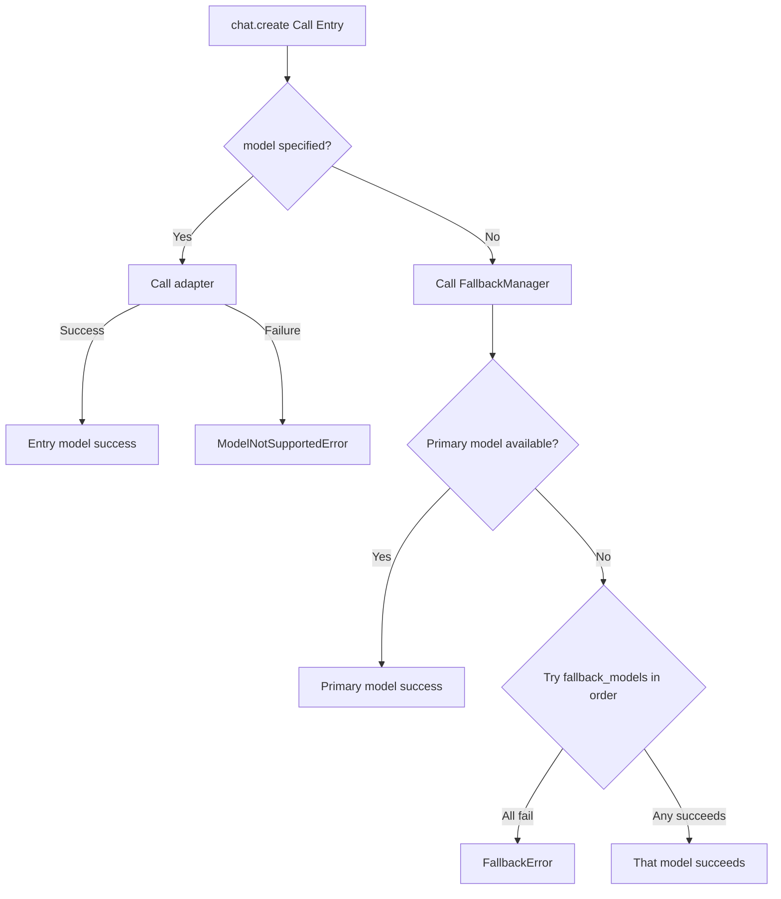

# CNLLM - Chinese LLM Adapter

[English](README_en.md) | [中文](README.md)

[](https://pypi.org/project/cnllm/)
[](https://pypi.org/project/cnllm/)
[](LICENSE)

***

## Project Background

Integrating Chinese large language models into established ML frameworks has become a core challenge for developers in both academic research and production environments.

Current mainstream approaches have clear limitations: using OpenAI-compatible interfaces is straightforward but cannot fully leverage each vendor's native capabilities; calling native interfaces directly means handling response parsing, format conversion, and other tedious work on your own.

CNLLM is dedicated to resolving this dilemma—by providing a **unified interface** and **consistent parameter specifications** for calling Chinese LLMs. While fully unleashing the native capabilities of these models, CNLLM automatically converts diverse responses into OpenAI standard format. Whether it's LangChain, LlamaIndex or other ML frameworks, you can integrate various LLMs in the same way; additionally, in scenarios requiring multi-model collaboration, you can maintain consistent interfaces, parameters, and response formats.

> Due to limited time and energy, we welcome like-minded friends to join us in building CNLLM: [wangkancheng1122@163.com](mailto:wangkancheng1122@163.com)

### Collaboration Opportunities

| Area | Description |
|------|-------------|
| 🌐 **New Vendor Adapters** | Integrate more Chinese LLMs (Alibaba Qwen, ByteDance Doubao, Kimi, etc.) |
| 🔗 **Framework Integration** | Deepen integration with LlamaIndex, LiteLLM, and other frameworks |
| 🐛 **Capability Expansion** | Adapter development for Embedding, Multimodal, and other features |
| 📖 **Documentation** | Add use cases and improve development guides |
| 💡 **Feature Suggestions** | Share your ideas and requirements |

Quick start: [Contributor Guide](docs/CONTRIBUTOR_en.md)
Detailed architecture: [System Architecture](docs/ARCHITECTURE_en.md)

## Changelog

### v0.5.0 (2026-04-06)

- ✨ **KIMI (Moonshot AI) Adapter** - Kimi model adapter, supports kimi-k2.5, kimi-k2 series and moonshot-v1 series (8k/32k/128k)
- ✨ **DeepSeek Adapter** - DeepSeek model adapter, supports `deepseek-chat` and `deepseek-reasoner` models
- Now CNLLM includes `system_fingerprint` and `choices[0].logprobs` fields in standard response

### v0.4.3 (2026-04-06)

- ✨ **Doubao Adapter** - ByteDance Doubao Seed series model adapter, supports seed-2.0 series, seed-1.6 series and seed-1.8, totaling 8 models (see `Supported Models` for details), with support for Doubao native parameters like `stream_options`, `reasoning_effort`, `service_tier`, etc.
  - Supports `reasoning_effort` inference length field with four-level switching: `minimal`, `low`, `medium`, `high`
  - Supports `thinking` field with three-level switching: `true` (enabled), `false` (disabled), `auto`; `thinking="auto"` only takes effect on doubao-seed-1-6 model
- 🔧 **Bug Fix** - Fixed streaming response `_collect_stream_result` duplicate call causing content accumulation anomaly

### v0.4.2 (2026-04-05)

- ✨ **GLM Adapter** - Zhipu GLM model adapter, supports "glm-4.6", "glm-5", "glm-5-turbo" and GLM 4.7 series
  - Supports GLM native parameters: `do_sample`, `request_id`, `response_format`, `tool_stream`, `thinking`, etc.
- 🔧 **Bug Fix** - Fixed `id` field response mapping

### v0.4.1 (2026-04-04)

- 🔧 **Bug fixes**

### v0.4.0 (2026-04-03)

- ✨ **mimo Adapter** - Xiaomi mimo model adapter, supports "mimo-v2-pro", "mimo-v2-omni", "mimo-v2-flash"
- ✨ **Architecture Refactoring** - BaseAdapter + Responder + VendorError three-layer architecture separation, clear responsibilities
- ✨ **.think Property** - `client.chat.think` retrieves reasoning_content, not included in resp
- ✨ **.tools Property** - `client.chat.tools` retrieves tool_calls, supports streaming accumulation
- ✨ **Streaming Accumulation** - `.think`, `.still`, `.tools` support real-time accumulation during streaming response

### v0.3.3 (2026-04-02) ✨

- ✨ **Unified Parameters** - Client init parameters unified with call entry parameters, call entry flexibly overrides
- ✨ **Architecture Optimization** - Core logic abstraction, BaseAdapter and Responder handle common logic
- ✨ **Extensibility** - Adding new provider only requires configuring corresponding YAML file, automatically implements request and response field mapping, error code mapping, no need to modify other upper-level components
- ✨ **YAML Function Integration** - Related field mapping, model support validation, required param validation, param support validation, vendor error code mapping logic
- ✨ **MiniMax Support Optimization** - Supports all MiniMax native interface parameters, such as `top_p`, `tools`, `thinking`, etc.

### v0.3.1 (2026-03-29) ✨

- ✨ **Deep LangChain Integration**
  - Runnable adapter as core feature, one function integrates with LangChain chain
  - Runnable streaming output, batch calls, async calls support
- ✨ **chat.create() Streaming Output** - `stream=True` parameter support
- ✨ **Fallback Mechanism** - Automatically switch to backup model when primary fails
- ✨ **Response Entry** - `client.chat.still` easily gets clean chat response, `client.chat.raw` gets full response
- 🔧 **Adapter Refactoring** - Model adapters (Chinese LLMs like MiniMax) + framework adapters (LangChain, etc.) dual-layer architecture

## Features

- **OpenAI Compatible** - Model output aligned with OpenAI API standard format
- **Framework Integration** - Compatible with LangChain, LlamaIndex and other major ML frameworks
- **Unified Interface** - One codebase, seamless switching between different Chinese LLMs
- **Simple API** - Multiple calling styles, simplest only needs one line of code

## Supported Models

- **DeepSeek**: deepseek-chat, deepseek-reasoner
- **KIMI (Moonshot AI)**: kimi-k2.5, kimi-k2-thinking, kimi-k2-thinking-turbo, kimi-k2-turbo-preview, kimi-k2-0905-preview, moonshot-v1-8k, moonshot-v1-32k, moonshot-v1-128k
- **Doubao**: doubao-seed-2-0-pro, doubao-seed-2-0-mini, doubao-seed-2-0-lite, doubao-seed-2-0-code, doubao-seed-1-8, doubao-seed-1-6, doubao-seed-1-6-lite, doubao-seed-1-6-flash
- **Zhipu GLM**: glm-4.6, glm-4.7, glm-4.7-flash, glm-4.7-flashx, glm-5, glm-5-turbo
- **Xiaomi MiMo**: mimo-v2-pro, mimo-v2-omni, mimo-v2-flash
- **MiniMax**: MiniMax-M2.7, MiniMax-M2.5, MiniMax-M2.1, MiniMax-M2
- **More providers and models in development**

## Installation

```bash
pip install cnllm
```

## Quick Start

### Initialization Interface

```python
from cnllm import CNLLM

client = CNLLM(model="minimax-m2.7", api_key="your_api_key")
```

### Three Entry Points

**1. Simple Call** **`client("prompt")`**

```python
resp = client("Introduce yourself in one sentence")
```

**2. Standard Call** **`client.chat.create(prompt="prompt")`**

```python
resp = client.chat.create(prompt="Introduce yourself in one sentence")
```

**3. Full Call** **`client.chat.create(messages=[...])`**

```python
resp = client.chat.create(
    messages=[
        {"role": "user", "content": "Introduce yourself in one sentence"}
    ]
)
```

### Quick Model Switching at Call:

```python
resp = client.chat.create(
    prompt="Introduce yourself",
    model="minimax-m2.5",
    api_key="your_other_api_key"
)
```

### Response Entry

**Get Clean Chat Response**

```python
client = CNLLM(model="minimax-m2.7", api_key=MINIMAX_API_KEY)
resp = client.chat.create(prompt="Introduce yourself in one sentence", ...)

# Traditional way
print(resp["choices"][0]["message"]["content"])

# Using still property (recommended)
print(client.chat.still)     # Returns: Hello, I'm minimax-m2.7 model...

# Get raw original response
print(client.chat.raw)     # Returns: {vendor native response JSON string}
```

**Get Model Thinking Process (reasoning_content)**

```python
resp = client.chat.create(thinking=True, ...)

print(client.chat.think)     # Returns: Let me think about this, user asked me to ...
```

**Get Tool Calls (tool_calls)**

```python
tools = [{"type": "function", "function": {"name": "get_weather", "parameters": {...}}}]
resp = client.chat.create(tools=tools, ...)

print(client.chat.tools)     # Returns: {tool call message dict}
```

## Unified Interface Parameters

| Parameter            | Type          | Required | Default                      | Client Init | Call Entry | Description                                           |
| ------------------- | ------------- | -------- | ---------------------------- | :---------: | :--------: | ----------------------------------------------------- |
| `model`             | str           | ✅        | -                            |     ✅      |     ✅     | Required at client initialization                      |
| `api_key`           | str           | ✅        | -                            |     ✅      |     ✅     | API key                                               |
| `messages`          | list\[dict]   | ⚠️       | -                            |     ❌      |     ✅     | OpenAI format message list (mutually exclusive with prompt) |
| `prompt`            | str           | ⚠️       | -                            |     ❌      |     ✅     | Short form (mutually exclusive with messages)          |
| `fallback_models`   | dict          | -        | -                            |     ✅      |     ❌     | Backup model configuration (see FallbackManager design) |
| `base_url`          | str           | -        | Auto-adapted model default   |     ✅      |     ✅     | Custom API address                                    |
| `timeout`           | int           | -        | 60                           |     ✅      |     ✅     | Request timeout (seconds)                             |
| `max_retries`       | int           | -        | 3                            |     ✅      |     ✅     | Maximum retry count                                  |
| `retry_delay`       | float         | -        | 1.0                          |     ✅      |     ✅     | Retry delay (seconds)                                |
| `temperature`       | float         | -        | Vendor default               |     ✅      |     ✅     | Generation randomness                                 |
| `max_tokens`        | int           | -        | Vendor default               |     ✅      |     ✅     | Maximum generation token count                        |
| `stream`            | bool          | -        | Vendor default, usually False|     ✅      |     ✅     | Streaming response                                   |
| `top_p`             | float         | -        | Vendor default               |     ✅      |     ✅     | Nucleus sampling threshold                           |
| `tools`             | list          | -        | -                            |     ✅      |     ✅     | Function tools definition                             |
| `tool_choice`       | str           | -        | -                            |     ✅      |     ✅     | Tool choice mode: none / auto                         |
| `thinking`          | bool          | -        | Vendor default               |     ✅      |     ✅     | Thinking mode, unified format as `thinking=True/False` |
| `presence_penalty`  | float         | -        | Vendor default               |     ✅      |     ✅     | Presence penalty                                     |
| `frequency_penalty` | float         | -        | Vendor default               |     ✅      |     ✅     | Frequency penalty                                    |
| `organization`      | str           | -        | -                            |     ✅      |     ✅     | Maps to group_id when using MiniMax                  |
| `stop`              | str/list      | -        | -                            |     ✅      |     ✅     | Stop sequences                                       |
| `user`              | str           | -        | -                            |     ✅      |     ✅     | User identifier                                      |
| `response_format`   | dict          | -        | Vendor default, usually {type:"text"} |     ✅      |     ✅     | Response format                                      |

**Notes**:

- For more parameters supported by specific models, please refer to the official documentation. CNLLM will pass through all parameters supported by the specific model.
- Call entry parameters take priority. It is recommended to pass commonly used parameters at the client level, and flexibly override or pass more parameters at individual calls.
- Required parameters only need to be ensured not empty when the request is initiated, i.e., the client and call entry should have at least one provide the parameter.

## Response Format

Through any API call style in the quick start, the model's response will be converted to OpenAI standard format:

```python
{
    "id": "chatcmpl-xxx",
    "object": "chat.completion",
    "created": 1234567890,
    "model": "minimax-m2.7",
    "choices": [{
        "index": 0,
        "message": {
            "role": "assistant",
            "content": "I am MiniMax-M2.7..."
        },
        "logprobs": null,
        "finish_reason": "stop"
    }],
    "usage": {
        "prompt_tokens": 10,
        "completion_tokens": 20,
        "total_tokens": 30,
        "prompt_tokens_details": {
            "cached_tokens": 0
        },
        "completion_tokens_details": {
            "reasoning_tokens": 0
        }
    },
    "system_fingerprint": "fp_xxx"
}
```

OpenAI standard response structure compatible with LangChain library (deep integration with Runnable component), other libraries like Pydantic, LlamaIndex, Instructor that support OpenAI standard structure should work directly (not verified).

## LangChainRunnable Implementation

```python
from cnllm import CNLLM
from cnllm.core.framework import LangChainRunnable
from langchain_core.prompts import ChatPromptTemplate
import asyncio

client = CNLLM(model="minimax-m2.7", api_key="your_key")

# Wrap client with LangChainRunnable
runnable = LangChainRunnable(client)

prompt = ChatPromptTemplate.from_messages([
    ("system", "You are a helpful assistant"),("human", "{input}")])

# Build LangChain chain
chain = prompt | runnable
result = chain.invoke({"input": "What is 2+2?"})
print(result.content)

# Synchronous streaming output
for chunk in runnable.stream("Count to 5"):
    print(chunk, end="", flush=True)

# Asynchronous streaming output
async def async_stream_test():
    async for chunk in runnable.astream("Count to 3"):
        print(chunk, end="", flush=True)

asyncio.run(async_stream_test())

# Batch calls
results = runnable.batch(["Hello", "How are you?"])
for r in results:
    print(r.content)
```

## FallbackManager

Only the client initialization entry accepts the `fallback_models` parameter. It is recommended to configure this option for program or application runtime stability.
When the primary model at the client entry is unavailable, it will try models in `fallback_models` in order.
Code example:

```python
client = CNLLM(
    model="minimax-m2.7", api_key="minimax_key",
    fallback_models={"mimo-v2-flash": "xiaomi-key", "minimax-m2.5": None}  # None means use the API_key configured for the primary model
    )
resp = client.chat.create(prompt="What is 2+2?")  # If model is configured again at the call entry, it will override all models configured at the client entry
print(resp)
```



## License

MIT License - See [LICENSE](LICENSE) file for details

## Contact

- GitHub Issues: <https://github.com/kanchengw/cnllm/issues>
