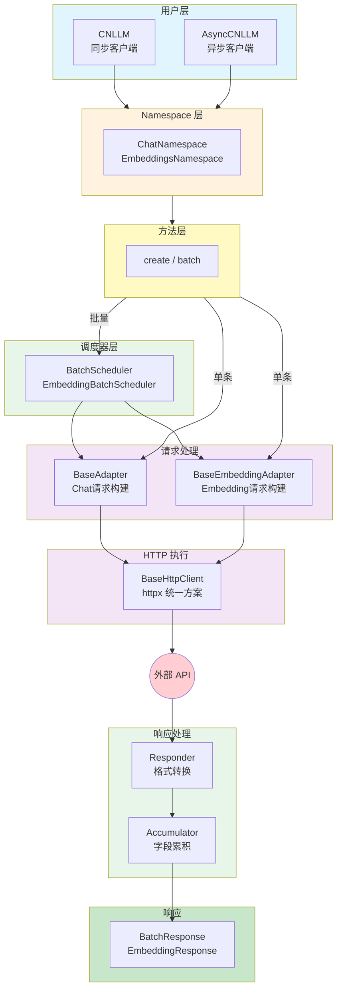
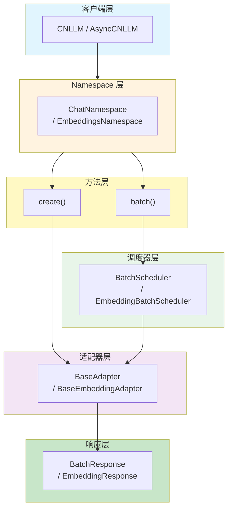
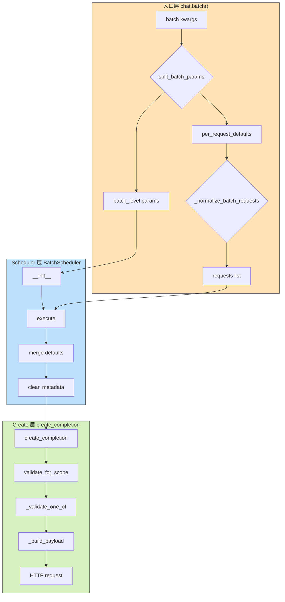
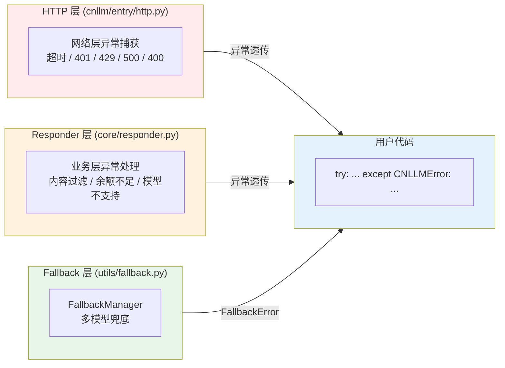
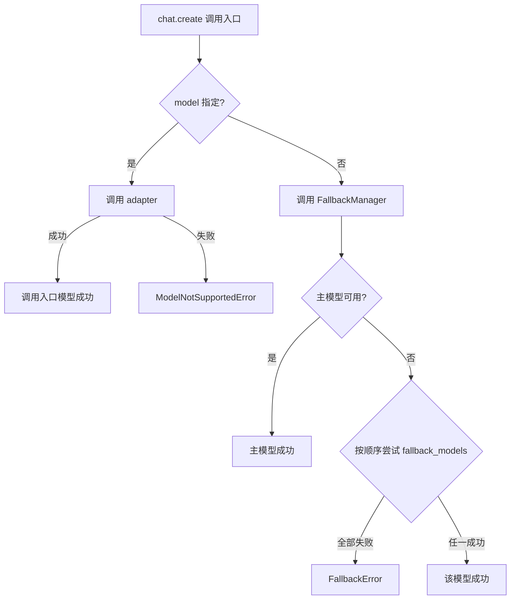
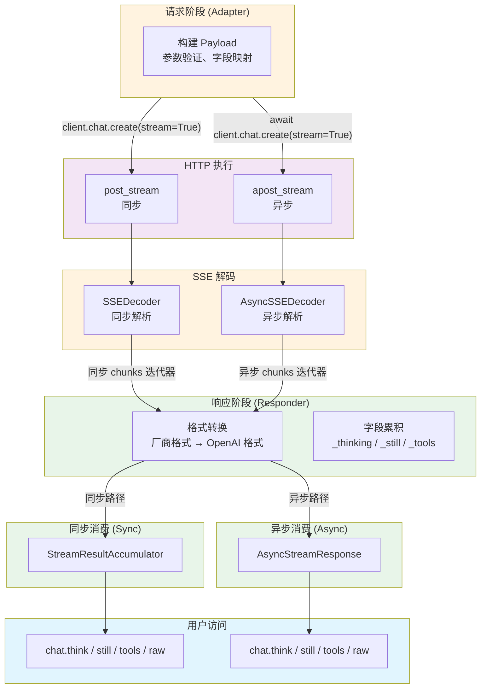
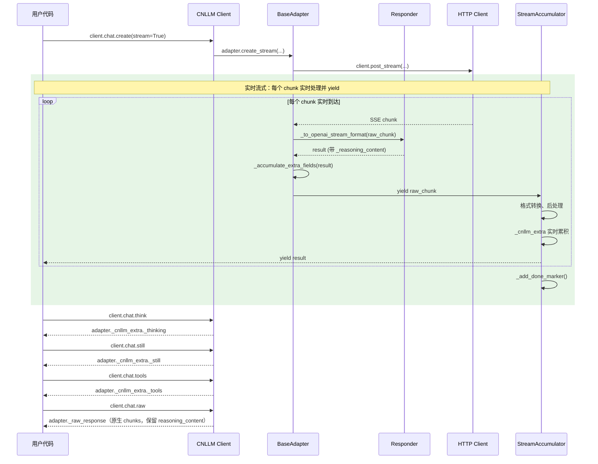
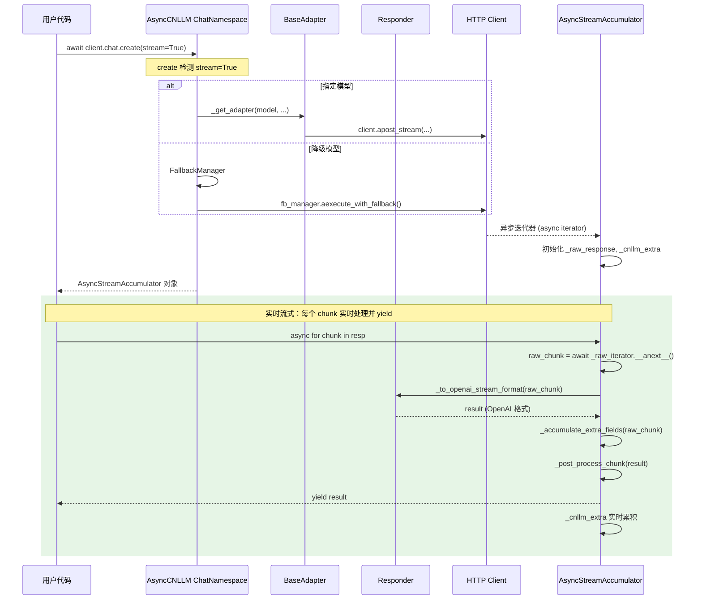

# CNLLM 架构与设计文档

## 0. 目录结构

```
cnllm/
├── entry/                    # 入口层 - 客户端初始化和调用入口
│   ├── __init__.py
│   ├── client.py             # CNLLM 主客户端类（同步）
│   ├── async_client.py       # AsyncCNLLM 异步客户端类
│   └── http.py               # HTTP 请求客户端（httpx 统一方案）
├── core/                     # 核心层 - 适配器抽象和厂商实现
│   ├── __init__.py
│   ├── adapter.py            # BaseAdapter 基础适配器（Chat）
│   ├── embedding.py          # BaseEmbeddingAdapter Embedding适配器
│   ├── responder.py          # Responder 响应格式转换框架
│   ├── accumulators/         # 字段累积器
│   │   ├── __init__.py
│   │   ├── base.py           # 累积器基类
│   │   ├── single_accumulator.py    # 单条请求累积器
│   │   ├── batch_accumulator.py     # Chat批量累积器
│   │   └── embedding_accumulator.py # Embedding批量累积器
│   ├── framework/
│   │   ├── __init__.py
│   │   └── langchain.py      # LangChain Runnable集成
│   └── vendor/               # 厂商实现
│       ├── __init__.py
│       ├── glm.py            # GLM 厂商适配器
│       ├── kimi.py           # Kimi 厂商适配器
│       ├── doubao.py         # Doubao 厂商适配器
│       ├── deepseek.py       # Deepseek 厂商适配器
│       ├── minimax.py        # MiniMax 厂商适配器
│       └── xiaomi.py         # Xiaomi 厂商适配器
└── utils/                    # 工具层 - 通用工具
    ├── __init__.py
    ├── exceptions.py         # 异常定义（含 BatchStopOnError）
    ├── fallback.py           # Fallback 管理器
    ├── batch.py              # 批量调度器（BatchScheduler, EmbeddingBatchScheduler）
    ├── stream.py             # 流式处理工具（SSEDecoder, AsyncSSEDecoder）
    ├── validator.py          # 参数验证器
    └── vendor_error.py       # 厂商错误处理

configs/
├── glm/
│   ├── request_glm.yaml
│   └── response_glm.yaml
├── kimi/
│   ├── request_kimi.yaml
│   └── response_kimi.yaml
├── doubao/
│   ├── request_doubao.yaml
│   └── response_doubao.yaml
├── deepseek/
│   ├── request_deepseek.yaml
│   └── response_deepseek.yaml
├── minimax/
│   ├── request_minimax.yaml
│   └── response_minimax.yaml
└── xiaomi/
    ├── request_xiaomi.yaml
    └── response_xiaomi.yaml
```

***

## 1. 架构设计

### 1.1 整体架构



### 1.2 通用基类架构

| 通用基类组件           | 文件                                         | 职责                   | 示例                                     |
| ---------------- | ------------------------------------------ | -------------------- | -------------------------------------- |
| **前端入口**         | `CNLLM` (entry/client.py)                  | 客户端初始化、调用入口          | `CNLLM(model='glm-4')`                 |
| **异步前端入口**       | `AsyncCNLLM` (entry/async\_client.py)      | 异步客户端初始化、调用入口        | `AsyncCNLLM(model='kimi-k2.6')`        |
| **Chat适配器**      | `BaseAdapter` (core/adapter.py)            | Chat请求字段映射、Payload构建 | `_build_payload()`, `validate_model()` |
| **Embedding适配器** | `BaseEmbeddingAdapter` (core/embedding.py) | Embedding请求处理        | `create_batch()`                       |
| **HTTP执行**       | `BaseHttpClient` (entry/http.py)           | 通用HTTP请求、重试机制（httpx） | `post_stream()`, `apost_stream()`      |
| **响应后处理**        | `Responder` (core/responder.py)            | 响应字段映射，OpenAI 标准格式构建 | `to_openai_stream_format()`            |
| **字段累积器**        | `Accumulator` (core/accumulators/)         | 统一处理字段累积（非流式/批量）     | `BatchResponse`, `EmbeddingResponse`   |

### 1.3 厂商层架构

| 厂商层组件              | 文件                        | 职责                      | 示例                                   |
| ------------------ | ------------------------- | ----------------------- | ------------------------------------ |
| **厂商Chat适配器**      | `core/vendor/{vendor}.py` | 厂商特有Chat请求处理、Payload 构建 | `GLMAdapter.create_completion()`     |
| **厂商Embedding适配器** | `core/vendor/{vendor}.py` | 厂商Embedding请求处理         | `GLMEmbeddingAdapter.create_batch()` |
| **厂商响应转换器**        | `core/vendor/{vendor}.py` | 厂商特有响应转换逻辑              | `GLMResponder.to_openai_format()`    |
| **厂商错误解析器**        | `core/vendor/{vendor}.py` | 厂商特有错误解析                | `GLMVendorError.parse()`             |
| **请求端配置**          | `configs/{vendor}/`       | 厂商请求字段映射、错误码映射、参数验证     | `request_{vendor}.yaml`              |
| **响应端配置**          | `configs/{vendor}/`       | 厂商响应字段映射、流处理配置          | `response_{vendor}.yaml`             |

### 1.4 工具类架构

| 工具类         | 文件                      | 职责                   | 示例                                          |
| ----------- | ----------------------- | -------------------- | ------------------------------------------- |
| **异常系统**    | `utils/exceptions.py`   | CNLLM 异常基类，统一异常体系    | `raise CNLLMError(msg)`                     |
| **批量调度器**   | `utils/batch.py`        | Chat/Embedding批量调度   | `BatchScheduler`, `EmbeddingBatchScheduler` |
| **批量停止异常**  | `utils/exceptions.py`   | stop\_on\_error抛出的异常 | `BatchStopOnError`                          |
| **厂商错误翻译器** | `utils/vendor_error.py` | 厂商错误翻译器，翻译为 CNLLM 异常 | `translator.to_cnllm_error()`               |
| **回退管理器**   | `utils/fallback.py`     | 回退管理器，处理模型不可用时的回退逻辑  | `execute_with_fallback()`                   |
| **流式处理工具**  | `utils/stream.py`       | SSE 解码、HTTP 流处理      | `SSEDecoder`, `AsyncSSEDecoder`             |
| **参数验证器**   | `utils/validator.py`    | 参数验证器，验证模型、字段、参数范围   | `validate_model()`, `validate_required()`   |

***

### 1.5 调用入口层级



| 层           | 示例                                                                                   |
| ----------- | ------------------------------------------------------------------------------------ |
| 客户端         | `CNLLM(model='glm-4', api_key='xxx')`                                                |
| Namespace   | `client.chat` / `client.embeddings`                                                  |
| 单条方法        | `client.chat.create(messages=[...])`                                                 |
| 批量方法        | `client.chat.batch(['hi', 'hello'])` / `embeddings.create_batch(['text1', 'text2'])` |
| 调度器         | `BatchScheduler(client, max_concurrent=5, stop_on_error=True)`                       |
| 适配器         | `GLMAdapter(api_key='xxx', model='glm-4')`                                           |
| 批量响应        | `BatchResponse.results / status["success_count"] / errors / usage`                      |
| Embedding响应 | `EmbeddingResponse.results / vectors / batch_info["dimension"] / status`               |

***

## 2. 调用参数链

### 2.1 单条调用参数链

```
用户调用 client.chat.create(messages=[...], temperature=0.7)
    ↓
Namespace.create() 透传参数
    ↓
BaseAdapter.__init__()   ← 客户端初始化时
├─ resolve_default("chat", "timeout")      → 30
├─ resolve_default("chat", "max_retries")  → 3
└─ resolve_default("chat", "retry_delay")  → 1.0
    ↓
BaseAdapter.create_completion(messages, temperature, stream, **kwargs)
    ↓
① 收集参数：{model, messages, temperature, stream, **kwargs}
    ↓
② validate_for_scope(params, scope="chat", vendor_yaml=..., drop_params="warn")
  ├─ A: PARAM_REGISTRY 校验（是否注册 / scope 匹配 / batch_level 误传 / 类型提示）
  ├─ B: YAML field_mappings 校验（厂商特有参数白名单）
  └─ C: 未匹配参数 → 按 drop_params 策略处理（warn / strict / ignore）
    ↓
③ _validate_one_of(params)  →  互斥参数校验（prompt / messages 二选一）
    ↓
④ _check_image_support(params)  →  图片输入兼容性检查
    ↓
⑤ _build_payload(params)  →  按 YAML 字段映射（map / transform / skip）构建请求体
   └─ 内部调用 get_vendor_model(model)  →  短名 → 厂商模型名
    ↓
⑥ get_base_url() + get_api_path()  →  组装完整请求 URL
    ↓
⑦ get_header_mappings()  →  读取 YAML 中 skip:true 且 head 的字段 → 请求头
    ↓
⑧ HTTP 请求（BaseHttpClient）
```

关键变化：

- **`filter_supported_params`** **+** **`validate_required_params`** **→ 合并为** **`validate_for_scope()`**，统一在 `param_registry.py` 中完成
- **`get_default_value`** **→ 替换为** **`resolve_default()`**，在适配器初始化时从 PARAM\_REGISTRY 读取 scope 感知默认值
- **`drop_params`** **策略（warn/strict/ignore）** 由客户端入口通过各层透传，控制未知参数的处理行为
- **新增** **`_check_image_support()`**，在 Payload 构建前校验模型是否支持图片输入

### 2.2 批量调用参数链

```
用户调用 client.chat.batch(requests, temperature=0.7, max_concurrent=5,
                            stop_on_error=True, callbacks=[...])
    ↓
Namespace.batch() 入口
    ↓
① split_batch_params(kwargs)  →  按 PARAM_REGISTRY.batch_level 标志分离
  ├─ per_request_defaults = {temperature: 0.7, ...}  →  合并到每个请求
  └─ batch_level_kwargs = {max_concurrent: 5, stop_on_error: True, ...}  →  传给 Scheduler
    ↓
② _normalize_batch_requests(requests, prompt=..., messages=..., per_request_defaults)
  →  三种输入模式统一为 requests 列表
  →  共享 prompt/messages 注入（prompt 为单个字符串，messages 为单组消息列表）
  →  _input_type 元数据标记
    ↓
③ BatchScheduler(client, max_concurrent=5, stop_on_error=True, callbacks=[...],
                  timeout=resolve_default("chat", "timeout"), ...)
    ↓
④ scheduler.execute()  控制并发 / 限速 / 回调
    ↓
⑤ adapter.create_completion(request)  ←  只传递 per-request 参数，不含 batch-level 参数
```

关键变化：

- **`BATCH_LEVEL_KEYS`** **硬编码集合 → 替换为** **`split_batch_params()`**，基于 PARAM\_REGISTRY 中 `batch_level=True` 标志动态分离
- \*\*\_normalize\_batch\_requests 支持 `requests=` 与 `prompt=` / `messages=` 共存，prompt 为单个字符串，messages 为单组消息列表，作为所有 request 的通用输入

### 2.3 YAML 配置文件中的参数传递机制

> **参数传递顺序说明**：
>
> - 用户调用 `create()` 时，adapter 类型（chat/embedding）已确定
> - 适配器初始化时（`__init__`）通过 `resolve_default` 读取 scope 感知默认值
> - `validate_for_scope` 执行后，参数已按 PARAM\_REGISTRY + YAML 白名单过滤
> - 以下逻辑按参数处理顺序排序（从上到下）

| 序号 | 用途                   | 访问点                             | 判断范围                                                      | 新增/处理参数                             |
| -- | -------------------- | ------------------------------- | --------------------------------------------------------- | ----------------------------------- |
| 1  | 获取 scope 感知默认值（初始化时） | `resolve_default`               | **PARAM\_REGISTRY.default**（scope 差异化：如 chat=3, embed=12） | timeout, max\_retries, retry\_delay |
| 2  | 通用参数校验 + 过滤          | `validate_for_scope` 步骤 A       | **PARAM\_REGISTRY**（scope 匹配 + batch\_level 校验 + 类型提示）    | -                                   |
| 3  | 厂商特有参数校验             | `validate_for_scope` 步骤 B       | **YAML optional\_fields**（含可选 scope 限制）                   | -                                   |
| 4  | 未知参数策略               | `validate_for_scope` 步骤 C       | **drop\_params**（warn / strict / ignore）                  | -                                   |
| 5  | 互斥参数校验               | `_validate_one_of`¹             | one\_of（prompt ↔ messages）                                | -                                   |
| 6  | 图片支持校验               | `_check_image_support`          | 模型 vision 支持列表                                            | -                                   |
| 7  | 构建请求体 + 模型名映射        | `_build_payload`                | YAML 字段映射（map / transform / skip）+ model\_mapping         | -                                   |
| 8  | 组装请求 URL             | `get_base_url` + `get_api_path` | base\_url + api\_path（按 adapter\_type 分层）                 | -                                   |
| 9  | 请求头映射                | `get_header_mappings`           | YAML 中 skip:true 且 head 的字段                               | -                                   |

¹ `_validate_one_of` 仅在 Chat 调用路径中执行，Embedding 路径不调用此方法。

**参数验证两阶段设计**：

```
validate_for_scope(params, scope, vendor_yaml, drop_params)
  │
  ├─ 步骤 A ── PARAM_REGISTRY 匹配
  │   ├─ scope 匹配 → 加入 clean
  │   ├─ scope 不匹配 → 按 drop_params 处理
  │   ├─ batch_level=True → 警告（误传入 create）
  │   └─ 类型不匹配 → strict 抛 TypeError，warn 记录警告丢弃参数
  │
  ├─ 步骤 B ── YAML field_mappings 匹配（厂商特有参数）
  │   ├─ 查 optional_fields + required_fields
  │   ├─ scope 限制检查（如 mask 仅 chat）
  │   └─ skip 字段忽略
  │
  └─ 步骤 C ── 未匹配 → 按 drop_params 策略
      ├─ "strict" → 抛 TypeError（类型不匹配）/ InvalidRequestError（未知参数）
      ├─ "warn"   → logger.warning + 丢弃（默认）
      └─ "ignore" → 静默丢弃
```

**YAML 简化说明**：

重构后 YAML 配置中移除了 `adapter` 级别的标识（如 `adapter: [chat]` / `adapter: [embedding]`），scope 控制统一由 PARAM\_REGISTRY 管理。厂商特有参数仍保留在 YAML 中，通过 `optional_fields` 注册，并可附带 `scope` 限制字段。`skip`、`map`、`transform` 等字段映射机制保持不变。

### 2.4 Batch 参数验证链条

Batch 调用支持三种输入模式，其参数验证分为三层职责：入口层（参数分离 + 请求规范化）→ Scheduler 层（填充运行时默认值）→ Create 层（单条验证链）。

#### 2.4.1 三层职责划分



#### 2.4.2 Batch 参数分类（由 PARAM\_REGISTRY 定义）

Batch 参数分为两类，**性质完全不同**，由 PARAM\_REGISTRY 中 `batch_level` 标志定义：

| 类别              | 参数                                                                                                                                      | PARAM\_REGISTRY 定义      | 处理方式                                                        |
| --------------- | --------------------------------------------------------------------------------------------------------------------------------------- | ----------------------- | ----------------------------------------------------------- |
| **Per-Request** | `prompt`、`messages`、`thinking`、`tools`、`temperature`、`max_tokens`、`top_p`、`stop`、`model`、`stream`、`timeout`、`max_retries`、`retry_delay` | `batch_level=False`（默认） | 进入请求 dict → create() → validate\_for\_scope                 |
| **Batch-Level** | `max_concurrent`、`rps`、`batch_size`、`stop_on_error`、`callbacks`、`custom_ids`、`keep`                                                     | `batch_level=True`      | **不进请求 dict** → 直接传给 BatchScheduler/EmbeddingBatchScheduler |

> **关键原则**：Batch-Level 参数不需要、不应该、不必要进入 YAML。YAML 描述的是「外部 API 接口规范」，Batch-Level 参数描述的是「客户端调度行为」，两者职责不同。

#### 2.4.3 源头分离机制（split\_batch\_params）

所有 `kwargs` 在 `batch()` 入口处由 `split_batch_params()` 分为两组，替代了旧版硬编码的 `BATCH_LEVEL_KEYS`：

```python
# split_batch_params 读取 PARAM_REGISTRY 中每个参数的 batch_level 标志
def split_batch_params(kwargs):
    batch_params = {}
    per_request_params = {}
    for key, value in kwargs.items():
        param_def = PARAM_REGISTRY.get(key)
        if param_def is not None and param_def.batch_level:
            batch_params[key] = value     # → BatchScheduler
        else:
            per_request_params[key] = value  # → create() 验证
    return batch_params, per_request_params

# 调用点（ChatNamespace.batch / EmbeddingsNamespace.batch）
batch_level_kwargs, per_request_defaults = split_batch_params(kwargs)
```

**优势**：

- **单一数据源**：PARAM\_REGISTRY 是参数分类的唯一权威来源，无需维护两套分离逻辑
- **自动扩展**：新增 batch-level 参数只需在 PARAM\_REGISTRY 中加一行定义，无需修改分离逻辑
- **scope 感知**：不同功能域（chat/embed）可定义不同的 batch-level 参数集合

#### 2.4.4 Per-Request 参数优先级

每个请求的最终参数由三层优先级决定：

```
Per-Request 独立参数（requests[i]） > 共享参数（batch 级 prompt/messages） > Per-Request 全局默认值（batch kwargs）
```

合并逻辑（`_normalize_batch_requests` 中）：

```python
per_request = req.copy()  # request[i] 中自有参数优先
if per_request_defaults:
    defaults = {k: v for k, v in per_request_defaults.items()
                 if k not in per_request}  # 不覆盖 item 自有值
    per_request = {**defaults, **per_request}
```

Scheduler 层进一步补充运行时默认值（通过 `resolve_default` 读取 PARAM\_REGISTRY）：

```python
# Scheduler._execute_single — per-request 不存在时才填入
if 'timeout' not in request and self.timeout is not None:
    request['timeout'] = self.timeout
if 'max_retries' not in request and self.max_retries is not None:
    request['max_retries'] = self.max_retries
```

#### 2.4.5 内部元数据字段（\_input\_type）

`_normalize_batch_requests()` 为每个请求添加 `_input_type` 内部字段（`"prompt"` / `"messages"`），仅作为标识输入来源的元数据，**不参与任何过滤或路由逻辑**。

此字段在传入 `create()` 前由 Scheduler 层剥离：

```python
# Scheduler 层（_execute_single）— 仅剥离元数据，无过滤逻辑
request_with_batch = {k: v for k, v in request.items() if k != "_input_type"}
response = self.client.chat.create(**request_with_batch)
```

#### 2.4.6 Per-Request 误传 Batch-Level 参数的警告

如果用户在 `requests` 列表的 dict 中误传了 Batch-Level 参数（如 `requests=[{"prompt": "A", "max_concurrent": 5}]`），会在 `normalize_batch_requests()` 中产生**引导性警告**，而非通用的"参数不支持"警告：

```
WARNING: batch() 参数 'max_concurrent' 在 requests[0] 中未生效。
请在 batch() 全局参数中配置 'max_concurrent'，例如: batch(..., max_concurrent=5)
```

该警告基于旧版 `BATCH_LEVEL_KEYS` 硬编码集合（与 `split_batch_params` 并存），确保用户能正确理解参数应该放在 batch() 的哪个层级配置。

#### 2.4.7 三种输入模式

| 模式                                | 示例                                 | 内部处理                                             |
| --------------------------------- | ---------------------------------- | ------------------------------------------------ |
| `requests=[{...}, {...}]`         | **推荐用法**，每个 item 独立参数              | 直接使用，item 自有参数优先级最高                              |
| `requests=[...] + prompt="A"`     | **共享模式**，所有 request 使用同一 prompt    | prompt 为单个字符串，未自带 prompt/messages 的 item 注入该值    |
| `requests=[...] + messages=[...]` | **共享模式**，所有 request 使用同一组 messages | messages 为单组消息列表，未自带 prompt/messages 的 item 注入该值 |
| `prompt=["A", "B"]`               | 老用法，向后兼容                           | 包装成 `[{prompt: "A"}, {prompt: "B"}]`             |
| `messages=[[{...}], [{...}]]`     | 老用法，向后兼容                           | 包装成 `[{messages: [...]}, ...]`                   |

> **注**：`prompt` 和 `messages` 之间仍保持互斥（不可同时提供）。与 `requests` 共存时，prompt 或 messages作为全局参数，仅接受单个输入。

## 3. 异常处理系统架构



### 3.1 错误分类与处理职责

| 错误类型             | 发生场景        | 处理组件        |
| ---------------- | ----------- | ----------- |
| 类型错误、参数不合法        | 客户端预检       | `validate_for_scope` / `_check_image_support` → `TypeError` |
| 网络不可达、连接超时       | 发送请求前       | HTTP 层      |
| API Key 错误 (401) | 请求到达服务器前    | HTTP 层      |
| 限流 (429)         | 请求到达服务器前    | HTTP 层      |
| 模型不存在、参数错误 (400) | 请求到达服务器后    | HTTP 层      |
| 服务器错误 (>=500)    | 请求到达服务器后    | HTTP 层      |
| 业务错误 (敏感词、余额不足)  | 模型处理后       | Responder 层 |
| 模型不支持            | 参数验证阶段      | Responder 层 |
| 所有模型均失败          | Fallback 机制 | Fallback 层  |

## 4. FallbackManager 流程设计

只有客户端初始化入口接受配置`fallback_models`参数，为追求程序或应用运行时的稳定性建议配置此项。
当客户端入口处的主模型不可用时，会按顺序尝试`fallback_models`中的模型。
代码示例：

```python
client = CNLLM(
    model="minimax-m2.7", api_key="minimax_key", 
    fallback_models={"mimo-v2-flash": "xiaomi-key", "minimax-m2.5": None}  # None 表示使用主模型配置的 API_key
    )   
resp = client.chat.create(prompt="2+2等于几？")  # 调用入口如再次配置模型，将会覆盖客户端入口处配置的所有模型
print(resp)
```



### 4.1 FallbackError 错误聚合

当配置多模型 fallback 且所有模型都失败时，`FallbackError` 会聚合所有错误信息：

```python
try:
    client = CNLLM(
        model="primary-model",
        api_key="key",
        fallback_models={"backup-1": "key1", "backup-2": "key2"}
    )
    client.chat.create(messages=[...])
except FallbackError as e:
    print(e.message)  # "所有模型均失败。已尝试: primary-model, backup-1, backup-2"
    for i, err in enumerate(e.errors):
        print(f"[{i+1}] {err}")  # 每个模型的详细错误
```

***

## 5. 流式处理系统架构

### 5.1 整体处理流程



#### 同步 vs 异步调用对比

| 维度     | 同步调用                              | 异步调用                                    |
| ------ | --------------------------------- | --------------------------------------- |
| 入口     | `client.chat.create(stream=True)` | `await client.chat.create(stream=True)` |
| HTTP   | `post_stream()`                   | `apost_stream()`                        |
| SSE 解码 | `SSEDecoder` (同步)                 | `AsyncSSEDecoder` (异步)                  |
| 消费层    | `StreamAccumulator`               | `AsyncStreamAccumulator`                |
| 迭代方式   | `for chunk in response`           | `async for chunk in response`           |
| 客户端类   | `CNLLM`                           | `AsyncCNLLM`                            |

### 5.2 组件职责说明

#### 请求阶段（Adapter）

| 方法                                       | 职责                                               |
| ---------------------------------------- | ------------------------------------------------ |
| `validate_for_scope()`                   | 统一参数验证（PARAM\_REGISTRY + YAML + drop\_params 策略） |
| `_validate_one_of()`                     | 互斥参数校验（prompt ↔ messages）                        |
| `_check_image_support()`                 | 图片输入兼容性检查                                        |
| `resolve_default()`                      | 从 PARAM\_REGISTRY 读取 scope 感知默认值                 |
| `get_vendor_model()`                     | 获取厂商模型名                                          |
| `_build_payload()`                       | 构建请求 Payload                                     |
| `create_completion()`                    | 同步调用入口                                           |
| `acreate_completion()`                   | 异步调用入口                                           |
| `_handle_stream()` / `_ahandle_stream()` | 返回原始 chunks 迭代器                                  |

#### 响应处理（流式）

| 组件                         | 文件                     | 职责                                                                                          |
| -------------------------- | ---------------------- | ------------------------------------------------------------------------------------------- |
| **StreamAccumulator**      | `utils/accumulator.py` | 内部调用 `adapter._to_openai_stream_format()` 格式转换，累积字段到 `adapter._cnllm_extra`，后处理（去重、过滤 DONE） |
| **AsyncStreamAccumulator** | `utils/accumulator.py` | 异步版本：同样逻辑                                                                                   |
| **StreamHandler**          | `utils/stream.py`      | 只返回原始 chunks（不进行格式转换）                                                                       |
| **AsyncStreamHandler**     | `utils/stream.py`      | 异步版本：只返回原始 chunks                                                                           |
| **SSEDecoder**             | `utils/stream.py`      | 解析 SSE，`data: {...}` → JSON                                                                 |
| **AsyncSSEDecoder**        | `utils/stream.py`      | 异步解析 SSE                                                                                    |

#### 格式转换（Adapter → Responder）

| 方法                              | 职责                                       | 归属      |
| ------------------------------- | ---------------------------------------- | ------- |
| `_to_openai_format()`           | 非流式格式转换                                  | 子类实现    |
| `_to_openai_stream_format()`    | 流式格式转换（调用 `_do_to_openai_stream_format`） | Adapter |
| `_do_to_openai_stream_format()` | 厂商特定格式转换逻辑                               | 子类实现    |

#### 用户访问

| 组件                    | 文件                                          | 职责             |
| --------------------- | ------------------------------------------- | -------------- |
| **client.chat.think** | `entry/client.py` / `entry/async_client.py` | 返回 `_thinking` |
| **client.chat.still** | `entry/client.py` / `entry/async_client.py` | 返回 `_still`    |
| **client.chat.tools** | `entry/client.py` / `entry/async_client.py` | 返回 `_tools`    |
| **client.chat.raw**   | `entry/client.py` / `entry/async_client.py` | 返回原生响应 chunks  |

### 5.3 实时流式模式

`StreamAccumulator` 采用**实时流式**模式，每个 chunk 在到达时立即 yield 给用户：

```python
def __iter__(self):
    for raw_chunk in self._raw_iterator:
        result = self._adapter._to_openai_stream_format(raw_chunk)
        self._accumulate_extra_fields(result)
        self._post_process_chunk(result)
        self._chunks.append(result)
        self._adapter._raw_response["chunks"].append(clean_for_raw)
        yield result  # 实时 yield，不等待所有 chunks
    self._done = True
    self._add_done_marker()
```

**特性**：

- 用户迭代 `for chunk in response` 时，每个 chunk **实时到达**（无需等待整个 HTTP 流完成）
- `_cnllm_extra` 和 `_raw_response["chunks"]` 在迭代过程中**实时累积**
- 适合前端流式渲染等需要实时消费的场景

累积在**两个地方**同时进行：

1. **StreamAccumulator 层** (`_accumulate_extra_fields`)：累积到 `adapter._cnllm_extra`
   - 供 `client.chat.think/still/tools` 属性访问
2. **StreamAccumulator 层**：实时存储完整的原始响应到 `adapter._raw_response["chunks"]`
   - 供 `client.chat.raw` 属性访问，保留所有字段，不进行过滤

| 字段类型         | 示例                            | 处理规则   | 说明                                                              |
| ------------ | ----------------------------- | ------ | --------------------------------------------------------------- |
| 最终累积字段       | `_thinking`、`_still`、`_tools` | **累积** | 存储到 `adapter._cnllm_extra`，供 `client.chat.think/still/tools` 访问 |
| 标准 OpenAI 字段 | `id`、`choices`、`delta` 等      | **保留** | `.raw` 保留完整原始响应                                                 |
| 原生响应特有字段     | `reasoning_content`等          | **保留** | `.raw` 保留完整原始响应                                                 |

**说明**：

- `.raw` 属性现在返回完整的原始响应，不进行任何过滤
- 字段提取仍然进行，为 `.think`、`.still` 和 `.tools` 属性服务

### 5.4 Chunk 后处理规则（StreamAccumulator）

在迭代过程中逐个 chunk 执行后处理：

```python
# 1. 每个 chunk 实时过滤重复 choice.index 的 role 字段（保持 OpenAI 兼容性）
if choice_idx in self._seen_choice_indices:
    if "role" in delta:
        del delta["role"]
else:
    self._seen_choice_indices.add(choice_idx)

# 2. 每个 chunk 实时过滤重复 tool_calls.index 的 id/type/name 字段（OpenAI 流式标准）
if "tool_calls" in delta:
    for tc in delta["tool_calls"]:
        idx = tc.get("index")
        if idx in self._seen_tool_call_indices:
            tc.pop("id", None)
            tc.pop("type", None)
            if "function" in tc and "name" in tc["function"]:
                del tc["function"]["name"]
        else:
            self._seen_tool_call_indices.add(idx)

# 3. 流结束时移除重复的 finish_reason chunk（只保留第一个）
def _remove_duplicate_finish_chunks(self):
    finish_indices = [i for i, chunk in enumerate(self._chunks)
                      if is_finish_chunk(chunk)]
    if len(finish_indices) > 1:
        for idx in reversed(finish_indices[1:]):
            self._chunks.pop(idx)
```

流式响应中，以下字段按 index 过滤以符合 OpenAI 标准：

**`delta.role`** **过滤规则**

- 按 `choice.index` 判断
- 首次出现的 `choice.index` → **保留** `role: assistant`
- 同一 `choice.index` 再次出现 → **删除** `role`

**`tool_calls`** **过滤规则**

- 按 `tool_calls[].index` 判断
- 首次出现的 `tool_calls[].index` → **保留** `id`、`type`、`function.name`、`arguments`
- 同一 `tool_calls[].index` 再次出现 → **只保留** `index` 和 `function.arguments`

> **独立性**：`choice.index`（第几条消息）和 `tool_calls.index`（第几个工具）完全独立，互不影响。

**终止符 chunk**

- `[DONE]` 是 SSE 流的内部终止协议（OpenAI 原始 SSE 流的一部分）
- 国内厂商可能没有 `[DONE]`，SDK 内部兜底添加以确保迭代器能正常终止
- **对外暴露时过滤**：`__next__()` 和 `get_chunks()` 会过滤掉 `[DONE]` 字符串，只返回纯 JSON chunks
- 这样设计是为了兼容 LangChain、LiteLLM 等 OpenAI 兼容库的期望（它们期望纯 JSON chunks）

### 5.5 同步数据流时序图



### 5.6 异步数据流时序图



## 6. CNLLM 标准响应格式

系统支持 8 种响应类型，根据 3 个维度组合：

| 维度   | 选项       |
| ---- | -------- |
| 调用方式 | 同步 / 异步  |
| 流式模式 | 流式 / 非流式 |
| 批量模式 | 批量 / 非批量 |

### 6.1 响应类型总览

| #  | 类型              | 返回类型                  | 累积器类                             |
| -- | --------------- | --------------------- | -------------------------------- |
| 1  | 同步非流式非批量        | `Dict`                | `NonStreamAccumulator`           |
| 2  | 同步流式非批量         | `Iterator[Dict]`      | `StreamAccumulator`              |
| 3  | 同步非流式批量         | `BatchResponse`       | `BatchNonStreamAccumulator`      |
| 4  | 同步流式批量          | `Iterator[Dict]`      | `BatchStreamAccumulator`         |
| 5  | 异步非流式非批量        | `Dict`                | `AsyncNonStreamAccumulator`      |
| 6  | 异步流式非批量         | `AsyncIterator[Dict]` | `AsyncStreamAccumulator`         |
| 7  | 异步非流式批量         | `BatchResponse`       | `AsyncBatchNonStreamAccumulator` |
| 8  | 异步流式批量          | `AsyncIterator[Dict]` | `AsyncBatchStreamAccumulator`    |
| 9  | 同步非批量Embeddings | `Dict`                | `EmbeddingAccumulator`           |
| 10 | 同步批量Embeddings  | `EmbeddingResponse`   | `EmbeddingBatchAccumulator`      |
| 11 | 异步非批量Embeddings | `Dict`                | `AsyncEmbeddingAccumulator`      |
| 12 | 异步批量Embeddings  | `EmbeddingResponse`   | `AsyncEmbeddingBatchAccumulator` |
| 13 | 同步混合流式批量 | `BatchResponse`       | `MixedBatchScheduler`         |
| 14 | 异步混合流式批量 | `BatchResponse`   | `AsyncMixedBatchScheduler`      |

### 6.2 非批量响应类型

#### 类型 1、5: 同步/异步非流式非批量

```python
# 返回格式: Dict (OpenAI 标准格式)
{
    "id": "chatcmpl-xxx",
    "object": "chat.completion",
    "created": 1234567890,
    "model": "minimax-m2.7",
    "choices": [{
        "index": 0,
        "message": {
            "role": "assistant",
            "content": "这是回复内容"
        },
        "finish_reason": "stop"
    }],
    "usage": {
        "prompt_tokens": 5,
        "completion_tokens": 4,
        "total_tokens": 9
    }
}
```

#### 类型 2、6: 同步/异步流式非批量

```python
# 返回格式: Iterator[Dict] / AsyncIterator[Dict]
# 开始 chunk:
{
    "id": "chatcmpl-xxx",
    "object": "chat.completion.chunk",
    "created": 1234567890,
    "model": "minimax-m2.7",
    "choices": [{
        "index": 0,
        "delta": {
            "role": "assistant",
            "content": "部分内容"
        },
        "finish_reason": None
    }]
},

# 中间 chunk:
{
    "id": "chatcmpl-xxx",
    "object": "chat.completion.chunk",
    "created": 1234567890,
    "model": "minimax-m2.7",
    "choices": [{
        "index": 0,
        "delta": {
            "content": "更多内容"
        },
        "finish_reason": None
    }]
},

# 最后一个 chunk:
{
    "id": "chatcmpl-xxx",
    "choices": [{
        "index": 0,
        "delta": {},
        "finish_reason": "stop"
    }]
}
```

### 6.3 批量响应类型

#### 类型 3、7: 同步/异步非流式批量

```python
# 返回格式: BatchResponse（非流式批量 / 混合流式批量）
# 注意：to_dict() 时才展开，直接访问属性获取数据

# status — 统计信息
result.status
# {"success_count": 2, "fail_count": 0, "total": 2, "elapsed": "0.35s"}

# results — 成功响应 dict（默认不持久化，需 keep=["*"] 或 keep=["results"]）
result.results
# {"request_0": {...}, "request_1": {...}}  每个 value 同类型 1 Dict

# errors — 失败信息 dict
result.errors
# {"request_1": "参数错误"}

# usage — tokens 累积
result.usage
# {"prompt_tokens": 10, "completion_tokens": 50, "total_tokens": 60}

# think / still / tools — 默认持久化字段（无需 keep 参数）
result.think    # {"request_0": "...", "request_1": "..."}
result.still    # {"request_0": "...", "request_1": "..."}
result.tools    # {"request_0": [...], "request_1": [...]}

# raw — 原生响应
result.raw      # {"request_0": {...}, "request_1": {...}}

# to_dict — 控制输出字段
result.to_dict()
# {"still": {...}, "think": {...}, "tools": {...}, "status": {...}, "usage": {...}}

result.to_dict(results=True, errors=True)
# {"results": {...}, "errors": {...}, "status": {...}, "usage": {...}}
```

#### 类型 4、8: 同步/异步流式批量

```python
# 返回类型: Iterator[Dict] / AsyncIterator[Dict]（chunks 迭代器）
# 迭代结束后通过 batch_result 访问聚合数据

# 迭代过程：每个 chunk 实时 yield
for chunk in client.chat.batch(requests, stream=True):
    print(chunk)  # 单条请求的流式 chunk（OpenAI 标准格式）

# 迭代结束后通过 batch_result 访问完整结果
batch_resp = client.chat.batch_result

batch_resp.status
# {"success_count": 1, "fail_count": 1, "total": 2, "elapsed": "0.42s"}

batch_resp.errors
# {"request_1": "参数错误"}

batch_resp.results  # 需 keep=["results"] 或 keep=["*"]
# {"request_0": [chunk1, chunk2, ...], ...}

batch_resp.usage
# {"prompt_tokens": 10, "completion_tokens": 30}

# think / still / tools / raw — 默认保留
batch_resp.think   # {"request_0": "...", "request_1": "..."}
batch_resp.still   # {"request_0": "...", "request_1": "..."}
batch_resp.tools   # {"request_0": [...], "request_1": [...]}
batch_resp.raw     # {"request_0": {...}, "request_1": {...}}
```


### 6.5 字段访问

### 非批量调用 类型1/2/5/6 字段详情

| 类别        | 访问方式                               | 返回格式              | 返回示例                                             |
| --------- | ---------------------------------- | ----------------- | ------------------------------------------------ |
| **think** | `resp.think` / `client.chat.think` | `str`             | `"推理内容..."`                                      |
| **still** | `resp.still` / `client.chat.still` | `str`             | `"回复内容..."`                                      |
| **tools** | `resp.tools` / `client.chat.tools` | `Dict[int, Dict]` | `{0: {"id": "...", "function": {...}}, 1: {...}` |
| **raw**   | `resp.raw` / `client.chat.raw`     | `Dict`            | `{"id": "...", "choices": [...], ...}`           |

### 批量调用 类型3/4/7/8 字段详情

| 类别          | 访问方式                                                              | 返回格式                         | 返回示例                                                |
| ----------- | ----------------------------------------------------------------- | ---------------------------- | --------------------------------------------------- |
| **统计字段**    | `resp.status` / `batch_result.status`                             | `Dict`                       | `{"success_count": 2, "fail_count": 0, "total": 2, "elapsed": "0.35s"}` |
| <br />      | `resp.status["success_count"]`                                    | `int`                        | `2`                                                 |
| <br />      | `resp.status["fail_count"]`                                       | `int`                        | `0`                                                 |
| <br />      | `resp.status["total"]`                                            | `int`                        | `2`                                                 |
| <br />      | `resp.status["elapsed"]`                                          | `str`                        | `"0.35s"`                                           |
| **usage**   | `resp.usage` / `batch_result.usage`                               | `Dict`                       | `{"prompt_tokens": 10, "completion_tokens": 30}`    |
| **errors**  | `resp.errors` / `batch_result.errors`                             | `Dict[str, str]`             | `{"request_1": "参数错误"}`                          |
| **results** | `resp.results` / `batch_result.results`                           | `Dict[str, Dict]`            | `{"request_0": {...}, "request_1": {...}}`          |
| <br />      | `resp.results[0]` / `batch_result.results[0]`                     | `Dict`                       | `{"id": "...", "choices": [...], ...}`              |
| <br />      | `resp.results["request_0"]` / `batch_result.results["request_0"]` | `Dict`                       | 同上                                                  |
| **think**   | `resp.think` / `batch_result.think`                               | `Dict[str, str]`             | `{"request_0": "...", "request_1": "..."}`          |
| <br />      | `resp.think[0]` / `batch_result.think[0]`                         | `str`                        | `"推理内容..."`                                         |
| <br />      | `resp.think["request_0"]` / `batch_result.think["request_0"]`     | `str`                        | `"推理内容..."`                                         |
| **still**   | `resp.still` / `batch_result.still`                               | `Dict[str, str]`             | `{"request_0": "...", "request_1": "..."}`          |
| <br />      | `resp.still[0]` / `batch_result.still[0]`                         | `str`                        | `"回复内容..."`                                         |
| <br />      | `resp.still["request_0"]` / `batch_result.still["request_0"]`     | `str`                        | `"回复内容..."`                                         |
| **tools**   | `resp.tools` / `batch_result.tools`                               | `Dict[str, Dict[int, Dict]]` | `{"request_0": {...}, "request_1": {...}}`          |
| <br />      | `resp.tools[0]` / `batch_result.tools[0]`                         | `Dict[int, Dict]`            | `{0: {"id": "...", "function": {...}}, 1: {...}`    |
| <br />      | `resp.tools["request_0"]` / `batch_result.tools["request_0"]`     | `Dict[int, Dict]`            | 同上                                                  |
| **raw**     | `resp.raw` / `batch_result.raw`                                   | `Dict[str, Dict]`            | `{"request_0": {...}, "request_1": {...}}`          |
| <br />      | `resp.raw[0]` / `batch_result.raw[0]`                             | `Dict`                       | `{"id": "...", "choices": [...], ...}`              |
| <br />      | `resp.raw["request_0"]` / `batch_result.raw["request_0"]`         | `Dict`                       | 同上                                                  |

### 批量调用类型 10/12 Embedding 响应字段详情

| 类别           | 访问方式                                                              | 返回格式              | 返回示例                                                                                                                                                                                                            |
| ------------ | ----------------------------------------------------------------- | ----------------- | --------------------------------------------------------------------------------------------------------------------------------------------------------------------------------------------------------------- |
| **统计字段**     | `resp.status` / `batch_result.status`                             | `Dict`            | `{"success_count": 2, "fail_count": 0, "total": 2, "elapsed": "0.35s"}`                                                                                                                                         |
| <br />       | `resp.status["success_count"]`                                    | `int`             | `2`                                                                                                                                                                                                             |
| <br />       | `resp.status["fail_count"]`                                       | `int`             | `0`                                                                                                                                                                                                             |
| <br />       | `resp.status["total"]`                                            | `int`             | `2`                                                                                                                                                                                                             |
| <br />       | `resp.status["elapsed"]`                                          | `str`             | `"0.35s"`                                                                                                                                                                                                       |
| <br />       | `resp.batch_info["dimension"]`                                    | `int`             | `1024`                                                                                                                                                                                                          |
| <br />       | `resp.batch_info["batch_size"]`                                   | `int`             | `8`                                                                                                                                                                                                             |
| <br />       | `resp.batch_info["batch_count"]`                                  | `int`             | `4`                                                                                                                                                                                                             |
| **usage**    | `resp.usage` / `batch_result.usage`                               | `Dict`            | `{"prompt_tokens": 10, "total_tokens": 10}`                                                                                                                                                                      |
| **vectors**  | `resp.vectors` / `batch_result.vectors`                           | `Dict[str, list]` | `{"request_0": [0.1, 0.2, ...], "request_1": [0.3, 0.4, ...]}`                                                                                                                                                 |
| **errors**   | `resp.errors` / `batch_result.errors`                             | `Dict[str, str]`  | `{"request_2": "some error"}`                                                                                                                                                                                    |
| **results**  | `resp.results` / `batch_result.results`                           | `Dict[str, Dict]` | `{"request_0": {...}, "request_1": {...}}`                                                                                                                                                                      |
| <br />       | `resp.results[0]` / `batch_result.results[0]`                     | `Dict`            | `{"object": "list", "data": [...], ...}`                                                                                                                                                                        |
| <br />       | `resp.results["request_0"]` / `batch_result.results["request_0"]` | `Dict`            | 同上                                                                                                                                                                                                              |
| **repr**     | `repr(resp)` / `repr(batch_result)`                               | `str`             | `EmbeddingResponse(status={...}, usage={...}, batch_info={...})`                                                                                                                                                 |
| **to\_dict** | `resp.to_dict()`                                                  | `Dict`            | `{"vectors": {"request_0": [...], "request_1": [...]}, "status": {...}, "usage": {...}, "batch_info": {...}}`                                                                                                    |
| <br />       | `resp.to_dict(results=True)`                                      | `Dict`            | `{"results": {"request_0": {...}, "request_1": {...}}, "status": {...}, "usage": {...}, "batch_info": {...}}`                                                                                                    |
| <br />       | `resp.to_dict(vectors=False)`                                     | `Dict`            | `{"status": {...}, "usage": {...}, "batch_info": {...}}` — 排除 vectors                                                                                                                                           |

## 7. 批量调用系统架构

见 [批量调用系统架构](/feature/batch.md)

## 8. 异步实现说明

见 [异步实现说明](/feature/async.md)

## 9. Embedding实现说明

见 [Embedding实现说明](/feature/embedding.md)
