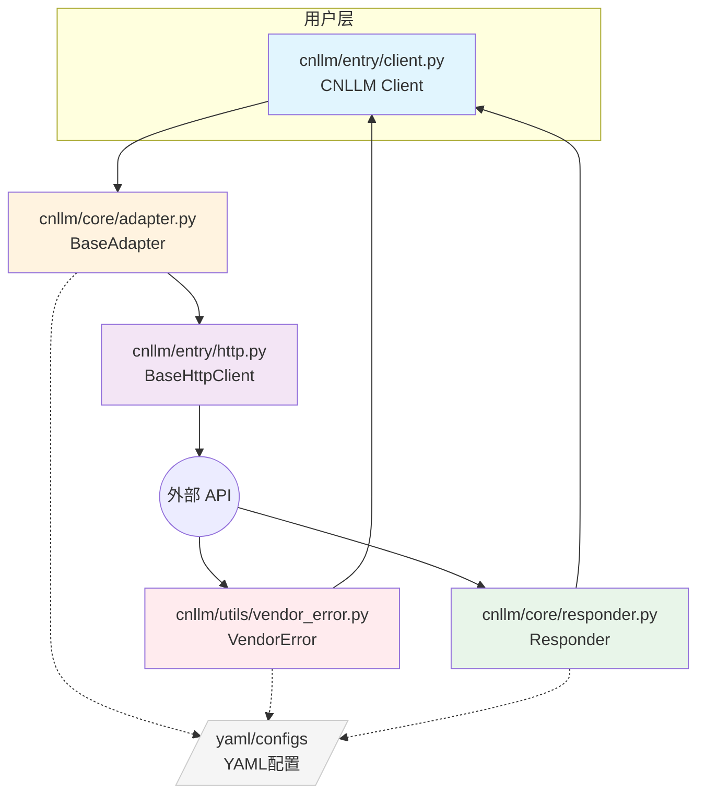
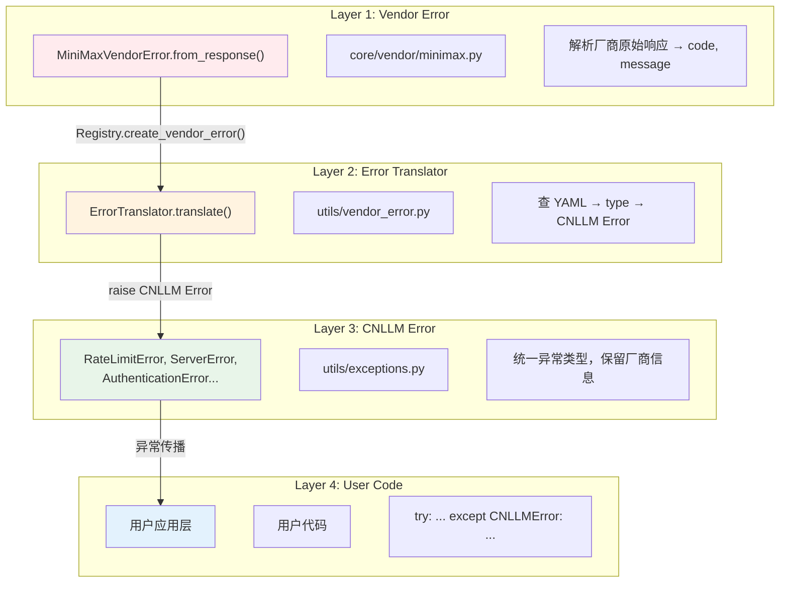

# CNLLM 架构与设计文档

## 1. 架构设计

### 1.1 整体架构



### 1.2 通用基类架构

| 通用基类组件     | 文件                               | 职责                    | 示例                                     |
| ---------- | -------------------------------- | --------------------- | -------------------------------------- |
| **前端入口**   | `CNLLM` (entry/client.py)        | 客户端初始化、调用入口| `CNLLM(model='minimax-m2.7')`          |
| **请求预处理**  | `BaseAdapter` (core/adapter.py)  | 请求字段映射、Payload构建 | `_build_payload()`, `validate_model()` |
| **HTTP执行** | `BaseHttpClient` (entry/http.py) | 通用HTTP请求、重试机制     | `post_stream()`, `post()`              |
| **响应后处理**  | `Responder` (core/responder.py)  | 响应字段映射，OpenAI 标准格式构建 | `to_openai_stream_format()`            |

### 1.2 厂商层架构

| 厂商层组件 | 文件 | 职责 | 示例 |
| --- | --- | --- | --- |
| **厂商适配器** | `core/vendor/{vendor}.py` | 厂商特有请求处理、Payload 构建 | `MiniMaxAdapter.create_completion()` |
| **厂商响应转换器** | `core/vendor/{vendor}.py` | 厂商特有响应转换逻辑 | `MiniMaxResponder.to_openai_format()` |
| **厂商错误解析器** | `core/vendor/{vendor}.py` | 厂商特有错误解析 | `MiniMaxVendorError.parse()` |
| **请求端配置** | `configs/{vendor}/` | 厂商请求字段映射、错误码映射、参数验证 | `request_{vendor}.yaml` |
| **响应端配置** | `configs/{vendor}/` | 厂商响应字段映射、流处理配置 | `response_{vendor}.yaml` |

### 1.3 工具类架构
| 工具类 | 文件 | 职责 | 示例 |
| --- | --- | --- | --- |
| **异常系统**| `utils/exceptions.py` | CNLLM 异常基类，统一异常体系 | `raise CNLLMError(msg)` |
| **厂商错误翻译器** | `utils/vendor_error.py` | 厂商错误翻译器，翻译为 CNLLM 异常 | `translator.to_cnllm_error()` |
| **回退管理器** | `utils/fallback.py` | 回退管理器，处理模型不可用时的回退逻辑 | `execute_with_fallback()` |
| **流式处理工具** | `utils/stream.py` | 流式处理工具，处理流式响应 | `process_stream_chunk()` |
| **参数验证器** | `utils/validator.py` | 参数验证器，验证模型、字段、参数范围 | `validate_model()`, `validate_required()` |
***

## 2. 目录结构
```
cnllm/
├── entry/                    # 入口层 - 客户端初始化和调用入口
│   ├── __init__.py
│   ├── client.py             # CNLLM 主客户端类
│   └── http.py               # HTTP 请求客户端
├── core/                     # 核心层 - 适配器抽象和厂商实现
│   ├── __init__.py
│   ├── adapter.py            # BaseAdapter 基础适配器
│   ├── responder.py          # Responder 响应格式转换框架
│   ├── framework/
│   │   ├── __init__.py
│   │   └── langchain.py      # LangChain Runnable集成
│   └── vendor/               # 厂商实现
│       ├── __init__.py
│       ├── minimax.py        # MiniMax 厂商适配器
│       └── xiaomi.py         # Xiaomi 厂商适配器
└── utils/                    # 工具层 - 通用工具
    ├── __init__.py
    ├── exceptions.py         # 异常定义
    ├── fallback.py           # Fallback 管理器
    ├── stream.py             # 流式处理工具
    ├── validator.py          # 参数验证器
    └── vendor_error.py       # 厂商错误处理

configs/
├── minimax/
│   ├── request_minimax.yaml  # 请求配置
│   └── response_minimax.yaml # 响应配置
└── xiaomi/
    ├── request_xiaomi.yaml   # 请求配置
    └── response_xiaomi.yaml  # 响应配置
```
***

## 3. 异常处理系统架构


***

## 4. FallbackManager 流程设计

只有客户端初始化入口接受配置`fallback_models`参数，为追求程序或应用运行时的稳定性建议配置此项。
当客户端入口处的主模型不可用时，会按顺序尝试`fallback_models`中的模型。
代码示例：

```python
client = CNLLM(
    model="minimax-m2.7", api_key="minimax_key", 
    fallback_models={"mimo-v2-flash": "xiaomi-key", "minimax-m2.5": None}  # None 表示使用主模型配置的 API_key
    )   
resp = client.chat.create(prompt="2+2等于几？")  # 调用入口如再次配置模型，将会覆盖客户端入口处配置的所有模型
print(resp)
```

```mermaid
flowchart TD
    A[chat.create 调用入口] --> B{model 指定?}
    B -->|是| C[调用 adapter]
    C -->|成功| J[调用入口模型成功]
    C -->|失败| K[ModelNotSupportedError]
    B -->|否| D[调用 FallbackManager]
    D --> E{主模型可用?}
    E -->|是| F[主模型成功]
    E -->|否| G{按顺序尝试 fallback_models}
    G -->|全部失败| H[FallbackError]
    G -->|任一成功| I[该模型成功]
````
***