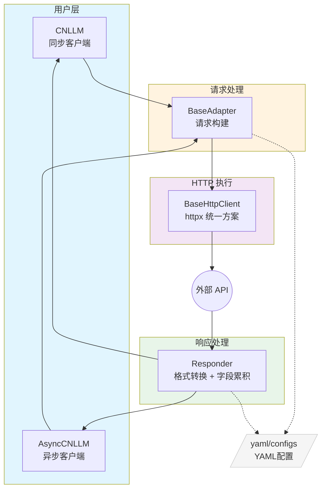
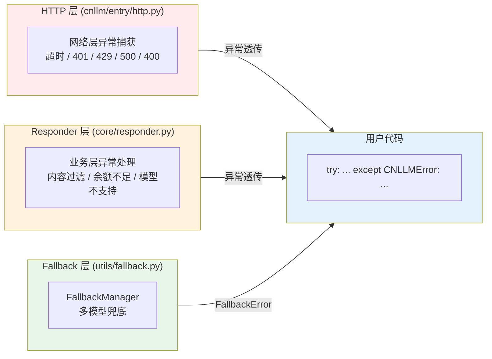
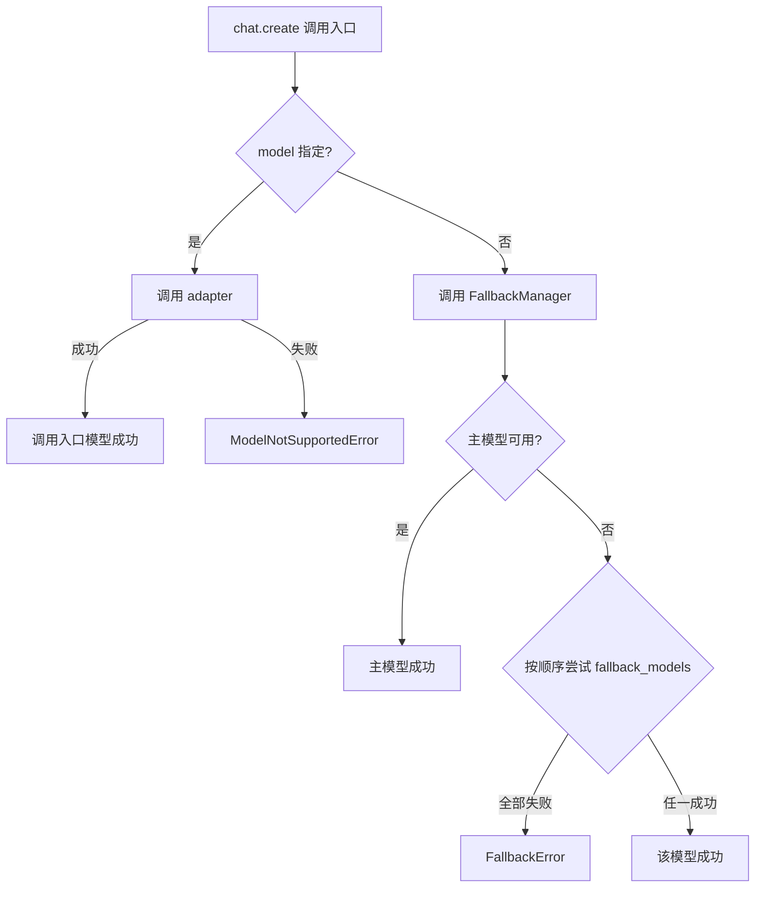
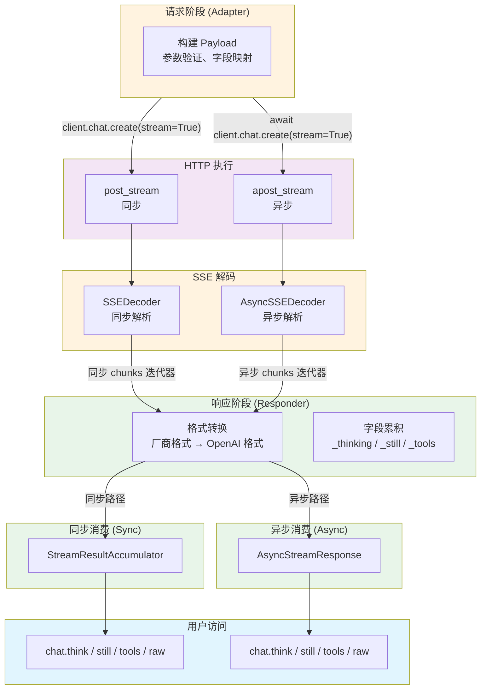
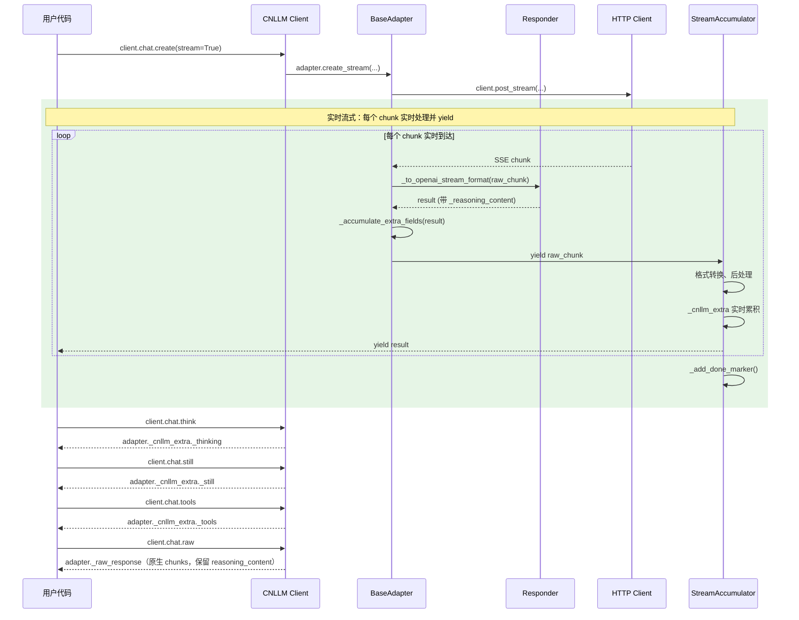
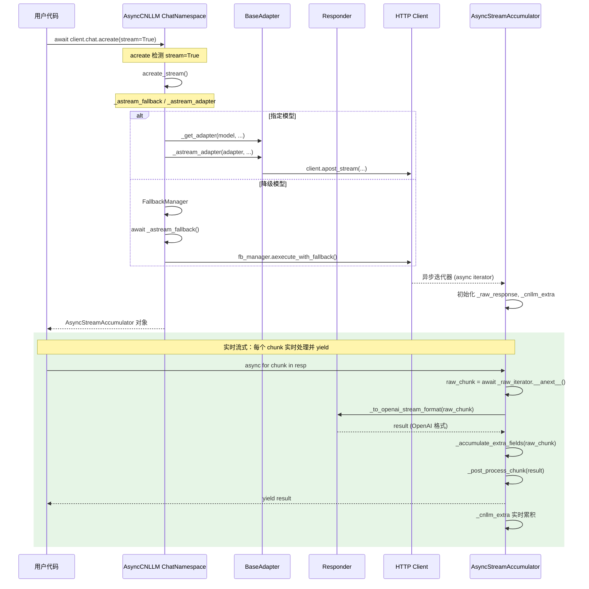

# CNLLM 架构与设计文档

## 1. 架构设计

### 1.1 整体架构



### 1.2 通用基类架构

| 通用基类组件     | 文件                               | 职责                   | 示例                                     |
| ---------- | -------------------------------- | -------------------- | -------------------------------------- |
| **前端入口**   | `CNLLM` (entry/client.py)        | 客户端初始化、调用入口          | `CNLLM(model='minimax-m2.7')`          |
| **异步前端入口** | `AsyncCNLLM` (entry/async_client.py) | 异步客户端初始化、调用入口 | `AsyncCNLLM(model='deepseek-chat')`    |
| **请求预处理**  | `BaseAdapter` (core/adapter.py)  | 请求字段映射、Payload构建     | `_build_payload()`, `validate_model()` |
| **HTTP执行** | `BaseHttpClient` (entry/http.py) | 通用HTTP请求、重试机制（httpx）   | `post_stream()`, `apost_stream()`      |
| **响应后处理**  | `Responder` (core/responder.py)  | 响应字段映射，OpenAI 标准格式构建 | `to_openai_stream_format()`            |

### 1.2 厂商层架构

| 厂商层组件       | 文件                        | 职责                  | 示例                                    |
| ----------- | ------------------------- | ------------------- | ------------------------------------- |
| **厂商适配器**   | `core/vendor/{vendor}.py` | 厂商特有请求处理、Payload 构建 | `MiniMaxAdapter.create_completion()`  |
| **厂商响应转换器** | `core/vendor/{vendor}.py` | 厂商特有响应转换逻辑          | `MiniMaxResponder.to_openai_format()` |
| **厂商错误解析器** | `core/vendor/{vendor}.py` | 厂商特有错误解析            | `MiniMaxVendorError.parse()`          |
| **请求端配置**   | `configs/{vendor}/`       | 厂商请求字段映射、错误码映射、参数验证 | `request_{vendor}.yaml`               |
| **响应端配置**   | `configs/{vendor}/`       | 厂商响应字段映射、流处理配置      | `response_{vendor}.yaml`              |

### 1.3 工具类架构

| 工具类         | 文件                      | 职责                   | 示例                                        |
| ----------- | ----------------------- | -------------------- | ----------------------------------------- |
| **异常系统**    | `utils/exceptions.py`   | CNLLM 异常基类，统一异常体系    | `raise CNLLMError(msg)`                   |
| **厂商错误翻译器** | `utils/vendor_error.py` | 厂商错误翻译器，翻译为 CNLLM 异常 | `translator.to_cnllm_error()`             |
| **回退管理器**   | `utils/fallback.py`     | 回退管理器，处理模型不可用时的回退逻辑  | `execute_with_fallback()`, `aexecute_with_fallback()` |
| **流式处理工具**  | `utils/stream.py`       | SSE 解码、HTTP 流处理       | `SSEDecoder`, `AsyncSSEDecoder`, `StreamHandler` |
| **字段累积器**   | `utils/accumulator.py`  | 统一处理字段累积（非流式/流式/批量） | `StreamAccumulator`, `BatchResponse` |
| **参数验证器**   | `utils/validator.py`    | 参数验证器，验证模型、字段、参数范围   | `validate_model()`, `validate_required()` |

***

## 2. 目录结构

```
cnllm/
├── entry/                    # 入口层 - 客户端初始化和调用入口
│   ├── __init__.py
│   ├── client.py             # CNLLM 主客户端类（同步）
│   ├── async_client.py       # AsyncCNLLM 异步客户端类
│   └── http.py               # HTTP 请求客户端（httpx 统一方案）
├── core/                     # 核心层 - 适配器抽象和厂商实现
│   ├── __init__.py
│   ├── adapter.py            # BaseAdapter 基础适配器
│   ├── responder.py          # Responder 响应格式转换框架
│   ├── framework/
│   │   ├── __init__.py
│   │   └── langchain.py      # LangChain Runnable集成
│   └── vendor/               # 厂商实现
│       ├── __init__.py
│       ├── minimax.py        # MiniMax 厂商适配器
│       └── xiaomi.py         # Xiaomi 厂商适配器
└── utils/                    # 工具层 - 通用工具
    ├── __init__.py
    ├── exceptions.py         # 异常定义
    ├── fallback.py           # Fallback 管理器
    ├── stream.py             # 流式处理工具（SSEDecoder, AsyncSSEDecoder）
    ├── accumulator.py        # 字段累积器（非流式/流式/批量）
    ├── validator.py          # 参数验证器
    └── vendor_error.py       # 厂商错误处理

configs/
├── minimax/
│   ├── request_minimax.yaml  # 请求配置
│   └── response_minimax.yaml # 响应配置
└── xiaomi/
    ├── request_xiaomi.yaml   # 请求配置
    └── response_xiaomi.yaml  # 响应配置
```

***

## 3. 异常处理系统架构



### 3.1 错误分类与处理职责

| 错误类型             | 发生场景        | 处理组件        |
| ---------------- | ----------- | ----------- |
| 网络不可达、连接超时       | 发送请求前       | HTTP 层      |
| API Key 错误 (401) | 请求到达服务器前    | HTTP 层      |
| 限流 (429)         | 请求到达服务器前    | HTTP 层      |
| 模型不存在、参数错误 (400) | 请求到达服务器后    | HTTP 层      |
| 服务器错误 (>=500)    | 请求到达服务器后    | HTTP 层      |
| 业务错误 (敏感词、余额不足)  | 模型处理后       | Responder 层 |
| 模型不支持            | 参数验证阶段      | Responder 层 |
| 所有模型均失败          | Fallback 机制 | Fallback 层  |

### 3.2 FallbackError 错误聚合

当配置多模型 fallback 且所有模型都失败时，`FallbackError` 会聚合所有错误信息：

```python
try:
    client = CNLLM(
        model="primary-model",
        api_key="key",
        fallback_models={"backup-1": "key1", "backup-2": "key2"}
    )
    client.chat.create(messages=[...])
except FallbackError as e:
    print(e.message)  # "所有模型均失败。已尝试: primary-model, backup-1, backup-2"
    for i, err in enumerate(e.errors):
        print(f"[{i+1}] {err}")  # 每个模型的详细错误
```

## 4. FallbackManager 流程设计

只有客户端初始化入口接受配置`fallback_models`参数，为追求程序或应用运行时的稳定性建议配置此项。
当客户端入口处的主模型不可用时，会按顺序尝试`fallback_models`中的模型。
代码示例：

```python
client = CNLLM(
    model="minimax-m2.7", api_key="minimax_key", 
    fallback_models={"mimo-v2-flash": "xiaomi-key", "minimax-m2.5": None}  # None 表示使用主模型配置的 API_key
    )   
resp = client.chat.create(prompt="2+2等于几？")  # 调用入口如再次配置模型，将会覆盖客户端入口处配置的所有模型
print(resp)
````



***

## 5. 流式处理系统架构

### 5.1 整体处理流程



#### 同步 vs 异步调用对比

| 维度 | 同步调用 | 异步调用 |
| ---- | -------- | -------- |
| 入口 | `client.chat.create(stream=True)` | `await client.chat.create(stream=True)` |
| HTTP | `post_stream()` | `apost_stream()` |
| SSE 解码 | `SSEDecoder` (同步) | `AsyncSSEDecoder` (异步) |
| 消费层 | `StreamAccumulator` | `AsyncStreamAccumulator` |
| 迭代方式 | `for chunk in response` | `async for chunk in response` |
| 客户端类 | `CNLLM` | `AsyncCNLLM` |

### 5.2 组件职责说明

#### 请求阶段（Adapter）

| 方法 | 职责 |
| ---- | ---- |
| `_validate_required_params()` | 必填参数验证 |
| `_filter_supported_params()` | 过滤支持参数 |
| `get_vendor_model()` | 获取厂商模型名 |
| `_build_payload()` | 构建请求 Payload |
| `create_completion()` / `acreate_completion()` | 调用入口 |
| `_handle_stream()` / `_ahandle_stream()` | 返回原始 chunks 迭代器 |

#### 响应处理（流式）

| 组件 | 文件 | 职责 |
| ---- | ---- | ---- |
| **StreamAccumulator** | `utils/accumulator.py` | 内部调用 `adapter._to_openai_stream_format()` 格式转换，累积字段到 `adapter._cnllm_extra`，后处理（去重、过滤 DONE） |
| **AsyncStreamAccumulator** | `utils/accumulator.py` | 异步版本：同样逻辑 |
| **StreamHandler** | `utils/stream.py` | 只返回原始 chunks（不进行格式转换） |
| **AsyncStreamHandler** | `utils/stream.py` | 异步版本：只返回原始 chunks |
| **SSEDecoder** | `utils/stream.py` | 解析 SSE，`data: {...}` → JSON |
| **AsyncSSEDecoder** | `utils/stream.py` | 异步解析 SSE |

#### 格式转换（Adapter → Responder）

| 方法 | 职责 | 归属 |
| ---- | ---- | ---- |
| `_to_openai_format()` | 非流式格式转换 | 子类实现 |
| `_to_openai_stream_format()` | 流式格式转换（调用 `_do_to_openai_stream_format`） | Adapter |
| `_do_to_openai_stream_format()` | 厂商特定格式转换逻辑 | 子类实现 |

#### 用户访问

| 组件 | 文件 | 职责 |
| ---- | ---- | ---- |
| **client.chat.think** | `entry/client.py` / `entry/async_client.py` | 返回 `_thinking` |
| **client.chat.still** | `entry/client.py` / `entry/async_client.py` | 返回 `_still` |
| **client.chat.tools** | `entry/client.py` / `entry/async_client.py` | 返回 `_tools` |
| **client.chat.raw** | `entry/client.py` / `entry/async_client.py` | 返回原生响应 chunks |

### 5.3 关键设计决策

#### 5.3.1 实时流式模式

`StreamAccumulator` 采用**实时流式**模式，每个 chunk 在到达时立即 yield 给用户：

```python
def __iter__(self):
    for raw_chunk in self._raw_iterator:
        result = self._adapter._to_openai_stream_format(raw_chunk)
        self._accumulate_extra_fields(result)
        self._post_process_chunk(result)
        self._chunks.append(result)
        self._adapter._raw_response["chunks"].append(clean_for_raw)
        yield result  # 实时 yield，不等待所有 chunks
    self._done = True
    self._add_done_marker()
```

**特性**：

- 用户迭代 `for chunk in response` 时，每个 chunk **实时到达**（无需等待整个 HTTP 流完成）
- `_cnllm_extra` 和 `_raw_response["chunks"]` 在迭代过程中**实时累积**
- 适合前端流式渲染等需要实时消费的场景

#### 5.3.2 双层累积机制

累积在**两个地方**同时进行：

1. **StreamAccumulator 层** (`_accumulate_extra_fields`)：累积到 `adapter._cnllm_extra`
   - 供 `client.chat.think/still/tools` 属性访问
2. **StreamAccumulator 层**：实时存储完整的原始响应到 `adapter._raw_response["chunks"]`
   - 供 `client.chat.raw` 属性访问，保留所有字段，不进行过滤

#### 5.3.3 字段过滤规则

| 字段类型         | 示例                            | 处理规则   | 说明                     |
| ------------ | ----------------------------- | ------ | ------------------------ |
| 最终累积字段       | `_thinking`、`_still`、`_tools` | **累积** | 存储到 `adapter._cnllm_extra`，供 `client.chat.think/still/tools` 访问   |
| 标准 OpenAI 字段 | `id`、`choices`、`delta` 等      | **保留** | `.raw` 保留完整原始响应 |
| 原生响应特有字段       | `reasoning_content`等    | **保留** | `.raw` 保留完整原始响应 |

**说明**：
- `.raw` 属性现在返回完整的原始响应，不进行任何过滤
- 字段提取仍然进行，为 `.think`、`.still` 和 `.tools` 属性服务
- 当前的属性名只支持非批量调用

#### 5.3.4 Chunk 后处理规则（StreamAccumulator）

在迭代过程中逐个 chunk 执行后处理：

```python
# 1. 每个 chunk 实时过滤重复 choice.index 的 role 字段（保持 OpenAI 兼容性）
if choice_idx in self._seen_choice_indices:
    if "role" in delta:
        del delta["role"]
else:
    self._seen_choice_indices.add(choice_idx)

# 2. 每个 chunk 实时过滤重复 tool_calls.index 的 id/type/name 字段（OpenAI 流式标准）
if "tool_calls" in delta:
    for tc in delta["tool_calls"]:
        idx = tc.get("index")
        if idx in self._seen_tool_call_indices:
            tc.pop("id", None)
            tc.pop("type", None)
            if "function" in tc and "name" in tc["function"]:
                del tc["function"]["name"]
        else:
            self._seen_tool_call_indices.add(idx)

# 3. 流结束时移除重复的 finish_reason chunk（只保留第一个）
def _remove_duplicate_finish_chunks(self):
    finish_indices = [i for i, chunk in enumerate(self._chunks)
                      if is_finish_chunk(chunk)]
    if len(finish_indices) > 1:
        for idx in reversed(finish_indices[1:]):
            self._chunks.pop(idx)
```

流式响应中，以下字段按 index 过滤以符合 OpenAI 标准：

**`delta.role` 过滤规则**
- 按 `choice.index` 判断
- 首次出现的 `choice.index` → **保留** `role: assistant`
- 同一 `choice.index` 再次出现 → **删除** `role`

**`tool_calls` 过滤规则**
- 按 `tool_calls[].index` 判断
- 首次出现的 `tool_calls[].index` → **保留** `id`、`type`、`function.name`、`arguments`
- 同一 `tool_calls[].index` 再次出现 → **只保留** `index` 和 `function.arguments`

> **独立性**：`choice.index`（第几条消息）和 `tool_calls.index`（第几个工具）完全独立，互不影响。

**终止符 chunk**
- `[DONE]` 是 SSE 流的内部终止协议（OpenAI 原始 SSE 流的一部分）
- 国内厂商可能没有 `[DONE]`，SDK 内部兜底添加以确保迭代器能正常终止
- **对外暴露时过滤**：`__next__()` 和 `get_chunks()` 会过滤掉 `[DONE]` 字符串，只返回纯 JSON chunks
- 这样设计是为了兼容 LangChain、LiteLLM 等 OpenAI 兼容库的期望（它们期望纯 JSON chunks）

#### 5.3.5 统一的字段访问入口

```python
# 流式
response = client.chat.create(messages=[...], stream=True, tools=[...])
for chunk in response:
    print(chunk)

# 重要字段的访问入口
print(client.chat.think)  # 思维内容
print(client.chat.still)  # 回复内容
print(client.chat.tools)  # 工具调用
print(client.chat.raw)  # 原生响应 chunks（原样保留 reasoning_content）
```

### 5.4 同步数据流时序图



### 5.5 异步数据流时序图



#### 5.5.1 异步流式调用链

异步流式调用通过以下方法链实现：

1. **`acreate(stream=True)`**：异步创建方法，检测到 `stream=True` 时调用 `acreate_stream`
2. **`acreate_stream()`**：`async def`，处理流式请求
   - 指定模型：调用 `_astream_adapter()` 返回 `AsyncStreamAccumulator`
   - 降级模型：调用 `await _astream_fallback()` 返回 `AsyncStreamAccumulator`
3. **`_astream_adapter()`**：`def`（同步），直接创建 `AsyncStreamAccumulator`
4. **`_astream_fallback()`**：`async def`，处理模型降级，创建 `AsyncStreamAccumulator`
5. **`AsyncStreamAccumulator`**：封装异步迭代器，实现 `async for` 协议

**关键点**：
- `acreate_stream` 和 `_astream_fallback` 必须正确返回 `AsyncStreamAccumulator` 对象
- 不能返回协程或异步生成器，否则用户无法使用 `async for` 迭代

***

## 6. CNLLM 标准响应格式

系统支持 8 种响应类型，根据 3 个维度组合：

| 维度 | 选项 |
| ---- | ---- |
| 调用方式 | 同步 / 异步 |
| 流式模式 | 流式 / 非流式 |
| 批量模式 | 批量 / 非批量 |

### 6.1 响应类型总览

| # | 类型 | 调用方式 | 流式模式 | 批量模式 | 返回类型 | 累积器类 |
|---|------|----------|----------|----------|----------|----------|
| 1 | 同步非流式非批量 | 同步 | ❌ | ❌ | `Dict` | `NonStreamAccumulator` |
| 2 | 同步流式非批量 | 同步 | ✅ | ❌ | `Iterator[Dict]` | `StreamAccumulator` |
| 3 | 同步非流式批量 | 同步 | ❌ | ✅ | `BatchResponse` | `BatchNonStreamAccumulator` |
| 4 | 同步流式批量 | 同步 | ✅ | ✅ | `Iterator[Dict]` | `BatchStreamAccumulator` |
| 5 | 异步非流式非批量 | 异步 | ❌ | ❌ | `Dict` | `NonStreamAccumulator` |
| 6 | 异步流式非批量 | 异步 | ✅ | ❌ | `AsyncIterator[Dict]` | `AsyncStreamAccumulator` |
| 7 | 异步非流式批量 | 异步 | ❌ | ✅ | `BatchResponse` | `AsyncBatchNonStreamAccumulator` |
| 8 | 异步流式批量 | 异步 | ✅ | ✅ | `AsyncIterator[Dict]` | `AsyncBatchStreamAccumulator` |

### 6.2 非批量响应类型

#### 类型 1、5: 同步/异步非流式非批量
```python
# 返回格式: Dict (OpenAI 标准格式)
{
    "id": "chatcmpl-xxx",
    "object": "chat.completion",
    "created": 1234567890,
    "model": "minimax-m2.7",
    "choices": [{
        "index": 0,
        "message": {
            "role": "assistant",
            "content": "这是回复内容"
        },
        "finish_reason": "stop"
    }],
    "usage": {
        "prompt_tokens": 5,
        "completion_tokens": 4,
        "total_tokens": 9
    }
}

# client.chat.think / still / tools / raw 返回:
client.chat.think   # str: "思维推理内容" 或 ""
client.chat.still   # str: "回复内容"
client.chat.tools   # List[Dict]: [{"id": "call_xxx", "type": "function", ...}]
client.chat.raw     # Dict: 原始响应（保留 reasoning_content 等）
```

#### 类型 2、6: 同步/异步流式非批量
```python
# 返回格式: Iterator[Dict] / AsyncIterator[Dict]
# 开始 chunk:
{
    "id": "chatcmpl-xxx",
    "object": "chat.completion.chunk",
    "created": 1234567890,
    "model": "minimax-m2.7",
    "choices": [{
        "index": 0,
        "delta": {
            "role": "assistant",
            "content": "部分内容"
        },
        "finish_reason": None
    }]
},

# 中间 chunk:
{
    "id": "chatcmpl-xxx",
    "object": "chat.completion.chunk",
    "created": 1234567890,
    "model": "minimax-m2.7",
    "choices": [{
        "index": 0,
        "delta": {
            "content": "更多内容"
        },
        "finish_reason": None
    }]
},

# 最后一个 chunk:
{
    "id": "chatcmpl-xxx",
    "choices": [{
        "index": 0,
        "delta": {},
        "finish_reason": "stop"
    }]
}

# client.chat.think / still / tools / raw 返回:
client.chat.think   # str: "累积的思维内容"
client.chat.still   # str: "累积的回复内容"
client.chat.tools   # List[Dict]: 累积的工具调用
client.chat.raw     # {"chunks": [...]} 所有原始 chunks
```

### 6.3 批量响应类型

#### 批量方法参数

#### 类型 3、7: 同步/异步非流式批量
```python
# 返回格式: BatchResponse
{
    "success": ["request_0", "request_1"],  # 成功的 request_id 列表
    "errors": [],                                 # 失败的 request_id 列表
    "request_counts": {
        "success_count": 2,
        "fail_count": 0,
        "total": 2
    },
    "elapsed": 0.35,
    "results": {
        "request_0": {                 # "request_0" 成功的单次响应
            "id": "chatcmpl-xxx",        # 单次调用的内层结构 同类型 1、5 中的 Dict
            "object": "chat.completion",
            "created": 1742112345,
            "model": "deepseek-chat",
            "choices": [{
                "index": 0,
                "message": {
                    "role": "assistant",
                    "content": "回复内容"
                },
                "finish_reason": "stop"
            }],
            "usage": {
                "prompt_tokens": 5,
                "completion_tokens": 4,
                "total_tokens": 9
            }
        },
        "request_1": {                 # "request_1" 失败的单次响应
            "error": {
                "index": 1,
                "code": "invalid_request",
                "message": "参数错误"
            }
        }
    },
    "think": {"request_0": "...", "request_1": "..."},
    "still": {"request_0": "...", "request_1": "..."},
    "tools": {"request_0": [...], "request_1": [...]},
    "raw": {"request_0": {...}, "request_1": {...}}
}

# 字段访问:
# 统计字段访问-支持批中查询，实时累积：
result.total              # int: 总数
result.success_count      # int: 成功数
result.fail_count         # int: 失败数
result.elapsed            # float: 耗时
result.success            # List[str]: 成功的 request_id 列表
result.errors             # List[str]: 失败的 request_id 列表
result.request_counts     # Dict: {"success_count": ..., "fail_count": ..., "total": ...}

# 累积字段访问:
result.think[0]                  # 推理内容
result.think["request_0"]     # 同上
result.still[0]                 # 回复内容
result.still["request_0"]     # 同上
result.tools[0]                 # 工具调用
result.tools["request_0"]     # 同上
result.raw[0]                   # 原始数据
result.raw["request_0"]       # 同上

# 批响应访问：
result.results

# 以上所有字段支持批中访问，结果实时累积

# 单个响应访问（四种方式等价）:
result.results["request_0"]   # OpenAI 格式 dict
result.results[0]               # 同上
result["request_0"]           # 同上
result[0]                       # 同上

# print 输出（简洁统计，不显示大文本）:
print(result)
# BatchResponse(request_counts={...}, elapsed=..., success=[...], errors=[...])

print(result.results)
# BatchResults(count=2, request_id=['request_0', 'request_1'])

# 转换为标准 JSON:
result.to_dict()                        # 只保留 results (默认)
result.to_dict(stats=True)              # results + 统计字段 (success/errors/request_counts/elapsed)
result.to_dict(think=True, still=True, tools=True, raw=True)  # results + 相应字段
```

#### 类型 4、8: 同步/异步流式批量
```python
# 返回类型: Iterator[Dict] / AsyncIterator[Dict]

{
    "success": ["request_0"],
    "errors": ["request_1"],
    "request_counts": {"success_count": 1, "fail_count": 1, "total": 2},
    "elapsed": 0.42,
    "results": {
        "request_0": [                  # "request_0" 成功的单次响应的 chunks 列表
            {"id": "chatcmpl-batch-xxx",
            "object": "chat.completion.chunk",
            "model": "deepseek-chat",
            "choices": [{
                "index": 0,
                "delta": {"role": "assistant"},
                "finish_reason": null}]},
            {...,
            "choices": [{
                "index": 0,
                "delta": {"content": "你好"},
                "finish_reason": null}]},
            {...,
            "choices": [{
                "index": 0,
                "delta": {},
                "finish_reason": "stop"}]
            }],
        "request_1": [{                 # "request_1" 失败的单次响应
            "error": {
                "index": 1,
                "code": "invalid_request",
                "message": "参数错误"
            }
        }],
    },
    "think": {"request_0": "...", "request_1": "..."},
    "still": {"request_0": "...", "request_1": "..."},
    "tools": {"request_0": [...], "request_1": [...]},
    "raw": {"request_0": {...}, "request_1": {...}}
}

# 开启迭代：
accumulator = client.chat.batch(requests, stream=True)
for chunk in accumulator:
    pass
batch_response = accumulator.batch_response

# 统计字段访问：
batch_response.total              # int: 总数
batch_response.success_count      # int: 成功数
batch_response.fail_count         # int: 失败数
batch_response.elapsed            # float: 耗时
batch_response.success            # List[str]: 成功的 request_id 列表
batch_response.errors             # List[str]: 失败的 request_id 列表
batch_response.request_counts     # Dict: {"success_count": ..., "fail_count": ..., "total": ...}

# 累积字段访问:
batch_response.think[0]                  # 推理内容
batch_response.think["request_0"]     # 同上
batch_response.still[0]                 # 回复内容
batch_response.still["request_0"]     # 同上
batch_response.tools[0]                 # 工具调用
batch_response.tools["request_0"]     # 同上
batch_response.raw[0]                   # 原始数据
batch_response.raw["request_0"]       # 同上

# 批响应访问：
batch_response.results

# 单个响应访问（四种方式等价）:
batch_response.results["request_0"]  # List[chunk]
batch_response.results[0]              # 同上
batch_response["request_0"]          # 同上
batch_response[0]                      # 同上

# 以上所有字段支持批中访问，结果实时累积

# print 输出（简洁统计，不显示大文本）:
print(batch_response)
# BatchResponse(request_counts={...}, elapsed=..., success=[...], errors=[...])

print(batch_response.results)
# BatchResults(count=2, request_id=['request_0', 'request_1'])

# 转换为标准 JSON:
batch_response.to_dict()                        # 只保留 results (默认)
batch_response.to_dict(stats=True)              # results + 统计字段 (success/errors/request_counts/elapsed)
batch_response.to_dict(think=True, still=True,...)  # results + think/still/tools/raw
```

### 6.4 BatchResponse 数据结构

```python
@dataclass
class BatchResponse:
    _results: Dict[str, Any]              # {request_id: OpenAI 格式}
    elapsed: float = 0.0                   # 耗时（秒）

    _think: Dict[str, str]                # {request_id: think_str}
    _still: Dict[str, str]                # {request_id: still_str}
    _tools: Dict[str, List[Dict]]         # {request_id: tools_list}
    _raw: Dict[str, Dict]                 # {request_id: raw_data}

    @property
    def results(self) -> BatchResults
    @property
    def think(self) -> Dict[str, str]
    @property
    def still(self) -> Dict[str, str]
    @property
    def tools(self) -> Dict[str, List]
    @property
    def raw(self) -> Dict[str, Dict]
    @property
    def success(self) -> List[str]
    @property
    def errors(self) -> List[str]
    @property
    def request_counts(self) -> Dict
    @property
    def success_count(self) -> int
    @property
    def fail_count(self) -> int
    @property
    def total(self) -> int
    def __getitem__(key) -> Any
    def to_dict(self) -> Dict


class BatchResults:
    def __getitem__(key) -> Any
    def items(self) -> Iterator
    def keys(self) -> Iterator
    def values(self) -> Iterator

**关键变更**：results 直接存储标准 OpenAI 格式

### 8.5 批量方法功能参数

```python
# 同步/异步适用
result = client.chat.batch(
    requests,                    # List[str | dict]: 请求列表
    stream=False,               # bool: 是否流式，默认 False
    max_concurrent=3,         # int: 最大并发数
    timeout=None,               # float: 单请求超时（秒）
    stop_on_error=False,        # bool: 遇错是否停止
    callbacks=None              # List[Callable]: 进度回调
)
```

## 7. 批量调用系统架构

见 [批量调用系统架构](/feature/batch.md)

## 8. 异步实现说明

见 [异步实现说明](/feature/async.md)

## 9. Embedding实现说明

见 [Embedding实现说明](/feature/embedding.md)