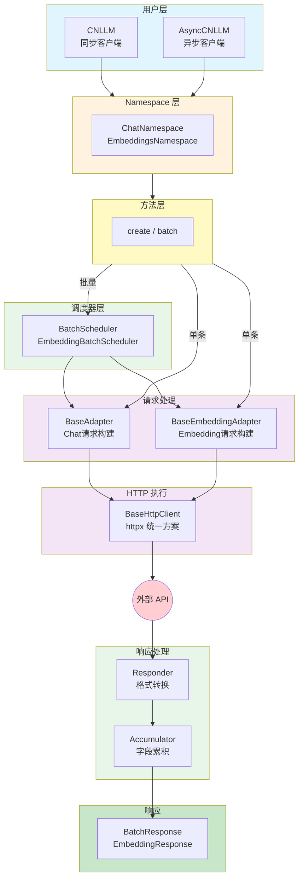
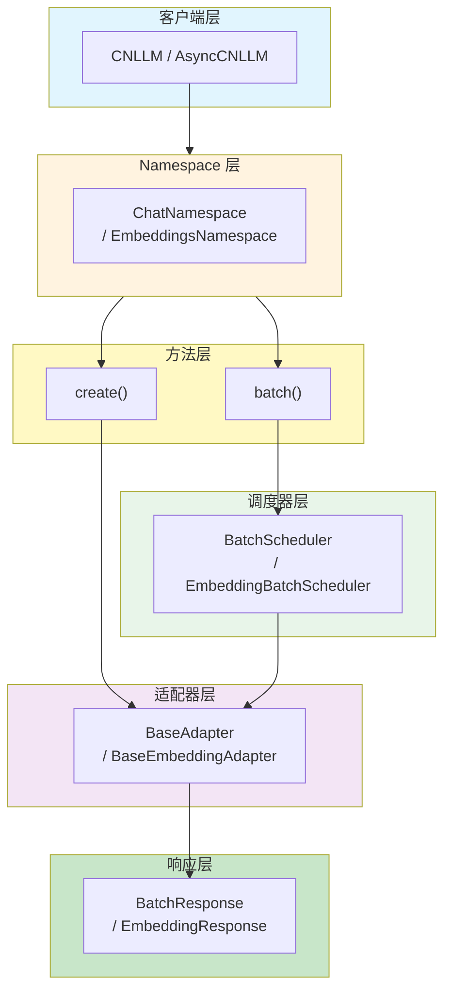
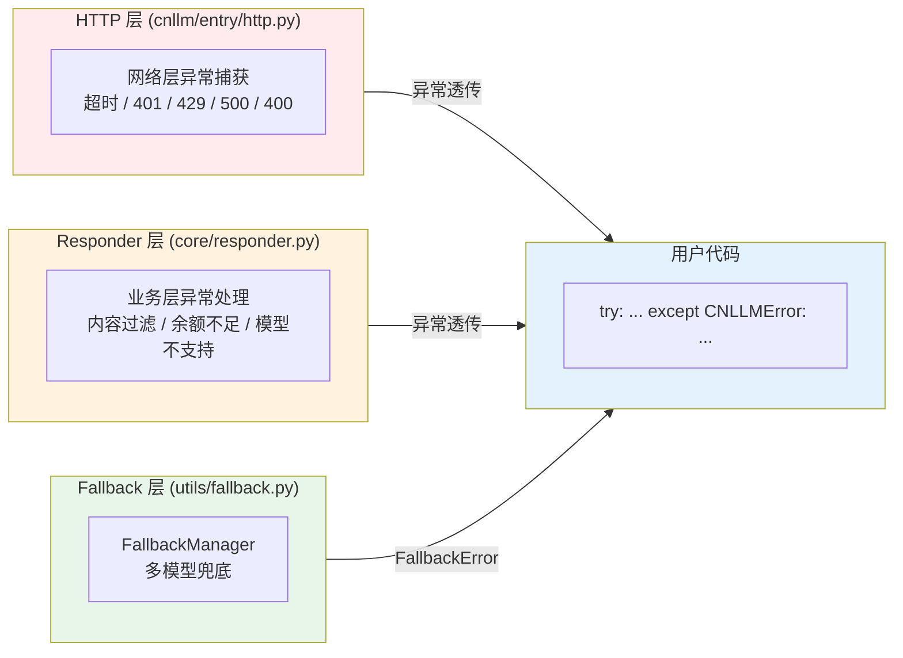
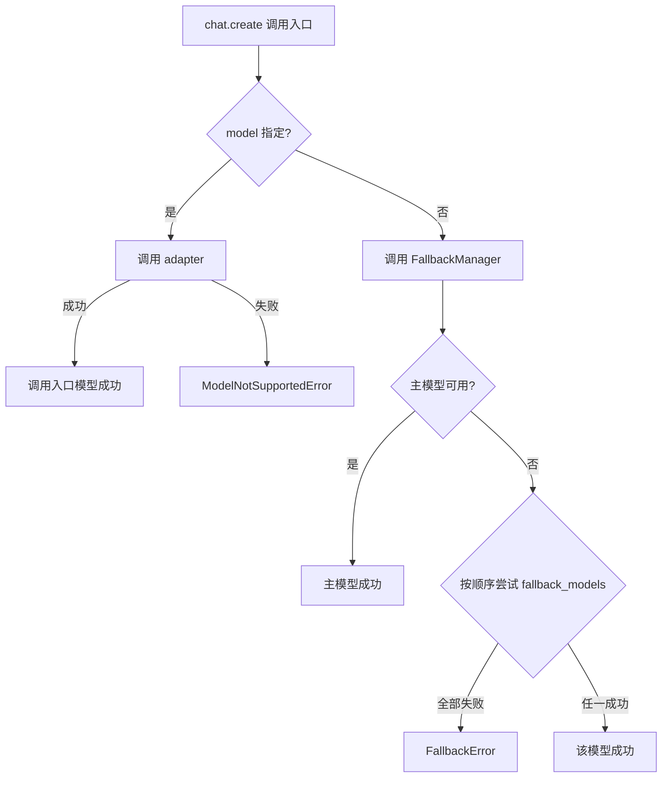
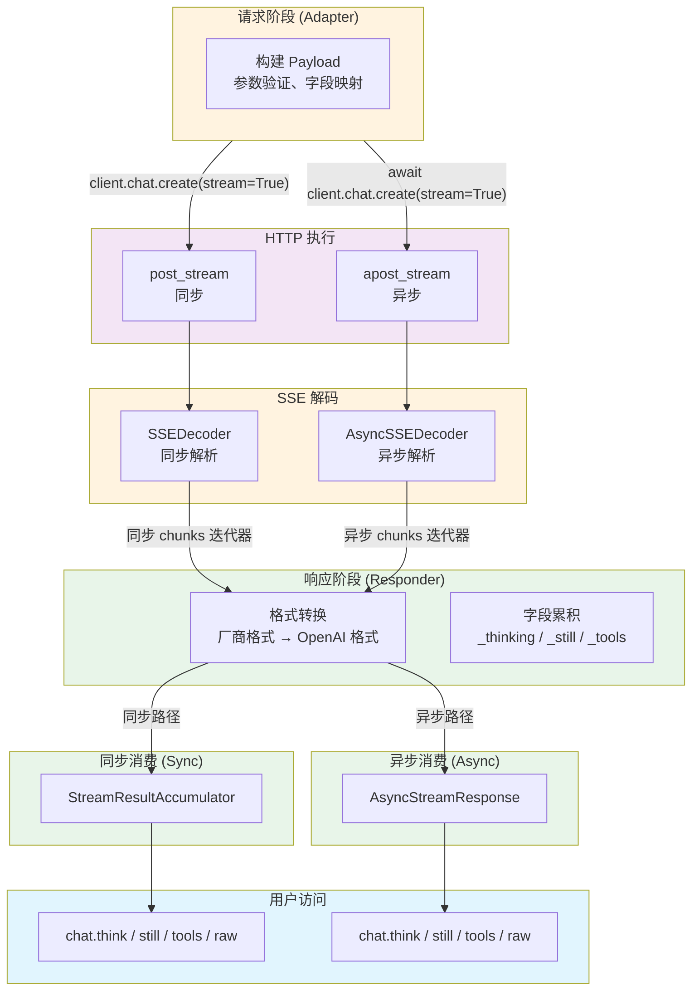
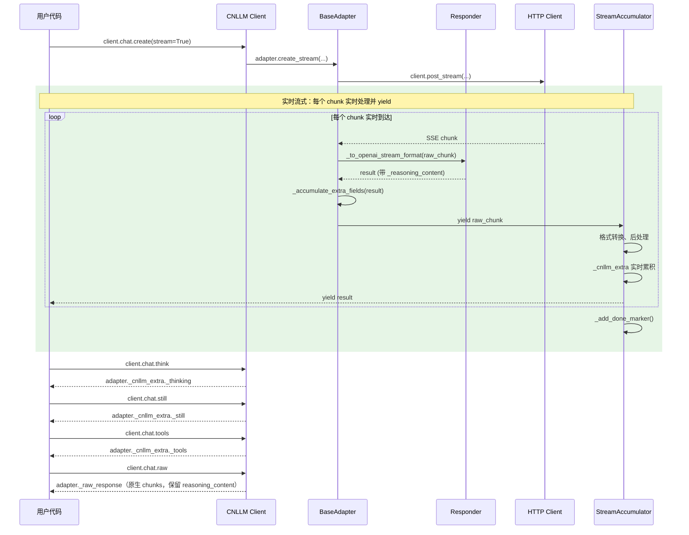
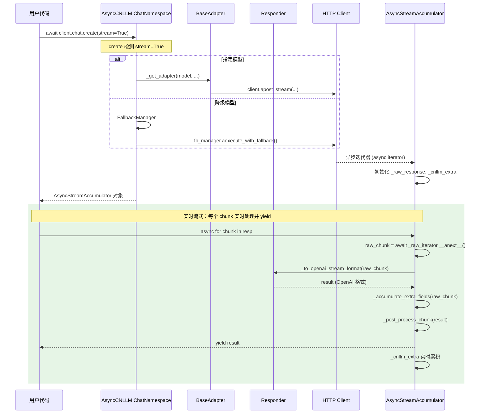

# CNLLM 架构与设计文档

## 0. 目录结构

```
cnllm/
├── entry/                    # 入口层 - 客户端初始化和调用入口
│   ├── __init__.py
│   ├── client.py             # CNLLM 主客户端类（同步）
│   ├── async_client.py       # AsyncCNLLM 异步客户端类
│   └── http.py               # HTTP 请求客户端（httpx 统一方案）
├── core/                     # 核心层 - 适配器抽象和厂商实现
│   ├── __init__.py
│   ├── adapter.py            # BaseAdapter 基础适配器（Chat）
│   ├── embedding.py          # BaseEmbeddingAdapter Embedding适配器
│   ├── responder.py          # Responder 响应格式转换框架
│   ├── accumulators/         # 字段累积器
│   │   ├── __init__.py
│   │   ├── base.py           # 累积器基类
│   │   ├── single_accumulator.py    # 单条请求累积器
│   │   ├── batch_accumulator.py     # Chat批量累积器
│   │   └── embedding_accumulator.py # Embedding批量累积器
│   ├── framework/
│   │   ├── __init__.py
│   │   └── langchain.py      # LangChain Runnable集成
│   └── vendor/               # 厂商实现
│       ├── __init__.py
│       ├── glm.py            # GLM 厂商适配器
│       ├── kimi.py           # Kimi 厂商适配器
│       ├── doubao.py         # Doubao 厂商适配器
│       ├── deepseek.py       # Deepseek 厂商适配器
│       ├── minimax.py        # MiniMax 厂商适配器
│       └── xiaomi.py         # Xiaomi 厂商适配器
└── utils/                    # 工具层 - 通用工具
    ├── __init__.py
    ├── exceptions.py         # 异常定义（含 BatchStopOnError）
    ├── fallback.py           # Fallback 管理器
    ├── batch.py              # 批量调度器（BatchScheduler, EmbeddingBatchScheduler）
    ├── stream.py             # 流式处理工具（SSEDecoder, AsyncSSEDecoder）
    ├── validator.py          # 参数验证器
    └── vendor_error.py       # 厂商错误处理

configs/
├── glm/
│   ├── request_glm.yaml
│   └── response_glm.yaml
├── kimi/
│   ├── request_kimi.yaml
│   └── response_kimi.yaml
├── doubao/
│   ├── request_doubao.yaml
│   └── response_doubao.yaml
├── deepseek/
│   ├── request_deepseek.yaml
│   └── response_deepseek.yaml
├── minimax/
│   ├── request_minimax.yaml
│   └── response_minimax.yaml
└── xiaomi/
    ├── request_xiaomi.yaml
    └── response_xiaomi.yaml
```

***

## 1. 架构设计

### 1.1 整体架构



### 1.2 通用基类架构

| 通用基类组件       | 文件                               | 职责                   | 示例                                     |
| ------------ | -------------------------------- | -------------------- | -------------------------------------- |
| **前端入口**     | `CNLLM` (entry/client.py)        | 客户端初始化、调用入口          | `CNLLM(model='glm-4')`                 |
| **异步前端入口**   | `AsyncCNLLM` (entry/async_client.py) | 异步客户端初始化、调用入口 | `AsyncCNLLM(model='kimi-k2.6')`         |
| **Chat适配器**   | `BaseAdapter` (core/adapter.py)  | Chat请求字段映射、Payload构建     | `_build_payload()`, `validate_model()` |
| **Embedding适配器** | `BaseEmbeddingAdapter` (core/embedding.py) | Embedding请求处理 | `create_batch()`                       |
| **HTTP执行**   | `BaseHttpClient` (entry/http.py) | 通用HTTP请求、重试机制（httpx）   | `post_stream()`, `apost_stream()`      |
| **响应后处理**    | `Responder` (core/responder.py)  | 响应字段映射，OpenAI 标准格式构建 | `to_openai_stream_format()`             |
| **字段累积器**    | `Accumulator` (core/accumulators/) | 统一处理字段累积（非流式/批量）   | `BatchResponse`, `EmbeddingResponse`   |

### 1.3 厂商层架构

| 厂商层组件        | 文件                        | 职责                  | 示例                                    |
| ------------ | ------------------------- | ------------------- | ------------------------------------- |
| **厂商Chat适配器** | `core/vendor/{vendor}.py` | 厂商特有Chat请求处理、Payload 构建 | `GLMAdapter.create_completion()`      |
| **厂商Embedding适配器** | `core/vendor/{vendor}.py` | 厂商Embedding请求处理 | `GLMEmbeddingAdapter.create_batch()`   |
| **厂商响应转换器**  | `core/vendor/{vendor}.py` | 厂商特有响应转换逻辑          | `GLMResponder.to_openai_format()`       |
| **厂商错误解析器**  | `core/vendor/{vendor}.py` | 厂商特有错误解析            | `GLMVendorError.parse()`               |
| **请求端配置**    | `configs/{vendor}/`       | 厂商请求字段映射、错误码映射、参数验证 | `request_{vendor}.yaml`                 |
| **响应端配置**    | `configs/{vendor}/`       | 厂商响应字段映射、流处理配置      | `response_{vendor}.yaml`               |

### 1.4 工具类架构

| 工具类          | 文件                      | 职责                   | 示例                                        |
| ------------ | ----------------------- | -------------------- | ----------------------------------------- |
| **异常系统**     | `utils/exceptions.py`   | CNLLM 异常基类，统一异常体系    | `raise CNLLMError(msg)`                   |
| **批量调度器**    | `utils/batch.py`        | Chat/Embedding批量调度    | `BatchScheduler`, `EmbeddingBatchScheduler` |
| **批量停止异常**   | `utils/exceptions.py`    | stop_on_error抛出的异常     | `BatchStopOnError`                        |
| **厂商错误翻译器**  | `utils/vendor_error.py` | 厂商错误翻译器，翻译为 CNLLM 异常 | `translator.to_cnllm_error()`             |
| **回退管理器**    | `utils/fallback.py`     | 回退管理器，处理模型不可用时的回退逻辑  | `execute_with_fallback()`                 |
| **流式处理工具**   | `utils/stream.py`       | SSE 解码、HTTP 流处理       | `SSEDecoder`, `AsyncSSEDecoder`           |
| **参数验证器**    | `utils/validator.py`    | 参数验证器，验证模型、字段、参数范围   | `validate_model()`, `validate_required()` |

***

### 1.5 调用入口层级



| 层 | 示例 |
| --- | --- |
| 客户端 | `CNLLM(model='glm-4', api_key='xxx')` |
| Namespace | `client.chat` / `client.embeddings` |
| 单条方法 | `client.chat.create(messages=[...])` |
| 批量方法 | `client.chat.batch(['hi', 'hello'])` / `embeddings.create_batch(['text1', 'text2'])` |
| 调度器 | `BatchScheduler(client, max_concurrent=5, stop_on_error=True)` |
| 适配器 | `GLMAdapter(api_key='xxx', model='glm-4')` |
| 批量响应 | `BatchResponse.total / success / fail / results` |
| Embedding响应 | `EmbeddingResponse.dimension / results` |

***

## 2. 调用参数链

### 2.1 单条调用参数链

```
用户调用 client.chat.create(timeout=60)
    ↓
Namespace.create(timeout=60)
    ↓
BaseAdapter.__init__(timeout=60)
    ↓
Adapter.validate_params(timeout=60) → filter_supported_params()
    ↓
HTTP 请求使用 self.timeout
```

### 2.2 批量调用参数链

```
用户调用 client.chat.batch(requests, timeout=60, stop_on_error=True, callbacks=[...])
    ↓
Namespace.batch(requests, timeout=60, stop_on_error=True, callbacks=[...])
    ↓
BatchScheduler(client, timeout=actual_timeout, stop_on_error=True, callbacks=[...])
    ↓
scheduler.execute() 使用内部参数
    ↓
adapter.create_completion(request) ← 不传递调度器参数
```

### 2.3 YAML 配置文件中的参数传递机制

> **参数传递顺序说明**：
>
> - 用户调用 `chat.create()` 或 `embeddings.create()` 时，adapter 类型（chat/embedding）已确定
> - `filter_supported_params` 执行后，参数已全部过滤为当前 adapter 支持的参数
> - 以下逻辑按参数处理顺序排序（从上到下）

| 序号 | 用途 | 访问点 | 判断范围 | 判断依据 | 新增参数 |
| --- | --- | --- | --- | --- | --- |
| 1 | 必填参数校验 | `validate_required_params` | required_fields | adapter 标识 + chat/embedding 层级 | - |
| 2 | 参数支持校验 | `filter_supported_params` | required_fields + optional_fields + one_of | adapter 标识 + chat/embedding 层级 | - |
| 3 | 互斥参数校验 | `validate_one_of` | one_of | adapter 标识 | - |
| 4 | 获取默认值 | `get_default_value` | 硬编码：timeout, max_retries, retry_delay | - | timeout, max_retries, retry_delay |
| 5 | 验证 base_url + 获取完整地址 | `validate_base_url` + `get_api_path` | base_url | chat/embedding 层级 | 可能新增：base_url + api_path |
| 6 | 请求头映射 | `get_header_mappings` | required_fields + optional_fields + one_of | skip: true | - |
| 7 | 构建请求体 | `_build_payload` | required_fields + optional_fields + one_of | 字段映射：不含 skip: true 且 {fields}.map | - |
| 8 | 模型名映射 | `get_vendor_model` | model_mapping | chat/embedding 层级 | - |

**判断依据说明**：

- `adapter`：字段级别的标识，如 `adapter: [chat]` 或 `adapter: [embedding]`
- `chat`/`embedding` 层级：字段下有 `chat:` 或 `embedding:` 子层级的配置（如 `base_url`）

### 2.4 Batch 参数验证链条

Batch 调用支持三种输入模式，其参数验证分为 Batch 层 → Scheduler 层 → Create 层三层职责，各司其职。

#### 2.4.1 三层职责划分

```mermaid
flowchart TB
    subgraph batch_layer["Batch 层（_normalize_batch_requests — batch.py）"]
        direction TB
        BL_INPUT[batch kwargs: thinking, tools, max_concurrent, timeout...]
        BL_SPLIT{按 BATCH_LEVEL_KEYS 分离}
        BL_PER[per_request_defaults<br/>thinking, tools, temperature...]
        BL_BATCH_LEVEL[batch_level_kwargs<br/>max_concurrent, rps, timeout...]
        BL_VALIDATE[互斥验证 / 空值过滤 / 必填检查 / 误传警告]
        BL_OUTPUT[规范化的 per-request 列表]
        BL_INPUT --> BL_SPLIT
        BL_SPLIT --> BL_PER
        BL_SPLIT --> BL_BATCH_LEVEL
        BL_VALIDATE --> BL_OUTPUT
    end

    subgraph scheduler_layer["Scheduler 层（_execute_single — batch.py）"]
        direction TB
        SCH_MERGE[合并 timeout / max_retries / retry_delay<br/>per-request 优先]
        SCH_INPUT[per_request_defaults]
        SCH_FILTER[_input_type 过滤]
        SCH_BATCH[batch_level_kwargs → BatchScheduler]
        SCH_OUTPUT[完整请求参数]
        SCH_INPUT --> SCH_MERGE --> SCH_FILTER --> SCH_OUTPUT
        SCH_BATCH
    end

    subgraph create_layer["Create 层（client.py → adapter.py → validator.py）"]
        direction TB
        CR_ADAPTER[adapter.create_completion]
        CR_YAML[YAML 验证流水线]
        CR_HTTP[HTTP 请求]
        SCH_OUTPUT --> CR_ADAPTER --> CR_YAML --> CR_HTTP
        SCH_BATCH -.->|不进入此路径| CR_ADAPTER
    end

    batch_kwargs["batch kwargs"] --> BL_INPUT
    requests_arg[requests=[{...}, {...}]] --> BL_VALIDATE
    prompt["prompt=[...]"] --> BL_VALIDATE
    messages["messages=[...]"] --> BL_VALIDATE

    style BL_BATCH fill:#f9f,stroke:#333,stroke-width:1px
    style SCH_BATCH fill:#f9f,stroke:#333,stroke-width:1px
    style create_layer fill:#d4f1be,stroke:#333,stroke-width:1px
    style batch_layer fill:#ffe4b5,stroke:#333,stroke-width:1px
    style scheduler_layer fill:#bde0fe,stroke:#333,stroke-width:1px
```

#### 2.4.2 Batch 参数分类

Batch 参数分为两类，**性质完全不同**，处理方式也完全不同：

| 类别 | 参数 | 性质 | 处理方式 |
|------|------|------|---------|
| **Per-Request** | `prompt`/`messages`、`thinking`、`tools`、`temperature`、`max_tokens`、`top_p`、`stop`、`model`、`stream`、`timeout`、`max_retries`、`retry_delay` | 描述「发给 API 的数据」 | 进入请求 dict → create() → YAML 验证 |
| **Batch-Level** | `max_concurrent`、`rps`、`stop_on_error`、`callbacks`、`custom_ids` | 描述「如何调度这些请求」 | **不进请求 dict** → 直接用于 BatchScheduler，不传给 create() |

> **关键原则**：Batch-Level 参数不需要、不应该、不必要进入 YAML。YAML 描述的是「外部 API 接口规范」，Batch-Level 参数描述的是「客户端调度行为」，两者职责不同。

#### 2.4.3 源头分离机制

所有 `kwargs` 在 `batch()` 入口处按 `BATCH_LEVEL_KEYS` 集合分为两组：

```python
BATCH_LEVEL_KEYS = frozenset({
    "max_concurrent", "rps", "stop_on_error",
    "callbacks", "custom_ids",
})

per_request_defaults = {k: v for k, v in kwargs.items() if k not in BATCH_LEVEL_KEYS}
batch_level_kwargs  = {k: v for k, v in kwargs.items() if k in BATCH_LEVEL_KEYS}

# per_request_defaults 进入请求 dict → create() → YAML 验证
# batch_level_kwargs 用于 BatchScheduler → 绝不进入请求 dict
```

#### 2.4.4 Per-Request 参数优先级

每个请求的最终参数由三层优先级决定：

```
Per-Request 独立参数（requests[i]） > Batch 全局默认值（batch kwargs） > Adapter YAML 默认值
```

实现逻辑（Scheduler 层）：

```python
# 仅在 per-request 不存在时才填入 batch 级默认值
if 'timeout' not in request and self.timeout is not None:
    request['timeout'] = self.timeout
if 'max_retries' not in request and self.max_retries is not None:
    request['max_retries'] = self.max_retries
```

#### 2.4.5 内部字段过滤（_input_type）

`_normalize_batch_requests()` 为每个请求添加 `_input_type` 内部字段（`"prompt"` / `"messages"`），用于标识输入类型。

此字段在传入 `create()` 前通过字典推导式过滤：

```python
# Scheduler 层（_execute_single）
request_clean = {k: v for k, v in request.items() if k != "_input_type"}
response = self.client.chat.create(**request_clean)
```

#### 2.4.6 Per-Request 误传 Batch-Level 参数的警告

如果用户在 `requests` 列表的 dict 中误传了 Batch-Level 参数（如 `requests=[{"prompt": "A", "max_concurrent": 5}]`），会在 `normalize_batch_requests()` 中产生**引导性警告**，而非通用的"参数不支持"警告：

```
WARNING: batch() 参数 'max_concurrent' 在 requests[0] 中未生效。
请在 batch() 全局参数中配置 'max_concurrent'，例如: batch(..., max_concurrent=5)
```

这使用户能正确理解参数应该放在 batch() 的哪个层级配置。

#### 2.4.7 三种输入模式

| 模式 | 示例 | 内部处理 |
|------|------|---------|
| `prompt=["A", "B"]` | 老用法，向后兼容 | 包装成 `[{prompt: "A"}, {prompt: "B"}]` |
| `messages=[[{...}], [{...}]]` | 老用法，向后兼容 | 包装成 `[{messages: [...]}, ...]` |
| `requests=[{...}, {...}]` | **新用法** | 直接使用，合并 per-request 默认值 |

## 3. 异常处理系统架构



### 3.1 错误分类与处理职责

| 错误类型             | 发生场景        | 处理组件        |
| ---------------- | ----------- | ----------- |
| 网络不可达、连接超时       | 发送请求前       | HTTP 层      |
| API Key 错误 (401) | 请求到达服务器前    | HTTP 层      |
| 限流 (429)         | 请求到达服务器前    | HTTP 层      |
| 模型不存在、参数错误 (400) | 请求到达服务器后    | HTTP 层      |
| 服务器错误 (>=500)    | 请求到达服务器后    | HTTP 层      |
| 业务错误 (敏感词、余额不足)  | 模型处理后       | Responder 层 |
| 模型不支持            | 参数验证阶段      | Responder 层 |
| 所有模型均失败          | Fallback 机制 | Fallback 层  |

## 4. FallbackManager 流程设计

只有客户端初始化入口接受配置`fallback_models`参数，为追求程序或应用运行时的稳定性建议配置此项。
当客户端入口处的主模型不可用时，会按顺序尝试`fallback_models`中的模型。
代码示例：

```python
client = CNLLM(
    model="minimax-m2.7", api_key="minimax_key", 
    fallback_models={"mimo-v2-flash": "xiaomi-key", "minimax-m2.5": None}  # None 表示使用主模型配置的 API_key
    )   
resp = client.chat.create(prompt="2+2等于几？")  # 调用入口如再次配置模型，将会覆盖客户端入口处配置的所有模型
print(resp)
````



### 4.1 FallbackError 错误聚合

当配置多模型 fallback 且所有模型都失败时，`FallbackError` 会聚合所有错误信息：

```python
try:
    client = CNLLM(
        model="primary-model",
        api_key="key",
        fallback_models={"backup-1": "key1", "backup-2": "key2"}
    )
    client.chat.create(messages=[...])
except FallbackError as e:
    print(e.message)  # "所有模型均失败。已尝试: primary-model, backup-1, backup-2"
    for i, err in enumerate(e.errors):
        print(f"[{i+1}] {err}")  # 每个模型的详细错误
```

***

## 5. 流式处理系统架构

### 5.1 整体处理流程



#### 同步 vs 异步调用对比

| 维度 | 同步调用 | 异步调用 |
| ---- | -------- | -------- |
| 入口 | `client.chat.create(stream=True)` | `await client.chat.create(stream=True)` |
| HTTP | `post_stream()` | `apost_stream()` |
| SSE 解码 | `SSEDecoder` (同步) | `AsyncSSEDecoder` (异步) |
| 消费层 | `StreamAccumulator` | `AsyncStreamAccumulator` |
| 迭代方式 | `for chunk in response` | `async for chunk in response` |
| 客户端类 | `CNLLM` | `AsyncCNLLM` |

### 5.2 组件职责说明

#### 请求阶段（Adapter）

| 方法 | 职责 |
| ---- | ---- |
| `_validate_required_params()` | 必填参数验证 |
| `_filter_supported_params()` | 过滤支持参数 |
| `get_vendor_model()` | 获取厂商模型名 |
| `_build_payload()` | 构建请求 Payload |
| `create_completion()` | 同步调用入口 |
| `acreate_completion()` | 异步调用入口 |
| `_handle_stream()` / `_ahandle_stream()` | 返回原始 chunks 迭代器 |

#### 响应处理（流式）

| 组件 | 文件 | 职责 |
| ---- | ---- | ---- |
| **StreamAccumulator** | `utils/accumulator.py` | 内部调用 `adapter._to_openai_stream_format()` 格式转换，累积字段到 `adapter._cnllm_extra`，后处理（去重、过滤 DONE） |
| **AsyncStreamAccumulator** | `utils/accumulator.py` | 异步版本：同样逻辑 |
| **StreamHandler** | `utils/stream.py` | 只返回原始 chunks（不进行格式转换） |
| **AsyncStreamHandler** | `utils/stream.py` | 异步版本：只返回原始 chunks |
| **SSEDecoder** | `utils/stream.py` | 解析 SSE，`data: {...}` → JSON |
| **AsyncSSEDecoder** | `utils/stream.py` | 异步解析 SSE |

#### 格式转换（Adapter → Responder）

| 方法 | 职责 | 归属 |
| ---- | ---- | ---- |
| `_to_openai_format()` | 非流式格式转换 | 子类实现 |
| `_to_openai_stream_format()` | 流式格式转换（调用 `_do_to_openai_stream_format`） | Adapter |
| `_do_to_openai_stream_format()` | 厂商特定格式转换逻辑 | 子类实现 |

#### 用户访问

| 组件 | 文件 | 职责 |
| ---- | ---- | ---- |
| **client.chat.think** | `entry/client.py` / `entry/async_client.py` | 返回 `_thinking` |
| **client.chat.still** | `entry/client.py` / `entry/async_client.py` | 返回 `_still` |
| **client.chat.tools** | `entry/client.py` / `entry/async_client.py` | 返回 `_tools` |
| **client.chat.raw** | `entry/client.py` / `entry/async_client.py` | 返回原生响应 chunks |

### 5.3 实时流式模式

`StreamAccumulator` 采用**实时流式**模式，每个 chunk 在到达时立即 yield 给用户：

```python
def __iter__(self):
    for raw_chunk in self._raw_iterator:
        result = self._adapter._to_openai_stream_format(raw_chunk)
        self._accumulate_extra_fields(result)
        self._post_process_chunk(result)
        self._chunks.append(result)
        self._adapter._raw_response["chunks"].append(clean_for_raw)
        yield result  # 实时 yield，不等待所有 chunks
    self._done = True
    self._add_done_marker()
```

**特性**：

- 用户迭代 `for chunk in response` 时，每个 chunk **实时到达**（无需等待整个 HTTP 流完成）
- `_cnllm_extra` 和 `_raw_response["chunks"]` 在迭代过程中**实时累积**
- 适合前端流式渲染等需要实时消费的场景

累积在**两个地方**同时进行：

1. **StreamAccumulator 层** (`_accumulate_extra_fields`)：累积到 `adapter._cnllm_extra`
   - 供 `client.chat.think/still/tools` 属性访问
2. **StreamAccumulator 层**：实时存储完整的原始响应到 `adapter._raw_response["chunks"]`
   - 供 `client.chat.raw` 属性访问，保留所有字段，不进行过滤

| 字段类型         | 示例                            | 处理规则   | 说明                     |
| ------------ | ----------------------------- | ------ | ------------------------ |
| 最终累积字段       | `_thinking`、`_still`、`_tools` | **累积** | 存储到 `adapter._cnllm_extra`，供 `client.chat.think/still/tools` 访问   |
| 标准 OpenAI 字段 | `id`、`choices`、`delta` 等      | **保留** | `.raw` 保留完整原始响应 |
| 原生响应特有字段       | `reasoning_content`等    | **保留** | `.raw` 保留完整原始响应 |

**说明**：
- `.raw` 属性现在返回完整的原始响应，不进行任何过滤
- 字段提取仍然进行，为 `.think`、`.still` 和 `.tools` 属性服务

### 5.4 Chunk 后处理规则（StreamAccumulator）

在迭代过程中逐个 chunk 执行后处理：

```python
# 1. 每个 chunk 实时过滤重复 choice.index 的 role 字段（保持 OpenAI 兼容性）
if choice_idx in self._seen_choice_indices:
    if "role" in delta:
        del delta["role"]
else:
    self._seen_choice_indices.add(choice_idx)

# 2. 每个 chunk 实时过滤重复 tool_calls.index 的 id/type/name 字段（OpenAI 流式标准）
if "tool_calls" in delta:
    for tc in delta["tool_calls"]:
        idx = tc.get("index")
        if idx in self._seen_tool_call_indices:
            tc.pop("id", None)
            tc.pop("type", None)
            if "function" in tc and "name" in tc["function"]:
                del tc["function"]["name"]
        else:
            self._seen_tool_call_indices.add(idx)

# 3. 流结束时移除重复的 finish_reason chunk（只保留第一个）
def _remove_duplicate_finish_chunks(self):
    finish_indices = [i for i, chunk in enumerate(self._chunks)
                      if is_finish_chunk(chunk)]
    if len(finish_indices) > 1:
        for idx in reversed(finish_indices[1:]):
            self._chunks.pop(idx)
```

流式响应中，以下字段按 index 过滤以符合 OpenAI 标准：

**`delta.role` 过滤规则**
- 按 `choice.index` 判断
- 首次出现的 `choice.index` → **保留** `role: assistant`
- 同一 `choice.index` 再次出现 → **删除** `role`

**`tool_calls` 过滤规则**
- 按 `tool_calls[].index` 判断
- 首次出现的 `tool_calls[].index` → **保留** `id`、`type`、`function.name`、`arguments`
- 同一 `tool_calls[].index` 再次出现 → **只保留** `index` 和 `function.arguments`

> **独立性**：`choice.index`（第几条消息）和 `tool_calls.index`（第几个工具）完全独立，互不影响。

**终止符 chunk**
- `[DONE]` 是 SSE 流的内部终止协议（OpenAI 原始 SSE 流的一部分）
- 国内厂商可能没有 `[DONE]`，SDK 内部兜底添加以确保迭代器能正常终止
- **对外暴露时过滤**：`__next__()` 和 `get_chunks()` 会过滤掉 `[DONE]` 字符串，只返回纯 JSON chunks
- 这样设计是为了兼容 LangChain、LiteLLM 等 OpenAI 兼容库的期望（它们期望纯 JSON chunks）

### 5.5 同步数据流时序图



### 5.6 异步数据流时序图



## 6. CNLLM 标准响应格式

系统支持 8 种响应类型，根据 3 个维度组合：

| 维度 | 选项 |
| ---- | ---- |
| 调用方式 | 同步 / 异步 |
| 流式模式 | 流式 / 非流式 |
| 批量模式 | 批量 / 非批量 |

### 6.1 响应类型总览

| # | 类型 | 返回类型 | 累积器类 |
|---|------|----------|----------|
| 1 | 同步非流式非批量 | `Dict` | `NonStreamAccumulator` |
| 2 | 同步流式非批量 | `Iterator[Dict]` | `StreamAccumulator` |
| 3 | 同步非流式批量 | `BatchResponse` | `BatchNonStreamAccumulator` |
| 4 | 同步流式批量 | `Iterator[Dict]` | `BatchStreamAccumulator` |
| 5 | 异步非流式非批量 | `Dict` | `AsyncNonStreamAccumulator` |
| 6 | 异步流式非批量 | `AsyncIterator[Dict]` | `AsyncStreamAccumulator` |
| 7 | 异步非流式批量 | `BatchResponse` | `AsyncBatchNonStreamAccumulator` |
| 8 | 异步流式批量 | `AsyncIterator[Dict]` | `AsyncBatchStreamAccumulator` |
| 9 | 同步非批量Embeddings | `Dict` | `EmbeddingAccumulator` |
| 10 | 同步批量Embeddings | `EmbeddingResponse` | `EmbeddingBatchAccumulator` |
| 11 | 异步非批量Embeddings | `Dict` | `AsyncEmbeddingAccumulator` |
| 12 | 异步批量Embeddings | `EmbeddingResponse` | `AsyncEmbeddingBatchAccumulator` |

### 6.2 非批量响应类型

#### 类型 1、5: 同步/异步非流式非批量
```python
# 返回格式: Dict (OpenAI 标准格式)
{
    "id": "chatcmpl-xxx",
    "object": "chat.completion",
    "created": 1234567890,
    "model": "minimax-m2.7",
    "choices": [{
        "index": 0,
        "message": {
            "role": "assistant",
            "content": "这是回复内容"
        },
        "finish_reason": "stop"
    }],
    "usage": {
        "prompt_tokens": 5,
        "completion_tokens": 4,
        "total_tokens": 9
    }
}
```

#### 类型 2、6: 同步/异步流式非批量
```python
# 返回格式: Iterator[Dict] / AsyncIterator[Dict]
# 开始 chunk:
{
    "id": "chatcmpl-xxx",
    "object": "chat.completion.chunk",
    "created": 1234567890,
    "model": "minimax-m2.7",
    "choices": [{
        "index": 0,
        "delta": {
            "role": "assistant",
            "content": "部分内容"
        },
        "finish_reason": None
    }]
},

# 中间 chunk:
{
    "id": "chatcmpl-xxx",
    "object": "chat.completion.chunk",
    "created": 1234567890,
    "model": "minimax-m2.7",
    "choices": [{
        "index": 0,
        "delta": {
            "content": "更多内容"
        },
        "finish_reason": None
    }]
},

# 最后一个 chunk:
{
    "id": "chatcmpl-xxx",
    "choices": [{
        "index": 0,
        "delta": {},
        "finish_reason": "stop"
    }]
}
```

### 6.3 批量响应类型

#### 类型 3、7: 同步/异步非流式批量
```python
# 返回格式: BatchResponse
{
    "success": ["request_0", "request_1"],  # 成功的 request_id 列表
    "fail": [],                                 # 失败的 request_id 列表
    "request_counts": {
        "success_count": 2,
        "fail_count": 0,
        "total": 2
    },
    "elapsed": 0.35,
    "results": {
        "request_0": {                 # "request_0" 成功的单次响应
            "id": "chatcmpl-xxx",        # 单次调用的内层结构 同类型 1、5 中的 Dict
            "object": "chat.completion",
            "created": 1742112345,
            "model": "deepseek-chat",
            "choices": [{
                "index": 0,
                "message": {
                    "role": "assistant",
                    "content": "回复内容"
                },
                "finish_reason": "stop"
            }],
            "usage": {
                "prompt_tokens": 5,
                "completion_tokens": 4,
                "total_tokens": 9
            }
        },
        "request_1": {                 # "request_1" 失败的单次响应
            "error": {
                "index": 1,
                "code": "invalid_request",
                "message": "参数错误"
            }
        }
    },
    "think": {"request_0": "...", "request_1": "..."},
    "still": {"request_0": "...", "request_1": "..."},
    "tools": {"request_0": [...], "request_1": [...]},
    "raw": {"request_0": {...}, "request_1": {...}}
}

# 批量响应访问：
result.results
# 所有响应带request_id列表，['request_0': {...}, 'request_1': {...}, ...]

# print 输出（简洁统计，不显示大文本）:
print(result)
# BatchResponse(request_counts={...}, elapsed=..., success=[...], errors=[...])

# 转换为标准 JSON:
result.to_dict()                        # 只保留 results (默认)
result.to_dict(stats=True)              # results + 统计字段 (success/errors/request_counts/elapsed)
result.to_dict(think=True, still=True, tools=True, raw=True)  # results + 相应字段
```

#### 类型 4、8: 同步/异步流式批量
```python
# 返回类型: Iterator[Dict] / AsyncIterator[Dict]

{
    "success": ["request_0"],
    "fail": ["request_1"],
    "request_counts": {"success_count": 1, "fail_count": 1, "total": 2},
    "elapsed": 0.42,
    "results": {
        "request_0": [                  # "request_0" 成功的单次响应的 chunks 列表
            {"id": "chatcmpl-batch-xxx",
            "object": "chat.completion.chunk",
            "model": "deepseek-chat",
            "choices": [{
                "index": 0,
                "delta": {"role": "assistant"},
                "finish_reason": null}]},
            {...,
            "choices": [{
                "index": 0,
                "delta": {"content": "你好"},
                "finish_reason": null}]},
            {...,
            "choices": [{
                "index": 0,
                "delta": {},
                "finish_reason": "stop"}]
            }],
        "request_1": [{                 # "request_1" 失败的单次响应
            "error": {
                "index": 1,
                "code": "invalid_request",
                "message": "参数错误"
            }
        }],
    },
    "think": {"request_0": "...", "request_1": "..."},
    "still": {"request_0": "...", "request_1": "..."},
    "tools": {"request_0": [...], "request_1": [...]},
    "raw": {"request_0": {...}, "request_1": {...}}
}

# 开启迭代：
accumulator = client.chat.batch(requests, stream=True)
for chunk in accumulator:
    pass
batch_response = accumulator._batch_response

# 批量响应访问：
batch_response.results
# 所有响应带request_id列表，['request_0': {...}, 'request_1': {...}, ...]

# print 输出（简洁统计，不显示大文本）:
print(batch_response)
# BatchResponse(request_counts={...}, elapsed=..., success=[...], errors=[...])

# 转换为标准 JSON:
batch_response.to_dict()                        # 只保留 results (默认)
batch_response.to_dict(stats=True)              # results + 统计字段 (success/errors/request_counts/elapsed)
batch_response.to_dict(think=True, still=True,...)  # results + think/still/tools/raw
```

### 6.5 字段访问

### 非批量调用 类型1/2/5/6 字段详情

| 类别 | 访问方式 | 返回格式 | 返回示例 |
|------|---------|---------|---------|
| **think** | `resp.think` / `client.chat.think` | `str` | `"推理内容..."` |
| **still** | `resp.still` / `client.chat.still` | `str` | `"回复内容..."` |
| **tools** | `resp.tools` / `client.chat.tools` | `Dict[int, Dict]` | `{0: {"id": "...", "function": {...}}, 1: {...}` |
| **raw** | `resp.raw` / `client.chat.raw` | `Dict` | `{"id": "...", "choices": [...], ...}` |

### 批量调用 类型3/4/7/8 字段详情

| 类别 | 访问方式 | 返回格式 | 返回示例 |
|------|---------|---------|---------|
| **统计字段** | `resp.success` / `batch_result.success` | `List[str]` | `["request_0", "request_1"]` |
| | `resp.fail` / `batch_result.fail` | `List[str]` | `[]` |
| | `resp.request_counts` / `batch_result.request_counts` | `Dict` | `{"success_count": 2, "fail_count": 0, "total": 2}` |
| | `resp.elapsed` / `batch_result.elapsed` | `float` | `1.23` |
| **results** | `resp.results` / `batch_result.results` | `Dict[str, Dict]` | `{"request_0": {...}, "request_1": {...}}` |
| | `resp.results[0]` / `batch_result.results[0]` | `Dict` | `{"id": "...", "choices": [...], ...}` |
| | `resp.results["request_0"]` / `batch_result.results["request_0"]` | `Dict` | 同上 |
| **think** | `resp.think` / `batch_result.think` | `Dict[str, str]` | `{"request_0": "...", "request_1": "..."}` |
| | `resp.think[0]` / `batch_result.think[0]` | `str` | `"推理内容..."` |
| | `resp.think["request_0"]` / `batch_result.think["request_0"]` | `str` | `"推理内容..."` |
| **still** | `resp.still` / `batch_result.still` | `Dict[str, str]` | `{"request_0": "...", "request_1": "..."}` |
| | `resp.still[0]` / `batch_result.still[0]` | `str` | `"回复内容..."` |
| | `resp.still["request_0"]` / `batch_result.still["request_0"]` | `str` | `"回复内容..."` |
| **tools** | `resp.tools` / `batch_result.tools` | `Dict[str, Dict[int, Dict]]` | `{"request_0": {...}, "request_1": {...}}` |
| | `resp.tools[0]` / `batch_result.tools[0]` | `Dict[int, Dict]` | `{0: {"id": "...", "function": {...}}, 1: {...}` |
| | `resp.tools["request_0"]` / `batch_result.tools["request_0"]` | `Dict[int, Dict]` | 同上 |
| **raw** | `resp.raw` / `batch_result.raw` | `Dict[str, Dict]` | `{"request_0": {...}, "request_1": {...}}` |
| | `resp.raw[0]` / `batch_result.raw[0]` | `Dict` | `{"id": "...", "choices": [...], ...}` |
| | `resp.raw["request_0"]` / `batch_result.raw["request_0"]` | `Dict` | 同上 |

### 批量调用类型 10/12 Embedding 响应字段详情

| 类别 | 访问方式 | 返回格式 | 返回示例 |
|------|---------|---------|---------|
| **统计字段** | `resp.success` / `batch_result.success` | `List[str]` | `["request_0", "request_1"]` |
| | `resp.fail` / `batch_result.fail` | `List[str]` | `["request_2"]` |
| | `resp.success_count` / `batch_result.success_count` | `int` | `2` |
| | `resp.fail_count` / `batch_result.fail_count` | `int` | `1` |
| | `resp.request_counts` / `batch_result.request_counts` | `Dict` | `{"total": 2, "success_count": 2, "fail_count": 0, "dimension": 1024}` |
| | `resp.elapsed` / `batch_result.elapsed` | `float` | `1.23` |
| | `resp.total` / `batch_result.total` | `int` | `2` |
| | `resp.dimension` / `batch_result.dimension` | `int` | `1024` |
| **results** | `resp.results` / `batch_result.results` | `Dict[str, Dict]` | `{"request_0": {...}, "request_1": {...}}` |
| | `resp.results[0]` / `batch_result.results[0]` | `Dict` | `{"object": "list", "data": [...], ...}` |
| | `resp.results["request_0"]` / `batch_result.results["request_0"]` | `Dict` | 同上 |
| **repr** | `repr(resp)` / `repr(batch_result)` | `str` | `EmbeddingResponse(success=['request_0'], fail=['request_2'], request_counts={'total': 2, 'dimension': 1024}, elapsed=1.23)` |
| **to_dict** | `resp.to_dict()` | `Dict` | `{"results": {...}}` |
| | `resp.to_dict(results=False)` | `Dict` | `{}` |
| | `resp.to_dict(stats=True)` | `Dict` | `{"results": {...}, "request_counts": {...}, "elapsed": ..., "success": [...], "fail": [...]}` |

## 7. 批量调用系统架构

见 [批量调用系统架构](/feature/batch.md)

## 8. 异步实现说明

见 [异步实现说明](/feature/async.md)

## 9. Embedding实现说明

见 [Embedding实现说明](/feature/embedding.md)
