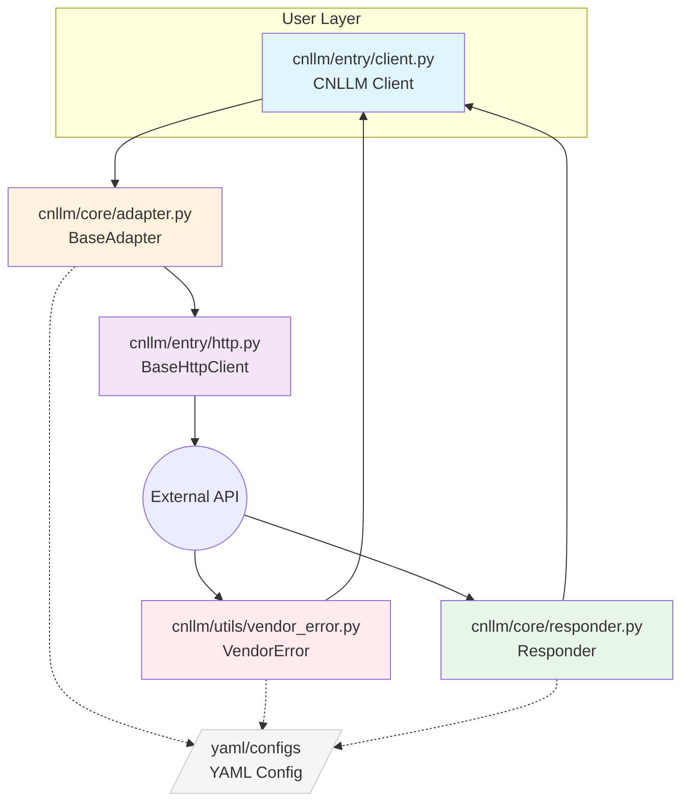
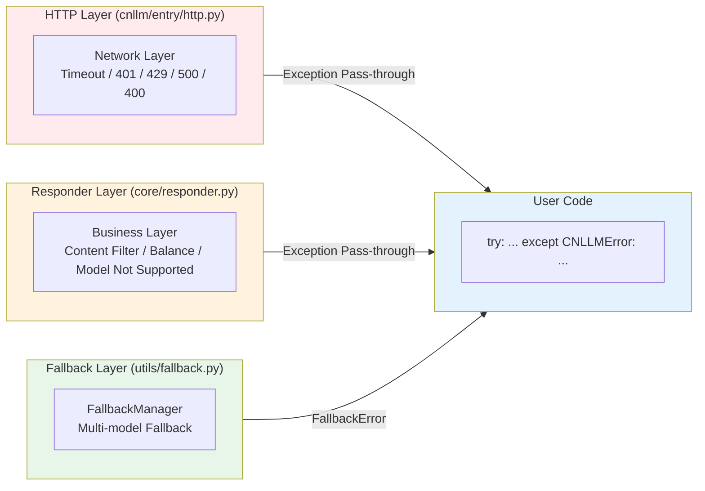
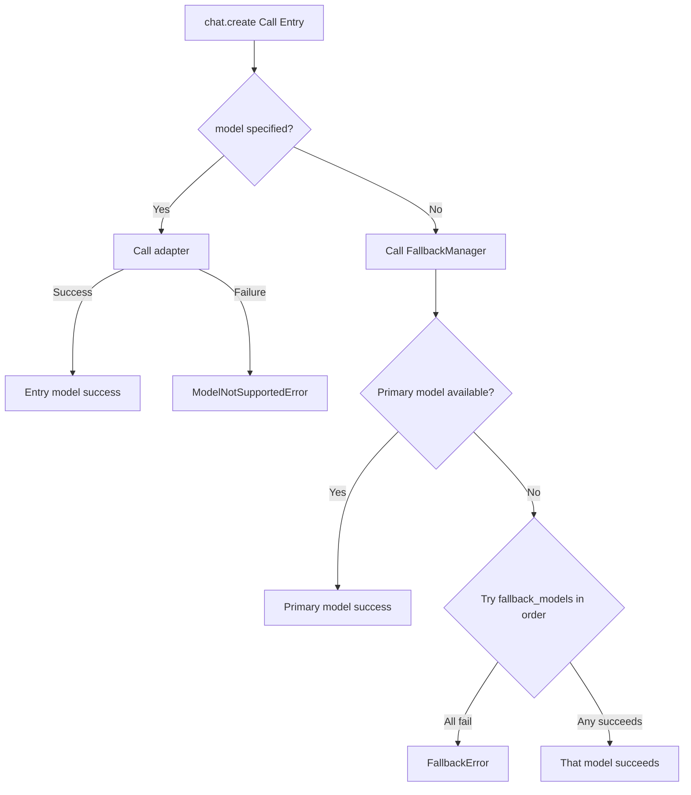

# CNLLM Architecture and Design Documentation

## 1. Architecture Design

### 1.1 Overall Architecture



### 1.2 General Base Class Architecture

| Base Class Component | File | Responsibility | Example |
| --- | --- | --- | --- |
| **Frontend Entry** | `CNLLM` (entry/client.py) | Client initialization, call entry | `CNLLM(model='minimax-m2.7')` |
| **Request Preprocessing** | `BaseAdapter` (core/adapter.py) | Request field mapping, Payload construction | `_build_payload()`, `validate_model()` |
| **HTTP Execution** | `BaseHttpClient` (entry/http.py) | Generic HTTP request, retry mechanism | `post_stream()`, `post()` |
| **Response Postprocessing** | `Responder` (core/responder.py) | Response field mapping, OpenAI standard format construction | `to_openai_stream_format()` |

### 1.2 Vendor Layer Architecture

| Vendor Layer Component | File | Responsibility | Example |
| --- | --- | --- | --- |
| **Vendor Adapter** | `core/vendor/{vendor}.py` | Vendor-specific request handling, Payload construction | `MiniMaxAdapter.create_completion()` |
| **Vendor Response Converter** | `core/vendor/{vendor}.py` | Vendor-specific response conversion logic | `MiniMaxResponder.to_openai_format()` |
| **Vendor Error Parser** | `core/vendor/{vendor}.py` | Vendor-specific error parsing | `MiniMaxVendorError.parse()` |
| **Request Config** | `configs/{vendor}/` | Vendor request field mapping, error code mapping, param validation | `request_{vendor}.yaml` |
| **Response Config** | `configs/{vendor}/` | Vendor response field mapping, stream processing config | `response_{vendor}.yaml` |

### 1.3 Utility Class Architecture

| Utility Class | File | Responsibility | Example |
| --- | --- | --- | --- |
| **Exception System** | `utils/exceptions.py` | CNLLM exception base class, unified exception system | `raise CNLLMError(msg)` |
| **Vendor Error Translator** | `utils/vendor_error.py` | Vendor error translator, translate to CNLLM exception | `translator.to_cnllm_error()` |
| **Fallback Manager** | `utils/fallback.py` | Fallback manager, handle model unavailability fallback logic | `execute_with_fallback()` |
| **Streaming Utility** | `utils/stream.py` | Streaming utility, handle streaming response | `process_stream_chunk()` |
| **Parameter Validator** | `utils/validator.py` | Parameter validator, validate model, field, param range | `validate_model()`, `validate_required()` |

***

## 2. Directory Structure

```
cnllm/
├── entry/                    # Entry Layer - Client initialization and call entry
│   ├── __init__.py
│   ├── client.py             # CNLLM main client class
│   └── http.py               # HTTP request client
├── core/                     # Core Layer - Adapter abstraction and vendor implementation
│   ├── __init__.py
│   ├── adapter.py            # BaseAdapter base adapter
│   ├── responder.py          # Responder response transformation framework
│   ├── framework/
│   │   ├── __init__.py
│   │   └── langchain.py      # LangChain Runnable integration
│   └── vendor/               # Vendor implementation
│       ├── __init__.py
│       ├── minimax.py        # MiniMax vendor adapter
│       └── xiaomi.py         # Xiaomi vendor adapter
└── utils/                    # Utility Layer - Common utilities
    ├── __init__.py
    ├── exceptions.py         # Exception definitions
    ├── fallback.py           # Fallback manager
    ├── stream.py             # Streaming utility
    ├── validator.py          # Parameter validator
    └── vendor_error.py       # Vendor error handling

configs/
├── minimax/
│   ├── request_minimax.yaml  # Request config
│   └── response_minimax.yaml # Response config
└── xiaomi/
    ├── request_xiaomi.yaml   # Request config
    └── response_xiaomi.yaml  # Response config
```

***

## 3. Exception Handling System Architecture



***

## 4. FallbackManager Flow Design

Only the client initialization entry accepts the `fallback_models` parameter. It is recommended to configure this option for program or application runtime stability.
When the primary model at the client entry is unavailable, it will try models in `fallback_models` in order.
Code example:

```python
client = CNLLM(
    model="minimax-m2.7", api_key="minimax_key",
    fallback_models={"mimo-v2-flash": "xiaomi-key", "minimax-m2.5": None}  # None means use the API_key configured for the primary model
    )
resp = client.chat.create(prompt="What is 2+2?")  # If model is configured again at the call entry, it will override all models configured at the client entry
print(resp)
```



***