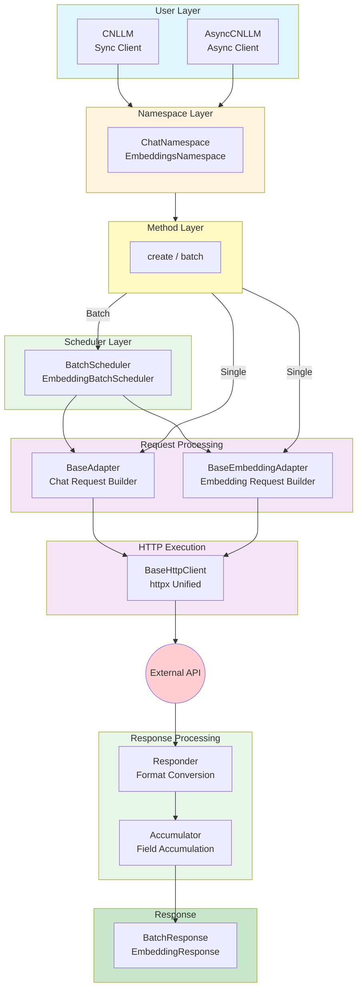
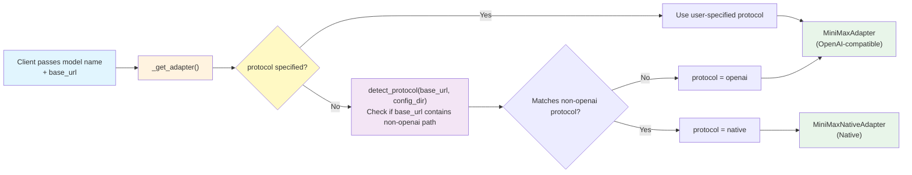
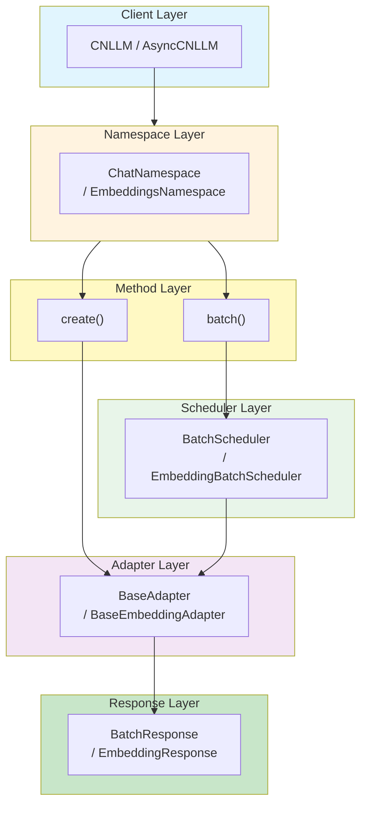
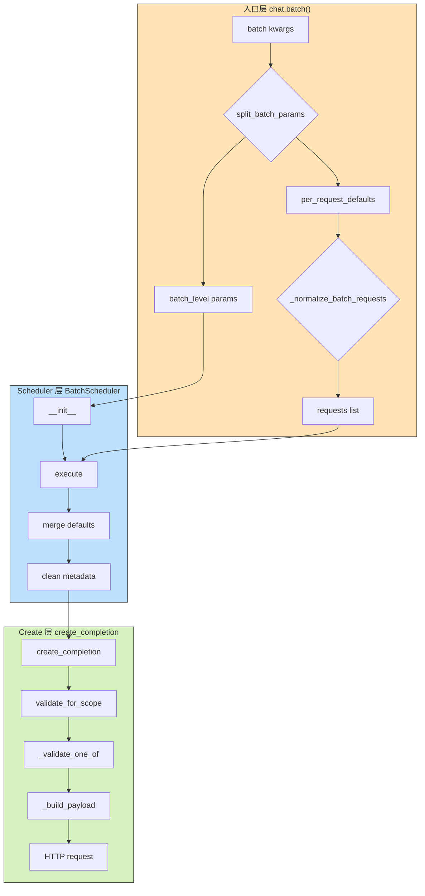
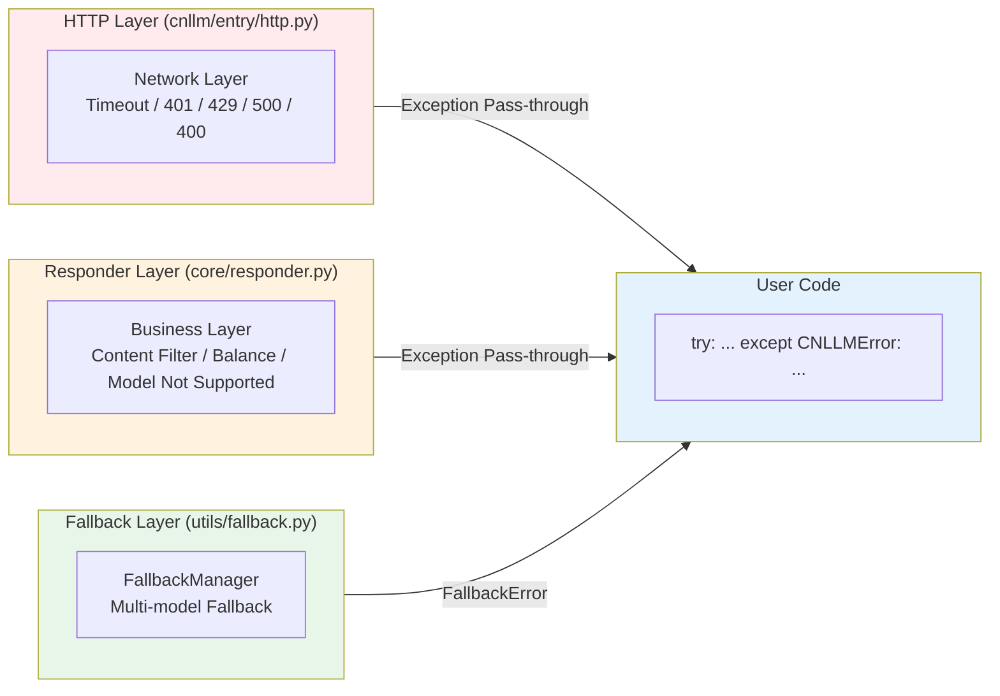
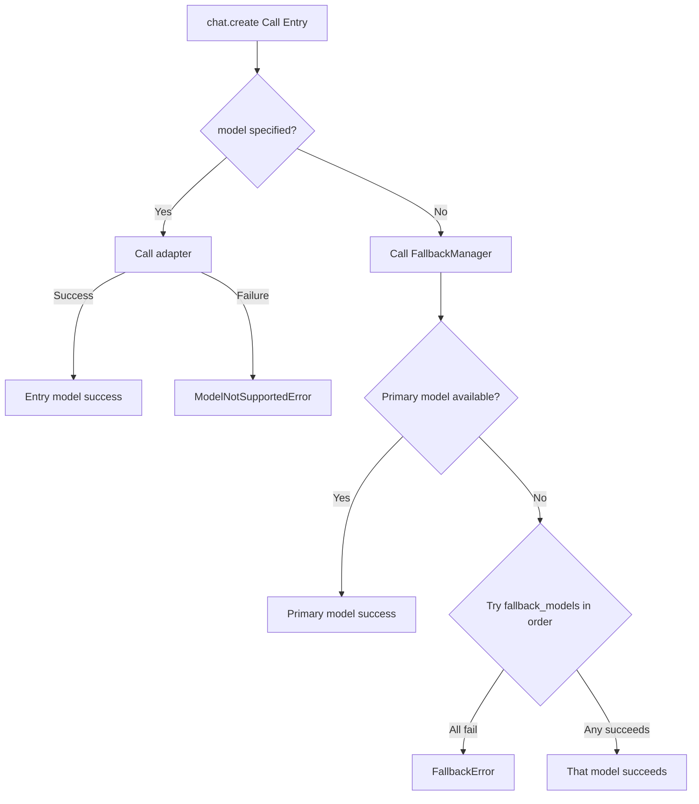
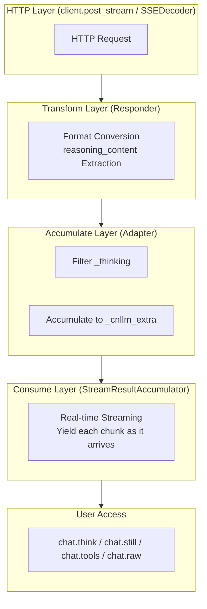
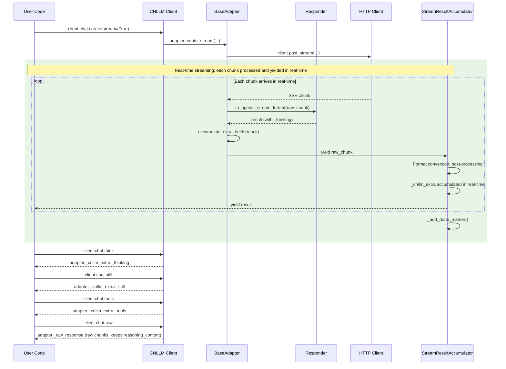

# CNLLM Architecture and Design Documentation

## 0. Directory Structure

```
cnllm/
├── entry/                    # Entry Layer - Client initialization and call entry
│   ├── __init__.py
│   ├── client.py             # CNLLM main client class (sync)
│   ├── async_client.py       # AsyncCNLLM async client class
│   └── http.py               # HTTP request client (httpx unified)
├── core/                     # Core Layer - Adapter abstraction and vendor implementation
│   ├── __init__.py
│   ├── adapter.py            # BaseAdapter base adapter (Chat, protocol routing)
│   ├── embedding.py           # BaseEmbeddingAdapter + EmbeddingResponder unified entry
│   ├── responder.py          # Responder response transformation framework
│   ├── accumulators/         # Field accumulators
│   │   ├── __init__.py
│   │   ├── base.py           # Accumulator base class
│   │   ├── single_accumulator.py    # Single stream/non-stream accumulator
│   │   ├── batch_response.py        # Batch response data classes
│   │   ├── batch_stream.py          # Batch stream accumulator
│   │   ├── batch_nonstream.py       # Batch non-stream accumulator
│   │   └── embedding_accumulator.py # Embedding accumulator
│   ├── framework/
│   │   ├── __init__.py
│   │   └── langchain.py      # LangChain Runnable integration
│   └── vendor/               # Vendor implementation
│       ├── __init__.py
│       ├── glm.py            # GLM vendor adapter
│       ├── kimi.py           # Kimi vendor adapter
│       ├── doubao.py         # Doubao vendor adapter
│       ├── deepseek.py       # Deepseek vendor adapter
│       ├── minimax.py        # MiniMax vendor adapter
│       └── xiaomi.py         # Xiaomi vendor adapter
└── utils/                    # Utility Layer - Common utilities
    ├── __init__.py
    ├── scheduler/            # Batch schedulers
    │   ├── __init__.py
    │   ├── base.py           # BatchScheduler / data classes / common functions
    │   ├── chat.py           # Stream/mixed chat schedulers
    │   └── embedding.py      # Embedding schedulers
    ├── exceptions.py         # Exception definitions (includes BatchStopOnError)
    ├── fallback.py           # Fallback manager
    ├── stream.py             # Streaming utility (SSEDecoder, AsyncSSEDecoder)
    ├── validator.py          # Parameter validator
    └── vendor_error.py       # Vendor error handling

configs/
├── glm/
│   ├── request_glm.yaml
│   └── response_glm.yaml
├── kimi/
│   ├── request_kimi.yaml
│   └── response_kimi.yaml
├── doubao/
│   ├── request_doubao.yaml
│   └── response_doubao.yaml
├── deepseek/
│   ├── request_deepseek.yaml
│   └── response_deepseek.yaml
├── minimax/
│   ├── request_minimax.yaml
│   └── response_minimax.yaml
└── xiaomi/
    ├── request_xiaomi.yaml
    └── response_xiaomi.yaml
```

***

## 1. Architecture Design

### 1.1 Overall Architecture



### 1.2 General Base Class Architecture

| Base Class Component       | File                               | Responsibility                   | Example                                     |
| ------------ | -------------------------------- | -------------------- | -------------------------------------- |
| **Frontend Entry**     | `CNLLM` (entry/client.py)        | Client initialization, call entry          | `CNLLM(model='glm-4')`                 |
| **Async Frontend Entry**   | `AsyncCNLLM` (entry/async_client.py) | Async client initialization, call entry | `AsyncCNLLM(model='kimi-k2.6')`         |
| **Chat Adapter**   | `BaseAdapter` (core/adapter.py)  | Chat request field mapping, Payload construction, protocol routing     | `_build_payload()`, `_get_optional_fields()`, `_get_protocol_excluded_params()` |
| **Embedding Adapter** | `BaseEmbeddingAdapter` (core/embedding.py) | Embedding request handling | `create_batch()`                       |
| **HTTP Execution**   | `BaseHttpClient` (entry/http.py) | Generic HTTP request, retry mechanism (httpx)   | `post_stream()`, `apost_stream()`      |
| **Response Postprocessing**    | `Responder` (core/responder.py)  | Response field mapping, OpenAI standard format construction | `to_openai_stream_format()`             |
| **Field Accumulator**    | `Accumulator` (core/accumulators/) | Unified field accumulation (non-streaming/batch)   | `BatchResponse`, `EmbeddingResponse`   |

### 1.3 Vendor Layer Architecture

| Vendor Layer Component        | File                        | Responsibility                  | Example                                    |
| ------------ | ------------------------- | ------------------- | ------------------------------------- |
| **Vendor Chat Adapter** | `core/vendor/{vendor}.py` | Vendor-specific Chat request handling, Payload construction | `GLMAdapter.create_completion()`, `MiniMaxAdapter` / `MiniMaxNativeAdapter` dual protocol |
| **Vendor Embedding Adapter** | `core/vendor/{vendor}.py` | Vendor-specific Embedding request handling | `GLMEmbeddingAdapter.create_batch()`   |
| **Vendor Response Converter**  | `core/vendor/{vendor}.py` | Vendor-specific response conversion logic          | `GLMResponder.to_openai_format()`       |
| **Vendor Error Parser**  | `core/vendor/{vendor}.py` | Vendor-specific error parsing            | `GLMVendorError.parse()`               |
| **Request Config**    | `configs/{vendor}/`       | Vendor request field mapping, error code mapping, param validation | `request_{vendor}.yaml`                 |
| **Response Config**    | `configs/{vendor}/`       | Vendor response field mapping, stream processing config      | `response_{vendor}.yaml`               |

### 1.4 Utility Class Architecture

| Utility Class          | File                      | Responsibility                   | Example                                        |
| ------------ | ----------------------- | -------------------- | ----------------------------------------- |
| **Exception System**     | `utils/exceptions.py`   | CNLLM exception base class, unified exception system    | `raise CNLLMError(msg)`                   |
| **Batch Scheduler**    | `utils/scheduler/`        | Chat/Embedding batch scheduling    | `BatchScheduler`, `EmbeddingBatchScheduler` |
| **Batch Stop Exception**   | `utils/exceptions.py`    | Exception thrown when stop_on_error    | `BatchStopOnError`                        |
| **Vendor Error Translator**  | `utils/vendor_error.py` | Vendor error translator, translate to CNLLM exception | `translator.to_cnllm_error()`             |
| **Fallback Manager**    | `utils/fallback.py`     | Fallback manager, handle model unavailability fallback logic  | `execute_with_fallback()`, `fallback_models={"fb_model": "fb_key"}` |
| **Streaming Utility**   | `utils/stream.py`       | SSE decoding, HTTP streaming       | `SSEDecoder`, `AsyncSSEDecoder`           |
| **Parameter Validator**    | `utils/validator.py`    | Parameter validator, validate model, field, param range   | `validate_model()`, `validate_required()` |

***

### 1.5 Protocol Routing Layer

Some vendors (e.g., MiniMax) provide both **OpenAI-compatible interfaces** and **Native interfaces**, with different parameter sets and response formats. CNLLM implements multi-protocol routing through the following mechanism:



**Protocol impact on the parameter system**:

| Mechanism | No protocol (other vendors) | protocol="openai" (MiniMax) | protocol="native" (MiniMax) |
|-----------|----------------------------|-----------------------------|-----------------------------|
| `_get_optional_fields()` | Returns all optional_fields | Returns only openai-compatible params | Returns only native params |
| `_get_protocol_excluded_params()` | `set()` no exclusions | `{thinking, top_k, mask, ...}` | `{reasoning_split}` |
| `validate_for_scope` A.6 | Not triggered | Excludes native-only params | Excludes openai-only params |

**Backward compatibility**: For other vendors, `protocol=None`, so `_get_optional_fields()` returns all fields, `_get_protocol_excluded_params()` returns an empty set, producing no filtering effect.

### 1.7 Call Entry Layer



| Layer | Example |
| --- | --- |
| Client | `CNLLM(model='glm-4', api_key='xxx')` |
| Namespace | `client.chat` / `client.embeddings` |
| Single method | `client.chat.create(messages=[...])` |
| Batch method | `client.chat.batch(['hi', 'hello'])` / `embeddings.create_batch(['text1', 'text2'])` |
| Scheduler | `BatchScheduler(client, max_concurrent=5, stop_on_error=True)` |
| Adapter | `GLMAdapter(api_key='xxx', model='glm-4')` |
| Batch Response | `BatchResponse.results / status["success_count"] / errors / usage` |
| Embedding Response | `EmbeddingResponse.results / vectors / batch_info["dimension"] / status` |

***

## 2. Request Parameter Chain

### 2.1 Single Request Parameter Chain

```
User calls client.chat.create(messages=[...], temperature=0.7)
    ↓
Namespace.create() passes through parameters
    ↓
BaseAdapter.__init__()   ← during client initialization
├─ resolve_default("chat", "timeout")      → 30
├─ resolve_default("chat", "max_retries")  → 3
└─ resolve_default("chat", "retry_delay")  → 1.0
    ↓
BaseAdapter.create_completion(messages, temperature, stream, **kwargs)
    ↓
① Collect parameters: {model, messages, temperature, stream, **kwargs}
    ↓
② validate_for_scope(params, scope="chat", vendor_yaml=protocol_vendor_yaml, drop_params="warn", protocol_excluded_params=...)
  ├─ A: PARAM_REGISTRY validation (registered / scope match / batch_level misuse / type hints)
  ├─ A.5: YAML skip markers → skip (e.g., api_key, base_url)
  ├─ A.6: Protocol exclusion filtering — params excluded by adapter._get_protocol_excluded_params()
  ├─ B: YAML field_mappings validation (vendor-specific parameter whitelist)
  ├─ C: Unmatched parameters → handled by drop_params strategy (warn / strict / ignore)
    ↓
③ _validate_one_of(params)  →  Mutually exclusive parameter validation (prompt / messages pick one)
    ↓
④ _check_image_support(params)  →  Multi-modality input compatibility check
    ↓
⑤ _build_payload(params)  →  First passes `_model_params` blacklist filter at entry (Embedding only)
   │
   ├─ Filter: _filter_model_params(params, model)  →  Remove unsupported params for current model
   │   (handled by drop_params strategy: warn / strict / ignore)
   │
   ├─ Build: via YAML field mappings (map / transform / skip)
   └─ Internally calls get_vendor_model(model)  →  Short name → vendor model name
    ↓
⑥ get_base_url() + get_api_path()  →  Assemble complete request URL
    ↓
⑦ get_header_mappings()  →  Read YAML fields with skip:true and head → request headers
    ↓
⑧ HTTP request (BaseHttpClient)
```

Key changes:

- **`filter_supported_params`** **+** **`validate_required_params`** **→ merged into** **`validate_for_scope()`**, unified in `param_registry.py`
- **`get_default_value`** **→ replaced by** **`resolve_default()`**, reads scope-aware defaults from PARAM_REGISTRY during adapter initialization
- **`drop_params`** **strategy (warn/strict/ignore)** is passed through layers from client entry, controlling how unknown parameters are handled
- **New** **`_check_image_support()`**, validates whether model supports image input before Payload construction

### 2.2 Batch Request Parameter Chain

```
User calls client.chat.batch(requests, temperature=0.7, max_concurrent=5,
                            stop_on_error=True, callbacks=[...])
    ↓
Namespace.batch() entry
    ↓
① split_batch_params(kwargs)  →  Split by PARAM_REGISTRY.batch_level flag
  ├─ per_request_defaults = {temperature: 0.7, ...}  →  merged into each request
  └─ batch_level_kwargs = {max_concurrent: 5, stop_on_error: True, ...}  →  passed to Scheduler
    ↓
② _normalize_batch_requests(requests, prompt=..., messages=..., per_request_defaults)
  →  Unified three input modes into requests list
  →  Shared prompt/messages injection (prompt as single string, messages as single message list)
  →  _input_type metadata tagging
    ↓
③ BatchScheduler(client, max_concurrent=5, stop_on_error=True, callbacks=[...],
                  timeout=resolve_default("chat", "timeout"), ...)
    ↓
④ scheduler.execute()  controls concurrency / rate limiting / callbacks
    ↓
⑤ adapter.create_completion(request)  ←  only passes per-request parameters, no batch-level parameters
```

Key changes:

- **`BATCH_LEVEL_KEYS`** **hard-coded set → replaced by** **`split_batch_params()`**, dynamically splits based on `batch_level=True` flag in PARAM\_REGISTRY
- **\_normalize\_batch\_requests supports `requests=` coexisting with `prompt=` / `messages=`**, where prompt is single string, messages is single message list, serving as common input for all requests

### 2.3 Parameter Passing Mechanism in YAML Configuration Files

> **Parameter Passing Order Description**:
>
> - When user calls `create()`, the adapter type (chat/embedding) is already determined
> - During adapter initialization (`__init__`), scope-aware default values are read via `resolve_default`
> - After `validate_for_scope` executes, parameters are filtered according to PARAM\_REGISTRY + YAML whitelist
> - The following logic is sorted by parameter processing order (top to bottom)

| # | Purpose | Access Point | Validation Scope | New/Processed Parameters |
| -- | --- | --- | --- | --- |
| 1 | Get scope-aware default value (at init) | `resolve_default` | **PARAM\_REGISTRY.default** (scope-differentiated: e.g., chat=3, embed=12) | timeout, max\_retries, retry\_delay |
| 2 | General parameter validation + filtering | `validate_for_scope` step A | **PARAM\_REGISTRY** (scope match + batch\_level validation + type hints) | - |
| 3 | YAML skip parameter filtering | `validate_for_scope` step A.5 | **vendor\_yaml** `skip: true` markers | api\_key, base\_url, etc. |
| 4 | Protocol exclusion filtering | `validate_for_scope` step A.6 | **protocol\_excluded\_params** (via `_get_protocol_excluded_params()`) | MiniMax only: thinking, top\_k (native); reasoning\_split (openai) |
| 5 | Vendor-specific parameter validation | `validate_for_scope` step B | **YAML optional\_fields** (with optional scope restrictions) | - |
| 6 | Unknown parameter strategy | `validate_for_scope` step C | **drop\_params** (warn / strict / ignore) | - |
| 7 | Mutually exclusive parameter validation | `_validate_one_of`¹ | one\_of (prompt ↔ messages) | - |
| 8 | Image support validation | `_check_image_support` | Model vision support list | - |
| 9 | Build request body + model name mapping | `_build_payload` | YAML field mappings (map / transform / skip) + model\_mapping + `_get_optional_fields()` protocol filter | - |
| 10 | Assemble request URL | `get_base_url` + `get_api_path` | base\_url + api\_path (layered by protocol or adapter\_type) | - |
| 11 | Request header mapping | `get_header_mappings` | YAML fields with skip:true and head | - |

¹ `_validate_one_of` only executes in Chat call path, Embedding path does not call this method.

**Model-level Parameter Filtering**:

Some parameters are only supported by specific models (e.g., Qwen's `dimensions` is only supported by text-embedding-v3/v4). Subclasses can declare a `_model_params` blacklist, which is checked at the `_build_payload` entry:

```python
# cnllm/core/vendor/qwen.py
class QwenEmbeddingAdapter(BaseEmbeddingAdapter):
    _model_params = {
        "text-embedding-v1": {"dimensions", "encoding_format"},
        "text-embedding-v2": {"dimensions", "encoding_format"},
    }
```

Models not listed are unaffected. Filtering follows the `drop_params` three-tier strategy (warn / strict / ignore).

**Two-Stage Parameter Validation Design**:

```
validate_for_scope(params, scope, vendor_yaml, drop_params, protocol_excluded_params=None)
  │
  ├─ Step A ── PARAM_REGISTRY Matching
  │   ├─ scope match → add to clean
  │   ├─ scope mismatch → handle by drop_params
  │   ├─ batch_level=True → warn (misplaced in create)
  │   ├─ type mismatch → TypeError in strict mode, logger.warning + drop in warn mode
  │   ├─ Step A.5 ── YAML skip marker → skip (e.g., api_key, base_url)
  │   └─ Step A.6 ── Protocol exclusion filtering
  │       └─ param in protocol_excluded_params? → treat as unknown
  │           (provided by adapter._get_protocol_excluded_params())
  │
  ├─ Step B ── YAML field_mappings Matching (vendor-specific parameters)
  │   ├─ check optional_fields + required_fields
  │   ├─ scope restriction check (e.g., mask only for chat)
  │   └─ skip fields ignored
  │
  └─ Step C ── No match → handle by drop_params strategy
      ├─ "strict" → throw TypeError (type mismatch) / InvalidRequestError (unknown param)
      ├─ "warn"   → logger.warning + drop (default)
      └─ "ignore" → silently drop
```

**YAML Simplification**:

After refactoring, the `adapter` level identifiers (such as `adapter: [chat]` / `adapter: [embedding]`) have been removed from YAML configuration. Scope control is now unified by PARAM\_REGISTRY. Vendor-specific parameters remain in YAML, registered via `optional_fields`, and can carry `scope` restriction fields. Field mapping mechanisms like `skip`, `map`, and `transform` remain unchanged.

### 2.4 Batch Parameter Validation Chain

Batch calls support three input modes, with parameter validation divided into three layers: Entry Layer (parameter splitting + request normalization) → Scheduler Layer (fill runtime defaults) → Create Layer (single request validation chain).

#### 2.4.1 Three-Layer Responsibility Division



#### 2.4.2 Batch Parameter Classification (Defined by PARAM\_REGISTRY)

Batch parameters are divided into two categories, **completely different in nature**, defined by the `batch_level` flag in PARAM\_REGISTRY:

| Category | Parameters | PARAM\_REGISTRY Definition | Handling |
| --- | --- | --- | --- |
| **Per-Request** | `prompt`, `messages`, `thinking`, `tools`, `temperature`, `max_tokens`, `top_p`, `stop`, `model`, `stream`, `timeout`, `max_retries`, `retry_delay` | `batch_level=False` (default) | Enter request dict → create() → validate\_for\_scope |
| **Batch-Level** | `max_concurrent`, `rps`, `batch_size`, `stop_on_error`, `callbacks`, `custom_ids`, `keep` | `batch_level=True` | **Do NOT enter request dict** → directly passed to BatchScheduler/EmbeddingBatchScheduler |

> **Key Principle**: Batch-Level parameters do not need to, should not, and are not required to enter YAML. YAML describes "External API Interface Specification", while Batch-Level parameters describe "Client Scheduling Behavior" - the two have different responsibilities.

#### 2.4.3 Source Separation Mechanism (split\_batch\_params)

All `kwargs` are split into two groups by `split_batch_params()` at the `batch()` entry point, replacing the old hard-coded `BATCH_LEVEL_KEYS`:

```python
# split_batch_params reads the batch_level flag of each parameter from PARAM_REGISTRY
def split_batch_params(kwargs):
    batch_params = {}
    per_request_params = {}
    for key, value in kwargs.items():
        param_def = PARAM_REGISTRY.get(key)
        if param_def is not None and param_def.batch_level:
            batch_params[key] = value     # → BatchScheduler
        else:
            per_request_params[key] = value  # → create() validation
    return batch_params, per_request_params

# Call site (ChatNamespace.batch / EmbeddingsNamespace.batch)
batch_level_kwargs, per_request_defaults = split_batch_params(kwargs)
```

**Advantages**:

- **Single Source of Truth**: PARAM\_REGISTRY is the only authoritative source for parameter classification, eliminating the need to maintain two separate logic sets
- **Auto-extensible**: Adding a new batch-level parameter only requires adding one definition in PARAM\_REGISTRY, no need to modify the separation logic
- **Scope-aware**: Different functional domains (chat/embed) can define different batch-level parameter sets

#### 2.4.4 Per-Request Parameter Priority

The final parameters for each request are determined by three-layer priority:

```
Per-Request independent parameters (requests[i]) > Shared parameters (batch-level prompt/messages) > Per-Request global defaults (batch kwargs)
```

Merge logic (in `_normalize_batch_requests`):

```python
per_request = req.copy()  # request[i] own parameters have highest priority
if per_request_defaults:
    defaults = {k: v for k, v in per_request_defaults.items()
                 if k not in per_request}  # do not override item's own values
    per_request = {**defaults, **per_request}
```

Scheduler layer further supplements runtime defaults (read from PARAM\_REGISTRY via `resolve_default`):

```python
# Scheduler._execute_single — only fill when per-request doesn't exist
if 'timeout' not in request and self.timeout is not None:
    request['timeout'] = self.timeout
if 'max_retries' not in request and self.max_retries is not None:
    request['max_retries'] = self.max_retries
```

#### 2.4.5 Internal Metadata Field (\_input\_type)

`_normalize_batch_requests()` adds an internal `_input_type` metadata field to each request (`"prompt"` / `"messages"`), which only serves as an identifier for the input source, **does not participate in any filtering or routing logic**.

This field is stripped by the Scheduler layer before being passed to `create()`:

```python
# Scheduler layer (_execute_single) — only strips metadata, no filtering logic
request_with_batch = {k: v for k, v in request.items() if k != "_input_type"}
response = self.client.chat.create(**request_with_batch)
```

#### 2.4.6 Per-Request Batch-Level Parameter Misplacement Warning

If a user accidentally passes a Batch-Level parameter in a dict within the `requests` list (e.g., `requests=[{"prompt": "A", "max_concurrent": 5}]`), a **guidance warning** is generated in `normalize_batch_requests()`, rather than a generic "parameter not supported" warning:

```
WARNING: batch() parameter 'max_concurrent' in requests[0] has no effect.
Please configure 'max_concurrent' in batch() global parameters, e.g., batch(..., max_concurrent=5)
```

This warning is based on the old `BATCH_LEVEL_KEYS` hard-coded set (coexisting with `split_batch_params`), ensuring users correctly understand which layer the parameter should be configured in.

#### 2.4.7 Three Input Modes

| Mode | Example | Internal Handling |
| --- | --- | --- |
| `requests=[{...}, {...}]` | **Recommended usage**, each item with independent parameters | Use directly, item's own parameters have highest priority |
| `requests=[...] + prompt="A"` | **Shared mode**, all requests use the same prompt | prompt as single string, inject this value to items without their own prompt/messages |
| `requests=[...] + messages=[...]` | **Shared mode**, all requests use the same messages | messages as single message list, inject this value to items without their own prompt/messages |
| `prompt=["A", "B"]` | Legacy usage, backward compatible | Wrapped as `[{prompt: "A"}, {prompt: "B"}]` |
| `messages=[[{...}], [{...}]]` | Legacy usage, backward compatible | Wrapped as `[{messages: [...]}, ...]` |

> **Note**: `prompt` and `messages` remain mutually exclusive (cannot be provided simultaneously). When coexisting with `requests`, prompt or messages serve as global parameters and only accept single input.

## 3. Exception Handling System Architecture



### 3.1 Error Classification and Handling Responsibilities

| Error Type | Occurrence Scenario | Handling Component |
| --- | --- | --- |
| TypeError, invalid params | Client-side pre-check | `validate_for_scope` / `_check_image_support` → `TypeError` |
| Network unreachable, connection timeout | Before sending request | HTTP Layer |
| API Key incorrect (401) | Before request reaches server | HTTP Layer |
| Rate limit (429) | Before request reaches server | HTTP Layer |
| Model not found, parameter error (400) | After request reaches server | HTTP Layer |
| Server error (>=500) | After request reaches server | HTTP Layer |
| Business error (sensitive content, insufficient balance) | After model processing | Responder Layer |
| Model not supported | Parameter validation phase | Responder Layer |
| All models failed | Fallback mechanism | Fallback Layer |

***

## 4. FallbackManager Flow Design

Only the client initialization entry accepts the `fallback_models` parameter. It is recommended to configure this option for program or application runtime stability.
When the primary model at the client entry is unavailable, it will try models in `fallback_models` in order.

### 4.1 fallback_models Configuration Format

```python
fallback_models = {
    "deepseek-chat": {
        "api_key": "ds-key-456",
        "base_url": "https://api.deepseek.com/v1",
    },
    "qwen-plus": {
        "api_key": "my-key",         # base_url omitted → use default URL (same as primary model)
    },
}
```

- **key**: Fallback model name (required)
- **value**: `dict`, required fields:
  - `api_key`: API Key for this model (**required**)
  - `base_url`: Independent endpoint for this model (optional; omit or `None` to use adapter default URL)

Code example:

```python
client = CNLLM(
    model="minimax-m2.7", api_key="minimax_key",
    fallback_models={
        "mimo-v2-flash": {"api_key": "xiaomi-key"},
        "deepseek-chat": {"api_key": "ds-key", "base_url": "https://api.deepseek.com/v1"},
    },
)   
resp = client.chat.create(prompt="What is 2+2?")
print(resp)
```

If `model` is specified again at the call entry, it overrides the client's `model`, but the fallback order **is unaffected** (still starts from the primary model).



### 4.2 Execution Flow

```python
# FallbackManager internal
# Primary model always uses client-provided parameters (api_key, base_url, etc.)
models_to_try = [(primary_model, primary_api_key, self.base_url)]

# Fallback models read per-model config from fallback_config
for fb_model, fb_config in self.fallback_config.items():
    fb_api_key = fb_config["api_key"]                    # required
    fb_base_url = fb_config.get("base_url")               # optional, None → use manager's base_url
    models_to_try.append((fb_model, fb_api_key, fb_base_url))

# Try each model in order
for model, api_key, base_url in models_to_try:
    try:
        adapter = self.get_adapter_func(
            model, api_key,
            base_url=base_url or self.base_url,           # fb_base_url first, else manager's shared base_url
            ...
        )
        return execute_fn(adapter, model, api_key)
    except (ModelNotSupportedError, MissingParameterError, ContentFilteredError):
        raise  # Non-retryable errors are raised directly
    except Exception as e:
        # Network/server errors → log error, try next
        continue

raise FallbackError(...)  # All models failed
```

**Non-retryable error types** (raised directly, no fallback):
- `ModelNotSupportedError`: Model does not exist
- `MissingParameterError`: Missing required parameters
- `ContentFilteredError`: Content was filtered

All other exceptions (network errors, rate limits, server errors, etc.) trigger fallback attempts.

### 4.3 FallbackError Error Aggregation

When multi-model fallback is configured and all models fail, `FallbackError` aggregates all error information:

```python
try:
    client = CNLLM(
        model="primary-model",
        api_key="key",
        fallback_models={"backup-1": "key1", "backup-2": "key2"}
    )
    client.chat.create(messages=[...])
except FallbackError as e:
    print(e.message)  # "All models failed. Tried: primary-model, backup-1, backup-2"
    for i, err in enumerate(e.errors):
        print(f"[{i+1}] {err}")  # Detailed error for each model
```

***

## 5. Streaming System Architecture

### 5.1 Overall Processing Flow



### 5.2 Component Responsibilities

| Component | File | Core Function | Responsibility |
| --- | --- | --- | --- |
| **SSEDecoder** | `utils/stream.py` | `decode_stream()` | Parse SSE event stream, parse `data: {...}` into JSON objects |
| **StreamHandler** | `utils/stream.py` | `handle_stream()` | Wrap HTTP streaming response, call conversion function for each chunk |
| **StreamResultAccumulator** | `utils/stream.py` | `__iter__()` | **Real-time streaming**: yield each chunk as it arrives, post-processing in real-time |
| **StreamResultAccumulator** | `utils/stream.py` | `get_chunks()` | Return filtered chunks list (filter reasoning_content and non-first role) |
| **Responder.to_openai_stream_format** | `core/responder.py` | `to_openai_stream_format()` | Convert vendor raw response to OpenAI streaming format, add `_thinking` field |
| **Adapter._handle_stream** | `core/adapter.py` | `_handle_stream()` | Initialize `_raw_response` and `_cnllm_extra`, return stream handler |
| **Adapter._accumulate_extra_fields** | `core/adapter.py` | `_accumulate_extra_fields()` | Extract `_thinking`, `content`, `tool_calls` from chunk and accumulate to `_cnllm_extra` |
| **client.chat.think** | `entry/client.py` | `ChatNamespace.think` | Return `adapter._cnllm_extra._thinking` |
| **client.chat.still** | `entry/client.py` | `ChatNamespace.still` | Return `adapter._cnllm_extra._still` |
| **client.chat.tools** | `entry/client.py` | `ChatNamespace.tools` | Return `adapter._cnllm_extra._tools` |
| **client.chat.raw** | `entry/client.py` | `ChatNamespace.raw` | Return `adapter._raw_response` (raw response, unfiltered) |

### 5.3 Key Design Decisions

#### 5.3.1 Real-time Streaming Mode

`StreamResultAccumulator` uses **real-time streaming** mode, yielding each chunk as it arrives:

```python
def __iter__(self):
    for raw_chunk in self._raw_iterator:
        result = self._adapter._to_openai_stream_format(raw_chunk)
        self._accumulate_extra_fields(result)
        self._post_process_chunk(result)
        self._chunks.append(result)
        self._adapter._raw_response["chunks"].append(clean_for_raw)
        yield result  # Real-time yield, no waiting for all chunks
    self._done = True
    self._add_done_marker()
```

**Features**:

- When user iterates `for chunk in response`, each chunk **arrives in real-time** (no waiting for entire HTTP stream)
- `_cnllm_extra` and `_raw_response["chunks"]` are **accumulated in real-time** during iteration
- Suitable for frontend streaming rendering scenarios that require real-time consumption

#### 5.3.2 Dual-Layer Accumulation Mechanism

Accumulation occurs in **two places** simultaneously:

1. **StreamResultAccumulator Layer** (`_accumulate_extra_fields`): Accumulate to `adapter._cnllm_extra`
   - For `client.chat.think/still/tools` attribute access

2. **StreamResultAccumulator Layer**: Store filtered clean chunk to `adapter._raw_response["chunks"]` in real-time

#### 5.3.3 Field Filtering Rules

| Field Type | Example | Filter Rule | Description |
| --- | --- | --- | --- |
| Final Accumulation Field | `_thinking`, `_still`, `_tools` | **Filter** | Store to `adapter._cnllm_extra` for user access |
| Raw Response Field | `reasoning_content` (no `_`) | **Keep** | `.raw` keeps, `.response` filters |
| Standard OpenAI Field | `id`, `choices`, `delta`, etc. | **Keep** | Both `.raw` and `.response` keep |

#### 5.3.4 Chunk Post-Processing Rules (StreamResultAccumulator)

Execute after immediate consumption in `__init__`:

```python
# 1. Identify all ending chunks
finish_indices = [i for i, chunk in enumerate(chunks)
                  if chunk.get("choices", [{}])[0].get("finish_reason") in ("stop", "tool_calls")]

# 2. When multiple ending chunks, keep only the first one
if len(finish_indices) > 1:
    for idx in reversed(finish_indices[1:]):
        chunks.pop(idx)

# 3. Filter role field by choice.index (maintain OpenAI compatibility)
_seen_choice_indices = set()
for chunk in chunks:
    for choice in chunk.get("choices", []):
        delta = choice.get("delta", {})
        choice_idx = choice.get("index")
        if choice_idx in _seen_choice_indices:
            if "role" in delta:
                del delta["role"]
        else:
            _seen_choice_indices.add(choice_idx)

# 4. Filter tool_calls id/type/name by tool_calls.index (OpenAI streaming standard)
_seen_tool_call_indices = set()
for chunk in chunks:
    for choice in chunk.get("choices", []):
        delta = choice.get("delta", {})
        if "tool_calls" in delta:
            for tc in delta["tool_calls"]:
                idx = tc.get("index")
                if idx in _seen_tool_call_indices:
                    tc.pop("id", None)
                    tc.pop("type", None)
                    if "function" in tc and "name" in tc["function"]:
                        del tc["function"]["name"]
                else:
                    _seen_tool_call_indices.add(idx)

# 5. Add [DONE] marker (if vendor didn't return it)
if chunks[-1] != "[DONE]":
    chunks.append("[DONE]")
```

#### 5.3.5 Streaming Field Filtering Rules

In streaming responses, the following fields are filtered by index to comply with OpenAI standard:

**`delta.role` Filtering Rule**
- Judgment by `choice.index`
- First occurrence of `choice.index` → **Keep** `role: assistant`
- Same `choice.index` appearing again → **Remove** `role`

**`tool_calls` Filtering Rule**
- Judgment by `tool_calls[].index`
- First occurrence of `tool_calls[].index` → **Keep** `id`, `type`, `function.name`, `arguments`
- Same `tool_calls[].index` appearing again → **Keep only** `index` and `function.arguments`

> **Independence**: `choice.index` (which message) and `tool_calls.index` (which tool) are completely independent and do not affect each other.

**Termination Chunk**
- If vendor didn't return `data: [DONE]`, automatically add string `"[DONE]"` as the stream termination marker
- Returns this terminator when iterating to the end

#### 5.3.6 Unified Streaming/Non-Streaming Interface

```python
# Streaming
response = client.chat.create(messages=[...], stream=True, tools=[...])

print(response)  # OpenAI standard format streaming chunks

# Important field access
print(client.chat.think)  # Thinking content
print(client.chat.still)  # Response content
print(client.chat.tools)  # Tool calls
print(client.chat.raw)  # List of raw response chunks (unprocessed)
```

### 5.4 Streaming Data Three-Path Flow

Each raw chunk passes through three processing paths:

```
HTTP Raw Chunk
  │
  ├─①─ _to_openai_stream_format(chunk) ─→ Yielded result (OpenAI format)
  │     └─ Field extraction via YAML path mappings
  │      → _formatted_chunks.append(result) → __repr__ merged dict
  │
  ├─②─ _accumulate_extra_fields(result) ─→ .still / .think / .tools
  │     └─ Extract fields from ①'s formatted result, accumulate into adapter._cnllm_extra
  │
  └─③─ _chunks.append(chunk) ─→ .raw
        └─ Raw chunk stored as-is, no merging
         → resp.raw returns List[Dict]
```

**Path ① — `_to_openai_stream_format(chunk)`**: Converts vendor raw chunk to OpenAI standard stream format using Responder YAML config. The converted result feeds both Path ② and `_formatted_chunks` accumulation.

**Path ② — `_accumulate_extra_fields(result)`**: Extracts `content`, `reasoning_content`, `tool_calls` from the formatted result and accumulates them into `adapter._cnllm_extra`, which backs the `.still`, `.think`, `.tools` properties.

**Path ③ — `_chunks` raw storage**: `self._chunks.append(chunk)` — no processing. `.raw` returns `list(self._chunks)`.

**Batch reuse**: The batch schedulers iterate the single-stream accumulator, then read accumulated values via `.still`, `.think`, `.tools`, `._chunks`, bypassing per-chunk re-parsing.

### 5.5 Data Flow Sequence Diagram



***

## 6. CNLLM Standard Response Format

The system supports 12 response types, combined from 3 dimensions:

| Dimension | Options |
| --- | --- |
| Call Mode | Sync / Async |
| Streaming Mode | Streaming / Non-streaming |
| Batch Mode | Batch / Non-batch |

### 6.1 Response Type Overview

| # | Type | Return Type | Accumulator Class |
|---|------|----------|--------------|
| 1 | Sync non-streaming non-batch | `Dict` | `NonStreamAccumulator` |
| 2 | Sync streaming non-batch | `Iterator[Dict]` | `StreamAccumulator` |
| 3 | Sync non-streaming batch | `BatchResponse` | `BatchNonStreamAccumulator` |
| 4 | Sync streaming batch | `Iterator[Dict]` | `BatchStreamAccumulator` |
| 5 | Async non-streaming non-batch | `Dict` | `AsyncNonStreamAccumulator` |
| 6 | Async streaming non-batch | `AsyncIterator[Dict]` | `AsyncStreamAccumulator` |
| 7 | Async non-streaming batch | `BatchResponse` | `AsyncBatchNonStreamAccumulator` |
| 8 | Async streaming batch | `AsyncIterator[Dict]` | `AsyncBatchStreamAccumulator` |
| 9 | Sync non-batch Embeddings | `Dict` | `EmbeddingAccumulator` |
| 10 | Sync batch Embeddings | `EmbeddingResponse` | `EmbeddingBatchAccumulator` |
| 11 | Async non-batch Embeddings | `Dict` | `AsyncEmbeddingAccumulator` |
| 12 | Async batch Embeddings | `EmbeddingResponse` | `AsyncEmbeddingBatchAccumulator` |
| 13 | Sync mixed streaming batch | `BatchResponse` | `MixedBatchScheduler` |
| 14 | Async mixed streaming batch | `BatchResponse` | `AsyncMixedBatchScheduler` |

### 6.2 Non-batch Response Types

#### Types 1, 5: Sync/Async Non-streaming Non-batch

```python
# Return format: Dict (OpenAI standard format)
{
    "id": "chatcmpl-xxx",
    "object": "chat.completion",
    "created": 1234567890,
    "model": "minimax-m2.7",
    "choices": [{
        "index": 0,
        "message": {
            "role": "assistant",
            "content": "This is the response content"
        },
        "finish_reason": "stop"
    }],
    "usage": {
        "prompt_tokens": 5,
        "completion_tokens": 4,
        "total_tokens": 9
    }
}
```

#### Types 2, 6: Sync/Async Streaming Non-batch

```python
# Return format: Iterator[Dict] / AsyncIterator[Dict]
# Start chunk:
{
    "id": "chatcmpl-xxx",
    "object": "chat.completion.chunk",
    "created": 1234567890,
    "model": "minimax-m2.7",
    "choices": [{
        "index": 0,
        "delta": {
            "role": "assistant",
            "content": "Partial content"
        },
        "finish_reason": None
    }]
},

# Middle chunk:
{
    "id": "chatcmpl-xxx",
    "object": "chat.completion.chunk",
    "created": 1234567890,
    "model": "minimax-m2.7",
    "choices": [{
        "index": 0,
        "delta": {
            "content": "More content"
        },
        "finish_reason": None
    }]
},

# Last chunk:
{
    "id": "chatcmpl-xxx",
    "object": "chat.completion.chunk",
    "created": 1234567890,
    "model": "minimax-m2.7",
    "choices": [{
        "index": 0,
        "delta": {},
        "finish_reason": "stop"
    }]
}
```

### 6.3 Batch Response Types

#### Type 3, 7: Sync/Async Non-streaming Batch

```python
# Return format: BatchResponse (non-streaming batch / mixed streaming batch)
# Note: to_dict() expands the full dict; directly access properties for data

# status — statistics
result.status
# {"success_count": 2, "fail_count": 0, "total": 2, "elapsed": "0.35s"}

# results — success response dict (not persisted by default; use keep=["*"] or keep=["results"])
result.results
# {"request_0": {...}, "request_1": {...}}  each value is same as Type 1 Dict

# errors — failure info dict
result.errors
# {"request_1": "parameter error"}

# usage — token accumulation
result.usage
# {"prompt_tokens": 10, "completion_tokens": 50, "total_tokens": 60}

# think / still / tools — persisted by default (no keep param needed)
result.think    # {"request_0": "...", "request_1": "..."}
result.still    # {"request_0": "...", "request_1": "..."}
result.tools    # {"request_0": [...], "request_1": [...]}

# raw — native response
result.raw      # {"request_0": {...}, "request_1": {...}}

# to_dict — field control
result.to_dict()
# {"still": {...}, "think": {...}, "tools": {...}, "status": {...}, "usage": {...}}

result.to_dict(results=True, errors=True)
# {"results": {...}, "errors": {...}, "status": {...}, "usage": {...}}
```

#### Type 4, 8: Sync/Async Streaming Batch

```python
# Return format: Iterator[Dict] / AsyncIterator[Dict] (chunk iterator)
# After iteration, access aggregated data via batch_result

# Iteration: each chunk yielded in real-time
for chunk in client.chat.batch(requests, stream=True):
    print(chunk)  # streaming chunk for a single request (OpenAI standard format)

# After iteration, access complete results via batch_result
batch_resp = client.chat.batch_result

batch_resp.status
# {"success_count": 1, "fail_count": 1, "total": 2, "elapsed": "0.42s"}

batch_resp.errors
# {"request_1": "parameter error"}

batch_resp.results  # requires keep=["results"] or keep=["*"]
# {"request_0": [chunk1, chunk2, ...], ...}

batch_resp.usage
# {"prompt_tokens": 10, "completion_tokens": 30}

# think / still / tools / raw — persisted by default
batch_resp.think   # {"request_0": "...", "request_1": "..."}
batch_resp.still   # {"request_0": "...", "request_1": "..."}
batch_resp.tools   # {"request_0": [...], "request_1": [...]}
batch_resp.raw     # {"request_0": {...}, "request_1": {...}}
```


### 6.4 Embedding Response Types

#### Type 9, 11: Non-batch Embeddings

```python
# Return format: Dict
{
    "object": "list",
    "data": [
        {
            "object": "embedding",
            "embedding": [0.123, -0.456, ...],  # 1024-dim vector
            "index": 0
        }
    ],
    "model": "embedding-3-pro",
    "usage": {
        "prompt_tokens": 8,
        "total_tokens": 8
    }
}

# Access:
result["data"][0]["embedding"]    # [0.123, -0.456, ...]
result["usage"]["total_tokens"]  # 8
```

#### Type 10, 12: Batch Embeddings

```python
# Return format: EmbeddingResponse
{
    "status": {
        "success_count": 2,
        "fail_count": 0,
        "total": 2,
        "elapsed": "0.35s"
    },
    "usage": {
        "prompt_tokens": 11,
        "total_tokens": 11
    },
    "batch_info": {
        "batch_size": 2,
        "batch_count": 1,
        "dimension": 1024
    },
    "vectors": {
        "request_0": [0.1, 0.2, ...],
        "request_1": [0.3, 0.4, ...]
    },
    "results": {
        "request_0": {
            "object": "list",
            "data": [{"embedding": [0.1, 0.2, ...], "index": 0}],
            "model": "embedding-2",
            "usage": {"prompt_tokens": 5, "total_tokens": 5}
        }
    }
}

# Access methods:
embedding_resp.status                    # {"success_count": 2, "fail_count": 0, "total": 2, "elapsed": "0.35s"}
embedding_resp.status["success_count"]   # 2
embedding_resp.vectors                   # {"request_0": [0.1, 0.2, ...], "request_1": [0.3, 0.4, ...]}
embedding_resp.vectors["request_0"]      # [0.1, 0.2, ...]
embedding_resp.vectors[0]                # [0.1, 0.2, ...]
embedding_resp.results                   # requires keep=["*"]
embedding_resp.usage                     # {"prompt_tokens": 11, "total_tokens": 11}
embedding_resp.batch_info                # {"batch_size": 2, "batch_count": 1, "dimension": 1024}
embedding_resp.errors                    # {"request_2": "some error"}
```

***

## 7. Batch Calls Architecture

See [Batch Calls Architecture](/feature/batch.md)

## 8. Async Implementation

See [Async Implementation](/feature/async.md)

## 9. Embedding Implementation

See [Embedding Implementation](/feature/embedding.md)
