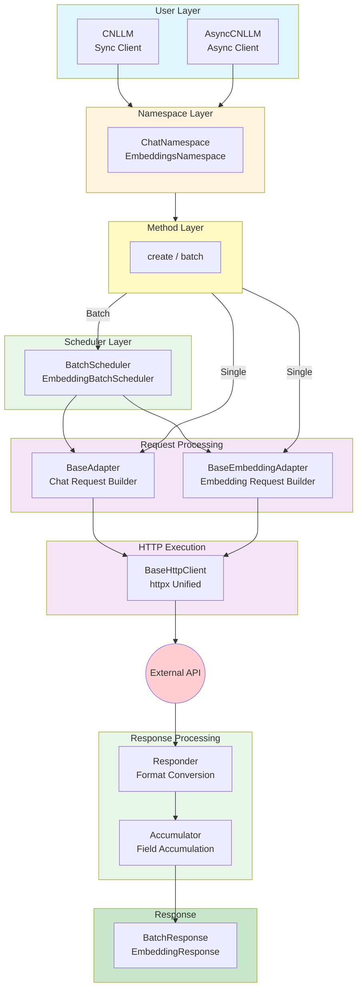
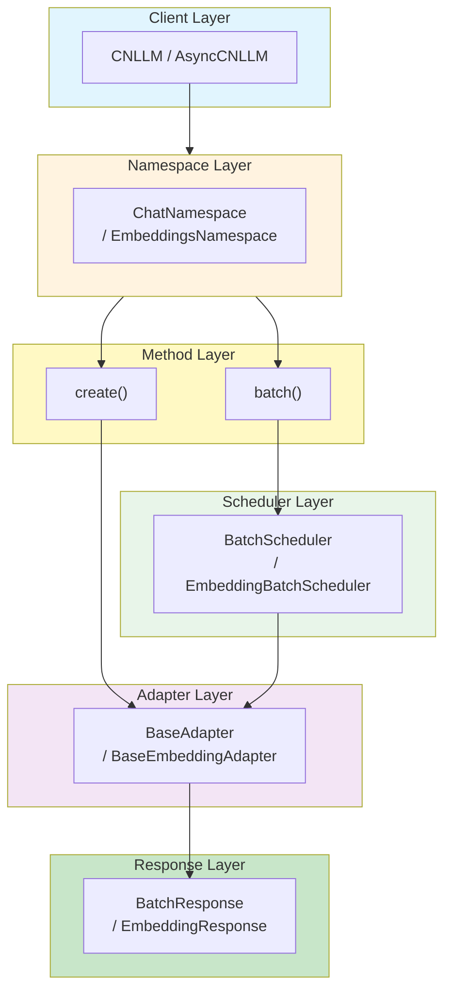
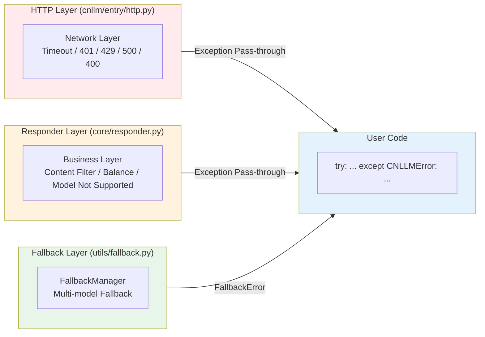
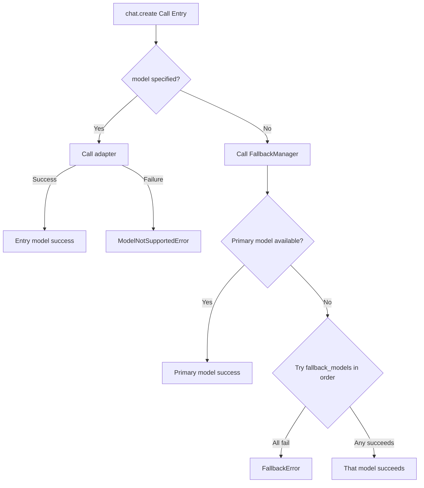
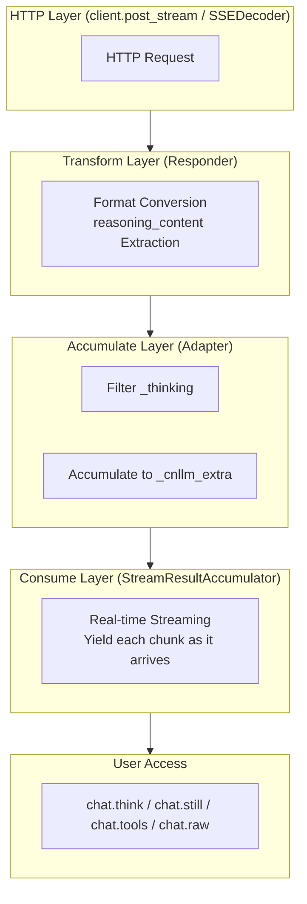
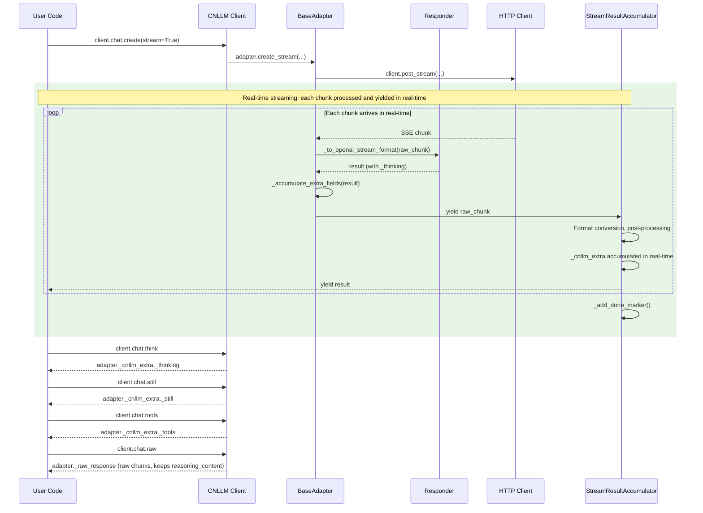

# CNLLM Architecture and Design Documentation

## 0. Directory Structure

```
cnllm/
├── entry/                    # Entry Layer - Client initialization and call entry
│   ├── __init__.py
│   ├── client.py             # CNLLM main client class (sync)
│   ├── async_client.py       # AsyncCNLLM async client class
│   └── http.py               # HTTP request client (httpx unified)
├── core/                     # Core Layer - Adapter abstraction and vendor implementation
│   ├── __init__.py
│   ├── adapter.py            # BaseAdapter base adapter (Chat)
│   ├── embedding.py          # BaseEmbeddingAdapter Embedding adapter
│   ├── responder.py          # Responder response transformation framework
│   ├── accumulators/         # Field accumulators
│   │   ├── __init__.py
│   │   ├── base.py           # Accumulator base class
│   │   ├── single_accumulator.py    # Single request accumulator
│   │   ├── batch_accumulator.py     # Chat batch accumulator
│   │   └── embedding_accumulator.py # Embedding batch accumulator
│   ├── framework/
│   │   ├── __init__.py
│   │   └── langchain.py      # LangChain Runnable integration
│   └── vendor/               # Vendor implementation
│       ├── __init__.py
│       ├── glm.py            # GLM vendor adapter
│       ├── kimi.py           # Kimi vendor adapter
│       ├── doubao.py         # Doubao vendor adapter
│       ├── deepseek.py       # Deepseek vendor adapter
│       ├── minimax.py        # MiniMax vendor adapter
│       └── xiaomi.py         # Xiaomi vendor adapter
└── utils/                    # Utility Layer - Common utilities
    ├── __init__.py
    ├── exceptions.py         # Exception definitions (includes BatchStopOnError)
    ├── fallback.py           # Fallback manager
    ├── batch.py              # Batch scheduler (BatchScheduler, EmbeddingBatchScheduler)
    ├── stream.py             # Streaming utility (SSEDecoder, AsyncSSEDecoder)
    ├── validator.py          # Parameter validator
    └── vendor_error.py       # Vendor error handling

configs/
├── glm/
│   ├── request_glm.yaml
│   └── response_glm.yaml
├── kimi/
│   ├── request_kimi.yaml
│   └── response_kimi.yaml
├── doubao/
│   ├── request_doubao.yaml
│   └── response_doubao.yaml
├── deepseek/
│   ├── request_deepseek.yaml
│   └── response_deepseek.yaml
├── minimax/
│   ├── request_minimax.yaml
│   └── response_minimax.yaml
└── xiaomi/
    ├── request_xiaomi.yaml
    └── response_xiaomi.yaml
```

***

## 1. Architecture Design

### 1.1 Overall Architecture



### 1.2 General Base Class Architecture

| Base Class Component       | File                               | Responsibility                   | Example                                     |
| ------------ | -------------------------------- | -------------------- | -------------------------------------- |
| **Frontend Entry**     | `CNLLM` (entry/client.py)        | Client initialization, call entry          | `CNLLM(model='glm-4')`                 |
| **Async Frontend Entry**   | `AsyncCNLLM` (entry/async_client.py) | Async client initialization, call entry | `AsyncCNLLM(model='kimi-k2.6')`         |
| **Chat Adapter**   | `BaseAdapter` (core/adapter.py)  | Chat request field mapping, Payload construction     | `_build_payload()`, `validate_model()` |
| **Embedding Adapter** | `BaseEmbeddingAdapter` (core/embedding.py) | Embedding request handling | `create_batch()`                       |
| **HTTP Execution**   | `BaseHttpClient` (entry/http.py) | Generic HTTP request, retry mechanism (httpx)   | `post_stream()`, `apost_stream()`      |
| **Response Postprocessing**    | `Responder` (core/responder.py)  | Response field mapping, OpenAI standard format construction | `to_openai_stream_format()`             |
| **Field Accumulator**    | `Accumulator` (core/accumulators/) | Unified field accumulation (non-streaming/batch)   | `BatchResponse`, `EmbeddingResponse`   |

### 1.3 Vendor Layer Architecture

| Vendor Layer Component        | File                        | Responsibility                  | Example                                    |
| ------------ | ------------------------- | ------------------- | ------------------------------------- |
| **Vendor Chat Adapter** | `core/vendor/{vendor}.py` | Vendor-specific Chat request handling, Payload construction | `GLMAdapter.create_completion()`      |
| **Vendor Embedding Adapter** | `core/vendor/{vendor}.py` | Vendor-specific Embedding request handling | `GLMEmbeddingAdapter.create_batch()`   |
| **Vendor Response Converter**  | `core/vendor/{vendor}.py` | Vendor-specific response conversion logic          | `GLMResponder.to_openai_format()`       |
| **Vendor Error Parser**  | `core/vendor/{vendor}.py` | Vendor-specific error parsing            | `GLMVendorError.parse()`               |
| **Request Config**    | `configs/{vendor}/`       | Vendor request field mapping, error code mapping, param validation | `request_{vendor}.yaml`                 |
| **Response Config**    | `configs/{vendor}/`       | Vendor response field mapping, stream processing config      | `response_{vendor}.yaml`               |

### 1.4 Utility Class Architecture

| Utility Class          | File                      | Responsibility                   | Example                                        |
| ------------ | ----------------------- | -------------------- | ----------------------------------------- |
| **Exception System**     | `utils/exceptions.py`   | CNLLM exception base class, unified exception system    | `raise CNLLMError(msg)`                   |
| **Batch Scheduler**    | `utils/batch.py`        | Chat/Embedding batch scheduling    | `BatchScheduler`, `EmbeddingBatchScheduler` |
| **Batch Stop Exception**   | `utils/exceptions.py`    | Exception thrown when stop_on_error    | `BatchStopOnError`                        |
| **Vendor Error Translator**  | `utils/vendor_error.py` | Vendor error translator, translate to CNLLM exception | `translator.to_cnllm_error()`             |
| **Fallback Manager**    | `utils/fallback.py`     | Fallback manager, handle model unavailability fallback logic  | `execute_with_fallback()`                 |
| **Streaming Utility**   | `utils/stream.py`       | SSE decoding, HTTP streaming       | `SSEDecoder`, `AsyncSSEDecoder`           |
| **Parameter Validator**    | `utils/validator.py`    | Parameter validator, validate model, field, param range   | `validate_model()`, `validate_required()` |

***

### 1.5 Call Entry Layer



| Layer | Example |
| --- | --- |
| Client | `CNLLM(model='glm-4', api_key='xxx')` |
| Namespace | `client.chat` / `client.embeddings` |
| Single method | `client.chat.create(messages=[...])` |
| Batch method | `client.chat.batch(['hi', 'hello'])` / `embeddings.create_batch(['text1', 'text2'])` |
| Scheduler | `BatchScheduler(client, max_concurrent=5, stop_on_error=True)` |
| Adapter | `GLMAdapter(api_key='xxx', model='glm-4')` |
| Batch Response | `BatchResponse.total / success / fail / results` |
| Embedding Response | `EmbeddingResponse.dimension / results` |

***

## 2. Call Parameter Chain

### 2.1 Single Call Parameter Chain

```
User calls client.chat.create(timeout=60)
    ↓
Namespace.create(timeout=60)
    ↓
BaseAdapter.__init__(timeout=60)
    ↓
Adapter.validate_params(timeout=60) → filter_supported_params()
    ↓
HTTP request uses self.timeout
```

### 2.2 Batch Call Parameter Chain

```
User calls client.chat.batch(requests, timeout=60, stop_on_error=True, callbacks=[...])
    ↓
Namespace.batch(requests, timeout=60, stop_on_error=True, callbacks=[...])
    ↓
BatchScheduler(client, timeout=actual_timeout, stop_on_error=True, callbacks=[...])
    ↓
scheduler.execute() uses internal parameters
    ↓
adapter.create_completion(request) ← does not pass scheduler parameters
```

### 2.3 YAML Config Parameter Pass-through Mechanism

> **Parameter Pass-through Order**:
>
> - When user calls `chat.create()` or `embeddings.create()`, adapter type (chat/embedding) is already determined
> - After `filter_supported_params` executes, all parameters are filtered to adapter-supported parameters
> - Process order (top to bottom)

| # | Purpose | Access Point | Judgment Range | Judgment Basis | New Parameters |
| --- | --- | --- | --- | --- | --- |
| 1 | Required param validation | `validate_required_params` | required_fields | adapter identifier + chat/embedding level | - |
| 2 | Supported param validation | `filter_supported_params` | required_fields + optional_fields + one_of | adapter identifier + chat/embedding level | - |
| 3 | Mutually exclusive validation | `validate_one_of` | one_of | adapter identifier | - |
| 4 | Get default values | `get_default_value` | hardcoded: timeout, max_retries, retry_delay | - | timeout, max_retries, retry_delay |
| 5 | Validate base_url + get complete path | `validate_base_url` + `get_api_path` | base_url | chat/embedding level | may add: base_url + api_path |
| 6 | Header mapping | `get_header_mappings` | required_fields + optional_fields + one_of | skip: true | - |
| 7 | Build request body | `_build_payload` | required_fields + optional_fields + one_of | field mapping: no skip: true and {fields}.map | - |
| 8 | Model name mapping | `get_vendor_model` | model_mapping | chat/embedding level | - |

**Judgment Basis Explanation**:

- `adapter`: Field-level identifier, e.g., `adapter: [chat]` or `adapter: [embedding]`
- `chat`/`embedding` level: Config has `chat:` or `embedding:` sub-level (e.g., `base_url`)

***

## 3. Exception Handling System Architecture



### 3.1 Error Classification and Handling Responsibilities

| Error Type | Occurrence Scenario | Handling Component |
| --- | --- | --- |
| Network unreachable, connection timeout | Before sending request | HTTP Layer |
| API Key incorrect (401) | Before request reaches server | HTTP Layer |
| Rate limit (429) | Before request reaches server | HTTP Layer |
| Model not found, parameter error (400) | After request reaches server | HTTP Layer |
| Server error (>=500) | After request reaches server | HTTP Layer |
| Business error (sensitive content, insufficient balance) | After model processing | Responder Layer |
| Model not supported | Parameter validation phase | Responder Layer |
| All models failed | Fallback mechanism | Fallback Layer |

***

## 4. FallbackManager Flow Design

Only the client initialization entry accepts the `fallback_models` parameter. It is recommended to configure this option for program or application runtime stability.
When the primary model at the client entry is unavailable, it will try models in `fallback_models` in order.
Code example:

```python
client = CNLLM(
    model="minimax-m2.7", api_key="minimax_key",
    fallback_models={"mimo-v2-flash": "xiaomi-key", "minimax-m2.5": None}  # None means use the API_key configured for the primary model
    )
resp = client.chat.create(prompt="What is 2+2?")  # If model is configured again at the call entry, it will override all models configured at the client entry
print(resp)
```



### 4.1 FallbackError Error Aggregation

When multi-model fallback is configured and all models fail, `FallbackError` aggregates all error information:

```python
try:
    client = CNLLM(
        model="primary-model",
        api_key="key",
        fallback_models={"backup-1": "key1", "backup-2": "key2"}
    )
    client.chat.create(messages=[...])
except FallbackError as e:
    print(e.message)  # "All models failed. Tried: primary-model, backup-1, backup-2"
    for i, err in enumerate(e.errors):
        print(f"[{i+1}] {err}")  # Detailed error for each model
```

***

## 5. Streaming System Architecture

### 5.1 Overall Processing Flow



### 5.2 Component Responsibilities

| Component | File | Core Function | Responsibility |
| --- | --- | --- | --- |
| **SSEDecoder** | `utils/stream.py` | `decode_stream()` | Parse SSE event stream, parse `data: {...}` into JSON objects |
| **StreamHandler** | `utils/stream.py` | `handle_stream()` | Wrap HTTP streaming response, call conversion function for each chunk |
| **StreamResultAccumulator** | `utils/stream.py` | `__iter__()` | **Real-time streaming**: yield each chunk as it arrives, post-processing in real-time |
| **StreamResultAccumulator** | `utils/stream.py` | `get_chunks()` | Return filtered chunks list (filter reasoning_content and non-first role) |
| **Responder.to_openai_stream_format** | `core/responder.py` | `to_openai_stream_format()` | Convert vendor raw response to OpenAI streaming format, add `_thinking` field |
| **Adapter._handle_stream** | `core/adapter.py` | `_handle_stream()` | Initialize `_raw_response` and `_cnllm_extra`, return stream handler |
| **Adapter._accumulate_extra_fields** | `core/adapter.py` | `_accumulate_extra_fields()` | Extract `_thinking`, `content`, `tool_calls` from chunk and accumulate to `_cnllm_extra` |
| **client.chat.think** | `entry/client.py` | `ChatNamespace.think` | Return `adapter._cnllm_extra._thinking` |
| **client.chat.still** | `entry/client.py` | `ChatNamespace.still` | Return `adapter._cnllm_extra._still` |
| **client.chat.tools** | `entry/client.py` | `ChatNamespace.tools` | Return `adapter._cnllm_extra._tools` |
| **client.chat.raw** | `entry/client.py` | `ChatNamespace.raw` | Return `adapter._raw_response` (raw response, unfiltered) |

### 5.3 Key Design Decisions

#### 5.3.1 Real-time Streaming Mode

`StreamResultAccumulator` uses **real-time streaming** mode, yielding each chunk as it arrives:

```python
def __iter__(self):
    for raw_chunk in self._raw_iterator:
        result = self._adapter._to_openai_stream_format(raw_chunk)
        self._accumulate_extra_fields(result)
        self._post_process_chunk(result)
        self._chunks.append(result)
        self._adapter._raw_response["chunks"].append(clean_for_raw)
        yield result  # Real-time yield, no waiting for all chunks
    self._done = True
    self._add_done_marker()
```

**Features**:

- When user iterates `for chunk in response`, each chunk **arrives in real-time** (no waiting for entire HTTP stream)
- `_cnllm_extra` and `_raw_response["chunks"]` are **accumulated in real-time** during iteration
- Suitable for frontend streaming rendering scenarios that require real-time consumption

#### 5.3.2 Dual-Layer Accumulation Mechanism

Accumulation occurs in **two places** simultaneously:

1. **StreamResultAccumulator Layer** (`_accumulate_extra_fields`): Accumulate to `adapter._cnllm_extra`
   - For `client.chat.think/still/tools` attribute access

2. **StreamResultAccumulator Layer**: Store filtered clean chunk to `adapter._raw_response["chunks"]` in real-time

#### 5.3.3 Field Filtering Rules

| Field Type | Example | Filter Rule | Description |
| --- | --- | --- | --- |
| Final Accumulation Field | `_thinking`, `_still`, `_tools` | **Filter** | Store to `adapter._cnllm_extra` for user access |
| Raw Response Field | `reasoning_content` (no `_`) | **Keep** | `.raw` keeps, `.response` filters |
| Standard OpenAI Field | `id`, `choices`, `delta`, etc. | **Keep** | Both `.raw` and `.response` keep |

#### 5.3.4 Chunk Post-Processing Rules (StreamResultAccumulator)

Execute after immediate consumption in `__init__`:

```python
# 1. Identify all ending chunks
finish_indices = [i for i, chunk in enumerate(chunks)
                  if chunk.get("choices", [{}])[0].get("finish_reason") in ("stop", "tool_calls")]

# 2. When multiple ending chunks, keep only the first one
if len(finish_indices) > 1:
    for idx in reversed(finish_indices[1:]):
        chunks.pop(idx)

# 3. Filter role field by choice.index (maintain OpenAI compatibility)
_seen_choice_indices = set()
for chunk in chunks:
    for choice in chunk.get("choices", []):
        delta = choice.get("delta", {})
        choice_idx = choice.get("index")
        if choice_idx in _seen_choice_indices:
            if "role" in delta:
                del delta["role"]
        else:
            _seen_choice_indices.add(choice_idx)

# 4. Filter tool_calls id/type/name by tool_calls.index (OpenAI streaming standard)
_seen_tool_call_indices = set()
for chunk in chunks:
    for choice in chunk.get("choices", []):
        delta = choice.get("delta", {})
        if "tool_calls" in delta:
            for tc in delta["tool_calls"]:
                idx = tc.get("index")
                if idx in _seen_tool_call_indices:
                    tc.pop("id", None)
                    tc.pop("type", None)
                    if "function" in tc and "name" in tc["function"]:
                        del tc["function"]["name"]
                else:
                    _seen_tool_call_indices.add(idx)

# 5. Add [DONE] marker (if vendor didn't return it)
if chunks[-1] != "[DONE]":
    chunks.append("[DONE]")
```

#### 5.3.5 Streaming Field Filtering Rules

In streaming responses, the following fields are filtered by index to comply with OpenAI standard:

**`delta.role` Filtering Rule**
- Judgment by `choice.index`
- First occurrence of `choice.index` → **Keep** `role: assistant`
- Same `choice.index` appearing again → **Remove** `role`

**`tool_calls` Filtering Rule**
- Judgment by `tool_calls[].index`
- First occurrence of `tool_calls[].index` → **Keep** `id`, `type`, `function.name`, `arguments`
- Same `tool_calls[].index` appearing again → **Keep only** `index` and `function.arguments`

> **Independence**: `choice.index` (which message) and `tool_calls.index` (which tool) are completely independent and do not affect each other.

**Termination Chunk**
- If vendor didn't return `data: [DONE]`, automatically add string `"[DONE]"` as the stream termination marker
- Returns this terminator when iterating to the end

#### 5.3.6 Unified Streaming/Non-Streaming Interface

```python
# Streaming
response = client.chat.create(messages=[...], stream=True, tools=[...])

print(response)  # OpenAI standard format streaming chunks

# Important field access
print(client.chat.think)  # Thinking content
print(client.chat.still)  # Response content
print(client.chat.tools)  # Tool calls
print(client.chat.raw)  # Raw response chunks (keeps reasoning_content as-is)
```

### 5.4 Data Flow Sequence Diagram



***

## 6. CNLLM Standard Response Format

The system supports 12 response types, combined from 3 dimensions:

| Dimension | Options |
| --- | --- |
| Call Mode | Sync / Async |
| Streaming Mode | Streaming / Non-streaming |
| Batch Mode | Batch / Non-batch |

### 6.1 Response Type Overview

| # | Type | Return Type | Accumulator Class |
|---|------|----------|--------------|
| 1 | Sync non-streaming non-batch | `Dict` | `NonStreamAccumulator` |
| 2 | Sync streaming non-batch | `Iterator[Dict]` | `StreamAccumulator` |
| 3 | Sync non-streaming batch | `BatchResponse` | `BatchNonStreamAccumulator` |
| 4 | Sync streaming batch | `Iterator[Dict]` | `BatchStreamAccumulator` |
| 5 | Async non-streaming non-batch | `Dict` | `AsyncNonStreamAccumulator` |
| 6 | Async streaming non-batch | `AsyncIterator[Dict]` | `AsyncStreamAccumulator` |
| 7 | Async non-streaming batch | `BatchResponse` | `AsyncBatchNonStreamAccumulator` |
| 8 | Async streaming batch | `AsyncIterator[Dict]` | `AsyncBatchStreamAccumulator` |
| 9 | Sync non-batch Embeddings | `Dict` | `EmbeddingAccumulator` |
| 10 | Sync batch Embeddings | `EmbeddingResponse` | `EmbeddingBatchAccumulator` |
| 11 | Async non-batch Embeddings | `Dict` | `AsyncEmbeddingAccumulator` |
| 12 | Async batch Embeddings | `EmbeddingResponse` | `AsyncEmbeddingBatchAccumulator` |

### 6.2 Non-batch Response Types

#### Types 1, 5: Sync/Async Non-streaming Non-batch

```python
# Return format: Dict (OpenAI standard format)
{
    "id": "chatcmpl-xxx",
    "object": "chat.completion",
    "created": 1234567890,
    "model": "minimax-m2.7",
    "choices": [{
        "index": 0,
        "message": {
            "role": "assistant",
            "content": "This is the response content"
        },
        "finish_reason": "stop"
    }],
    "usage": {
        "prompt_tokens": 5,
        "completion_tokens": 4,
        "total_tokens": 9
    }
}
```

#### Types 2, 6: Sync/Async Streaming Non-batch

```python
# Return format: Iterator[Dict] / AsyncIterator[Dict]
# Start chunk:
{
    "id": "chatcmpl-xxx",
    "object": "chat.completion.chunk",
    "created": 1234567890,
    "model": "minimax-m2.7",
    "choices": [{
        "index": 0,
        "delta": {
            "role": "assistant",
            "content": "Partial content"
        },
        "finish_reason": None
    }]
},

# Middle chunk:
{
    "id": "chatcmpl-xxx",
    "object": "chat.completion.chunk",
    "created": 1234567890,
    "model": "minimax-m2.7",
    "choices": [{
        "index": 0,
        "delta": {
            "content": "More content"
        },
        "finish_reason": None
    }]
},

# Last chunk:
{
    "id": "chatcmpl-xxx",
    "object": "chat.completion.chunk",
    "created": 1234567890,
    "model": "minimax-m2.7",
    "choices": [{
        "index": 0,
        "delta": {},
        "finish_reason": "stop"
    }]
}
```

### 6.3 Batch Response Types

#### Type 3, 7: Sync/Async Non-streaming Batch

```python
# Return format: BatchResponse
{
    "total": 10,           # Total requests
    "success": 9,           # Successful requests
    "fail": 1,            # Failed requests
    "results": [
        {"id": "chatcmpl-1", "choices": [...], "usage": {...}, "_custom_id": "req-1"},
        {"id": "chatcmpl-2", "choices": [...], "usage": {...}, "_custom_id": "req-2"},
        ...
    ],
    "errors": [
        {"error": "Rate limit", "message": "Too many requests", "_custom_id": "req-10"}
    ]
}

# Access methods:
batch_response.total       # Total count
batch_response.success  # Success count
batch_response.fail    # Fail count
batch_response.results # List of successful responses
batch_response.errors  # List of error details
batch_response.responses_by_id("req-1")  # Get by custom_id
batch_response.error_of("req-10")     # Get error by custom_id
```

#### Type 4, 8: Sync/Async Streaming Batch

```python
# Return format: Iterator[Dict] / AsyncIterator[Dict]
# Each item is a streaming chunk for each request
# Combined with BatchScheduler for concurrent processing
```

### 6.4 Embedding Response Types

#### Type 9, 11: Non-batch Embeddings

```python
# Return format: Dict
{
    "object": "list",
    "data": [
        {
            "object": "embedding",
            "embedding": [0.123, -0.456, ...],  # 1024-dim vector
            "index": 0
        }
    ],
    "model": "embedding-3-pro",
    "usage": {
        "prompt_tokens": 8,
        "total_tokens": 8
    }
}

# Access:
response.embedding    # [0.123, -0.456, ...]
response.dimension   # 1024
response.token_usage # 8
```

#### Type 10, 12: Batch Embeddings

```python
# Return format: EmbeddingResponse
{
    "total": 3,
    "success": 3,
    "fail": 0,
    "dimension": 1024,
    "results": [
        {"embedding": [0.1, -0.2, ...], "index": 0, "_custom_id": "text-1"},
        {"embedding": [0.3, -0.4, ...], "index": 1, "_custom_id": "text-2"},
        {"embedding": [0.5, -0.6, ...], "index": 2, "_custom_id": "text-3"}
    ],
    "errors": []
}

# Access methods:
embedding_response.total      # Total count
embedding_response.success    # Success count
embedding_response.fail     # Fail count
embedding_response.dimension   # Vector dimension
embedding_response.results  # List of successful embeddings
embedding_response.errors   # List of error details
embedding_response.embedding_of("text-1")  # Get by custom_id
```

***

## 7. Batch Calls Architecture

See [Batch Calls Architecture](/feature/batch.md)

## 8. Async Implementation

See [Async Implementation](/feature/async.md)

## 9. Embedding Implementation

See [Embedding Implementation](/feature/embedding.md)
