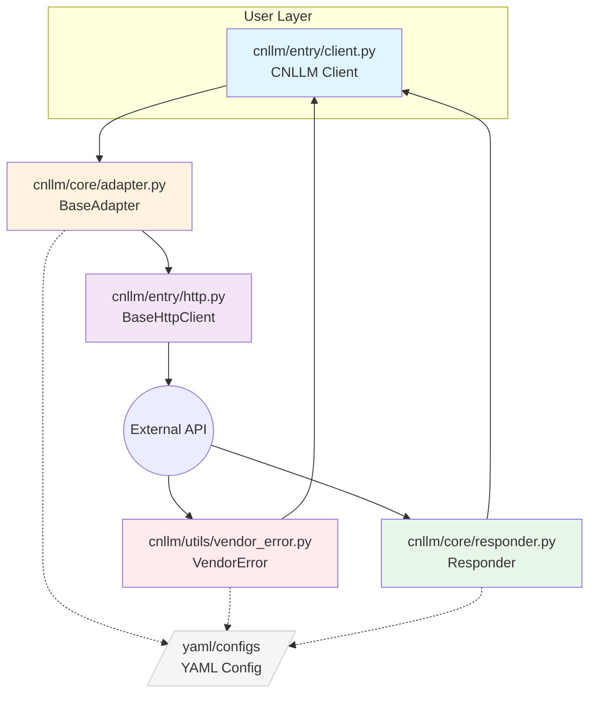
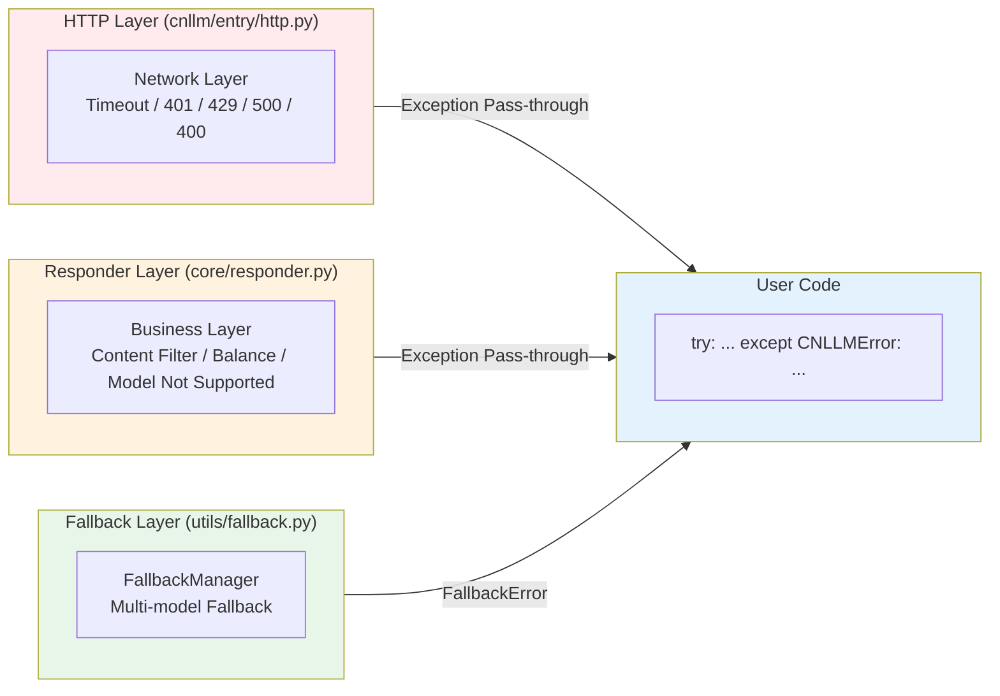
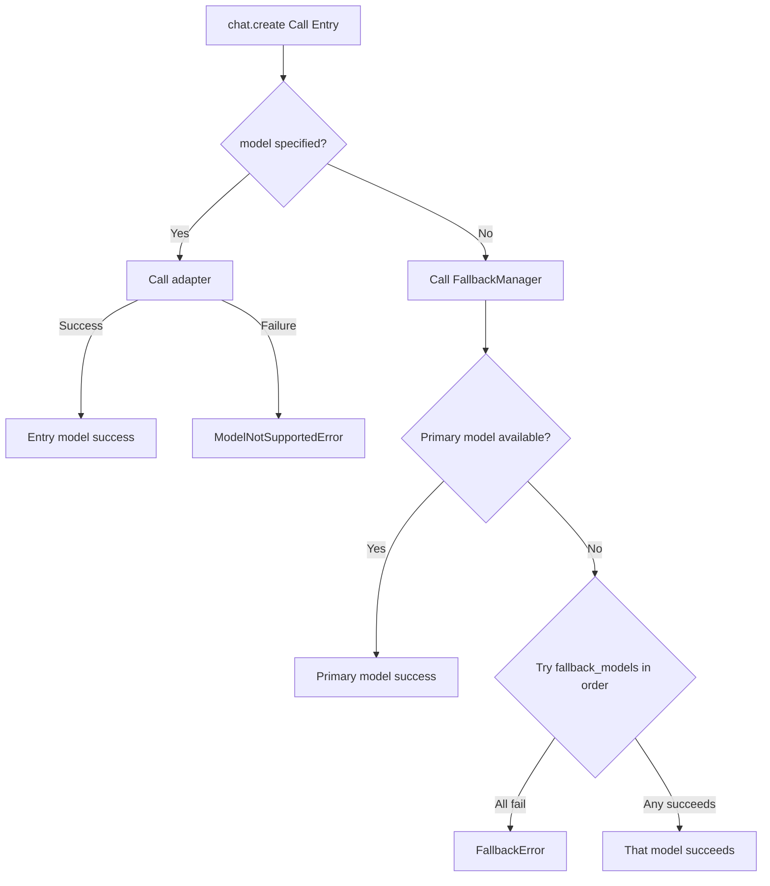
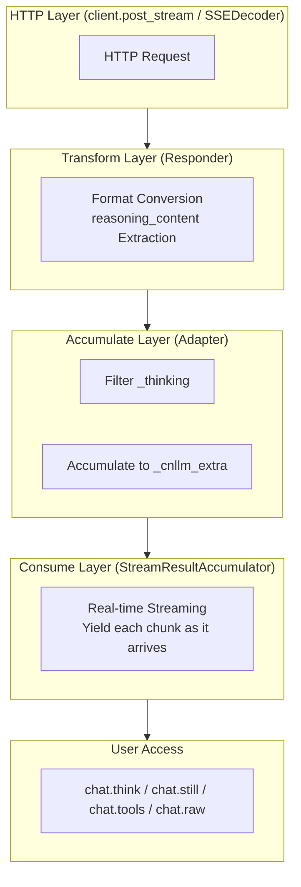
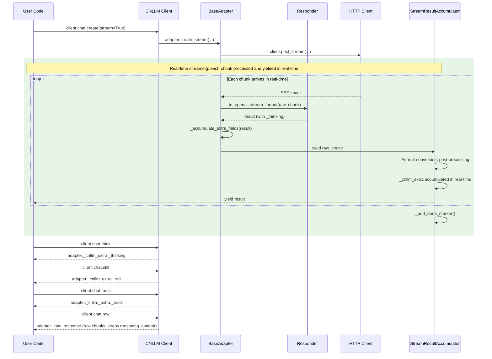

# CNLLM Architecture and Design Documentation

## 1. Architecture Design

### 1.1 Overall Architecture



### 1.2 General Base Class Architecture

| Base Class Component | File | Responsibility | Example |
| --- | --- | --- | --- |
| **Frontend Entry** | `CNLLM` (entry/client.py) | Client initialization, call entry | `CNLLM(model='minimax-m2.7')` |
| **Request Preprocessing** | `BaseAdapter` (core/adapter.py) | Request field mapping, Payload construction | `_build_payload()`, `validate_model()` |
| **HTTP Execution** | `BaseHttpClient` (entry/http.py) | Generic HTTP request, retry mechanism | `post_stream()`, `post()` |
| **Response Postprocessing** | `Responder` (core/responder.py) | Response field mapping, OpenAI standard format construction | `to_openai_stream_format()` |

### 1.2 Vendor Layer Architecture

| Vendor Layer Component | File | Responsibility | Example |
| --- | --- | --- | --- |
| **Vendor Adapter** | `core/vendor/{vendor}.py` | Vendor-specific request handling, Payload construction | `MiniMaxAdapter.create_completion()` |
| **Vendor Response Converter** | `core/vendor/{vendor}.py` | Vendor-specific response conversion logic | `MiniMaxResponder.to_openai_format()` |
| **Vendor Error Parser** | `core/vendor/{vendor}.py` | Vendor-specific error parsing | `MiniMaxVendorError.parse()` |
| **Request Config** | `configs/{vendor}/` | Vendor request field mapping, error code mapping, param validation | `request_{vendor}.yaml` |
| **Response Config** | `configs/{vendor}/` | Vendor response field mapping, stream processing config | `response_{vendor}.yaml` |

### 1.3 Utility Class Architecture

| Utility Class | File | Responsibility | Example |
| --- | --- | --- | --- |
| **Exception System** | `utils/exceptions.py` | CNLLM exception base class, unified exception system | `raise CNLLMError(msg)` |
| **Vendor Error Translator** | `utils/vendor_error.py` | Vendor error translator, translate to CNLLM exception | `translator.to_cnllm_error()` |
| **Fallback Manager** | `utils/fallback.py` | Fallback manager, handle model unavailability fallback logic | `execute_with_fallback()` |
| **Streaming Utility** | `utils/stream.py` | Streaming utility, handle streaming response | `process_stream_chunk()` |
| **Parameter Validator** | `utils/validator.py` | Parameter validator, validate model, field, param range | `validate_model()`, `validate_required()` |

***

## 2. Directory Structure

```
cnllm/
├── entry/                    # Entry Layer - Client initialization and call entry
│   ├── __init__.py
│   ├── client.py             # CNLLM main client class
│   └── http.py               # HTTP request client
├── core/                     # Core Layer - Adapter abstraction and vendor implementation
│   ├── __init__.py
│   ├── adapter.py            # BaseAdapter base adapter
│   ├── responder.py          # Responder response transformation framework
│   ├── framework/
│   │   ├── __init__.py
│   │   └── langchain.py      # LangChain Runnable integration
│   └── vendor/               # Vendor implementation
│       ├── __init__.py
│       ├── minimax.py        # MiniMax vendor adapter
│       └── xiaomi.py         # Xiaomi vendor adapter
└── utils/                    # Utility Layer - Common utilities
    ├── __init__.py
    ├── exceptions.py         # Exception definitions
    ├── fallback.py           # Fallback manager
    ├── stream.py             # Streaming utility
    ├── validator.py          # Parameter validator
    └── vendor_error.py       # Vendor error handling

configs/
├── minimax/
│   ├── request_minimax.yaml  # Request config
│   └── response_minimax.yaml # Response config
└── xiaomi/
    ├── request_xiaomi.yaml   # Request config
    └── response_xiaomi.yaml  # Response config
```

***

## 3. Exception Handling System Architecture



***

## 4. FallbackManager Flow Design

Only the client initialization entry accepts the `fallback_models` parameter. It is recommended to configure this option for program or application runtime stability.
When the primary model at the client entry is unavailable, it will try models in `fallback_models` in order.
Code example:

```python
client = CNLLM(
    model="minimax-m2.7", api_key="minimax_key",
    fallback_models={"mimo-v2-flash": "xiaomi-key", "minimax-m2.5": None}  # None means use the API_key configured for the primary model
    )
resp = client.chat.create(prompt="What is 2+2?")  # If model is configured again at the call entry, it will override all models configured at the client entry
print(resp)
```



***

## 5. Streaming System Architecture

### 5.1 Overall Processing Flow



### 5.2 Component Responsibilities

| Component | File | Core Function | Responsibility |
| --- | --- | --- | --- |
| **SSEDecoder** | `utils/stream.py` | `decode_stream()` | Parse SSE event stream, parse `data: {...}` into JSON objects |
| **StreamHandler** | `utils/stream.py` | `handle_stream()` | Wrap HTTP streaming response, call conversion function for each chunk |
| **StreamResultAccumulator** | `utils/stream.py` | `__iter__()` | **Real-time streaming**: yield each chunk as it arrives, post-processing in real-time |
| **StreamResultAccumulator** | `utils/stream.py` | `get_chunks()` | Return filtered chunks list (filter reasoning_content and non-first role) |
| **Responder.to_openai_stream_format** | `core/responder.py` | `to_openai_stream_format()` | Convert vendor raw response to OpenAI streaming format, add `_thinking` field |
| **Adapter._handle_stream** | `core/adapter.py` | `_handle_stream()` | Initialize `_raw_response` and `_cnllm_extra`, return stream handler |
| **Adapter._accumulate_extra_fields** | `core/adapter.py` | `_accumulate_extra_fields()` | Extract `_thinking`, `content`, `tool_calls` from chunk and accumulate to `_cnllm_extra` |
| **client.chat.think** | `entry/client.py` | `ChatNamespace.think` | Return `adapter._cnllm_extra._thinking` |
| **client.chat.still** | `entry/client.py` | `ChatNamespace.still` | Return `adapter._cnllm_extra._still` |
| **client.chat.tools** | `entry/client.py` | `ChatNamespace.tools` | Return `adapter._cnllm_extra._tools` |
| **client.chat.raw** | `entry/client.py` | `ChatNamespace.raw` | Return `adapter._raw_response` (raw response, unfiltered) |

### 5.3 Key Design Decisions

#### 5.3.1 Real-time Streaming Mode

`StreamResultAccumulator` uses **real-time streaming** mode, yielding each chunk as it arrives:

```python
def __iter__(self):
    for raw_chunk in self._raw_iterator:
        result = self._adapter._to_openai_stream_format(raw_chunk)
        self._accumulate_extra_fields(result)
        self._post_process_chunk(result)
        self._chunks.append(result)
        self._adapter._raw_response["chunks"].append(clean_for_raw)
        yield result  # Real-time yield, no waiting for all chunks
    self._done = True
    self._add_done_marker()
```

**Features**:

- When user iterates `for chunk in response`, each chunk **arrives in real-time** (no waiting for entire HTTP stream)
- `_cnllm_extra` and `_raw_response["chunks"]` are **accumulated in real-time** during iteration
- Suitable for frontend streaming rendering scenarios that require real-time consumption

#### 5.3.2 Dual-Layer Accumulation Mechanism

Accumulation occurs in **two places** simultaneously:

1. **StreamResultAccumulator Layer** (`_accumulate_extra_fields`): Accumulate to `adapter._cnllm_extra`
   - For `client.chat.think/still/tools` attribute access

2. **StreamResultAccumulator Layer**: Store filtered clean chunk to `adapter._raw_response["chunks"]` in real-time

#### 5.3.3 Field Filtering Rules

| Field Type | Example | Filter Rule | Description |
| --- | --- | --- | --- |
| Final Accumulation Field | `_thinking`, `_still`, `_tools` | **Filter** | Store to `adapter._cnllm_extra` for user access |
| Raw Response Field | `reasoning_content` (no `_`) | **Keep** | `.raw` keeps, `.response` filters |
| Standard OpenAI Field | `id`, `choices`, `delta`, etc. | **Keep** | Both `.raw` and `.response` keep |

#### 5.3.4 Chunk Post-Processing Rules (StreamResultAccumulator)

Execute after immediate consumption in `__init__`:

```python
# 1. Identify all ending chunks
finish_indices = [i for i, chunk in enumerate(chunks)
                  if chunk.get("choices", [{}])[0].get("finish_reason") in ("stop", "tool_calls")]

# 2. When multiple ending chunks, keep only the first one
if len(finish_indices) > 1:
    for idx in reversed(finish_indices[1:]):
        chunks.pop(idx)

# 3. Filter role field by choice.index (maintain OpenAI compatibility)
_seen_choice_indices = set()
for chunk in chunks:
    for choice in chunk.get("choices", []):
        delta = choice.get("delta", {})
        choice_idx = choice.get("index")
        if choice_idx in _seen_choice_indices:
            if "role" in delta:
                del delta["role"]
        else:
            _seen_choice_indices.add(choice_idx)

# 4. Filter tool_calls id/type/name by tool_calls.index (OpenAI streaming standard)
_seen_tool_call_indices = set()
for chunk in chunks:
    for choice in chunk.get("choices", []):
        delta = choice.get("delta", {})
        if "tool_calls" in delta:
            for tc in delta["tool_calls"]:
                idx = tc.get("index")
                if idx in _seen_tool_call_indices:
                    tc.pop("id", None)
                    tc.pop("type", None)
                    if "function" in tc and "name" in tc["function"]:
                        del tc["function"]["name"]
                else:
                    _seen_tool_call_indices.add(idx)

# 5. Add [DONE] marker (if vendor didn't return it)
if chunks[-1] != "[DONE]":
    chunks.append("[DONE]")
```

#### 5.3.5 Streaming Field Filtering Rules

In streaming responses, the following fields are filtered by index to comply with OpenAI standard:

**`delta.role` Filtering Rule**
- Judgment by `choice.index`
- First occurrence of `choice.index` → **Keep** `role: assistant`
- Same `choice.index` appearing again → **Remove** `role`

**`tool_calls` Filtering Rule**
- Judgment by `tool_calls[].index`
- First occurrence of `tool_calls[].index` → **Keep** `id`, `type`, `function.name`, `arguments`
- Same `tool_calls[].index` appearing again → **Keep only** `index` and `function.arguments`

> **Independence**: `choice.index` (which message) and `tool_calls.index` (which tool) are completely independent and do not affect each other.

**Termination Chunk**
- If vendor didn't return `data: [DONE]`, automatically add string `"[DONE]"` as the stream termination marker
- Returns this terminator when iterating to the end

#### 5.3.6 Unified Streaming/Non-Streaming Interface

```python
# Streaming
response = client.chat.create(messages=[...], stream=True, tools=[...])

print(response)  # OpenAI standard format streaming chunks

# Important field access
print(client.chat.think)  # Thinking content
print(client.chat.still)  # Response content
print(client.chat.tools)  # Tool calls
print(client.chat.raw)  # Raw response chunks (keeps reasoning_content as-is)
```

### 5.4 Data Flow Sequence Diagram



***

## 7. Batch Calls Architecture

See [Batch Calls Architecture](/feature/batch.md)

## 8. Async Implementation

See [Async Implementation](/feature/async.md)

## 9. Embedding Implementation

See [Embedding Implementation](/feature/embedding.md)