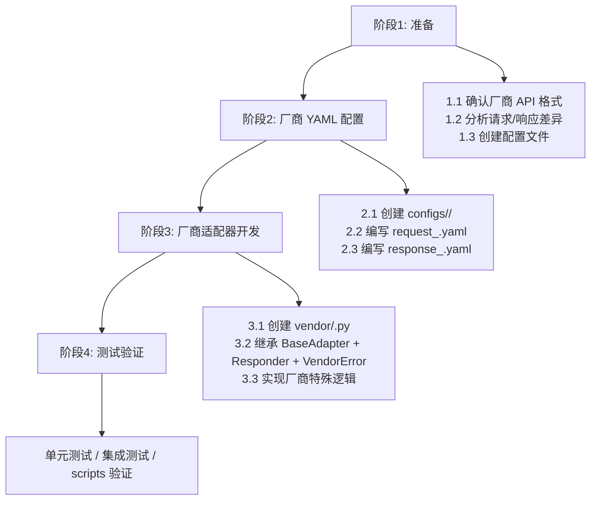
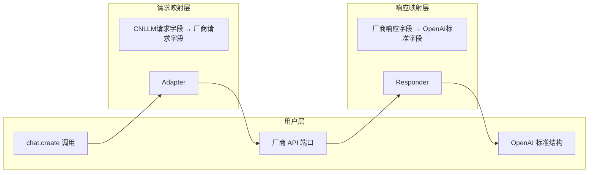

# 新厂商适配开发指南

CNLLM 项目文本处理方向的基础框架已基本完善，详细的系统架构可以参阅[系统架构](ARCHITECTURE.md)。
本文档梳理开发新厂商适配的标准流程，基于 MiniMax 和小米 mimo 适配开发经验总结。

## 两种路线

### 路线1：适配厂商的OpenAI兼容接口

- 优势：适配简单，请求前后字段基本一致。
- 劣势：兼容接口一般功能较少，缺少厂商原生功能。
- 案例：小米mimo系列模型适配采用此路线，因为小米官方只提供OpenAI兼容接口。

### 路线2：适配厂商的原生接口

- 优势：功能完善，支持更多厂商原生功能。
- 劣势：适配复杂，需要详细分析厂商 API 的请求和响应格式，需要在vendor适配器中实现厂商特殊逻辑处理。
- 案例：MiniMax M2系列的模型适配采用此路线，支持更多原生接口的独特能力，如：
  `thinking`深度思考模式
  `top_p`最小概率采样
  `mask`掩码输入
  最后以符合OpenAI API规范的格式返回响应。

***

## 开发流程概览



***

## 阶段1: 准备

### 1.1 架构示意图



### 1.2 确认字段差异

#### 请求字段差异（以 MiniMax 为例）

**CNLLM 标准请求字段**以**OpenAI 标准请求参数**为基础，增加如`thinking`等国内厂商基本统一的字段。
这样做的好处是，用户在切换不同模型时，仅需遵守一套字段标准。

**非 OpenAI 标准请求字段**
- 如`thinking` 深度思考模式并非 OpenAI 标准字段，但已作为**CNLLM 标准请求字段**开发，统一各厂商的不同格式。
  在 CNLLM标准请求字段中，将小米 mimo 的 `"thinking": {"type": "enabled"}`和 `thinking": {"type": "disabled"}` 统一为 `thinking=true` 或 `thinking=false`这种更符合用户习惯的格式。

如厂商请求字段与**CNLLM 标准请求字段**不一致，需在**厂商 YAML 配置文件**中映射，映射为**厂商请求字段**:
- 如用户使用 MiniMax M2 系列模型时传入 `max_tokens` 字段时，将被映射为 `max_completion_tokens`  字段
- 如用户使用小米 mimo 模型时传入的`"thinking": {"type": "enabled"}`，将被映射为 `thinking=true`

如为**厂商特有参数**，则用户可直接使用厂商定义的字段，会直接透传到厂商 API，如 MiniMax M2系列模型的特殊参数:
- `top_k` 最大K采样数
- `mask` 掩码输入

CNLLM 在完成 **OpenAI 标准请求字段 → 厂商请求字段**的映射后，加入厂商特有字段，拼接成适配厂商 API 的完整请求体。

**请求头**

| CNLLM 标准请求字段 | MiniMax 请求字段 |
| :----------------: | :--------------: |
| `api_key`          | `Authorization` |
| `organization`     | `group_id`       |

**请求体字段**

| CNLLM 标准请求字段 | MiniMax 请求字段 |
| :----------------: | :--------------: |
| `model`           | `model`         |
| `messages`        | `messages`      |
| `temperature`     | `temperature`   |
| `top_p`           | `top_p`        |
| `stream`          | `stream`        |
| `stop`            | `stop`          |
| `presence_penalty` | `presence_penalty` |
| `frequency_penalty` | `frequency_penalty` |
| `user`            | `user`          |
| `tools`           | `tools`         |
| `tool_choice`     | `tool_choice`   |
| `max_tokens`      | `max_completion_tokens` |
| `thinking`        | `thinking`        |
| -                 | `mask`     |
| -            | `top_k`       |

CNLLM 的标准**响应字段**将国内厂商的响应字段统一为 **OpenAI 标准响应字段**，之后封装为 OpenAI 标准响应格式。

如厂商响应字段与 OpenAI 标准字段不一致，需在**厂商 YAML 配置文件**中映射为 **OpenAI 标准响应字段**:
- 如 MiniMax 的响应中，`reasoning_content` 字段，将被从 CNLM中的完整响应体中丢弃。
  但是，我们提供了`chat.create.think`的入口，用户可通过该入口获取厂商原生响应中的`reasoning_content`字段。
  以及`chat.create.raw`可获取厂商原生响应中的所有字段。

CNLLM 在完成 **厂商响应字段 → OpenAI 标准响应字段**的映射后，拼接成完整响应体。

#### 响应字段差异（以 MiniMax 为例）

| CNLLM 标准响应字段 | MiniMax 响应字段 |
| :----------------: | :--------------: |
| `id`              | `id`             |
| `created`         | `created`        |
| `model`           | `model`          |
| `content`         | `choices[0].message.content` |
| `tool_calls`      | `choices[0].message.tool_calls` |
| `prompt_tokens`   | `usage.prompt_tokens` |
| `completion_tokens` | `usage.completion_tokens` |
| `total_tokens`    | `usage.total_tokens` |
| `reasoning_tokens` | `usage.completion_tokens_details.reasoning_tokens` |
| -                 | `choices[0].message.reasoning_content` |

***

## 阶段2: 厂商 YAML 配置

### 2.1 YAML 逻辑实现

| 用途 | 访问点 | YAML 路径 | YAML 表名 |
| --- | --- | --- | --- |
| 获取默认值 | `timeout`, `max_retries`... | `optional_fields.{field}.default` | request\_{vendor}.yaml |
| 厂商请求字段映射 | `_build_payload` | `optional_fields.{field}.body` | request\_{vendor}.yaml |
| 请求头映射 | `_build_headers` | `optional_fields.{field}.header` | request\_{vendor}.yaml |
| 必填参数校验 | `validate_required_params` | `required_fields` | request\_{vendor}.yaml |
| 参数支持校验 | `filter_supported_params` | `optional_fields` | request\_{vendor}.yaml |
| 互斥参数校验 | `validate_one_of` | `one_of` | request\_{vendor}.yaml |
| API配置 | `get_base_url`, `get_api_path` | `optional_fields.base_url.default`, `request.method` | request\_{vendor}.yaml |
| 模型名映射 | `model_mapping` | `model_mapping` | request\_{vendor}.yaml |
| OpenAI 响应字段映射 | `Responder` | `fields` | response\_{vendor}.yaml |
| 敏感内容检测 | `Responder` | `error_check.sensitive_check` | response\_{vendor}.yaml |
| 流式响应映射 | `Responder` | `stream_fields` | response\_{vendor}.yaml |


### 2.2 请求配置 configs/request\_{vendor}.yaml

**HTTP 请求配置**

```yaml
request:
  method: "POST"
  headers:
    Content-Type: "application/json"
    Authorization: "Bearer ${api_key}"
```

**必填字段和选填字段映射**

字段映射部分采用键值对形式，如厂商请求字段与OpenAI标准请求字段一致，则值可留空。

```yaml
request:  # 请求头配置
  method: "POST"
  headers: 
    Content-Type: "application/json"
    Authorization: "Bearer ${api_key}"

required_fields:  # 必填参数校验，参数支持校验
  model: ""  # Value 留空表示无需映射，字段保持不变，便于人工维护
  api_key:
    body: "__skip__" # 请求头或内部字段，跳过请求体构建

one_of:  # 互斥参数校验
  messages_or_prompt:
    messages: ""
    prompt: ""

optional_fields:  # 参数支持校验
  base_url:
    body: "__skip__"
    default: "https://api.minimaxi.com/v1"  # 有默认值的字段
    text: "text/chatcompletion_v2"
  organization:
    body: "__skip__"  
    head: "group_id"  # 请求头字段映射，在 build_headers()函数中映射
  max_tokens:
    body: "max_completion_tokens"  # 请求体字段映射，在 build_payload()函数中映射
  stream: ""
  top_p: ""
  top_k: ""
  tools: ""
    # ...其他支持的字段
```

**模型映射**

```yaml
model_mapping:  # 模型映射，模型支持校验
  minimax-m2: "MiniMax-M2"
  minimax-m2.1: "MiniMax-M2.1"
```

**错误码映射**

```yaml
error_check: # 请求配置中的错误事件发生在模型响应前，模型并未成功响应
  code_path: "base_resp.status_code"
  success_code: 0
  message_path: "base_resp.status_msg"
  auth_code: 1004
  error_codes:
    1000:
      type: "unknown_error"
      message: "未知错误"
      suggestion: "请稍后重试"
    # ...其他厂商 API 端口的错误码映射
```

### 2.3 响应配置 configs/response\_{vendor}.yaml

```yaml
fields:  # 响应配置目前采用路径映射，与请求配置不同
  id: "id"
  created: "created"
  model: "model"
  content: "choices[0].message.content"
  tool_calls: "choices[0].message.tool_calls"
  # ...其他字段映射

defaults: # 兜底的默认值，厂商响应中字段可能不存在
  object: "chat.completion"
  index: 0
  role: "assistant"
  finish_reason: "stop"

stream_fields:  # 流式响应的路径映射
  object: "chat.completion.chunk"
  index: 0
  content_path: "choices[0].delta.content"
  tool_calls_path: "choices[0].delta.tool_calls"
  reasoning_content_path: "choices[0].delta.reasoning_content"

error_check:  # 响应配置中的错误事件发生在模型响应后，模型返回响应体，但发生业务层错误
  sensitive_check: 
    input_sensitive_type_path: "input_sensitive_type"
    output_sensitive_type_path: "output_sensitive_type"
```

***

## 阶段3: 适配器开发

### 3.1 创建适配器文件

厂商适配器需要继承三类基类组件，基类中定义了大量通用方法，在厂商适配器层只需要实现厂商的特殊逻辑：

```python
# 创建位置： cnllm/core/vendor/<vendor>.py
from . import BaseAdapter
from ..responder import Responder
from ...utils.vendor_error import VendorError, VendorErrorRegistry

class <Vendor>Adapter(BaseAdapter):
    """<厂商名>厂商适配器"""
    VENDOR_NAME = "<vendor>"

class <Vendor>Responder(Responder):
    CONFIG_DIR = "<vendor>"

class <Vendor>VendorError(VendorError):
    VENDOR_NAME = "<vendor>"
```

### 3.2 继承架构组件和厂商适配开发

#### 3.2.1 BaseAdapter (核心适配器)

厂商适配器层只需要实现厂商的特殊逻辑， 通用方法已在基类 BaseAdapter 中实现：

**基类中已实现的方法：**

- `get_supported_models()` - 获取支持的模型列表
- `get_adapter_name_for_model()` - 根据模型名获取适配器
- `get_vendor_model()` - 模型名映射
- `get_api_path()` - 获取 API 路径
- `get_base_url()` - 获取基础 URL
- `get_header_mappings()` - 获取请求头映射
- `_validate_required_params()` - 校验必填参数
- `_validate_one_of()` - 校验互斥参数
- `_filter_supported_params()` - 过滤不支持的参数
- `_build_payload()` - 构建请求体
- `create_completion()` - 发起请求
- `_handle_stream()` - 处理流式响应
- `_get_responder()` - 获取 Responder 实例

**厂商层需实现的特殊逻辑：**

- 如小米 mimo 模型的特殊请求参数 `"thinking": {"type": "disabled"}` 的映射逻辑需要额外实现：
  在`xiaomi.py`中的`_build_payload()` 函数中，配合 YAML 配置文件映射为标准字段的

`request_xiaomi.yaml`
```yaml
optional_fields:  
  thinking:
    transform:
      true: {"type": "enabled"}
      false: {"type": "disabled"}
```

`core/vendor/xiaomi.py`
```python
field_config = optional_fields.get(key, key)
if isinstance(field_config, dict):
    transform = field_config.get("transform")
    if transform and value in transform:
        value = transform[value]
```


**配置依赖：**

- `configs/<vendor>/request_<vendor>.yaml` 中的 `base_url`、`required_fields`、`optional_fields`等

#### 3.2.2 Responder (响应转换器)

厂商响应转换器层只需要实现厂商的特殊逻辑， 通用方法已在基类 Responder 中实现：

**基类中已实现的方法：**

- `to_openai_format()` - 非流式响应转换
- `to_openai_stream_format()` - 流式响应转换
- `check_error()` - 检查业务层错误和敏感内容
- `_check_sensitive()` - 敏感内容检测
- `collect_stream_result()` - 流式结果累积

**BaseAdapter 分发至 Responder 的方法：**

- `_to_openai_format()` - 分发至 Responder.to_openai_format()
- `_to_openai_stream_format()` - 分发至 Responder.to_openai_stream_format()
- `_check_response_error()` - 分发至 Responder.check_error()
- `_collect_stream_result()` - 分发至 Responder.collect_stream_result()

**配置依赖：**

- `configs/<vendor>/response_<vendor>.yaml` 中的 `fields`、`stream_fields`、`error_check`

**厂商层需实现的特殊逻辑：**

Responder 的字段映射逻辑大多已在 YAML 配置中声明，厂商适配器通常只需定义 `CONFIG_DIR`，无需额外代码实现。

```python
class XiaomiResponder(Responder):
    CONFIG_DIR = "xiaomi"
```

如厂商响应字段结构与 YAML 配置不完全匹配，需自定义解析逻辑（如嵌套字段、动态 key 等）：

```python
class <Vendor>Responder(Responder):
    CONFIG_DIR = "<vendor>"

    def _get_by_path(self, data: Dict[str, Any], path: str, default=None):
        # 自定义路径解析逻辑
        ...
```

#### 3.2.3 VendorError (厂商错误)

厂商错误层只需要实现厂商的特殊逻辑， 通用方法已在基类 VendorError 中实现：

**已实现方法：**

- `to_dict()` - 转换为字典

**配置依赖：**

- `configs/<vendor>/request_<vendor>.yaml` 中的 `error_check.error_codes`

**厂商层需实现的特殊逻辑：**

错误解析逻辑大多已在 YAML 配置中声明，厂商适配器只需定义 `VENDOR_NAME` 并注册：

```python
class MiniMaxVendorError(VendorError):
    VENDOR_NAME = "minimax"

    @classmethod
    def from_response(cls, raw_response: dict) -> Optional["MiniMaxVendorError"]:
        base_resp = raw_response.get("base_resp", {})
        code = base_resp.get("status_code")
        if code is None:
            return None
        message = base_resp.get("status_msg", "")
        return cls(code=code, message=message, vendor=cls.VENDOR_NAME, raw_response=raw_response)

VendorErrorRegistry.register(MiniMaxVendorError.VENDOR_NAME, MiniMaxVendorError)
```

如厂商错误响应结构与 YAML 配置不完全匹配，需自定义 `from_response()` 解析逻辑。

## 阶段4：测试验证

### 4.1 现有的测试用例

**`tests/`** **- 单元测试（非 API 调用）**

- `test_adapter_config.py` - 适配器配置加载测试
- `test_adapter_payload.py` - 请求 payload 构建测试
- `test_responder_format.py` - 响应格式转换测试
- `test_responder_reasoning.py` - reasoning 内容测试
- `test_stream.py` - 流式输出测试
- `test_yaml_request.py` - 请求 YAML 配置测试
- `test_yaml_response.py` - 响应 YAML 配置测试
- `test_langchain_runnable.py` - LangChain Runnable 集成测试

**`tests/key_needed/`** **- 需要真实 API Key 的集成测试**

- `test_client.py` - 客户端基础功能测试（流式/非流式、think/still/tools 属性）
- `test_openai_format.py` - OpenAI 标准格式响应对比测试
- `test_stream_accumulator.py` - 流式响应累加器测试
- `test_vendor_error.py` - 厂商错误处理测试（认证失败、无效模型、畸形请求）
- `test_fallback_model_logic.py` - FallbackManager 逻辑测试（主模型成功/失败、fallback 触发、FallbackError 抛出）

需要真实 API 的测试文件在 import 块下方设有以下赋值语句，便于更换测试对象：

```python
MODEL = "mimo-v2-flash"
API_KEY = os.getenv("XIAOMI_API_KEY")
```

### 4.2 scripts脚本

**`validate_model_compatible.py`** **- 模型兼容性验证脚本**

模型兼容性验证脚本，用于测试现有适配器的其他潜在适配模型。

**功能：**

- 测试现有适配器的潜在兼容模型（如 MiniMax 的其他模型可能适配 MiniMaxAdapter）
- 测试流式输出
- 测试 Fallback 机制
- 测试 LangChain Runnable 集成
- 测试封装后的响应与 OpenAI 标准格式的对齐度

**环境变量：**

- `API_KEY`
- `CNLLM_SKIP_MODEL_VALIDATION=true` - 跳过主程序的模型映射验证（测试后门）

**`test_e2e_installed.py`**

端到端测试脚本，模拟用户通过 pip install 安装 cnllm 后的生产环境使用。

**特点：**

- 不引用项目本地模块，使用已安装的 cnllm 包
- 验证安装后包能否正常工作
- 测试基础对话、流式输出、Fallback 等功能

**环境变量：**

- `API_KEY`


## 最后一步：文档更新
- [ ] 文档 `docs/vendor/<vendor>.md` 更新，添加适配器实现的详细说明