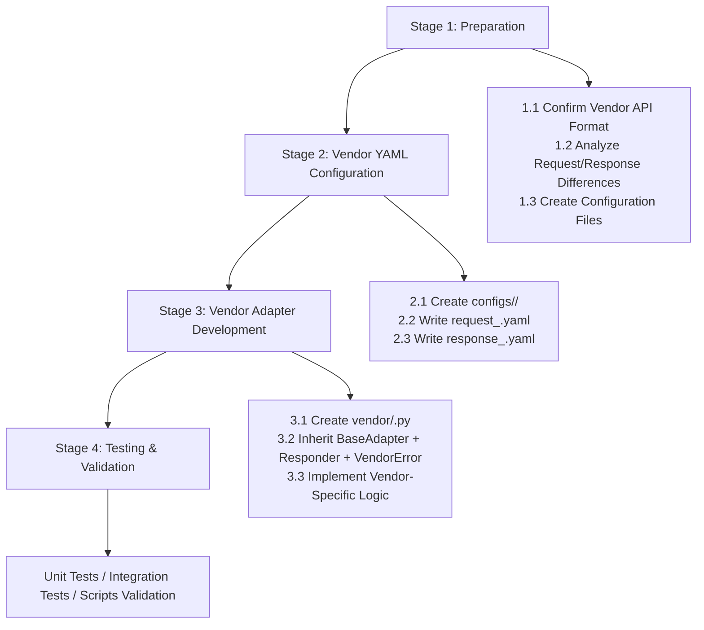

# New Vendor Adapter Development Guide

The text processing foundation of the CNLLM project is now complete. For detailed system architecture, see [System Architecture](ARCHITECTURE_en.md).
This document outlines the standard process for developing new vendor adapters, based on experience from MiniMax and Xiaomi mimo adapter development.

## Two Approaches

### Approach 1: Adapter OpenAI-Compatible Interface

- Advantages: Simple adaptation, request/response fields are mostly consistent.
- Disadvantages: Compatible interfaces usually have fewer features, lacking vendor-native capabilities.
- Example: Xiaomi mimo series model adaptation uses this approach, as Xiaomi only provides OpenAI-compatible interfaces.

### Approach 2: Adapter Vendor Native Interface

- Advantages: Full feature support, more vendor-native capabilities.
- Disadvantages: Complex adaptation, requires detailed analysis of vendor API request/response formats, needs special logic handling in vendor adapter.
- Example: MiniMax M2 series model adaptation uses this approach, supporting unique native interface capabilities such as:
  `thinking` - deep thinking mode
  `top_p` - minimum probability sampling
  `mask` - mask input
  Finally returns responses conforming to OpenAI API specifications.

***

## Development Flow Overview



***

## Stage 1: Preparation

### 1.1 Architecture Overview


### 1.2 Confirm Field Differences

#### Request Field Differences (MiniMax Example)

**CNLLM Standard Request Fields** are based on **OpenAI Standard Request Parameters**, extended with fields like `thinking` that are commonly used across domestic vendors.
This approach benefits users: when switching between different models, they only need to follow one set of field standards.

**Non-OpenAI Standard Request Fields**
- For example, `thinking` deep thinking mode is not an OpenAI standard field, but has been developed as a **CNLLM Standard Request Field** to unify different vendor formats.
  In CNLLM standard request fields, Xiaomi mimo's `"thinking": {"type": "enabled"}` and `"thinking": {"type": "disabled"}` are unified to `thinking=true` or `thinking=false`, which is more user-friendly.

If vendor request fields differ from **CNLLM Standard Request Fields**, they need to be mapped in the **Vendor YAML Configuration File** to **Vendor Request Fields**:
- When a user passes `max_tokens` field with MiniMax M2 series models, it will be mapped to `max_completion_tokens` field
- When a user passes `"thinking": {"type": "enabled"}` with Xiaomi mimo models, it will be mapped to `thinking=true`

For **vendor-specific parameters**, users can directly use vendor-defined fields, which will be passed through to the vendor API. Examples include MiniMax M2 series special parameters:
- `top_k` - max K sampling number
- `mask` - mask input

After completing **OpenAI Standard Request Fields → Vendor Request Fields** mapping, CNLLM adds vendor-specific fields to compose the complete request body for vendor API adaptation.

**Request Headers**

| CNLLM Standard Request Field | MiniMax Request Field |
| :--------------------------: | :-------------------: |
| `api_key`                    | `Authorization`       |
| `organization`               | `group_id`            |

**Request Body Fields**

| CNLLM Standard Request Field | MiniMax Request Field |
| :--------------------------: | :-------------------: |
| `model`                      | `model`               |
| `messages`                   | `messages`            |
| `temperature`                | `temperature`         |
| `top_p`                      | `top_p`               |
| `stream`                     | `stream`              |
| `stop`                       | `stop`                |
| `presence_penalty`           | `presence_penalty`    |
| `frequency_penalty`          | `frequency_penalty`   |
| `user`                       | `user`                |
| `tools`                      | `tools`               |
| `tool_choice`                | `tool_choice`         |
| `max_tokens`                 | `max_completion_tokens` |
| `thinking`                   | `thinking`            |
| -                            | `mask`                |
| -                            | `top_k`               |

CNLLM's standard **Response Fields** unify domestic vendor response fields to **OpenAI Standard Response Fields**, then package them into OpenAI standard response format.

If vendor response fields differ from OpenAI standard fields, they need to be mapped in the **Vendor YAML Configuration File** to **OpenAI Standard Response Fields**:
- In MiniMax's response, the `reasoning_content` field will be discarded from the CNLLM complete response body.
  However, we provide `chat.create.think` entry for users to access the `reasoning_content` field from the vendor's native response.
  And `chat.create.raw` can access all fields from the vendor's native response.

After completing **Vendor Response Fields → OpenAI Standard Response Fields** mapping, CNLLM composes the complete response body.

#### Response Field Differences (MiniMax Example)

| CNLLM Standard Response Field | MiniMax Response Field |
| :---------------------------: | :--------------------: |
| `id`                         | `id`                   |
| `created`                    | `created`              |
| `model`                      | `model`                |
| `content`                    | `choices[0].message.content` |
| `tool_calls`                 | `choices[0].message.tool_calls` |
| `prompt_tokens`              | `usage.prompt_tokens`  |
| `completion_tokens`          | `usage.completion_tokens` |
| `total_tokens`               | `usage.total_tokens`   |
| `reasoning_tokens`           | `usage.completion_tokens_details.reasoning_tokens` |
| -                            | `choices[0].message.reasoning_content` |

***

## Stage 2: Vendor YAML Configuration

### 2.1 YAML Logic Implementation

| Purpose | Access Point | YAML Path | YAML Table Name |
| ------- | ------------ | --------- | --------------- |
| Get Default Values | `timeout`, `max_retries`... | `optional_fields.{field}.default` | request\_{vendor}.yaml |
| Vendor Request Field Mapping | `_build_payload` | `optional_fields.{field}.body` | request\_{vendor}.yaml |
| Request Header Mapping | `_build_headers` | `optional_fields.{field}.header` | request\_{vendor}.yaml |
| Required Parameter Validation | `validate_required_params` | `required_fields` | request\_{vendor}.yaml |
| Parameter Support Validation | `filter_supported_params` | `optional_fields` | request\_{vendor}.yaml |
| Mutually Exclusive Parameter Validation | `validate_one_of` | `one_of` | request\_{vendor}.yaml |
| API Configuration | `get_base_url`, `get_api_path` | `optional_fields.base_url.default`, `request.method` | request\_{vendor}.yaml |
| Model Name Mapping | `model_mapping` | `model_mapping` | request\_{vendor}.yaml |
| OpenAI Response Field Mapping | `Responder` | `fields` | response\_{vendor}.yaml |
| Sensitive Content Detection | `Responder` | `error_check.sensitive_check` | response\_{vendor}.yaml |
| Streaming Response Mapping | `Responder` | `stream_fields` | response\_{vendor}.yaml |

### 2.2 Request Configuration configs/request\_{vendor}.yaml

**HTTP Request Configuration**

```yaml
request:
  method: "POST"
  headers:
    Content-Type: "application/json"
    Authorization: "Bearer ${api_key}"
```

**Required and Optional Field Mappings**

Field mappings use key-value pairs. If vendor request fields match OpenAI standard request fields, the value can be left empty.

```yaml
request:  # Request header configuration
  method: "POST"
  headers:
    Content-Type: "application/json"
    Authorization: "Bearer ${api_key}"

required_fields:  # Required parameter validation, parameter support validation
  model: ""  # Empty value means no mapping needed, field remains unchanged for easy maintenance
  api_key:
    body: "__skip__" # Skip request body construction for headers or internal fields

one_of:  # Mutually exclusive parameter validation
  messages_or_prompt:
    messages: ""
    prompt: ""

optional_fields:  # Parameter support validation
  base_url:
    body: "__skip__"
    default: "https://api.minimaxi.com/v1"  # Fields with default values
  organization:
    body: "__skip__"
    head: "group_id"  # Request header field mapping, mapped in build_headers() function
  max_tokens:
    body: "max_completion_tokens"  # Request body field mapping, mapped in build_payload() function
  stream: ""
  top_p: ""
  top_k: ""
  tools: ""
    # ... other supported fields
```

**Model Mapping**

```yaml
model_mapping:  # Model mapping, model support validation
  minimax-m2: "MiniMax-M2"
  minimax-m2.1: "MiniMax-M2.1"
```

**Error Code Mapping**

```yaml
error_check: # Errors in request configuration occur before model response, model did not respond successfully
  code_path: "base_resp.status_code"
  success_code: 0
  message_path: "base_resp.status_msg"
  auth_code: 1004
  error_codes:
    1000:
      type: "unknown_error"
      message: "Unknown error"
      suggestion: "Please retry later"
    # ... other vendor API endpoint error code mappings
```

### 2.3 Response Configuration configs/response\_{vendor}.yaml

```yaml
fields:  # Response configuration currently uses path mapping, different from request configuration
  id: "id"
  created: "created"
  model: "model"
  content: "choices[0].message.content"
  tool_calls: "choices[0].message.tool_calls"
  # ... other field mappings

defaults: # Fallback default values, fields may not exist in vendor responses
  object: "chat.completion"
  index: 0
  role: "assistant"
  finish_reason: "stop"

stream_fields:  # Streaming response path mapping
  object: "chat.completion.chunk"
  index: 0
  content_path: "choices[0].delta.content"
  tool_calls_path: "choices[0].delta.tool_calls"
  reasoning_content_path: "choices[0].delta.reasoning_content"

error_check:  # Errors in response configuration occur after model response, model returned response body but business error occurred
  sensitive_check:
    input_sensitive_type_path: "input_sensitive_type"
    output_sensitive_type_path: "output_sensitive_type"
```

***

## Stage 3: Adapter Development

### 3.1 Create Adapter File

Vendor adapters need to inherit from three base class components. The base classes define a large number of common methods; vendor adapter layer only needs to implement vendor-specific logic:

```python
# Create at: cnllm/core/vendor/<vendor>.py
from . import BaseAdapter
from ..responder import Responder
from ...utils.vendor_error import VendorError, VendorErrorRegistry

class <Vendor>Adapter(BaseAdapter):
    """<Vendor Name> Vendor Adapter"""
    VENDOR_NAME = "<vendor>"

class <Vendor>Responder(Responder):
    CONFIG_DIR = "<vendor>"

class <Vendor>VendorError(VendorError):
    VENDOR_NAME = "<vendor>"
```

### 3.2 Inherit Architecture Components and Vendor Adapter Development

#### 3.2.1 BaseAdapter (Core Adapter)

The vendor adapter layer only needs to implement vendor-specific logic. Common methods are already implemented in the BaseAdapter base class:

**Methods Implemented in Base Class:**

- `get_supported_models()` - Get list of supported models
- `get_adapter_name_for_model()` - Get adapter name by model name
- `get_vendor_model()` - Model name mapping
- `get_api_path()` - Get API path
- `get_base_url()` - Get base URL
- `get_header_mappings()` - Get request header mappings
- `_validate_required_params()` - Validate required parameters
- `_validate_one_of()` - Validate mutually exclusive parameters
- `_filter_supported_params()` - Filter unsupported parameters
- `_build_payload()` - Build request body
- `create_completion()` - Make request
- `_handle_stream()` - Handle streaming response
- `_get_responder()` - Get Responder instance

**Vendor Layer Special Logic to Implement:**

- For example, Xiaomi mimo model's special request parameter `"thinking": {"type": "disabled"}` mapping logic requires additional implementation:
  In the `_build_payload()` function in `xiaomi.py`, cooperate with YAML configuration file to map to standard fields:

`request_xiaomi.yaml`
```yaml
optional_fields:
  thinking:
    transform:
      true: {"type": "enabled"}
      false: {"type": "disabled"}
```

`core/vendor/xiaomi.py`
```python
field_config = optional_fields.get(key, key)
if isinstance(field_config, dict):
    transform = field_config.get("transform")
    if transform and value in transform:
        value = transform[value]
```

**Configuration Dependencies:**

- `configs/<vendor>/request_<vendor>.yaml` - `base_url`, `required_fields`, `optional_fields`, etc.

#### 3.2.2 Responder (Response Converter)

The vendor response converter layer only needs to implement vendor-specific logic. Common methods are already implemented in the Responder base class:

**Methods Implemented in Base Class:**

- `to_openai_format()` - Non-streaming response conversion
- `to_openai_stream_format()` - Streaming response conversion
- `check_error()` - Check business-level errors and sensitive content
- `_check_sensitive()` - Sensitive content detection
- `collect_stream_result()` - Streaming result accumulation

**Methods Dispatched from BaseAdapter to Responder:**

- `_to_openai_format()` - Dispatch to Responder.to_openai_format()
- `_to_openai_stream_format()` - Dispatch to Responder.to_openai_stream_format()
- `_check_response_error()` - Dispatch to Responder.check_error()
- `_collect_stream_result()` - Dispatch to Responder.collect_stream_result()

**Configuration Dependencies:**

- `configs/<vendor>/response_<vendor>.yaml` - `fields`, `stream_fields`, `error_check`

**Vendor Layer Special Logic to Implement:**

Most field mapping logic in Responder is already declared in YAML configuration. Vendor adapters usually only need to define `CONFIG_DIR`, no additional code implementation needed.

```python
class XiaomiResponder(Responder):
    CONFIG_DIR = "xiaomi"
```

If vendor response field structure doesn't fully match YAML configuration, custom parsing logic needs to be implemented (e.g., nested fields, dynamic keys, etc.):

```python
class <Vendor>Responder(Responder):
    CONFIG_DIR = "<vendor>"

    def _get_by_path(self, data: Dict[str, Any], path: str, default=None):
        # Custom path parsing logic
        ...
```

#### 3.2.3 VendorError (Vendor Error)

The vendor error layer only needs to implement vendor-specific logic. Common methods are already implemented in the VendorError base class:

**Methods Implemented in Base Class:**

- `to_dict()` - Convert to dictionary

**Configuration Dependencies:**

- `configs/<vendor>/request_<vendor>.yaml` - `error_check.error_codes`

**Vendor Layer Special Logic to Implement:**

Most error parsing logic is already declared in YAML configuration. Vendor adapters only need to define `VENDOR_NAME` and register:

```python
class MiniMaxVendorError(VendorError):
    VENDOR_NAME = "minimax"

    @classmethod
    def from_response(cls, raw_response: dict) -> Optional["MiniMaxVendorError"]:
        base_resp = raw_response.get("base_resp", {})
        code = base_resp.get("status_code")
        if code is None:
            return None
        message = base_resp.get("status_msg", "")
        return cls(code=code, message=message, vendor=cls.VENDOR_NAME, raw_response=raw_response)

VendorErrorRegistry.register(MiniMaxVendorError.VENDOR_NAME, MiniMaxVendorError)
```

If vendor error response structure doesn't fully match YAML configuration, custom `from_response()` parsing logic needs to be implemented.

## Stage 4: Testing & Validation

### 4.1 Existing Test Cases

**`tests/`** **- Unit Tests (No API Calls)**

- `test_adapter_config.py` - Adapter configuration loading tests
- `test_adapter_payload.py` - Request payload construction tests
- `test_responder_format.py` - Response format conversion tests
- `test_responder_reasoning.py` - Reasoning content tests
- `test_stream.py` - Streaming output tests
- `test_yaml_request.py` - Request YAML configuration tests
- `test_yaml_response.py` - Response YAML configuration tests
- `test_langchain_runnable.py` - LangChain Runnable integration tests

**`tests/key_needed/`** **- Integration Tests Requiring Real API Keys**

- `test_client.py` - Client basic functionality tests (streaming/non-streaming, think/still/tools properties)
- `test_openai_format.py` - OpenAI standard format response comparison tests
- `test_stream_accumulator.py` - Streaming response accumulator tests
- `test_vendor_error.py` - Vendor error handling tests (auth failure, invalid model, malformed requests)
- `test_fallback_model_logic.py` - FallbackManager logic tests (primary model success/failure, fallback trigger, FallbackError thrown)

Test files requiring real APIs have the following assignments below the import block for easy test subject changes:

```python
MODEL = "mimo-v2-flash"
API_KEY = os.getenv("XIAOMI_API_KEY")
```

### 4.2 Scripts

**`validate_model_compatible.py`** **- Model Compatibility Validation Script**

Model compatibility validation script for testing potential compatible models for existing adapters.

**Features:**

- Test potential compatible models for existing adapters (e.g., other MiniMax models may be compatible with MiniMaxAdapter)
- Test streaming output
- Test Fallback mechanism
- Test LangChain Runnable integration
- Test alignment of wrapped responses with OpenAI standard format

**Environment Variables:**

- `API_KEY`
- `CNLLM_SKIP_MODEL_VALIDATION=true` - Skip model mapping validation in main program (test backdoor)

**`test_e2e_installed.py`**

End-to-end test script simulating production environment usage after user installs cnllm via pip install.

**Characteristics:**

- Does not reference project local modules, uses installed cnllm package
- Verify package works correctly after installation
- Test basic chat, streaming output, Fallback, and other features

**Environment Variables:**

- `API_KEY`

## Final Step: Documentation Update

- [ ] Update document `docs/vendor/<vendor>.md`, add detailed explanation of adapter implementation
