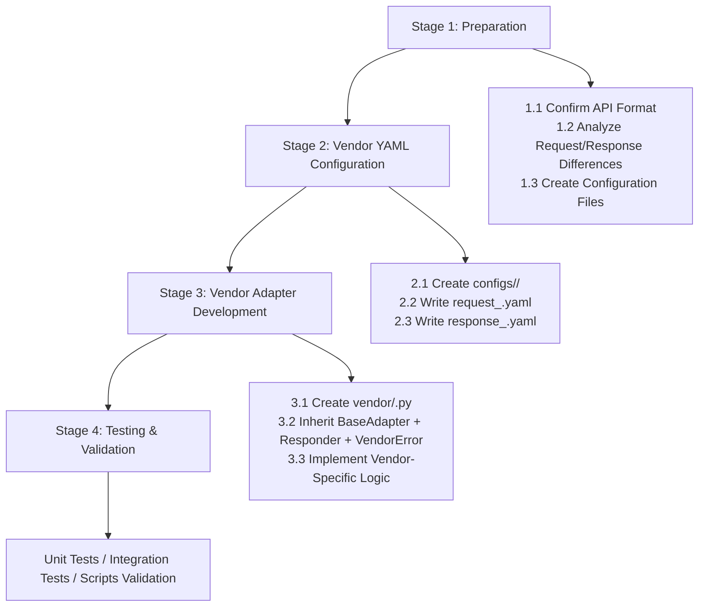
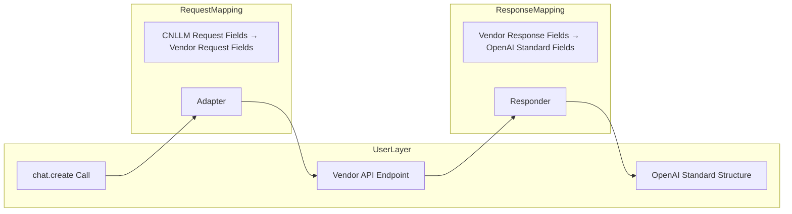

# Vendor Adapter Development Guide

CNLLM's text processing framework is now complete. For detailed system architecture, see [System Architecture](ARCHITECTURE_en.md).
This document outlines the standard process for developing new vendor adapters based on experience from MiniMax and Xiaomi mimo adapter development.

## Development Flow Overview



***

## Stage 1: Preparation

### 1.1 Architecture Overview



### 1.2 Confirm Field Differences

#### Request Field Differences (MiniMax as example)

**CNLLM standard request fields** are based on **OpenAI standard parameters**, with additional fields like `thinking` that are common among Chinese vendors.
This design allows users to follow one field standard when switching between different models.

**Non-OpenAI standard request fields**

Fields like `thinking` deep thinking mode are not OpenAI standard fields, but have been unified as **CNLLM standard request fields**.
In CNLLM standard request fields, Xiaomi mimo's `thinking": {"type": "enabled"}` and `"thinking": {"type": "disabled"}` are unified to `thinking=true` or `thinking=false` for better user experience.

When CNLLM request fields differ from vendor fields, map them in **vendor YAML configuration files**:

**Request Headers**

| CNLLM Standard Request Fields | Vendor Request Fields |
| :------------: | :-------------: |
| `api_key` | `Authorization` |

**Request Body Fields**

| CNLLM Standard Fields | Vendor Fields |
| :-----------------: | :---------------------: |
| `model` | `model` |
| `messages` | `messages` |
| `temperature` | `temperature` |
| `top_p` | `top_p` |
| `stream` | `stream` |
| `stop` | `stop` |
| `presence_penalty` | `presence_penalty` |
| `frequency_penalty` | `frequency_penalty` |
| `user` | `user` |
| `tools` | `tools` |
| `tool_choice` | `tool_choice` |
| `max_completion_tokens` | `max_completion_tokens` |
| `thinking` | `thinking` |
| - | `mask` |
| - | `top_k` |

### 1.3 Response Field Differences

CNLLM standard **response fields** unify vendor response fields to **OpenAI standard response format**.

When vendor response fields differ from OpenAI standard fields, map them in **vendor configuration files**:

| CNLLM Standard Response Fields | Vendor Response Fields |
| :-------------------: | :--------------------------------------------: |
| `id` | `id` |
| `created` | `created` |
| `model` | `model` |
| `content` | `choices[0].message.content` |
| `tool_calls` | `choices[0].message.tool_calls` |
| `prompt_tokens` | `usage.prompt_tokens` |
| `completion_tokens` | `usage.completion_tokens` |
| `total_tokens` | `usage.total_tokens` |
| `reasoning_tokens` | `usage.completion_tokens_details.reasoning_tokens` |
| `system_fingerprint` | - |
| `choices[0].logprobs` | - |
| - | `choices[0].message.reasoning_content` |

***

## Stage 2: Vendor YAML Configuration

### 2.1 YAML Logic Implementation

| Step | Purpose | Access Point | Scope | Judgment | New Parameters |
| --- | --- | --- | --- | --- | --- |
| 1 | Required param validation | `validate_required_params` | required_fields | adapter | - |
| 2 | Supported param validation | `filter_supported_params` | required_fields + optional_fields | - | - |
| 3 | Mutually exclusive param validation | `validate_one_of` | one_of | - | - |
| 4 | Get default values | `get_default_value` | Hardcoded: timeout, max_retries, retry_delay | - | timeout, max_retries, retry_delay |
| 5 | Validate base_url + get full path | `validate_base_url` + `get_api_path` | base_url | - | New: base_url + api_path |
| 6 | Request header mapping | `get_header_mappings` | required_fields + optional_fields + one_of | skip: true | - |
| 7 | Build request body | `_build_payload` | required_fields + optional_fields + one_of | Field mapping: no skip | - |
| 8 | Model name mapping | `get_vendor_model` | model_mapping | - | - |

**Scope Definition**:
- `adapter`: Adapter-level identifier like `chat` or `embedding`
- `chat`/`embedding`: Configuration sub-levels (e.g., `base_url` has `chat:` or `embedding:` sub-levels)

### 2.2 Request Configuration configs/request_{vendor}.yaml

```yaml
request:
  method: "POST"
  headers:
    Content-Type: "application/json"
    Authorization: "Bearer ${api_key}"
```

### 2.3 Response Configuration configs/response_{vendor}.yaml

```yaml
fields:  # Response configuration uses path mapping, different from request configuration
  id: "id"
  created: "created"
  model: "model"
  content: "choices[0].message.content"
  tool_calls: "choices[0].message.tool_calls"
  # ... other field mappings

defaults:  # Default values for fields that may not exist in vendor responses
  object: "chat.completion"
  index: 0
  role: "assistant"
  finish_reason: "stop"

stream_fields:  # Streaming response path mappings
  object: "chat.completion.chunk"
  index: 0
  content_path: "choices[0].delta.content"
  tool_calls_path: "choices[0].delta.tool_calls"
  reasoning_content_path: "choices[0].delta.reasoning_content"

error_check:  # Errors in response configuration occur after model response
  sensitive_check:
    input_sensitive_type_path: "input_sensitive_type"
    output_sensitive_type_path: "output_sensitive_type"
```

***

## Stage 3: Adapter Development

### 3.1 Create Adapter File

Vendor adapters need to inherit three base components:

```python
# Location: cnllm/core/vendor/<vendor>.py
from ..adapter import BaseAdapter
from ..responder import Responder
from ...utils.vendor_error import VendorError, VendorErrorRegistry

class <Vendor>Adapter(BaseAdapter):
    """<Vendor> Adapter"""
    VENDOR_NAME = "<vendor>"

class <Vendor>Responder(Responder):
    CONFIG_DIR = "<vendor>"

class <Vendor>VendorError(VendorError):
    VENDOR_NAME = "<vendor>"
```

### 3.2 Inherit Base Components

#### BaseAdapter

Vendor adapters only need to implement vendor-specific logic, common methods are already implemented in BaseAdapter:

**Already implemented methods:**

- `get_supported_models()` - Get list of supported models
- `get_adapter_name_for_model()` - Get adapter name from model
- `get_vendor_model()` - Model name mapping
- `get_api_path()` - Get API path
- `get_base_url()` - Get base URL
- `get_header_mappings()` - Get request header mappings
- `_validate_required_params()` - Validate required parameters
- `_validate_one_of()` - Validate mutually exclusive parameters
- `_filter_supported_params()` - Filter unsupported parameters
- `_build_payload()` - Build request body
- `create_completion()` - Make request
- `_handle_stream()` - Handle streaming response
- `_get_responder()` - Get Responder instance

**Vendor-specific logic to implement:**

For example, Xiaomi mimo's special request parameter `"thinking": {"type": "disabled"}` mapping logic needs extra implementation in the vendor adapter.

#### Responder

Vendor responders only need to implement vendor-specific logic, common methods are already implemented in Responder:

**Already implemented methods:**

- `to_openai_format()` - Non-streaming response conversion
- `to_openai_stream_format()` - Streaming response conversion
- `check_error()` - Check business errors and sensitive content
- `_check_sensitive()` - Sensitive content detection
- `collect_stream_result()` - Streaming result accumulation

**Configuration dependency:**

Responder field mapping logic is mostly declared in YAML configuration, vendors usually only need to define `CONFIG_DIR`.

```python
class XiaomiResponder(Responder):
    CONFIG_DIR = "xiaomi"
```

#### VendorError

Vendor errors only need to implement vendor-specific logic:

**Already implemented methods:**

- `to_dict()` - Convert to dictionary

**Configuration dependency:**

Error parsing logic is mostly declared in YAML configuration:

```python
class MiniMaxVendorError(VendorError):
    VENDOR_NAME = "minimax"

    @classmethod
    def from_response(cls, raw_response: dict) -> Optional["MiniMaxVendorError"]:
        base_resp = raw_response.get("base_resp", {})
        code = base_resp.get("status_code")
        if code is None:
            return None
        message = base_resp.get("status_msg", "")
        return cls(code=code, message=message, vendor=cls.VENDOR_NAME, raw_response=raw_response)

VendorErrorRegistry.register(MiniMaxVendorError.VENDOR_NAME, MiniMaxVendorError)
```

***

## Stage 4: Testing & Validation

### 4.1 Existing Test Cases

**Unit tests (no API calls):**

- `test_adapter_config.py` - Adapter configuration loading
- `test_adapter_payload.py` - Request payload construction
- `test_responder_format.py` - Response format conversion
- `test_responder_reasoning.py` - Reasoning content tests
- `test_stream.py` - Streaming output tests
- `test_yaml_request.py` - Request YAML configuration
- `test_yaml_response.py` - Response YAML configuration
- `test_langchain_runnable.py` - LangChain Runnable integration

**Integration tests (requires real API keys):**

- `test_client.py` - Basic client functionality
- `test_openai_format.py` - OpenAI format comparison
- `test_stream_accumulator.py` - Streaming accumulator
- `test_vendor_error.py` - Vendor error handling
- `test_fallback_model_logic.py` - Fallback logic tests

### 4.2 Scripts

**`validate_model_compatible.py`** - Model compatibility validation script

**Features:**

- Test potential compatible models for existing adapters
- Test streaming output
- Test Fallback mechanism
- Test LangChain Runnable integration
- Validate alignment with OpenAI standard format

**Environment variables:**

- `API_KEY`
- `CNLLM_SKIP_MODEL_VALIDATION=true` - Skip model mapping validation

**`test_e2e_installed.py`**

End-to-end test script simulating production use after pip install.

**Features:**

- Import installed cnllm package instead of local modules
- Validate package functionality after installation
- Test basic chat, streaming, Fallback

**Environment variables:**

- `API_KEY`

## Final Step: Documentation Update

- [ ] Update `docs/vendor/<vendor>.md` with detailed adapter implementation notes
