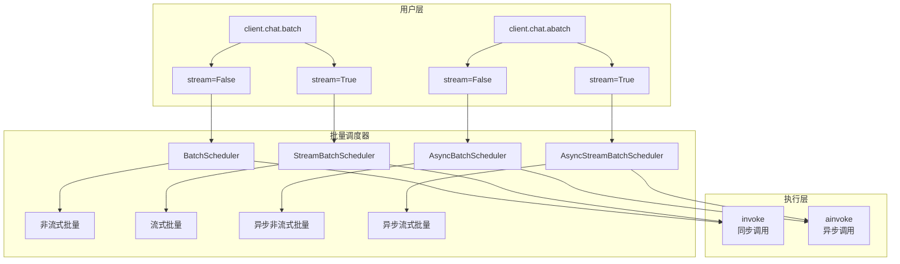

# CNLLM 批量调用

## 1. 功能特性

CNLLM 提供统一的批量调用接口，支持：

| 特性 | 说明 |
|------|------|
| 统一接口 | `batch()` / `abatch()` 方法，通过 `stream` 参数控制流式/非流式 |
| 并发控制 | `max_concurrent` 参数控制最大并发数 |
| 超时控制 | `timeout` 参数设置单请求超时时间 |
| 错误隔离 | 单个请求失败不影响其他请求 |
| 进度回调 | `callbacks` 参数监听任务进度 |
| 停止控制 | `stop_on_error` 参数遇错时停止其他任务 |

## 2. 竞品对比

| 特性 | OpenAI SDK | LangChain | LiteLLM | CNLLM |
|------|------------|-----------|---------|-------|
| 批量调用 | ✅ batch | ✅ batch | ✅ batch | ✅ batch |
| 并发控制 | ✅ max_concurrent | ✅ max_concurrent | ✅ concurrency_limit | ✅ max_concurrent |
| 异步批量 | ✅ async batch | ✅ abatch | ✅ abatch | ✅ abatch |
| 进度回调 | ❌ | ✅ with_config | ⚠️ | ✅ callbacks |
| 错误隔离 | ⚠️ | ✅ | ⚠️ | ✅ stop_on_error |
| 流式批量 | ❌ | ⚠️ | ✅ | ✅ stream=True |

## 3. 架构



## 4. 接口定义

### 4.1 同步批量 `client.chat.batch()`

```python
def batch(
    self,
    requests: list,
    *,
    stream: bool = False,
    max_concurrent: int = 3,
    timeout: Optional[float] = None,
    stop_on_error: bool = False,
    callbacks: Optional[List[Callable]] = None,
    custom_ids: Optional[List[str]] = None,
) -> BatchResponse:
    """
    批量执行多个请求（同步）

    Args:
        requests: 请求列表，支持 str / dict
        stream: 是否使用流式处理，默认 False
        max_concurrent: 最大并发数，默认 3
        timeout: 单个请求超时（秒），默认 None
        stop_on_error: 遇到错误是否停止，默认 False
        callbacks: 进度回调列表，默认 None
        custom_ids: 自定义请求 ID 列表，默认 None（使用 request_0, request_1...）

    Returns:
        BatchResponse: 批量响应对象
    """
```

### 4.2 异步批量 `client.chat.abatch()`

```python
async def abatch(
    self,
    requests: list,
    *,
    stream: bool = False,
    max_concurrent: int = 3,
    timeout: Optional[float] = None,
    stop_on_error: bool = False,
    callbacks: Optional[List[Callable]] = None,
    custom_ids: Optional[List[str]] = None,
) -> BatchResponse:
    """
    批量执行多个请求（异步）

    Args:
        requests: 请求列表，支持 str / dict
        stream: 是否使用流式处理，默认 False
        max_concurrent: 最大并发数，默认 3
        timeout: 单个请求超时（秒），默认 None
        stop_on_error: 遇到错误是否停止，默认 False
        callbacks: 进度回调列表，默认 None
        custom_ids: 自定义请求 ID 列表，默认 None（使用 request_0, request_1...）

    Returns:
        BatchResponse: 批量响应对象
    """
```

## 5. 参数说明

| 参数 | 类型 | 默认值 | 说明 |
|------|------|--------|------|
| `requests` | `list` | - | 请求列表，支持 str / dict |
| `stream` | `bool` | `False` | 是否使用流式处理 |
| `max_concurrent` | `int` | `3` | 最大并发执行数 |
| `timeout` | `float` | `None` | 单个请求超时时间（秒） |
| `stop_on_error` | `bool` | `False` | 遇错误时停止其他任务 |
| `callbacks` | `List[Callable]` | `None` | 进度回调函数列表 |

## 6. 返回值

### 6.1 BatchResponse 外层结构

```python
# print 输出（简洁统计，不显示大文本）:
print(result)
# BatchResponse(request_counts={...}, elapsed=..., success=[...], errors=[...])

print(result.results)
# BatchResults(count=2, ids=['request_0', 'request_1'])
```

### 6.2 非流式批量响应格式

```python
{
    "success": ["request_0", "request_1"],  # 成功的 request_id 列表
    "errors": [],                                 # 失败的 request_id 列表
    "request_counts": {
        "success_count": 2,
        "fail_count": 0,
        "total": 2
    },
    "elapsed": 0.35,
    "results": {              # {request_id: OpenAI 格式}
        "request_0": {                 # 成功的单次响应，标准 OpenAI 非流式格式
            "id": "chatcmpl-xxx",
            "object": "chat.completion",
            "created": 1742112345,
            "model": "deepseek-chat",
            "choices": [{
                "index": 0,
                "message": {
                    "role": "assistant",
                    "content": "回复内容"
                },
                "finish_reason": "stop"
            }],
            "usage": {
                "prompt_tokens": 5,
                "completion_tokens": 4,
                "total_tokens": 9
            }
        },
        "request_1": {                 # 失败的单次响应
            "error": {
                "index": 1,
                "code": "invalid_request",
                "message": "参数错误"
            }
        }
    },
    "think": {"request_0": "...", "request_1": "..."},
    "still": {"request_0": "...", "request_1": "..."},
    "tools": {"request_0": [...], "request_1": [...]},
    "raw": {"request_0": {...}, "request_1": {...}}
}
```

### 6.3 流式批量响应格式

流式每个 chunk：
```python
"request_0":[
# 开始 chunk (第一个，有 role，无 content):
{
    "id": "chatcmpl-batch-xxx",
    "object": "chat.completion.chunk",
    "model": "deepseek-chat",
    "choices": [{
        "index": 0,
        "delta": {"role": "assistant"},
        "finish_reason": null
    }]
},
# 中间 chunk (有 content):
{
    "id": "chatcmpl-batch-xxx",
    "object": "chat.completion.chunk",
    "model": "deepseek-chat",
    "choices": [{
        "index": 0,
        "delta": {"content": "你好"},
        "finish_reason": null
    }]
},
# 结尾 chunk (空 content，有 finish_reason):
{
    "id": "chatcmpl-batch-xxx",
    "object": "chat.completion.chunk",
    "model": "deepseek-chat",
    "choices": [{
        "index": 0,
        "delta": {},
        "finish_reason": "stop"
    }]
}]

# 失败的单次响应 (流式批量):
"request_1":[{
    "error": {
        "index": 1,
        "code": "invalid_request",
        "message": "参数错误"
    }
}]
```

外层结构：
```python
{
    "success": ["request_0"],
    "errors": ["request_1"],
    "request_counts": {"success_count": 1, "fail_count": 1, "total": 2},
    "elapsed": 0.42,
    "results": {
        "request_0": [chunk1, chunk2, chunk3],
        "request_1": [error_chunk],
    },
    "think": {"request_0": "...", "request_1": "..."},
    "still": {"request_0": "...", "request_1": "..."},
    "tools": {"request_0": [...], "request_1": [...]},
    "raw": {"request_0": {...}, "request_1": {...}}
}
```

### 6.4 响应访问

```python
# 所有字段支持批中访问，结果实时累积
# 统计字段:
result.total              # int: 总数
result.success_count      # int: 成功数
result.fail_count         # int: 失败数
result.elapsed            # float: 耗时
result.success            # List[str]: 成功的 request_id 列表
result.errors             # List[str]: 失败的 request_id 列表
result.request_counts     # Dict: {"success_count": ..., "fail_count": ..., "total": ...}

# 累积字段:
result.think[0]                  # 推理内容
result.think["request_0"]     # 同上
result.still[0]                 # 回复内容
result.still["request_0"]     # 同上
result.tools[0]                 # 工具调用
result.tools["request_0"]     # 同上
result.raw[0]                   # 原始数据
result.raw["request_0"]       # 同上

# 响应访问（四种方式等价）:
result.results["request_0"]   # 非流式: OpenAI 格式 dict
result.results[0]               # 流式: List[chunk]
result["request_0"]           # 同上
result[0]                       # 同上

# 遍历结果:
for request_id, item in result.results.items():
    if "error" in item:
        print(f"失败: {item['error']}")
    else:
        print(f"成功: {item['choices'][0]['message']['content']}")
```

### 6.5 数据存储

```python
# 转换为标准 JSON:
result.to_dict()                        # 只保留 results (默认)
result.to_dict(stats=True)              # results + 统计字段
result.to_dict(stats=True, think=True, still=True, tools=True, raw=True)  # results + 任意字段
```

## 7. 使用示例

### 7.1 同步批量（非流式）

```python
from cnllm import CNLLM

client = CNLLM(model="deepseek-chat", api_key="xxx")

results = client.chat.batch([
    "你好",
    "今天天气怎么样",
    "你是谁",
])

print(f"成功: {results.success_count}/{results.total}")
print(f"耗时: {results.elapsed:.2f}s")

# 遍历结果
for cid, item in results.results.items():
    if "error" in item:
        print(f"{cid} 失败: {item['error']}")
    else:
        print(f"{cid} 回复: {item['choices'][0]['message']['content']}")
```

### 7.2 同步批量（流式）

```python
from cnllm import CNLLM

client = CNLLM(model="deepseek-chat", api_key="xxx")

accumulator = client.chat.batch([
    "数到3",
    "说你好",
    "介绍自己"
], stream=True)

# 使用迭代器访问流式响应
accumulator = client.chat.batch([
    "数到3",
    "说你好"
], stream=True)
for chunk in accumulator:
    print(accumulator.batch_response.still[0])  # 实时累积，可中途访问
batch_response = accumulator.batch_response
print(f"成功: {batch_response.success_count}")
```

### 7.3 异步批量（非流式）

```python
from cnllm import AsyncCNLLM
import asyncio

async def main():
    client = AsyncCNLLM(model="deepseek-chat", api_key="xxx")

    results = await client.chat.abatch([
        "你好",
        "今天天气怎么样",
        "你是谁",
    ])

    print(f"成功: {results.success_count}/{results.total}")

    for cid, item in results.results.items():
        if "error" not in item:
            print(f"{cid}: {item['choices'][0]['message']['content']}")

    await client.aclose()

asyncio.run(main())
```

### 7.4 异步批量（流式）

```python
from cnllm import AsyncCNLLM
import asyncio

async def main():
    client = AsyncCNLLM(model="deepseek-chat", api_key="xxx")

    async for chunk in client.chat.abatch([
        "数到3",
        "说你好",
        "介绍自己"
    ], stream=True):
        content = chunk.get("choices", [{}])[0].get("delta", {}).get("content", "")
        print(content, end="", flush=True)

    await client.aclose()

asyncio.run(main())
```

## 8. 高级选项

### 8.1 超时和并发控制

```python
results = client.chat.batch(
    requests,
    max_concurrent=5,      # 最多5个并发
    timeout=30,             # 单请求30秒超时
)
```

### 8.2 自定义请求 ID

```python
results = client.chat.batch(
    ["文本1", "文本2", "文本3"],
    custom_ids=["doc_001", "doc_002", "doc_003"]
)

# 通过自定义 ID 访问结果
results["doc_001"]          # 获取 doc_001 的响应
results.think["doc_002"]    # 获取 doc_002 的推理内容
```

### 8.2 进度回调

### 5.1 进度回调

```python
def progress_callback(request_id: str, status: str) -> None:
    """request_id: 请求ID, status: success/error"""
    print(f"请求 {request_id} 完成: {status}")
```

回调会在每个请求完成时被调用，可以用于：
- 实时显示处理进度
- 记录已完成的任务
- 动态调整后续任务

```python
def on_complete(request_id, status):
    print(f"[{request_id}] {status}")

results = client.chat.batch(
    requests,
    callbacks=[on_complete]
)
```
### 8.3 遇错停止

```python
results = client.chat.batch(
    requests,
    stop_on_error=True  # 遇错停止
)
```
